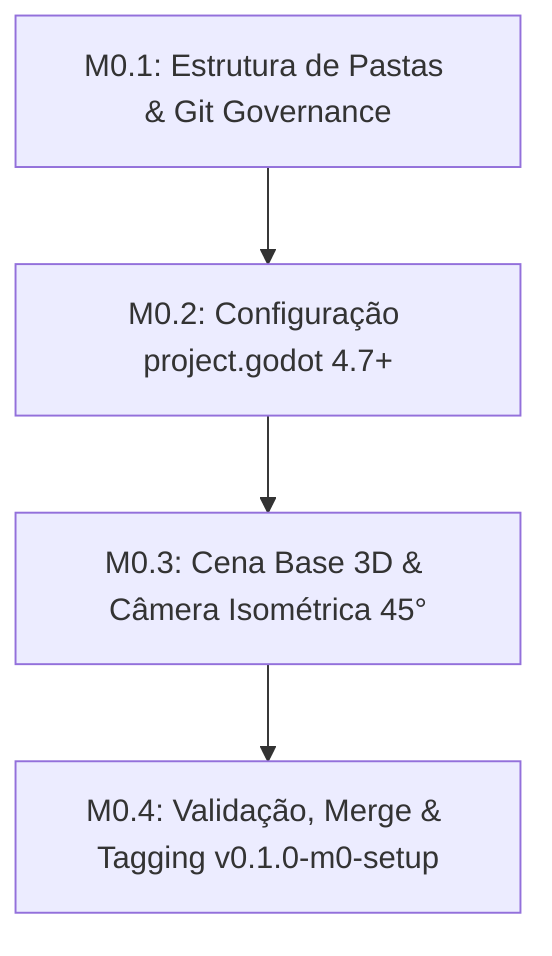

# 🚩 Marco 0 (M0) — Setup do Repositório & Baseline Godot 4.7+ 3D

> **Status:** Não Iniciado  
> **Branch de Trabalho:** `feat/m0-setup`  
> **Tag Final do Marco:** `v0.1.0-m0-setup`  
> **Documentos de Referência:** [`docs/planejamento/01_visao_mvp_e_marcos.md`](../docs/planejamento/01_visao_mvp_e_marcos.md), [`docs/planejamento/02_gestao_configuracao_e_github.md`](../docs/planejamento/02_gestao_configuracao_e_github.md), [`docs/projeto/02_estrutura_diretorios_convencoes.md`](../docs/projeto/02_estrutura_diretorios_convencoes.md).

---

## 🎯 Visão Geral do Marco

O objetivo deste marco é estabelecer a fundação de engenharia e a governança de arquivos para o projeto **Autodungeon 3D** na **Godot Engine 4.7+**. Ao final deste marco, o repositório terá rastreamento binário configurado com Git LFS, uma estrutura de pastas `res://` limpa e padronizada, configurações do motor otimizadas para 3D Top-Down com tipagem estática obrigatória e uma cena de teste 3D funcional com câmera isométrica fixa em $45^\circ$.

---

## 📋 Lista Sequencial de Tarefas



---

<a id="m01"></a>
### 🔹 Tarefa M0.1: Criação da Estrutura de Diretórios `res://` e Governança Git

#### 1. Contexto & Escolha Arquitetural
Na Godot Engine 4.x, uma estrutura de diretórios desorganizada causa acoplamento invisível e perda de UIDs de recursos durante refatorações. Adotamos o padrão modular e orientado a responsabilidades (`src/` dividido em `core`, `entities`, `systems`, `ui`, `data`, `world`), isolando os assets brutos em `assets/` e mantendo a raiz do projeto limpa.

O uso do **Git LFS** (`.gitattributes`) é fundamental desde o primeiro commit para evitar que malhas 3D (`.glb`, `.blend`), áudios e texturas inchem o repositório Git.

#### 2. Estrutura de Arquivos & Contratos
Crie a seguinte árvore de diretórios e arquivos de configuração na raiz do projeto:

```text
autodungeon/
├── .gitattributes
├── .gitignore
├── project.godot
├── assets/
│   ├── models/        # Modelos 3D (.glb, .gltf)
│   ├── materials/     # Materiais e Shaders 3D (.tres, .gdshader)
│   ├── textures/      # Texturas e Sprites
│   ├── audio/         # Efeitos sonoros e trilhas (.wav, .ogg)
│   └── fonts/         # Tipografia TTF/OTF
├── src/
│   ├── core/          # Singletons, EventBus, Pools e Interfaces globais
│   ├── data/          # Custom Resources (.tres) e definições de dados
│   ├── entities/      # Prefabs de personagens, heróis, monstros e componentes
│   ├── systems/       # Controladores de combate, navegação e masmorra
│   ├── ui/            # Cenas e scripts de HUD, menus e textos flutuantes
│   └── world/         # Cenas de salas, arenas, iluminação e masmorra 3D
└── tests/             # Cenas e scripts de validação isolada
```

**Conteúdo do `.gitattributes`:**
```gitattributes
# 3D Assets & Models
*.glb filter=lfs diff=lfs merge=lfs -text
*.gltf filter=lfs diff=lfs merge=lfs -text
*.blend filter=lfs diff=lfs merge=lfs -text
*.fbx filter=lfs diff=lfs merge=lfs -text
*.obj filter=lfs diff=lfs merge=lfs -text

# Audio Files
*.wav filter=lfs diff=lfs merge=lfs -text
*.ogg filter=lfs diff=lfs merge=lfs -text
*.mp3 filter=lfs diff=lfs merge=lfs -text

# Textures & Heavy Images
*.png filter=lfs diff=lfs merge=lfs -text
*.tga filter=lfs diff=lfs merge=lfs -text
*.exr filter=lfs diff=lfs merge=lfs -text
*.hdr filter=lfs diff=lfs merge=lfs -text

# Fonts
*.ttf filter=lfs diff=lfs merge=lfs -text
*.otf filter=lfs diff=lfs merge=lfs -text

# Line Endings (Normalização LF)
*.gd text eol=lf
*.tscn text eol=lf
*.tres text eol=lf
*.md text eol=lf
```

**Conteúdo do `.gitignore`:**
```gitignore
.godot/
*.import
.DS_Store
*.tmp
*.log
builds/
exports/
```

#### 3. Passo a Passo de Teste & Verificação
1. **Verificação de Git LFS:**
   No terminal, execute:
   ```bash
   git lfs status
   ```
   *Resultado Esperado:* O comando deve responder sem erros, indicando que o Git LFS está instalado e ativo.
2. **Verificação de Estrutura:**
   Verifique no explorador do sistema ou terminal (`ls -la src/`) se todos os 6 subdiretórios principais (`core`, `data`, `entities`, `systems`, `ui`, `world`) foram criados.

#### 4. Critérios de Aceitação
- [x] Todas as pastas de `src/`, `assets/` e `tests/` existem no projeto.
- [x] Arquivo `.gitattributes` inclui filtros LFS para extensões 3D, áudio e imagem.
- [x] Arquivo `.gitignore` ignora a pasta `.godot/` e arquivos `.import`.

#### 5. Lembrete de Commit
```bash
git checkout -b feat/m0-setup
git add .gitattributes .gitignore
git commit -m "chore(m0-setup): configurar estrutura de pastas res e governanca git lfs"
```

---

<a id="m02"></a>
### 🔹 Tarefa M0.2: Configuração do Projeto Godot 4.7+ (`project.godot`)

#### 1. Contexto & Escolha Arquitetural
Para um jogo 3D Top-Down com foco mobile e tático:
* **Physics Layers (3D):** Nomear as camadas de física 3D previne colisões acidentais e facilita o uso de `collision_mask` e `collision_layer`.
  * Layer 1: `World_Environment` (Paredes, chão e colunas estáticas).
  * Layer 2: `Hero_Bodies` (`CharacterBody3D` dos Heróis).
  * Layer 3: `Enemy_Bodies` (`CharacterBody3D` dos Inimigos).
  * Layer 4: `Hero_Hitboxes` (Áreas de dano emitidas por heróis).
  * Layer 5: `Hero_Hurtboxes` (Áreas de recebimento de dano dos heróis).
  * Layer 6: `Enemy_Hitboxes` (Áreas de dano emitidas por monstros).
  * Layer 7: `Enemy_Hurtboxes` (Áreas de dano sofrido por monstros).
  * Layer 8: `Triggers_Interactables` (Gatilhos de portas, baús e portais).
* **Static Typing:** Ativação de avisos rigorosos de tipagem (`untyped_declaration = "error"` ou `"warn"`) para assegurar robustez e alta performance na GDScript VM.
* **Aspect Ratio:** Resolução base `1920x1080` (Landscape) com modo de stretch `canvas_items` e aspect `keep_width` ou `expand`.

#### 2. Estrutura de Configurações
No arquivo `project.godot` (via Editor *Project Settings* ou texto):

```ini
[application]
config/name="Autodungeon"
config/features=PackedStringArray("4.3", "Forward Plus")
config/icon="res://icon.svg"

[display]
window/size/viewport_width=1920
window/size/viewport_height=1080
window/size/mode=0
window/stretch/mode="canvas_items"
window/stretch/aspect="expand"

[layer_names]
3d_physics/layer_1="World_Environment"
3d_physics/layer_2="Hero_Bodies"
3d_physics/layer_3="Enemy_Bodies"
3d_physics/layer_4="Hero_Hitboxes"
3d_physics/layer_5="Hero_Hurtboxes"
3d_physics/layer_6="Enemy_Hitboxes"
3d_physics/layer_7="Enemy_Hurtboxes"
3d_physics/layer_8="Triggers_Interactables"

[debug]
gdscript/warnings/untyped_declaration=1
gdscript/warnings/inferred_declaration=1
gdscript/warnings/unused_parameter=1
```

#### 3. Passo a Passo de Teste & Verificação
1. **Abertura do Projeto:**
   Abra a pasta do projeto na **Godot Engine 4.7+**.
2. **Inspeção de Physics Layers:**
   Acesse *Project Settings -> Layer Names -> 3D Physics*.
   *Resultado Esperado:* As camadas 1 a 8 devem estar devidamente nomeadas conforme a tabela de arquitetura.
3. **Validação do Console:**
   Verifique a aba *Debugger -> Errors/Warnings*. O projeto deve carregar sem erros.

#### 4. Critérios de Aceitação
- [x] Physics Layers 3D 1 a 8 nomeadas.
- [x] Resolução de viewport configurada para 1920x1080 com modo de redimensionamento responsivo.
- [x] Avisos de tipagem estática ativados no editor.

#### 5. Lembrete de Commit
```bash
git add project.godot
git commit -m "chore(m0-setup): configurar physics layers 3d resolucao de tela e tipagem estatica"
```

---

<a id="m03"></a>
### 🔹 Tarefa M0.3: Cena de Baseline 3D (`TestEnvironment3D.tscn`) e Câmera Isométrica

#### 1. Contexto & Escolha Arquitetural
Para validar o pipeline 3D e garantir que as próximas fases de movimentação e combate ocorram em um espaço calibrado, criamos a cena de baseline `res://src/world/TestEnvironment3D.tscn`.
* **Câmera Top-Down Isométrica:** Posicionada a $45^\circ$ de inclinação no eixo X (`rotation_degrees = Vector3(-45, 0, 0)`), projeção ortográfica ou perspectiva com FOV de $45^\circ$, proporcionando a estética clássica de Auto-Battler tático.
* **Iluminação:** `DirectionalLight3D` com sombras suaves ativadas e `WorldEnvironment` com Skybox procedural neutro para boa legibilidade visual dos protótipos.

#### 2. Estrutura de Nós & Assinaturas
**Árvore da Cena `TestEnvironment3D.tscn`:**
```text
TestEnvironment3D (Node3D)
├── WorldEnvironment (WorldEnvironment)
├── DirectionalLight3D (DirectionalLight3D)
├── GroundPlane (StaticBody3D)
│   ├── CollisionShape3D (CollisionShape3D -> BoxShape3D: Vector3(50, 1, 50))
│   └── MeshInstance3D (MeshInstance3D -> BoxMesh: Vector3(50, 1, 50))
└── IsometricCameraRig (Node3D)
    └── Camera3D (Camera3D)
```

**Script `res://src/world/IsometricCameraRig.gd`:**
```gdscript
class_name IsometricCameraRig
extends Node3D

@export var target: Node3D = null
@export var follow_speed: float = 5.0
@export var camera_offset: Vector3 = Vector3(0, 15, 15)

func _ready() -> void:
    # Ajusta o ângulo inicial da câmera para olhar em 45 graus para baixo
    pass

func _physics_process(delta: float) -> void:
    # Interpolação suave (lerp) seguindo a posição do target no plano XZ
    pass

func set_target(new_target: Node3D) -> void:
    target = new_target
```

#### 3. Passo a Passo de Teste & Verificação
1. **Execução da Cena:**
   No editor Godot, abra `res://src/world/TestEnvironment3D.tscn` e pressione `F6` (Play Scene).
2. **Validação Visual:**
   * O chão cinza claro deve ser renderizado uniformemente sob iluminação direcional.
   * A câmera deve exibir a cena a partir do ângulo elevado de $45^\circ$ sem distorções de horizonte.
3. **Monitor de Performance:**
   Abra a aba *Monitors* no Debugger: o framerate deve permanecer estável a 60 FPS com 0 erros de renderização.

#### 4. Critérios de Aceitação
- [ ] Cena `TestEnvironment3D.tscn` criada com chão colisor e iluminação funcional.
- [ ] `IsometricCameraRig.gd` implementado com suporte a follow suave via `lerp`.
- [ ] Execução da cena sem warnings ou shaders quebrados.

#### 5. Lembrete de Commit
```bash
git add src/world/TestEnvironment3D.tscn src/world/IsometricCameraRig.gd
git commit -m "feat(m0-setup): implementar cena de baseline 3d com camera isometrica de 45 graus"
```

---

<a id="m04"></a>
### 🔹 Tarefa M0.4: Validação da Linha de Base, Merge e Tag `v0.1.0-m0-setup`

#### 1. Contexto & Escolha Arquitetural
O encerramento do Marco 0 sela o baseline de infraestrutura do projeto. Nenhuma linha de código de regras de negócio ou heróis deve ser escrita antes da integração formal deste marco à branch principal (`main`).

#### 2. Checklist de Validação Final
- [ ] Execução completa do projeto via `F5` ou `F6` sem erros no Output.
- [ ] Árvore de diretórios limpa, sem arquivos soltos na raiz além do `project.godot` e documentação.
- [ ] Histórico Git com commits semânticos atômicos.

#### 3. Passo a Passo de Merge & Tagging
Execute os comandos no terminal:

```bash
# 1. Trocar para a branch main e atualizar
git checkout main

# 2. Fazer o merge da feature branch
git merge --no-ff feat/m0-setup -m "merge(m0): integrar setup de repositorio e baseline 3d"

# 3. Criar a Tag imutável do Marco 0
git tag -a v0.1.0-m0-setup -m "Marco M0 Concluído: Setup do Repositório, Baseline 3D e Governança Godot 4.7+"

# 4. Verificar se a tag foi aplicada
git tag -n
```

---

## ⏭️ Transição para o Próximo Marco
Com o baseline 3D validado e a tag `v0.1.0-m0-setup` criada, abra o próximo arquivo de execução:  
👉 **[01_m1_infraestrutura_dados.md](01_m1_infraestrutura_dados.md)**
