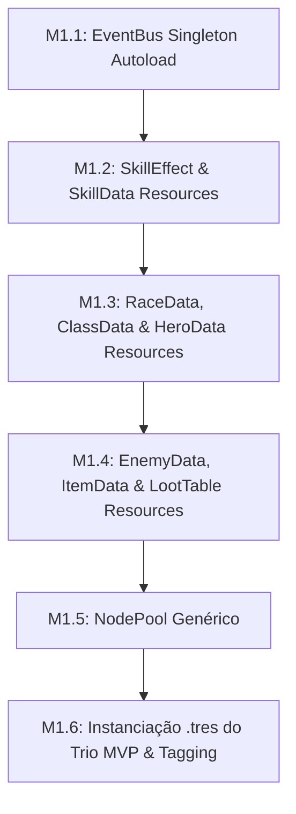

# 🚩 Marco 1 (M1) — Infraestrutura Core, Autoloads & Custom Resources

> **Status:** Concluído (M1.1 a M1.6 Concluídos)  
> **Branch de Trabalho:** `feat/m1-core`  
> **Tag Final do Marco:** `v0.1.0-m1-core`  
> **Documentos de Referência:** [`docs/planejamento/01_visao_mvp_e_marcos.md`](../docs/planejamento/01_visao_mvp_e_marcos.md), [`docs/projeto/01_visao_geral_e_padroes.md`](../docs/projeto/01_visao_geral_e_padroes.md), [`docs/projeto/05_sistema_combate_e_habilidades.md`](../docs/projeto/05_sistema_combate_e_habilidades.md), [`docs/projeto/06_sistema_itens_inventario_loot.md`](../docs/projeto/06_sistema_itens_inventario_loot.md), [`docs/projeto/08_ui_hud_e_eventbus.md`](../docs/projeto/08_ui_hud_e_eventbus.md).

---

## 🎯 Visão Geral do Marco

Este marco estabelece a **espinha dorsal de dados e comunicação** do Autodungeon. Utilizando o padrão **Data-Driven Design** da Godot Engine (via `Resource` e `class_name`), transformamos regras de heróis, habilidades, inimigos e itens em ativos puramente desacoplados (`.tres`).

Além disso, introduzimos o **`EventBus.gd`** como Singleton Autoload, permitindo que a camada de UI, áudio e sistemas de jogo reajam a eventos de combate e masmorra sem acoplamento direto entre nós de cena.

---

## 📋 Lista Sequencial de Tarefas



---

<a id="m11"></a>
### 🔹 Tarefa M1.1: Implementação do `EventBus.gd` (Singleton Autoload)

#### 1. Contexto & Escolha Arquitetural
Em jogos com combate autônomo, múltiplos eventos ocorrem em alta frequência (dano recebido, mana consumida, cura aterrissada, morte de entidade, mudança de sala). Fazer os nós se comunicarem através de chamadas diretas (`get_node()`) criaria um emaranhado de dependências que quebraria a UI a cada refatoração.

O **EventBus** atua como um despachante central de eventos baseado no padrão Observer do GoF. Nenhum nó precisa saber quem está ouvindo o evento; ele apenas o emite globalmente.

#### 2. Assinaturas & Estrutura de Código
Crie o arquivo `res://src/core/EventBus.gd` e registre-o no `project.godot` como Autoload:

```gdscript
class_name EventBusSingleton
extends Node

# --- Sinais de Combate e Entidade ---
signal entity_spawned(entity: Node3D)
signal entity_died(entity: Node3D, killer: Node3D)
signal damage_dealt(target: Node3D, source: Node3D, amount: int, is_critical: bool, is_blocked: bool)
signal healing_applied(target: Node3D, healer: Node3D, amount: int)
signal mana_changed(entity: Node3D, current_mana: float, max_mana: float)
signal health_changed(entity: Node3D, current_hp: int, max_hp: int)
signal skill_cast_started(caster: Node3D, skill_data: Resource)
signal skill_cooldown_updated(caster: Node3D, skill_id: String, remaining_ratio: float)

# --- Sinais de Masmorra & Navegação ---
signal combat_triggered(initiator: Node3D, target: Node3D)
signal room_entered(room_index: int, room_name: String)
signal room_cleared(room_index: int)
signal dungeon_path_changed(new_path_state: int) # Path 1 (Exploration), Path 2 (Chest), Path 3 (Extraction)
signal boss_telegraph_started(position: Vector3, radius: float, duration: float)

# --- Sinais de Itens & UI ---
signal potion_consumed(hero: Node3D, potion_data: Resource)
signal loot_collected(item_data: Resource, quantity: int)
signal match_ended(victory: bool, summary_data: Dictionary)
```

#### 3. Passo a Passo de Teste & Verificação
1. **Configuração de Autoload:**
   Em *Project Settings -> Globals -> Autoload*, adicione `res://src/core/EventBus.gd` com o nome `EventBus`.
2. **Cena de Teste Isolada (`res://tests/test_eventbus.tscn`):**
   Crie um script de teste conectando dois nós dummy:
   * Nó A emite `EventBus.damage_dealt.emit(null, null, 25, false, false)`.
   * Nó B conecta ao sinal e imprime no console: `[TEST] Dano recebido via EventBus: 25`.
3. **Execução:**
   Execute a cena de teste com `F6`. Verifique a mensagem no painel *Output*.

#### 4. Critérios de Aceitação
- [x] `EventBus.gd` registrado como Autoload global na Godot.
- [x] Sinais tipados para combate, masmorra, itens e UI definidos.
- [x] Teste de emissão e recepção executado sem erros no console.

#### 5. Lembrete de Commit
```bash
git checkout -b feat/m1-core
git add src/core/EventBus.gd project.godot tests/test_eventbus.tscn
git commit -m "feat(m1-core): implementar singleton autoload eventbus com sinais tipados"
```

---

<a id="m12"></a>
### 🔹 Tarefa M1.2: Camada de Dados de Habilidades (`SkillEffect.gd` e `SkillData.gd`)

#### 1. Contexto & Escolha Arquitetural
As habilidades de Autodungeon são compostas por uma definição de metadados (`SkillData`) e um array polimórfico de efeitos executáveis (`SkillEffect`). Isso permite criar skills complexas no Inspector (ex: uma skill que causa dano em área, aplica lentidão e cura o conjurador) combinando sub-recursos sem escrever novas classes de habilidade.

#### 2. Assinaturas & Estrutura de Código
Crie os arquivos em `res://src/data/skills/`:

**`res://src/data/skills/SkillEffect.gd`:**
```gdscript
class_name SkillEffect
extends Resource

enum TargetType { ENEMY_SINGLE, ENEMY_AREA, ALLY_SINGLE, ALLY_LOWEST_HP, ALLY_ALL, SELF }

@export var target_type: TargetType = TargetType.ENEMY_SINGLE
@export var value_base: int = 10
@export var stat_scaling_factor: float = 0.5
@export var duration: float = 0.0 # Se > 0, é buff/debuff com duração

func apply_effect(caster: Node3D, target: Node3D) -> void:
    # Método virtual a ser sobrescrito por DamageEffect, HealEffect, BuffEffect, etc.
    pass
```

**`res://src/data/skills/DamageSkillEffect.gd`:**
```gdscript
class_name DamageSkillEffect
extends SkillEffect

@export var is_physical: bool = true
@export var threat_multiplier: float = 1.0

func apply_effect(caster: Node3D, target: Node3D) -> void:
    # Lógica de despacho de dano desacoplado via EventBus
    pass
```

**`res://src/data/skills/SkillData.gd`:**
```gdscript
class_name SkillData
extends Resource

@export var id: String = ""
@export var display_name: String = ""
@export_multiline var description: String = ""
@export var icon: Texture2D = null
@export var mana_cost: float = 15.0
@export var cooldown: float = 6.0
@export var cast_time: float = 0.0 # 0.0 para instantânea
@export var range_meters: float = 4.0
@export var effects: Array[SkillEffect] = []
```

#### 3. Passo a Passo de Teste & Verificação
1. **Criação de Recurso no Inspector:**
   No Godot FileSystem, clique com botão direito -> *New Resource* -> `SkillData`.
2. **Preenchimento dos Campos:**
   * ID: `bromm_shield_slam`
   * Display Name: `Golpe de Escudo`
   * Mana Cost: `10.0`
   * Cooldown: `5.0`
   * No campo `effects`, adicione um novo `DamageSkillEffect` com `value_base = 20`.
3. **Salvar:**
   Salve como `res://src/data/skills/bromm_shield_slam.tres` e verifique que o arquivo carrega sem erros.

#### 4. Critérios de Aceitação
- [x] Classes `SkillEffect`, `DamageSkillEffect` e `SkillData` registradas com `class_name`.
- [x] Suporte a múltiplos efeitos por habilidade via `Array[SkillEffect]`.
- [x] Recurso `.tres` instanciável diretamente via Inspector.

#### 5. Lembrete de Commit
```bash
git add src/data/skills/
git commit -m "feat(m1-core): implementar arquitetura de custom resources para habilidades e efeitos"
```

---

<a id="m13"></a>
### 🔹 Tarefa M1.3: Camada de Dados de Heróis (`HeroData.gd`, `RaceData.gd`, `ClassData.gd`)

#### 1. Contexto & Escolha Arquitetural
Para que o sistema de expansão modular e LiveOps funcione sem acoplamento (conforme planejado em `docs/planejamento/05_roadmap_expansoes_pos_lancamento.md`), os atributos de um herói são calculados a partir da soma dos modificadores da **Raça** (`RaceData`) com a **Classe** (`ClassData`) e os valores base do **Herói** (`HeroData`).

#### 2. Assinaturas & Estrutura de Código
Crie os arquivos em `res://src/data/heroes/`:

**`res://src/data/heroes/RaceData.gd`:**
```gdscript
class_name RaceData
extends Resource

@export var race_name: String = ""
@export var bonus_max_hp: int = 0
@export var bonus_armor: int = 0
@export var bonus_magic_resist: int = 0
@export var bonus_physical_attack: int = 0
@export var bonus_magic_power: int = 0
@export var racial_trait_description: String = ""
```

**`res://src/data/heroes/ClassData.gd`:**
```gdscript
class_name ClassData
extends Resource

enum Role { TANK_MELEE, DPS_RANGED, DPS_MELEE, SUPPORT_HEALER }

@export var class_name_str: String = ""
@export var role: Role = Role.TANK_MELEE
@export var default_attack_range: float = 2.0
@export var base_move_speed: float = 4.0
@export var class_skills: Array[SkillData] = []
```

**`res://src/data/heroes/HeroData.gd`:**
```gdscript
class_name HeroData
extends Resource

@export var hero_id: String = ""
@export var hero_name: String = ""
@export var portrait: Texture2D = null
@export var race: RaceData = null
@export var hero_class: ClassData = null
@export var base_max_hp: int = 100
@export var base_max_mana: float = 50.0
@export var base_armor: int = 10
@export var base_magic_resist: int = 5
@export var base_attack_power: int = 15
@export var base_magic_power: int = 10
@export var innate_skills: Array[SkillData] = []

func get_total_max_hp() -> int:
    var race_bonus: int = race.bonus_max_hp if race else 0
    return base_max_hp + race_bonus

func get_total_armor() -> int:
    var race_bonus: int = race.bonus_armor if race else 0
    return base_armor + race_bonus
```

#### 3. Passo a Passo de Teste & Verificação
1. **Criação de Recursos de Teste:**
   Crie `res://src/data/heroes/races/race_anao.tres` (Anão: +20 HP, +5 Armadura).
2. Crie `res://src/data/heroes/classes/class_guardiao.tres` (Guardião: Role TANK_MELEE).
3. Crie `res://src/data/heroes/hero_bromm.tres` injetando a raça Anão e a classe Guardião.
4. **Verificação no Script de Teste:**
   No script de teste, carregue o `hero_bromm.tres` e valide com asserções se `hero_data.get_total_max_hp()` calcula a soma correta.

#### 4. Critérios de Aceitação
- [x] Classes de dados `RaceData`, `ClassData` e `HeroData` criadas com tipagem estática.
- [x] Funções utilitárias de agregação de atributos calculando somatório de raça + base.
- [x] Inspeção limpa no painel Inspector da Godot.

#### 5. Lembrete de Commit
```bash
git add src/data/heroes/
git commit -m "feat(m1-core): implementar custom resources de raca classe e dados base de herois"
```

---

<a id="m14"></a>
### 🔹 Tarefa M1.4: Camada de Dados de Inimigos e Itens (`EnemyData.gd`, `ItemData.gd`, `LootTableResource.gd`)

#### 1. Contexto & Escolha Arquitetural
Seguindo as especificações de `docs/projeto/06_sistema_itens_inventario_loot.md`, os itens consumíveis (como a *Poção de Vida Menor*) possuem gatilhos inatos de autodisparo (`auto_trigger_hp_threshold`), permitindo que a IA ou o sistema de combate faça o uso automático quando a condição de HP crítico é atingida.

As tabelas de drop (`LootTableResource`) utilizam cálculo ponderado de probabilidade (*weighted random*) sem acoplamento com o inventário.

#### 2. Assinaturas & Estrutura de Código
Crie os arquivos em `res://src/data/items/` e `res://src/data/enemies/`:

**`res://src/data/items/ItemData.gd`:**
```gdscript
class_name ItemData
extends Resource

enum ItemType { WEAPON, ARMOR, CONSUMABLE, MATERIAL, GOLD }

@export var item_id: String = ""
@export var item_name: String = ""
@export_multiline var description: String = ""
@export var icon: Texture2D = null
@export var item_type: ItemType = ItemType.CONSUMABLE
@export var gold_value: int = 10
@export var heal_amount: int = 0
@export var auto_trigger_hp_threshold: float = 0.30 # Dispara se HP < 30%
```

**`res://src/data/items/LootTableResource.gd`:**
```gdscript
class_name LootTableResource
extends Resource

@export var possible_items: Array[ItemData] = []
@export var drop_chances: Array[float] = [] # Probabilidades percentuais (0.0 a 1.0)
@export var min_gold: int = 5
@export var max_gold: int = 20

func roll_loot() -> Array[ItemData]:
    # Lógica de sorteio ponderado
    var dropped: Array[ItemData] = []
    # Retorna os itens sorteados
    return dropped
```

**`res://src/data/enemies/EnemyData.gd`:**
```gdscript
class_name EnemyData
extends Resource

enum EnemyTier { MINION, ELITE, BOSS }

@export var enemy_id: String = ""
@export var enemy_name: String = ""
@export var tier: EnemyTier = EnemyTier.MINION
@export var max_hp: int = 50
@export var armor: int = 2
@export var attack_power: int = 8
@export var attack_range: float = 1.8
@export var move_speed: float = 3.5
@export var loot_table: LootTableResource = null
@export var skills: Array[SkillData] = []
```

#### 3. Passo a Passo de Teste & Verificação
1. **Criação da Poção Menor:**
   Crie `res://src/data/items/consumables/item_potion_minor_hp.tres` com `heal_amount = 35` e `auto_trigger_hp_threshold = 0.30`.
2. **Criação do Goblin Minion:**
   Crie `res://src/data/enemies/enemy_goblin_warrior.tres` com `max_hp = 45` e `tier = MINION`.
3. **Teste de Roll de Loot:**
   No script de teste, invoque `loot_table.roll_loot()` 100 vezes e valide a distribuição de drops.

#### 4. Critérios de Aceitação
- [x] Estruturas `ItemData`, `LootTableResource` e `EnemyData` registradas.
- [x] Suporte a limiar de autodisparo de poção em `ItemData`.
- [x] Tabela de loot com suporte a faixa de ouro e lista de itens ponderados.

#### 5. Lembrete de Commit
```bash
git add src/data/items/ src/data/enemies/
git commit -m "feat(m1-core): implementar camada de recursos para itens consumiveis loot tables e inimigos"
```

---

<a id="m15"></a>
### 🔹 Tarefa M1.5: Implementação do `NodePool.gd` Genérico para Reciclagem de Instâncias

#### 1. Contexto & Escolha Arquitetural
Durante combates intensos com múltiplos projéteis, textos de dano flutuante e efeitos de partículas, instanciar (`.instantiate()`) e liberar (`queue_free()`) nós repetidamente gera picos no Garbage Collector e travamentos de frame (stuttering).

O **NodePool** pré-aloca uma coleção de instâncias inativas na memória e as reutiliza, mantendo o frame rate fixo a 60 FPS.

#### 2. Assinaturas & Estrutura de Código
Crie o arquivo `res://src/core/NodePool.gd`:

```gdscript
class_name NodePool
extends Node

@export var prefab_scene: PackedScene = null
@export var initial_pool_size: int = 20
@export var max_pool_size: int = 50

var _available_nodes: Array[Node] = []
var _active_nodes: Array[Node] = []

func _ready() -> void:
    # Pré-instancia o número inicial de nós inativos
    pass

func acquire_node() -> Node:
    # Retorna um nó disponível da fila, ou instancia novo se abaixo do limite
    return null

func release_node(node_instance: Node) -> void:
    # Desativa o nó e o devolve para a fila de disponíveis
    pass
```

#### 3. Passo a Passo de Teste & Verificação
1. **Cena de Teste de Pool (`res://tests/test_nodepool.tscn`):**
   Crie uma cena simples com um `NodePool` instanciando um `Node3D` dummy.
2. **Ciclo Acquire/Release:**
   * Adquira 5 nós via `acquire_node()`. Verifique se `_active_nodes.size() == 5`.
   * Devolva 3 nós via `release_node()`. Verifique se `_available_nodes` volta a ter 3 disponíveis.
3. **Verificação de Performance:**
   Execute a cena e confirme 0 vazamentos de memória (memory leaks) na aba *Monitors* do Debugger.

#### 4. Critérios de Aceitação
- [x] Classe `NodePool` implementada com controle de fila disponível/ativa.
- [x] Reutilização correta sem recriação contínua de memória.
- [x] Teste de estresse com 50 aquisições/devoluções sem warnings.

#### 5. Lembrete de Commit
```bash
git add src/core/NodePool.gd tests/test_nodepool.tscn
git commit -m "feat(m1-core): implementar componente nodepool generico para reciclagem de instancias"
```

---

<a id="m16"></a>
### 🔹 Tarefa M1.6: Criação dos Resources `.tres` do Trio MVP e Tag `v0.1.0-m1-core`

#### 1. Contexto & Escolha Arquitetural
Para que os próximos marcos (M2 a M4) construam as entidades e IAs com base em dados reais e balanceados, instanciamos os arquivos definitivos dos **3 Heróis do MVP de Autodungeon**:
1. **Bromm (Anão Guardião - Tanque Melee):** Alta vida, armadura pesada, *Investida* e *Postura Defensiva*.
2. **Elysia (Elfa Patrulheira - DPS Ranged):** Alto alcance, velocidade de ataque, *Tiro Certeiro* e *Chuva de Flechas*.
3. **Beatrice (Humana Clériga - Suporte Healer):** Suporte de retaguarda, *Cura Rápida* e *Escudo de Fé*.

#### 2. Arquivos de Recursos a Gerar
* `res://src/data/heroes/resources/hero_bromm.tres`
* `res://src/data/heroes/resources/hero_elysia.tres`
* `res://src/data/heroes/resources/hero_beatrice.tres`
* Habilidades associadas em `res://src/data/skills/resources/`

#### 3. Passo a Passo de Teste & Validação
1. **Carregamento dos 3 Heróis:**
   Crie uma rotina de inicialização no teste que carrega os 3 arquivos `.tres`.
2. **Validação de Atributos:**
   * Bromm: `HP >= 150`, `Armor >= 25`, `Role == TANK_MELEE`.
   * Elysia: `HP ~ 85`, `AttackRange >= 8.0`, `Role == DPS_RANGED`.
   * Beatrice: `HP ~ 95`, `Mana >= 100`, `Role == SUPPORT_HEALER`.

#### 4. Critérios de Aceitação
- [x] Os 3 heróis do MVP instanciados com todas as propriedades de Raça, Classe e Habilidades.
- [x] 0 erros de carregamento de dependências `.tres` na Godot Engine.
- [x] Marco M1 completo e pronto para integração.

#### 5. Passo a Passo de Merge & Tagging
```bash
# 1. Commit das alterações finais
git add src/data/
git commit -m "feat(m1-core): configurar recursos tres dos tres herois do mvp bromm elysia e beatrice"

# 2. Merge na branch main
git checkout main
git merge --no-ff feat/m1-core -m "merge(m1): integrar infraestrutura core eventbus e custom resources"

# 3. Criar a Tag do Marco 1
git tag -a v0.1.0-m1-core -m "Marco M1 Concluído: Infraestrutura Core, Autoloads e Camada de Dados Data-Driven"
git tag -n
```

---

## ⏭️ Transição para o Próximo Marco
Com a camada de dados e o barramento de eventos implementados, abra o próximo arquivo de execução:  
👉 **[02_m2_entidade_3d_base.md](02_m2_entidade_3d_base.md)**
