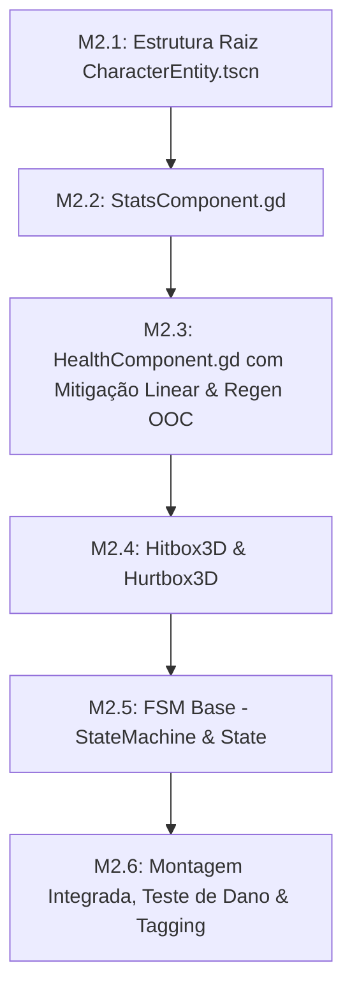

# 🚩 Marco 2 (M2) — Entidade 3D Base & Composição de Nós

> **Status:** Concluído  
> **Branch de Trabalho:** `feat/m2-entity3d`  
> **Tag Final do Marco:** `v0.1.0-m2-entity3d`  
> **Documentos de Referência:** [`docs/planejamento/01_visao_mvp_e_marcos.md`](../docs/planejamento/01_visao_mvp_e_marcos.md), [`docs/projeto/03_arquitetura_entidades_componentes.md`](../docs/projeto/03_arquitetura_entidades_componentes.md), [`docs/projeto/04_maquina_estados_e_ia.md`](../docs/projeto/04_maquina_estados_e_ia.md), [`docs/projeto/05_sistema_combate_e_habilidades.md`](../docs/projeto/05_sistema_combate_e_habilidades.md).

---

## 🎯 Visão Geral do Marco

Este marco constrói a **anatomia viva de todas as entidades do jogo** (Heróis, Inimigos e Chefes) no ambiente 3D. Seguindo o princípio de **Composição sobre Herança**, evitamos criar árvores profundas de herança (`Hero -> Warrior -> Bromm`).

Em vez disso, a cena base `CharacterEntity.tscn` é um `CharacterBody3D` modular equipado com nós especializados e plugáveis: `StatsComponent`, `HealthComponent`, `Hitbox3D`, `Hurtbox3D` e `StateMachine`.

---

## 📋 Lista Sequencial de Tarefas



---

<a id="m21"></a>
### 🔹 Tarefa M2.1: Estrutura Raiz de `CharacterEntity.tscn` e Colisor Físico 3D

#### 1. Contexto & Escolha Arquitetural
No espaço 3D da Godot 4.7+, a entidade raiz é um `CharacterBody3D`. O movimento ocorre no plano horizontal $XZ$, com a gravidade aplicada no eixo $Y$.

O colisor principal utiliza um formato de **Cápsula** (`CapsuleShape3D` com altura ~1.8m e raio ~0.4m), permitindo que os personagens deslizem suavemente por cantos de paredes e não fiquem presos em quinas de geometria da masmorra.

#### 2. Árvore de Nós & Assinaturas
Crie a cena `res://src/entities/base/CharacterEntity.tscn`:

```text
CharacterEntity (CharacterBody3D - Script: CharacterEntity.gd)
├── BodyCollider (CollisionShape3D -> CapsuleShape3D)
├── Visuals (Node3D)
│   └── ModelMesh (MeshInstance3D / Sprite3D / AnimatedMesh)
├── Components (Node3D)
│   ├── StatsComponent (Node - Script: StatsComponent.gd)
│   ├── HealthComponent (Node - Script: HealthComponent.gd)
│   └── Hurtbox3D (Area3D - Script: Hurtbox3D.gd)
└── StateMachine (Node - Script: StateMachine.gd)
```

**Script `res://src/entities/base/CharacterEntity.gd`:**
```gdscript
class_name CharacterEntity
extends CharacterBody3D

@export var hero_data: HeroData = null
@export var enemy_data: EnemyData = null

@onready var stats_component: StatsComponent = $Components/StatsComponent
@onready var health_component: HealthComponent = $Components/HealthComponent
@onready var state_machine: StateMachine = $StateMachine
@onready var visuals: Node3D = $Visuals

func _ready() -> void:
    # Inicializa componentes com os dados fornecidos (HeroData ou EnemyData)
    pass

func setup_entity_data() -> void:
    # Configura vida, armadura, ataque e habilidades a partir dos Custom Resources
    pass
```

#### 3. Passo a Passo de Teste & Verificação
1. **Instanciação na Cena de Teste:**
   Abra `res://src/world/TestEnvironment3D.tscn` e instancie uma cópia de `CharacterEntity.tscn`.
2. **Teste de Gravidade e Colisão:**
   Posicione a entidade a $Y = 3.0$ metros do chão e pressione `F6`.
   *Resultado Esperado:* A entidade deve cair suavemente sob ação da gravidade e parar exatamente sobre o chão colisor sem atravessar a malha.

#### 4. Critérios de Aceitação
- [x] Prefab `CharacterEntity.tscn` criado com nó raiz `CharacterBody3D`.
- [x] Colisor `CapsuleShape3D` configurado nas Physics Layers corretas (Layer 2 para Heróis ou Layer 3 para Monstros).
- [x] Queda física e colisão de chão verificadas no ambiente 3D.

#### 5. Lembrete de Commit
```bash
git checkout -b feat/m2-entity3d
git add src/entities/base/CharacterEntity.tscn src/entities/base/CharacterEntity.gd
git commit -m "feat(m2-entity3d): criar prefab raiz character entity 3d com colisor em capsula"
```

---

<a id="m22"></a>
### 🔹 Tarefa M2.2: Componente de Estatísticas `StatsComponent.gd`

#### 1. Contexto & Escolha Arquitetural
O `StatsComponent` centraliza todos os atributos de combate da entidade (HP Máximo, Mana Máxima, Poder de Ataque Físico, Poder Mágico, Armadura, Resistência Mágica, Chance Crítica e Velocidade).

Ele suporta **Modificadores Temporários e Permanentes** (*Flat* e *Percentuais*), permitindo que auras de boss, buffs de suporte e equipamentos alterem estatísticas sem sobrescrever os valores base.

#### 2. Assinaturas & Estrutura de Código
Crie o arquivo `res://src/entities/components/StatsComponent.gd`:

```gdscript
class_name StatsComponent
extends Node

signal stat_modified(stat_name: String, new_value: float)

@export var max_hp: int = 100
@export var max_mana: float = 50.0
@export var attack_power: int = 15
@export var magic_power: int = 10
@export var armor: int = 10
@export var magic_resist: int = 5
@export var move_speed: float = 4.0
@export var critical_chance: float = 0.05

var _flat_modifiers: Dictionary = {}
var _percent_modifiers: Dictionary = {}

func initialize_from_hero_data(data: HeroData) -> void:
    # Popula os atributos a partir de HeroData + RaceData + ClassData
    pass

func initialize_from_enemy_data(data: EnemyData) -> void:
    # Popula atributos a partir de EnemyData
    pass

func get_stat(stat_name: String) -> float:
    # Retorna o valor calculado: (base + sum(flats)) * (1.0 + sum(percents))
    return 0.0

func add_flat_modifier(stat_name: String, id: String, value: float) -> void:
    pass

func remove_modifier(stat_name: String, id: String) -> void:
    pass
```

#### 3. Passo a Passo de Teste & Verificação
1. **Cena de Teste Unitário (`res://tests/test_stats_comp.tscn`):**
   Instancie o `StatsComponent` e injete o recurso `res://src/data/heroes/resources/hero_bromm.tres`.
2. **Validação de Modificadores:**
   * Aplique um flat modifier de $+10$ em `armor`. Chame `get_stat("armor")` e confirme o valor.
   * Remova o modificador e valide se a armadura retornou ao valor base original.

#### 4. Critérios de Aceitação
- [x] Classe `StatsComponent` implementada com cálculo estático e dinâmico de modificadores.
- [x] Inicialização desacoplada tanto via `HeroData` quanto via `EnemyData`.
- [x] Emissão do sinal `stat_modified` ao alterar valores em tempo real.

#### 5. Lembrete de Commit
```bash
git add src/entities/components/StatsComponent.gd tests/test_stats_comp.tscn
git commit -m "feat(m2-entity3d): implementar statscomponent com suporte a modificadores dinamicos"
```

---

<a id="m23"></a>
### 🔹 Tarefa M2.3: Componente de Vida e Mana `HealthComponent.gd`

#### 1. Contexto & Escolha Arquitetural
O `HealthComponent` gerencia a integridade vital da entidade e implementa a fórmula matemática estipulada em `docs/projeto/05_sistema_combate_e_habilidades.md`:

$$\text{Dano Recebido} = \max\Big(1, \text{Dano Bruto} - \min(80, \text{Armadura Eficaz})\Big)$$

* **Teto de Proteção (Cap de 80):** A armadura nunca pode mitigar mais do que 80 pontos fixos de dano por golpe, impedindo tanques de ficarem 100% imunes a ataques pesados de boss.
* **Dano Mínimo:** Todo golpe bem-sucedido causa pelo menos 1 ponto de dano.
* **Regeneração de Mana Fora de Combate (OOC):** Quando a entidade não está em combate ativo, ela recupera $5\%$ de sua mana máxima a cada 2 segundos.

#### 2. Assinaturas & Estrutura de Código
Crie o arquivo `res://src/entities/components/HealthComponent.gd`:

```gdscript
class_name HealthComponent
extends Node

signal health_changed(current_hp: int, max_hp: int)
signal mana_changed(current_mana: float, max_mana: float)
signal damage_taken(amount: int, is_blocked: bool, source: Node3D)
signal healed(amount: int, healer: Node3D)
signal died(killer: Node3D)

@export var current_hp: int = 100
@export var max_hp: int = 100
@export var current_mana: float = 50.0
@export var max_mana: float = 50.0
@export var is_alive: bool = true
@export var in_combat: bool = false

var _ooc_mana_timer: float = 0.0

func _physics_process(delta: float) -> void:
    # Processa regeneração de mana fora de combate (5% a cada 2.0s)
    if not in_combat and is_alive:
        _process_ooc_mana_regen(delta)

func take_damage(raw_damage: int, armor_value: int, source: Node3D) -> int:
    # Aplica mitigação linear com cap de 80 e teto mínimo de 1 de dano
    # Emite sinal de damage_taken e verifica se HP <= 0 para disparar died
    return 0

func heal(amount: int, healer: Node3D) -> int:
    # Restaura HP respeitando o teto de max_hp
    return 0

func consume_mana(amount: float) -> bool:
    # Consome mana se houver saldo suficiente e retorna true
    return false

func _process_ooc_mana_regen(delta: float) -> void:
    pass
```

#### 3. Passo a Passo de Teste & Verificação
1. **Teste de Mitigação Linear:**
   * Invoque `take_damage(raw_damage = 50, armor = 20)`: Dano esperado $= 30$.
   * Invoque `take_damage(raw_damage = 50, armor = 90)`: Dano esperado $= \max(1, 50 - 80) = 1$.
2. **Teste de Morte:**
   * Invoque `take_damage(raw_damage = 999, armor = 0)`: Verifique se `is_alive` se torna `false` e o sinal `died` é disparado.
3. **Teste de Regen de Mana:**
   * Configure `current_mana = 0.0`, `in_combat = false` e simule 2 segundos de processo físico. O mana deve subir para $5\%$ de `max_mana`.

#### 4. Critérios de Aceitação
- [x] Fórmula de dano com mitigação linear e teto de proteção de 80 respeitada.
- [x] Disparo correto do sinal `died` apenas na transição de vivo para morto.
- [x] Regeneração contínua de mana OOC a cada 2s validada.

#### 5. Lembrete de Commit
```bash
git add src/entities/components/HealthComponent.gd
git commit -m "feat(m2-entity3d): implementar healthcomponent com mitigacao linear cap 80 e regen de mana ooc"
```

---

<a id="m24"></a>
### 🔹 Tarefa M2.4: Componentes de Combate `Hitbox3D.gd` e `Hurtbox3D.gd`

#### 1. Contexto & Escolha Arquitetural
Para que o combate físico e espacial funcione de forma legível e sem acoplamento:
* **`Hurtbox3D` (Área Receptora):** Fica atrelada ao corpo da entidade, monitora colisões e encaminha o impacto diretamente para o `HealthComponent`.
* **`Hitbox3D` (Área Ofensiva):** Fica atrelada a armas, projéteis ou áreas de skills, emitindo dados de ataque (`damage`, `is_physical`, `source_entity`) ao colidir com uma `Hurtbox3D` inimiga.

#### 2. Assinaturas & Estrutura de Código
Crie os arquivos em `res://src/entities/components/`:

**`res://src/entities/components/Hurtbox3D.gd`:**
```gdscript
class_name Hurtbox3D
extends Area3D

signal damage_received(hitbox: Hitbox3D)

@export var health_component: HealthComponent = null
@export var stats_component: StatsComponent = null

func receive_hit(hitbox: Hitbox3D) -> void:
    # Extrai dano da Hitbox, consulta armadura do StatsComponent e aplica no HealthComponent
    pass
```

**`res://src/entities/components/Hitbox3D.gd`:**
```gdscript
class_name Hitbox3D
extends Area3D

@export var damage: int = 10
@export var is_physical: bool = true
@export var source_entity: Node3D = null

func _ready() -> void:
    # Conecta o sinal area_entered para detectar Hurtbox3D
    pass

func _on_area_entered(area: Area3D) -> void:
    if area is Hurtbox3D and area != source_entity:
        area.receive_hit(self)
```

#### 3. Passo a Passo de Teste & Verificação
1. **Cena de Teste de Impacto 3D (`res://tests/test_combat_areas.tscn`):**
   * Crie uma entidade dummy defensiva com `Hurtbox3D` (Physics Layer 5).
   * Crie uma área ofensiva `Hitbox3D` (Physics Layer 4 e Mask 5).
2. **Execução:**
   Mova a Hitbox até sobrepor a Hurtbox.
   *Resultado Esperado:* A Hurtbox deve registrar o impacto, o `HealthComponent` deve deduzir o HP e emitir `EventBus.damage_dealt`.

#### 4. Critérios de Aceitação
- [x] Camadas de física configuradas sem colisão interna (uma entidade nunca atinge a si mesma).
- [x] Encaminhamento atômico de impacto da Hitbox para a Hurtbox.
- [x] Registro do evento no `EventBus` global.

#### 5. Lembrete de Commit
```bash
git add src/entities/components/Hitbox3D.gd src/entities/components/Hurtbox3D.gd tests/test_combat_areas.tscn
git commit -m "feat(m2-entity3d): implementar componentes de colisao de combate hitbox3d e hurtbox3d"
```

---

<a id="m25"></a>
### 🔹 Tarefa M2.5: Máquina de Estados Finita (`StateMachine.gd` e `State.gd`)

#### 1. Contexto & Escolha Arquitetural
Para que o comportamento de heróis e monstros transite de forma limpa entre **Marcha**, **Combate**, **Lançamento de Skill**, **Recuo (Kiting)** e **Morte**, utilizamos uma Máquina de Estados Finita (FSM) modular onde cada estado é um nó filho isolado.

#### 2. Assinaturas & Estrutura de Código
Crie os arquivos em `res://src/entities/fsm/`:

**`res://src/entities/fsm/State.gd`:**
```gdscript
class_name State
extends Node

var state_machine: StateMachine = null
var actor: CharacterEntity = null

func enter() -> void:
    pass

func exit() -> void:
    pass

func physics_update(delta: float) -> void:
    pass

func update(delta: float) -> void:
    pass
```

**`res://src/entities/fsm/StateMachine.gd`:**
```gdscript
class_name StateMachine
extends Node

signal state_changed(from_state: String, to_state: String)

@export var initial_state: State = null

var current_state: State = null
var _states: Dictionary = {}

func _ready() -> void:
    # Mapeia todos os nós filhos do tipo State e inicializa o initial_state
    pass

func _physics_process(delta: float) -> void:
    if current_state:
        current_state.physics_update(delta)

func change_state(new_state_name: String) -> void:
    # Realiza a transição segura: exit() no atual -> enter() no novo
    pass
```

#### 3. Passo a Passo de Teste & Verificação
1. **Criação de Estados Dummy:**
   Crie `res://tests/DummyStateA.gd` e `res://tests/DummyStateB.gd`.
2. **Teste de Transição:**
   * Inicialize em Estado A. Chame `change_state("DummyStateB")`.
   * Verifique se `exit()` de A foi chamado antes de `enter()` de B.

#### 4. Critérios de Aceitação
- [x] Classes `State` e `StateMachine` registradas e tipadas.
- [x] Transições de estado atômicas com disparo do sinal `state_changed`.
- [x] Tolerância a nomes de estados inválidos com log defensivo de erro.

#### 5. Lembrete de Commit
```bash
git add src/entities/fsm/
git commit -m "feat(m2-entity3d): implementar maquina de estados finita fsm e classe base state"
```

---

<a id="m26"></a>
### 🔹 Tarefa M2.6: Integração na `CharacterEntity.tscn`, Teste de Dano e Tag `v0.1.0-m2-entity3d`

#### 1. Contexto & Escolha Arquitetural
Nesta tarefa final do Marco 2, montamos a composição completa de nós na cena `CharacterEntity.tscn`, conectando `StatsComponent`, `HealthComponent`, `Hurtbox3D` e a `StateMachine`.

#### 2. Checklist de Montagem do Prefab Base
* Nó Raiz: `CharacterEntity` (`CharacterBody3D`)
* Filho: `CollisionShape3D` (Cápsula)
* Filho: `Visuals` (`Node3D` com malha teste)
* Filho: `Components` (`Node3D`)
  * `StatsComponent`
  * `HealthComponent`
  * `Hurtbox3D`
* Filho: `StateMachine` (`Node`)
  * `IdleState`
  * `DeadState`

#### 3. Passo a Passo de Teste de Integração
1. **Executar a Cena de Teste de Entidade (`res://tests/test_character_entity.tscn`):**
   * Instancie a entidade e simule a recepção de 3 golpes consecutivos.
   * Verifique se o HP cai no inspetor e no console.
   * Ao atingir HP 0, a `StateMachine` deve transitar imediatamente para `DeadState`, desativando a colisão física da entidade.

#### 4. Critérios de Aceitação
- [x] Prefab `CharacterEntity.tscn` 100% funcional com todos os componentes integrados.
- [x] Transição automática para `DeadState` na morte.
- [x] 0 erros no painel Debugger da Godot.

#### 5. Passo a Passo de Merge & Tagging
```bash
# 1. Commit das alterações de integração
git add src/entities/ tests/
git commit -m "feat(m2-entity3d): consolidar prefab character entity 3d integrado com componentes e fsm"

# 2. Merge na branch main
git checkout main
git merge --no-ff feat/m2-entity3d -m "merge(m2): integrar entidade 3d base e composicao de componentes"

# 3. Criar a Tag do Marco 2
git tag -a v0.1.0-m2-entity3d -m "Marco M2 Concluído: Entidade 3D Base, Componentes de Stats, Health, Dano e FSM"
git tag -n
```

---

## ⏭️ Transição para o Próximo Marco
Com a entidade 3D base operacional, abra o próximo arquivo de execução:  
👉 **[03_m3_navegacao_tethering.md](03_m3_navegacao_tethering.md)**
