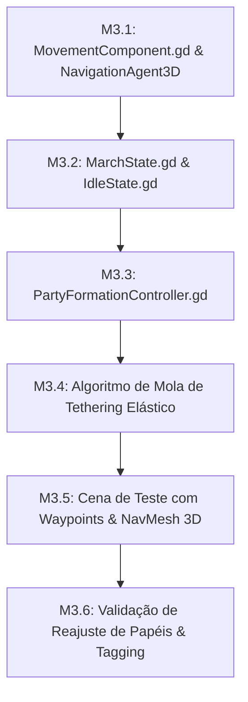

# 🚩 Marco 3 (M3) — Navegação 3D, Formação & Tethering do Trio

> **Status:** Em Progresso  
> **Branch de Trabalho:** `feat/m3-navigation3d`  
> **Tag Final do Marco:** `v0.1.0-m3-navigation3d`  
> **Documentos de Referência:** [`docs/planejamento/01_visao_mvp_e_marcos.md`](../docs/planejamento/01_visao_mvp_e_marcos.md), [`docs/projeto/04_maquina_estados_e_ia.md`](../docs/projeto/04_maquina_estados_e_ia.md), [`docs/projeto/07_navegacao_dungeon_e_fases.md`](../docs/projeto/07_navegacao_dungeon_e_fases.md), [`docs/idea/geral.md`](../docs/idea/geral.md).

---

## 🎯 Visão Geral do Marco

Este marco dá vida à **marcha autônoma do trio de heróis** no ambiente 3D. Em vez de heróis se movendo de maneira caótica ou em linha reta rígida, implementamos um sistema de **Formação Tática Orgânica** com **Tethering Elástico**.

O Tanque lidera a vanguarda e dita a rota dos Waypoints da masmorra no `NavigationRegion3D`. O Suporte segue no centro protegido e a DPS cobre a retaguarda. Se o grupo se distanciar além do raio de tolerância (cerca de 3.0 metros / 90 pixels), o líder desacelera automaticamente para aguardar os companheiros, mantendo o trio sempre compacto e coeso.

---

## 📋 Lista Sequencial de Tarefas



---

<a id="m31"></a>
### 🔹 Tarefa M3.1: Componente de Movimentação `MovementComponent.gd` com `NavigationAgent3D`

#### 1. Contexto & Escolha Arquitetural
Na Godot 4.7+, a navegação contínua no espaço 3D deve utilizar o `NavigationAgent3D` sincronizado com os servidores de navegação física (`NavigationServer3D`).

O `MovementComponent` é responsável por solicitar caminhos para alvos no plano horizontal $XZ$, ajustar a rotação suave do personagem na direção do movimento (`slerp` ou `looking_at`) e aplicar a velocidade no `CharacterBody3D`.

#### 2. Assinaturas & Estrutura de Código
Crie o arquivo `res://src/entities/components/MovementComponent.gd`:

```gdscript
class_name MovementComponent
extends Node

signal target_reached()
signal path_blocked()

@export var navigation_agent: NavigationAgent3D = null
@export var character_body: CharacterBody3D = null
@export var base_speed: float = 4.0
@export var rotation_speed: float = 10.0

var current_target_position: Vector3 = Vector3.ZERO
var speed_multiplier: float = 1.0

func _ready() -> void:
    # Configura tolerâncias de chegada no NavigationAgent3D (ex: target_desired_distance = 0.5)
    pass

func move_towards(target_pos: Vector3) -> void:
    # Define a posição de destino no NavigationAgent3D
    pass

func process_movement(delta: float) -> void:
    # Obtém a próxima posição de navegação, calcula direção no plano XZ, 
    # rotaciona a malha e executa character_body.move_and_slide()
    pass

func stop_movement() -> void:
    # Zera velocidade linear do CharacterBody3D
    pass
```

#### 3. Passo a Passo de Teste & Verificação
1. **Instanciação com NavigationAgent3D:**
   Adicione um `NavigationAgent3D` como filho da `CharacterEntity.tscn` e conecte-o ao `MovementComponent`.
2. **Teste de Destino Único:**
   Na cena de teste, mande o agente navegar até $Vector3(10, 0, 10)$.
   *Resultado Esperado:* O agente deve caminhar suavemente até o ponto e disparar o sinal `target_reached`.

#### 4. Critérios de Aceitação
- [x] `MovementComponent` desacoplado do código específico de herói.
- [x] Rotação suave do personagem orientada ao vetor de movimento no plano $XZ$.
- [x] Emissão do sinal `target_reached` ao entrar no raio de tolerância.

#### 5. Lembrete de Commit
```bash
git checkout -b feat/m3-navigation3d
git add src/entities/components/MovementComponent.gd
git commit -m "feat(m3-navigation3d): implementar movementcomponent 3d integrado ao navigationagent3d"
```

---

<a id="m32"></a>
### 🔹 Tarefa M3.2: Estados de Locomoção `MarchState.gd` e `IdleState.gd`

#### 1. Contexto & Escolha Arquitetural
Para que o `CharacterEntity` saiba quando marchar em formação pela masmorra ou quando permanecer em guarda imóvel, encapsulamos esses comportamentos em nós `State` conectados à `StateMachine`.

#### 2. Assinaturas & Estrutura de Código
Crie os arquivos em `res://src/entities/fsm/states/`:

**`res://src/entities/fsm/states/MarchState.gd`:**
```gdscript
class_name MarchState
extends State

@export var movement_component: MovementComponent = null

func enter() -> void:
    # Ativa animação de caminhada / marcha
    pass

func physics_update(delta: float) -> void:
    if movement_component:
        movement_component.process_movement(delta)

func exit() -> void:
    if movement_component:
        movement_component.stop_movement()
```

**`res://src/entities/fsm/states/IdleState.gd`:**
```gdscript
class_name IdleState
extends State

func enter() -> void:
    # Ativa animação idle e zera velocidade
    pass
```

#### 3. Passo a Passo de Teste & Verificação
1. **Transição de Estados:**
   No script de teste, inicialize a entidade em `IdleState`, alterne para `MarchState` e volte para `IdleState`.
2. **Verificação de Movimento:**
   A entidade só deve se mover enquanto estiver ativamente no `MarchState`.

#### 4. Critérios de Aceitação
- [x] Estados `MarchState` e `IdleState` criados e integrados à `StateMachine`.
- [x] Parada física imediata ao sair de `MarchState`.

#### 5. Lembrete de Commit
```bash
git add src/entities/fsm/states/
git commit -m "feat(m3-navigation3d): implementar estados marchstate e idlestate na fsm da entidade"
```

---

<a id="m33"></a>
### 🔹 Tarefa M3.3: Controlador de Formação `PartyFormationController.gd`

#### 1. Contexto & Escolha Arquitetural
O grupo é composto pelo trio clássico:
* **Vanguarda (Líder / Tanque - Bromm):** Segue diretamente a rota de Waypoints da Masmorra.
* **Centro (Suporte - Beatrice):** Mantém offset de proteção logo atrás e à direita do líder (`Vector3(1.2, 0, 1.2)`).
* **Retaguarda (DPS - Elysia):** Mantém offset de cobertura recuada e à esquerda (`Vector3(-1.2, 0, 1.8)`).

O `PartyFormationController` calcula a matriz de transformação do líder e projeta as posições relativas dos seguidores no espaço 3D.

#### 2. Assinaturas & Estrutura de Código
Crie o arquivo `res://src/systems/PartyFormationController.gd`:

```gdscript
class_name PartyFormationController
extends Node3D

@export var leader_hero: CharacterEntity = null
@export var support_hero: CharacterEntity = null
@export var dps_hero: CharacterEntity = null

# Offsets relativos ao líder (em coordenadas locais de rotação)
@export var support_offset: Vector3 = Vector3(1.2, 0, 1.2)
@export var dps_offset: Vector3 = Vector3(-1.2, 0, 1.8)

func _physics_process(delta: float) -> void:
    # Atualiza as posições de destino dos seguidores baseando-se no transform global do líder
    _update_follower_targets()

func _update_follower_targets() -> void:
    pass

func get_leader() -> CharacterEntity:
    return leader_hero

func reassign_roles_on_hero_death(dead_hero: CharacterEntity) -> void:
    # Se o líder/tanque morrer, o DPS ou Suporte assume a liderança da marcha
    pass
```

#### 3. Passo a Passo de Teste & Verificação
1. **Cena de Teste de Formação:**
   Instancie os 3 heróis e conecte-os ao `PartyFormationController`.
2. **Movimentação do Líder:**
   Mova o líder em linha reta e em curvas de $90^\circ$.
   *Resultado Esperado:* Os 2 seguidores devem orbitar suavemente mantendo seus respectivos flancos em relação à orientação do líder.

#### 4. Critérios de Aceitação
- [x] Posicionamento em cunha/triângulo tático preservado durante caminhadas retas e em curva.
- [x] Cálculo de coordenadas relativas baseado na orientação (`Transform3D`) do líder.

#### 5. Lembrete de Commit
```bash
git add src/systems/PartyFormationController.gd
git commit -m "feat(m3-navigation3d): implementar partyformationcontroller para formacao tatica do trio"
```

---

<a id="m34"></a>
### 🔹 Tarefa M3.4: Algoritmo de Mola de Tethering Elástico e Coesão

#### 1. Contexto & Escolha Arquitetural
Para que o trio pareça uma equipe coordenada e não se disperse pelos corredores da masmorra:
* Se a distância entre o líder e o herói mais distante for **$< 2.0\text{m}$ (zona ideal)**: todos marcham na velocidade normal ($1.0\times$).
* Se a distância for **entre $2.0\text{m}$ e $3.0\text{m}$ (zona de tensão)**: o seguidor atrasado ganha bônus de corrida ($1.25\times$).
* Se a distância exceder **$> 3.0\text{m}$ (90px / ruptura)**: o líder desacelera para $0.5\times$ ou para momentaneamente até o grupo se reagrupar.

#### 2. Assinaturas & Estrutura de Código
Integre ao `PartyFormationController.gd`:

```gdscript
# Limiares de tethering elástico (em metros)
@export var tether_ideal_distance: float = 2.0
@export var tether_max_distance: float = 3.0

func _apply_tethering_adjustments() -> void:
    # Calcula a distância do seguidor mais atrasado em relação ao líder
    # Ajusta o speed_multiplier do MovementComponent de cada herói
    pass
```

#### 3. Passo a Passo de Teste & Verificação
1. **Simulação de Atraso:**
   Coloque um obstáculo temporário na frente do DPS.
   *Resultado Esperado:* Quando a distância passar de 3.0m, o líder deve desacelerar visivelmente até o obstáculo ser contornado e o DPS se reaproximar.

#### 4. Critérios de Aceitação
- [x] Desaceleração suave do líder na ruptura de tethering ($>3.0\text{m}$).
- [x] Aceleração compensatória dos seguidores na zona de tensão ($2.0\text{m}$ a $3.0\text{m}$).
- [x] Ausência de travamentos de física ou tremores visuais (*jittering*).

#### 5. Lembrete de Commit
```bash
git add src/systems/PartyFormationController.gd
git commit -m "feat(m3-navigation3d): implementar algoritmo de mola de tethering elastico e coesao de velocidade"
```

---

<a id="m35"></a>
### 🔹 Tarefa M3.5: Cena de Teste de Travessia 3D com Waypoints e NavMesh

#### 1. Contexto & Escolha Arquitetural
Criamos uma cena de validação completa `res://tests/test_party_navigation_3d.tscn` contendo um percurso sinuoso com curvas de $90^\circ$, estreitamentos de corredor e uma série de Waypoints 3D interligados.

#### 2. Árvore da Cena de Teste
```text
TestPartyNavigation3D (Node3D)
├── NavigationRegion3D (NavigationRegion3D - NavMesh baked)
│   └── CorridorGeometry (StaticBody3D)
├── WaypointsHolder (Node3D)
│   ├── Waypoint_0 (Marker3D)
│   ├── Waypoint_1 (Marker3D)
│   ├── Waypoint_2 (Marker3D)
│   └── Waypoint_3 (Marker3D)
├── PartyFormationController (Node3D)
│   ├── Hero_Bromm (CharacterEntity)
│   ├── Hero_Beatrice (CharacterEntity)
│   └── Hero_Elysia (CharacterEntity)
└── IsometricCameraRig (Node3D -> Segue o líder)
```

#### 3. Passo a Passo de Teste & Verificação
1. **Baking da Malha de Navegação:**
   Selecione o `NavigationRegion3D` e clique em *Bake NavMesh* no editor.
2. **Executar Travessia:**
   Execute a cena com `F6`. O trio deve percorrer do `Waypoint_0` até o `Waypoint_3` de forma autônoma.
3. **Validação de Câmera:**
   A câmera isométrica deve acompanhar o centro de massa do grupo suavemente.

#### 4. Critérios de Aceitação
- [ ] Trio percorre os 4 waypoints sem colidir ou se prender nas paredes.
- [ ] NavMesh 3D assado com folga de margem para o tamanho das cápsulas dos 3 heróis.

#### 5. Lembrete de Commit
```bash
git add tests/test_party_navigation_3d.tscn
git commit -m "feat(m3-navigation3d): criar cena de teste de travessia 3d com waypoints e navmesh baked"
```

---

<a id="m36"></a>
### 🔹 Tarefa M3.6: Teste de Reajuste de Papéis em Morte de Herói e Tag `v0.1.0-m3-navigation3d`

#### 1. Contexto & Escolha Arquitetural
Se o líder do grupo (Bromm) morrer durante a exploração, o `PartyFormationController` deve detectar o evento via `EventBus.entity_died` e promover automaticamente o próximo herói vivo mais resistente para a vanguarda, garantindo que o grupo continue a marchar.

#### 2. Passo a Passo de Teste & Validação
1. **Disparo de Morte no Líder:**
   Na cena de travessia, force a morte de Bromm via console/debug.
2. **Comportamento Esperado:**
   * Bromm para no local e assume `DeadState`.
   * Beatrice ou Elysia assume a liderança imediata dos waypoints restantes.
   * A câmera refocaliza no novo líder sem travar.

#### 3. Critérios de Aceitação
- [ ] Reajuste automático de papéis ao morrer o líder.
- [ ] Travessia continua funcional com 2 ou 1 herói restante.
- [ ] Marco M3 100% testado e concluído.

#### 4. Passo a Passo de Merge & Tagging
```bash
# 1. Commit final
git add src/systems/ tests/
git commit -m "feat(m3-navigation3d): implementar reajuste dinamico de papeis da formacao em caso de morte"

# 2. Merge na branch main
git checkout main
git merge --no-ff feat/m3-navigation3d -m "merge(m3): integrar navegacao 3d formacao e tethering elastico"

# 3. Criar a Tag do Marco 3
git tag -a v0.1.0-m3-navigation3d -m "Marco M3 Concluído: Navegação 3D, Formação do Trio e Algoritmo de Tethering Elástico"
git tag -n
```

---

## ⏭️ Transição para o Próximo Marco
Com o sistema de locomoção e formação do trio funcional, abra o próximo arquivo de execução:  
👉 **[04_m4_combate_ia_herois.md](04_m4_combate_ia_herois.md)**
