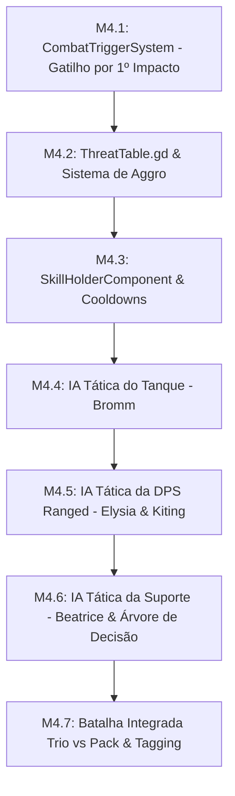

# 🚩 Marco 4 (M4) — Combate 3D, Gatilho por Impacto & IA dos 3 Heróis

> **Status:** Em Progresso  
> **Branch de Trabalho:** `feat/m4-combat-ai`  
> **Tag Final do Marco:** `v0.1.0-m4-combat-ai`  
> **Documentos de Referência:** [`docs/planejamento/01_visao_mvp_e_marcos.md`](../docs/planejamento/01_visao_mvp_e_marcos.md), [`docs/projeto/04_maquina_estados_e_ia.md`](../docs/projeto/04_maquina_estados_e_ia.md), [`docs/projeto/05_sistema_combate_e_habilidades.md`](../docs/projeto/05_sistema_combate_e_habilidades.md), [`docs/idea/geral.md`](../docs/idea/geral.md).

---

## 🎯 Visão Geral do Marco

Este marco implementa o **coração estratégico e tático de Autodungeon**: o combate autônomo tridimensional.

Três pilares fundamentais definem este marco:
1. **Gatilho de Batalha por Primeiro Impacto Físico:** Nenhum herói de retaguarda ataca ou conjura feitiços prematuramente enquanto o tanque estiver em marcha. O combate só inicia no exato milissegundo em que o primeiro golpe físico colide (`Hitbox3D -> Hurtbox3D`).
2. **Sistema de Aggro & Tabela de Ameaça (`ThreatTable`):** Inimigos atacam o alvo com maior valor de ameaça gerado pelo tanque.
3. **IAs Especializadas do Trio:**
   * **Bromm (Tanque):** Avança com *Investida*, trava os mobs e ativa *Postura Defensiva*.
   * **Elysia (DPS Ranged):** Dispara à distância ($180\text{px} / 6.0\text{m}$) e executa **kiting** automático recuando se os monstros se aproximarem.
   * **Beatrice (Suporte):** Executa uma **árvore de decisão de 4 níveis de prioridade** para salvar aliados em perigo antes de causar dano.

---

## 📋 Lista Sequencial de Tarefas



---

<a id="m41"></a>
### 🔹 Tarefa M4.1: Sistema de Gatilho de Batalha por Primeiro Impacto Físico

#### 1. Contexto & Escolha Arquitetural
Conforme definido no GDD (`docs/idea/geral.md`), o combate em Autodungeon não se inicia por aproximação visual nem por clique do jogador. O grupo inteiro permanece em estado de marcha até que o primeiro contato de combate físico ocorra.

No momento do impacto (`EventBus.damage_dealt` ou colisão na `Hitbox3D` da vanguarda), o `CombatTriggerSystem` emite `EventBus.combat_triggered`, convertendo instantaneamente a FSM de todos os membros do grupo do `MarchState` para os seus respectivos estados de combate.

#### 2. Assinaturas & Estrutura de Código
Crie o arquivo `res://src/systems/CombatTriggerSystem.gd`:

```gdscript
class_name CombatTriggerSystem
extends Node

signal party_combat_started(target_pack: Array[Node3D])
signal party_combat_ended()

var is_party_in_combat: bool = false

func _ready() -> void:
    EventBus.damage_dealt.connect(_on_damage_dealt)
    EventBus.entity_died.connect(_on_entity_died)

func _on_damage_dealt(target: Node3D, source: Node3D, amount: int, is_critical: bool, is_blocked: bool) -> void:
    # Se a equipe estiver em marcha e houver impacto entre Herói e Inimigo:
    if not is_party_in_combat and _is_combat_participant(target, source):
        trigger_combat_start(source, target)

func trigger_combat_start(initiator: Node3D, target: Node3D) -> void:
    is_party_in_combat = true
    EventBus.combat_triggered.emit(initiator, target)

func _is_combat_participant(a: Node3D, b: Node3D) -> bool:
    # Retorna true se um for da camada Hero e o outro da camada Enemy
    return true
```

#### 3. Passo a Passo de Teste & Verificação
1. **Cena de Teste de Gatilho:**
   Posicione o trio marchando em direção a um monstro imóvel.
2. **Validação Temporal:**
   * Enquanto Bromm caminha, Beatrice e Elysia **não** disparam tiros nem curam.
   * No milissegundo em que a espada de Bromm toca a Hurtbox do monstro, a FSM dos 3 heróis muda instantaneamente para o estado de batalha.

#### 4. Critérios de Aceitação
- [x] Transição síncrona de Marcha $\rightarrow$ Batalha disparada pelo primeiro impacto físico.
- [x] Zero ataques disparados pela retaguarda antes do contato.

#### 5. Lembrete de Commit
```bash
git checkout -b feat/m4-combat-ai
git add src/systems/CombatTriggerSystem.gd
git commit -m "feat(m4-combat-ai): implementar combattriggersystem com ativacao por primeiro impacto fisico"
```

---

<a id="m42"></a>
### 🔹 Tarefa M4.2: Sistema de Gestão de Ameaça e Aggro (`ThreatTable.gd`)

#### 1. Contexto & Escolha Arquitetural
Para que o papel do Tanque seja relevante, os inimigos utilizam uma **Tabela de Ameaça** (`ThreatTable`).
* Ataques normais geram ameaça proporcional ao dano causado ($1.0\times$).
* Habilidades do Tanque (como *Golpe de Escudo* e *Investida*) geram multiplicador elevado de ameaça ($3.0\times$ a $5.0\times$).
* O inimigo sempre foca no personagem com o maior valor na sua tabela.

#### 2. Assinaturas & Estrutura de Código
Crie o arquivo `res://src/entities/components/ThreatTable.gd`:

```gdscript
class_name ThreatTable
extends Node

signal primary_target_changed(new_target: CharacterEntity)

var _threat_scores: Dictionary = {} # Chave: CharacterEntity, Valor: float (threat)
var primary_target: CharacterEntity = null

func add_threat(source: CharacterEntity, amount: float) -> void:
    # Incrementa a pontuação de ameaça da fonte e recalcula o alvo primário
    pass

func modify_threat_multiplier(source: CharacterEntity, multiplier: float) -> void:
    pass

func clear_dead_target(dead_target: CharacterEntity) -> void:
    _threat_scores.erase(dead_target)
    _recalculate_primary_target()

func _recalculate_primary_target() -> void:
    # Define o alvo primário como o de maior pontuação
    pass
```

#### 3. Passo a Passo de Teste & Verificação
1. **Teste de Mudança de Alvo:**
   * DPS causa 20 de dano (Threat = 20). Inimigo foca no DPS.
   * Tanque usa Golpe de Escudo gerando 80 de Threat.
   * O inimigo deve virar imediatamente para o Tanque e disparar `primary_target_changed`.

#### 4. Critérios de Aceitação
- [x] Tabela de ameaça mantém pontuação dinâmica por atacante.
- [x] Limpeza imediata de entidades mortas da tabela.

#### 5. Lembrete de Commit
```bash
git add src/entities/components/ThreatTable.gd
git commit -m "feat(m4-combat-ai): implementar threattable para gerenciamento de aggro dos monstros"
```

---

<a id="m43"></a>
### 🔹 Tarefa M4.3: Componente de Habilidades `SkillHolderComponent.gd`

#### 1. Contexto & Escolha Arquitetural
O `SkillHolderComponent` gerencia os cooldowns, o custo de mana e a execução das habilidades equipadas pela entidade. Ele emite sinais para a interface através do `EventBus` para atualizar os relógios radiais de cooldown no HUD.

#### 2. Assinaturas & Estrutura de Código
Crie o arquivo `res://src/entities/components/SkillHolderComponent.gd`:

```gdscript
class_name SkillHolderComponent
extends Node

signal skill_ready(skill_data: SkillData)
signal skill_executed(skill_data: SkillData)

@export var equipped_skills: Array[SkillData] = []

var _cooldown_timers: Dictionary = {} # Chave: skill_id, Valor: float (tempo restante)

func _physics_process(delta: float) -> void:
    # Decrementa timers de cooldown e emite EventBus.skill_cooldown_updated
    pass

func can_cast_skill(skill_data: SkillData, current_mana: float) -> bool:
    # Valida se cooldown == 0 e mana suficiente
    return false

func execute_skill(skill_data: SkillData, caster: CharacterEntity, target: Node3D) -> bool:
    # Consome mana, inicia cooldown e aplica os SkillEffects do recurso
    return true
```

#### 3. Passo a Passo de Teste & Verificação
1. **Teste de Cooldown:**
   Execute uma skill com cooldown de 5.0s. Tente executá-la novamente aos 2.0s (deve retornar `false`).
2. **Execução aos 5.0s:**
   Após 5.0s, a skill deve retornar `can_cast_skill == true`.

#### 4. Critérios de Aceitação
- [x] Cooldowns rastreados em tempo real com emissão de progresso normalizado (0.0 a 1.0).
- [x] Validação rigorosa de mana antes da ativação.

#### 5. Lembrete de Commit
```bash
git add src/entities/components/SkillHolderComponent.gd
git commit -m "feat(m4-combat-ai): implementar skillholdercomponent para controle de cooldowns e lancamento"
```

---

<a id="m44"></a>
### 🔹 Tarefa M4.4: IA Tática do Tanque — Bromm (*Investida*, *Postura Defensiva*)

#### 1. Contexto & Escolha Arquitetural
A IA do Tanque é focada em engajamento rápido e fixação de ameaça:
1. Ao iniciar o combate, seleciona o monstro mais próximo e executa *Investida* (deslocamento rápido até o alvo).
2. Lança *Golpe de Escudo* para gerar alto aggro inicial.
3. Se HP cair abaixo de $60\%$, ativa *Postura Defensiva* (+20 Armadura temporária por 6s).

#### 2. Assinaturas & Estrutura de Código
Crie o arquivo `res://src/entities/ai/TankAIController.gd`:

```gdscript
class_name TankAIController
extends Node

@export var actor: CharacterEntity = null
@export var charge_skill: SkillData = null
@export var defensive_skill: SkillData = null

func evaluate_combat_tactics(delta: float, enemy_pack: Array[CharacterEntity]) -> void:
    # 1. Encontra inimigo mais próximo
    # 2. Se fora de alcance de combate físico, executa investida/caminhada rápida
    # 3. Lança habilidades ofensivas com alta geração de threat
    # 4. Avalia necessidade de postura defensiva baseando-se no percentual de HP
    pass
```

#### 3. Passo a Passo de Teste & Verificação
1. **Cena de Teste de Tanque:**
   Coloque Bromm a 6 metros de 2 dummies inimigos.
   *Resultado Esperado:* Bromm avança agressivamente, desfere o golpe inicial e atrai o foco dos dois alvos.

#### 4. Critérios de Aceitação
- [x] Avanço imediato no mob mais próximo ao engajar.
- [x] Ativação defensiva reativa quando HP $< 60\%$.

#### 5. Lembrete de Commit
```bash
git add src/entities/ai/TankAIController.gd
git commit -m "feat(m4-combat-ai): implementar ia tatica do tanque bromm com investida e postura defensiva"
```

---

<a id="m45"></a>
### 🔹 Tarefa M4.5: IA Tática da DPS Ranged — Elysia & Kiting

#### 1. Contexto & Escolha Arquitetural
Elysia opera em longo alcance ($6.0\text{m} / 180\text{px}$). Se um monstro romper a linha do tanque e se aproximar a menos de $2.5\text{m}$ dela, a IA executa o algoritmo de **Kiting**:
* Calcula o vetor de fuga oposto à posição do monstro mais próximo.
* Recua enquanto dispara tiros rápidos até restabelecer a distância segura.

#### 2. Assinaturas & Estrutura de Código
Crie o arquivo `res://src/entities/ai/RangedDPSAIController.gd`:

```gdscript
class_name RangedDPSAIController
extends Node

@export var actor: CharacterEntity = null
@export var safe_distance: float = 6.0
@export var kiting_trigger_distance: float = 2.5

func evaluate_combat_tactics(delta: float, enemy_pack: Array[CharacterEntity]) -> void:
    # 1. Identifica inimigo mais próximo
    # 2. Se distância < kiting_trigger_distance: executa movimento de recuo (kiting)
    # 3. Se em distância segura: seleciona alvo com menor HP e dispara habilidades ranged
    pass
```

#### 3. Passo a Passo de Teste & Verificação
1. **Teste de Kiting:**
   Mova um monstro manualmente para perto de Elysia.
   *Resultado Esperado:* Ela deve parar o ataque pesado, recuar em direção oposta mantendo a linha de visão e retomar os disparos ao atingir 6 metros.

#### 4. Critérios de Aceitação
- [x] Recuo autônomo (Kiting) ativado ao detectar monstro $< 2.5\text{m}$.
- [x] Disparo contínuo de habilidades de flecha na distância ideal de 6.0m.

#### 5. Lembrete de Commit
```bash
git add src/entities/ai/RangedDPSAIController.gd
git commit -m "feat(m4-combat-ai): implementar ia tatica da dps elysia com algoritmo de kiting"
```

---

<a id="m46"></a>
### 🔹 Tarefa M4.6: IA Tática da Suporte — Beatrice & Árvore de Decisão

#### 1. Contexto & Escolha Arquitetural
Beatrice segue estritamente a **Árvore de Prioridades de 4 Níveis** documentada em `docs/planejamento/01_visao_mvp_e_marcos.md`:
1. **Prioridade 1 (Proteção do Tanque):** Se HP do Tanque $< 80\% \rightarrow$ Conjurar *Cura Rápida* no Tanque.
2. **Prioridade 2 (Emergência da Equipe):** Se qualquer aliado estiver com HP $< 40\% \rightarrow$ Conjurar *Escudo de Fé* no alvo crítico.
3. **Prioridade 3 (Autoconservação):** Se seu próprio HP $< 50\% \rightarrow$ Curar a si mesma.
4. **Prioridade 4 (Suporte Ofensivo):** Se todos os aliados estiverem saudáveis $\rightarrow$ Disparar projétil básico de cajado no alvo focado pelo tanque.

#### 2. Assinaturas & Estrutura de Código
Crie o arquivo `res://src/entities/ai/SupportAIController.gd`:

```gdscript
class_name SupportAIController
extends Node

@export var actor: CharacterEntity = null
@export var quick_heal_skill: SkillData = null
@export var faith_shield_skill: SkillData = null

func evaluate_combat_tactics(delta: float, party_heroes: Array[CharacterEntity], enemies: Array[CharacterEntity]) -> void:
    # Executa a avaliação da árvore de 4 prioridades sequenciais
    pass
```

#### 3. Passo a Passo de Teste & Verificação
1. **Teste de Prioridade de Cura:**
   * Reduza a vida do Tanque para 70%. Beatrice deve imediatamente lançar *Cura Rápida* nele.
   * Reduza a vida do DPS para 30%. Beatrice deve priorizar o *Escudo de Fé* de emergência no DPS.

#### 4. Critérios de Aceitação
- [ ] Respeito absoluto à hierarquia de prioridades de suporte.
- [ ] Beatrice nunca gasta mana ofensiva quando um aliado precisa de cura vital.

#### 5. Lembrete de Commit
```bash
git add src/entities/ai/SupportAIController.gd
git commit -m "feat(m4-combat-ai): implementar ia tatica da suporte beatrice com arvore de 4 niveis de prioridade"
```

---

<a id="m47"></a>
### 🔹 Tarefa M4.7: Batalha Integrada Trio vs Pack e Tag `v0.1.0-m4-combat-ai`

#### 1. Contexto & Escolha Arquitetural
Consolidação final do combate: o trio avança em marcha, colide com um pack de 3 monstros de teste, entra em batalha no 1º golpe, o tanque gera aggro, a arqueira faz kiting se pressionada e a suporte mantém o trio vivo até a vitória.

#### 2. Passo a Passo de Teste & Validação
1. **Executar `res://tests/test_party_combat_3d.tscn`:**
   * Inicie a cena. O grupo marcha, colide fisicamente com o pack de monstros, executa suas IAs e elimina os 3 dummies sem crash.
   * Ao morrer o último monstro, o `CombatTriggerSystem` desativa o modo combate e a marcha é retomada.

#### 3. Critérios de Aceitação
- [ ] Loop de combate completo validado do 1º impacto ao encerramento da batalha.
- [ ] 0 erros de referência de nós no console.

#### 4. Passo a Passo de Merge & Tagging
```bash
# 1. Commit final de integração
git add src/ tests/
git commit -m "feat(m4-combat-ai): consolidar batalha integrada trio vs pack com ias e aggro funcionando"

# 2. Merge na branch main
git checkout main
git merge --no-ff feat/m4-combat-ai -m "merge(m4): integrar combate 3d gatilho por impacto e ia dos 3 herois"

# 3. Criar a Tag do Marco 4
git tag -a v0.1.0-m4-combat-ai -m "Marco M4 Concluído: Combate 3D, Gatilho por Primeiro Impacto, Aggro e IAs Táticas do Trio"
git tag -n
```

---

## ⏭️ Transição para o Próximo Marco
Com a IA e o combate 3D validados, abra o próximo arquivo de execução:  
👉 **[05_m5_masmorra_graybox_encounters.md](05_m5_masmorra_graybox_encounters.md)**
