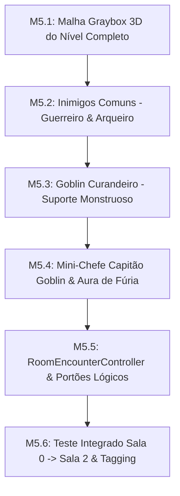

# 🚩 Marco 5 (M5) — Masmorra Graybox 3D, Encontros & Mini-Chefe

> **Status:** Concluído  
> **Branch de Trabalho:** `feat/m5-graybox-encounters`  
> **Tag Final do Marco:** `v0.1.0-m5-graybox-encounters`  
> **Documentos de Referência:** [`docs/planejamento/01_visao_mvp_e_marcos.md`](../docs/planejamento/01_visao_mvp_e_marcos.md), [`docs/projeto/07_navegacao_dungeon_e_fases.md`](../docs/projeto/07_navegacao_dungeon_e_fases.md), [`docs/idea/07_Mundo_e_Narrativa/`](../docs/idea/07_Mundo_e_Narrativa/), [`docs/idea/09_inimigos/`](../docs/idea/09_inimigos/).

---

## 🎯 Visão Geral do Marco

Este marco constrói a **primeira masmorra completa (Graybox 3D)** de Autodungeon, projetada para testar o ritmo e a cadência de travessia do jogo.

O nível é estruturado sequencialmente:
1. **Sala 0 (Spawn Seguro):** Posicionamento inicial do trio de heróis.
2. **Sala 1 (Encontro Básico):** 2 Goblins Guerreiros Melee + 1 Goblin Arqueiro.
3. **Corredor de Transição:** Teste de curvas fechadas no `NavigationRegion3D` e janela de **regeneração contínua de mana fora de combate (OOC)**.
4. **Sala 2 (Encontro Mini-Chefe):** 1 Capitão Goblin Elite (com *Aura de Fúria Tribal*) + 1 Goblin Curandeiro.
5. **Portão de Acesso à Arena 3 (Boss):** Transição para o clímax da fase.

---

## 📋 Lista Sequencial de Tarefas



---

<a id="m51"></a>
### 🔹 Tarefa M5.1: Construção da Malha Graybox 3D da Masmorra

#### 1. Contexto & Escolha Arquitetural
A geometria Graybox é construída com blocos e colisores simples (`StaticBody3D` com `BoxShape3D` ou `GridMap`/`CSGCombiner3D` assados). A masmorra deve possuir corredores com largura mínima de $4.0\text{m}$ para acomodar a cápsula do trio em marcha sem afunilamentos travados.

#### 2. Estrutura da Cena `res://src/world/dungeons/GrayboxDungeon.tscn`
```text
GrayboxDungeon (Node3D - Script: DungeonLevel.gd)
├── NavigationRegion3D (NavMesh 3D baked)
│   ├── Architecture (StaticBody3D - Physics Layer 1)
│   │   ├── Room0_Spawn (Mesh + Colliders)
│   │   ├── Corridor_0_1 (Mesh + Colliders)
│   │   ├── Room1_Encounter (Mesh + Colliders)
│   │   ├── Corridor_1_2 (Mesh + Colliders)
│   │   ├── Room2_MiniBoss (Mesh + Colliders)
│   │   └── Arena3_Boss (Mesh + Colliders)
├── Spawners (Node3D)
│   ├── PartySpawnPoint (Marker3D)
│   ├── Room1_EnemyPack (Node3D)
│   └── Room2_MiniBossPack (Node3D)
└── EncounterControllers (Node3D)
    ├── Room1_Controller (RoomEncounterController)
    └── Room2_Controller (RoomEncounterController)
```

#### 3. Passo a Passo de Teste & Verificação
1. **Baking do NavMesh Global:**
   Abra `GrayboxDungeon.tscn` e faça o bake do NavMesh.
2. **Inspeção de Malha:**
   Verifique no modo de visualização de navegação do editor (*Debug -> Visible Navigation*) se o chão azul cobre todas as salas e corredores sem buracos acidentais.

#### 4. Critérios de Aceitação
- [x] Salas 0, 1, 2, Corredores e Arena 3 modeladas com colisores estáticos (Physics Layer 1).
- [x] NavMesh 3D contínuo gerado cobrindo todo o percurso.

#### 5. Lembrete de Commit
```bash
git checkout -b feat/m5-graybox-encounters
git add src/world/dungeons/
git commit -m "feat(m5-graybox): criar geometria 3d da masmorra graybox com salas 0 1 2 e arena"
```

---

<a id="m52"></a>
### 🔹 Tarefa M5.2: Entidade e IA dos Goblins Comuns (Guerreiro e Arqueiro)

#### 1. Contexto & Escolha Arquitetural
Herde a cena `CharacterEntity.tscn` para criar os prefabs de inimigos:
* **Goblin Guerreiro (`GoblinWarrior.tscn`):** Vida baixa ($45\text{ HP}$), movimento corpo a corpo rápido, ataca o alvo com maior ameaça via `ThreatTable`.
* **Goblin Arqueiro (`GoblinArcher.tscn`):** Vida muito baixa ($30\text{ HP}$), mantém distância de $5.0\text{m}$, dispara flechas físicas com projétil e colisor `Hitbox3D`.

#### 2. Assinaturas & Estrutura de Código
Crie o arquivo `res://src/entities/enemies/GoblinAIController.gd`:

```gdscript
class_name GoblinAIController
extends Node

@export var actor: CharacterEntity = null
@export var is_ranged: bool = false
@export var attack_range: float = 1.8

func process_ai(delta: float, party_heroes: Array[CharacterEntity]) -> void:
    # 1. Consulta o alvo primário na ThreatTable do ator
    # 2. Se for ranged, mantém distância de ataque e dispara projétil
    # 3. Se for melee, persegue o alvo até colisão de Hitbox
    pass
```

#### 3. Passo a Passo de Teste & Verificação
1. **Cena de Teste de Mobs:**
   Instancie 1 Guerreiro e 1 Arqueiro contra Bromm.
   *Resultado Esperado:* O guerreiro corre até Bromm; o arqueiro para a 5 metros e dispara flechas contra o herói.

#### 4. Critérios de Aceitação
- [x] Prefabs `GoblinWarrior.tscn` e `GoblinArcher.tscn` instanciáveis.
- [x] Arqueiro dispara projétil físico com velocidade constante e colisão de dano.

#### 5. Lembrete de Commit
```bash
git add src/entities/enemies/
git commit -m "feat(m5-graybox): implementar prefabs e ias dos goblins comuns guerreiro e arqueiro"
```

---

<a id="m53"></a>
### 🔹 Tarefa M5.3: Entidade e IA do Goblin Curandeiro

#### 1. Contexto & Escolha Arquitetural
O **Goblin Curandeiro (`GoblinHealer.tscn`)** introduz a primeira dinâmica de suporte do lado dos monstros:
* Permanece atrás da linha de frente dos goblins.
* Monitora a vida dos aliados da sala. Se algum goblin (especialmente o Capitão) tiver $HP < 50\%$, conjura *Bênção Tribal* restaurando $25\text{ HP}$.

#### 2. Assinaturas & Estrutura de Código
Crie o arquivo `res://src/entities/enemies/GoblinHealerAI.gd`:

```gdscript
class_name GoblinHealerAI
extends Node

@export var actor: CharacterEntity = null
@export var heal_skill: SkillData = null

func evaluate_healing(pack_allies: Array[CharacterEntity]) -> void:
    # Encontra aliado com menor percentual de HP abaixo de 50% e executa o feitiço de cura
    pass
```

#### 3. Passo a Passo de Teste & Verificação
1. **Teste de Cura Inimiga:**
   * Cause dano em um Goblin Guerreiro até $30\%$ de HP.
   * O Goblin Curandeiro deve conjurar a cura e recuperar a vida do companheiro.

#### 4. Critérios de Aceitação
- [x] Curandeiro prioriza aliados feridos da sua sala.
- [x] Emissão de sinal `EventBus.healing_applied` ao curar o alvo.

#### 5. Lembrete de Commit
```bash
git add src/entities/enemies/GoblinHealer.tscn src/entities/enemies/GoblinHealerAI.gd
git commit -m "feat(m5-graybox): implementar goblin curandeiro com ia de cura de monstros aliados"
```

---

<a id="m54"></a>
### 🔹 Tarefa M5.4: Entidade e Mecânica do Capitão Goblin (*Aura de Fúria*)

#### 1. Contexto & Escolha Arquitetural
O **Capitão Goblin Elite (`GoblinCaptain.tscn`)** é o mini-chefe da Sala 2:
* HP robusto ($140\text{ HP}$) e armadura pesada.
* **Aura de Fúria Tribal:** Concede $+25\%$ de dano físico para todos os goblins em um raio de $6.0\text{m}$.
* Ao morrer, a aura é desativada instantaneamente, removendo o bônus dos lacaios sobreviventes.

#### 2. Assinaturas & Estrutura de Código
Crie o arquivo `res://src/entities/enemies/AuraDeFuriaTribal.gd`:

```gdscript
class_name AuraDeFuriaTribal
extends Area3D

@export var damage_multiplier_bonus: float = 0.25
@export var aura_radius: float = 6.0

var _buffed_allies: Array[CharacterEntity] = []

func _ready() -> void:
    # Conecta area_entered e area_exited para aplicar e remover modificadores de dano
    pass

func deactivate_aura() -> void:
    # Remove todos os modificadores de dano aplicados nos aliados
    pass
```

#### 3. Passo a Passo de Teste & Verificação
1. **Teste de Buff da Aura:**
   * Verifique o dano de um Goblin Guerreiro fora da aura (ex: 8 de dano).
   * Coloque o Capitão próximo: o dano do guerreiro deve subir para 10 ($+25\%$).
   * Mate o Capitão: o dano do guerreiro deve retornar imediatamente para 8.

#### 4. Critérios de Aceitação
- [x] Aura afeta apenas entidades da camada monstro (`Enemy_Bodies`).
- [x] Remoção imediata do buff em caso de morte do Capitão.

#### 5. Lembrete de Commit
```bash
git add src/entities/enemies/GoblinCaptain.tscn src/entities/enemies/AuraDeFuriaTribal.gd
git commit -m "feat(m5-graybox): implementar mini-chefe capitao goblin com aura de furia tribal"
```

---

<a id="m55"></a>
### 🔹 Tarefa M5.5: Controlador de Encontros de Sala (`RoomEncounterController.gd`)

#### 1. Contexto & Escolha Arquitetural
O `RoomEncounterController` gerencia o ciclo de cada sala da masmorra:
1. Detecta a entrada do trio via `Area3D` (`room_entered`).
2. Mantém a lista de inimigos vivos da sala.
3. Quando todos os inimigos da sala são derrotados $\rightarrow$ emite `room_cleared` e destrava a marcha do trio para a próxima sala.

#### 2. Assinaturas & Estrutura de Código
Crie o arquivo `res://src/systems/RoomEncounterController.gd`:

```gdscript
class_name RoomEncounterController
extends Area3D

signal encounter_cleared(room_index: int)

@export var room_index: int = 1
@export var enemy_pack: Array[CharacterEntity] = []

var _alive_enemies_count: int = 0

func _ready() -> void:
    EventBus.entity_died.connect(_on_entity_died)

func _on_area_entered(area: Area3D) -> void:
    # Detecta entrada do herói líder e ativa o combate do encontro
    pass

func _on_entity_died(entity: Node3D, killer: Node3D) -> void:
    # Decrementa contagem de inimigos vivos e verifica se sala foi limpa
    pass
```

#### 3. Passo a Passo de Teste & Verificação
1. **Teste de Limpeza de Sala:**
   * Entre na Sala 1 com o trio.
   * Elimine os 3 goblins.
   * Verifique no console a mensagem: `[DUNGEON] Sala 1 limpa! Retomando marcha.`

#### 4. Critérios de Aceitação
- [x] Transição automática para marcha assim que o último monstro da sala morrer.
- [x] Sinal `EventBus.room_cleared` emitido com índice correto.

#### 5. Lembrete de Commit
```bash
git add src/systems/RoomEncounterController.gd
git commit -m "feat(m5-graybox): implementar roomencountercontroller para gerenciamento de salas"
```

---

<a id="m56"></a>
### 🔹 Tarefa M5.6: Teste Integrado do Fluxo de Salas e Tag `v0.1.0-m5-graybox-encounters`

#### 1. Contexto & Escolha Arquitetural
Validação de ponta a ponta do Marco 5: a expedição inicia na Sala 0, caminha até a Sala 1, engaja no combate básico, derrota os goblins, caminha pelo corredor sinuoso (onde a mana recupera via OOC), engaja na Sala 2 contra o Mini-Chefe e Curandeiro, e se posiciona em frente ao portão do Boss.

#### 2. Passo a Passo de Teste & Validação
1. **Executar `res://src/world/dungeons/GrayboxDungeon.tscn`:**
   * Pressione `F6`. O trio deve completar as duas salas de combate consecutivas sem intervenção do jogador.
   * Confirme que a mana gasta na Sala 1 regenerou parcialmente no corredor antes da Sala 2.

#### 3. Critérios de Aceitação
- [x] Progressão autônoma Sala 0 $\rightarrow$ Sala 1 $\rightarrow$ Corredor $\rightarrow$ Sala 2 100% funcional.
- [x] 0 travamentos em cantos de malha 3D.

#### 4. Passo a Passo de Merge & Tagging
```bash
# 1. Commit final de integração
git add src/ tests/
git commit -m "feat(m5-graybox): consolidar fluxo completo de encontros de masmorra graybox 3d"

# 2. Merge na branch main
git checkout main
git merge --no-ff feat/m5-graybox-encounters -m "merge(m5): integrar masmorra graybox 3d encontros e mini-chefe"

# 3. Criar a Tag do Marco 5
git tag -a v0.1.0-m5-graybox-encounters -m "Marco M5 Concluído: Masmorra Graybox 3D, Inimigos Goblins, Mini-Chefe e Fluxo de Salas"
git tag -n
```

---

## ⏭️ Transição para o Próximo Marco
Com a masmorra e encontros intermediários validados, abra o próximo arquivo de execução:  
👉 **[06_m6_chefe_rei_goblin_3paths.md](06_m6_chefe_rei_goblin_3paths.md)**
