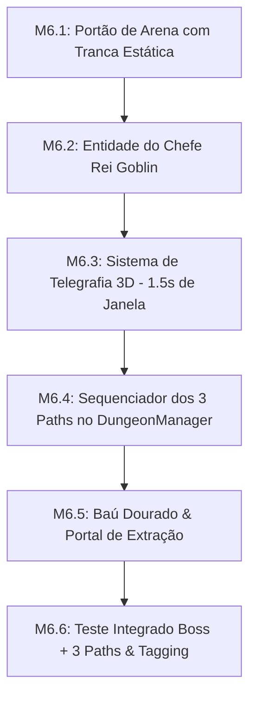
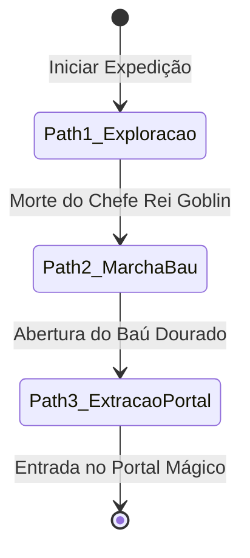

# 🚩 Marco 6 (M6) — Arena do Rei Goblin, Telegrafia 3D & Os 3 Paths

> **Status:** Não Iniciado  
> **Branch de Trabalho:** `feat/m6-boss-extraction`  
> **Tag Final do Marco:** `v0.1.0-m6-boss-extraction`  
> **Documentos de Referência:** [`docs/planejamento/01_visao_mvp_e_marcos.md`](../docs/planejamento/01_visao_mvp_e_marcos.md), [`docs/projeto/05_sistema_combate_e_habilidades.md`](../docs/projeto/05_sistema_combate_e_habilidades.md), [`docs/projeto/07_navegacao_dungeon_e_fases.md`](../docs/projeto/07_navegacao_dungeon_e_fases.md), [`docs/idea/geral.md`](../docs/idea/geral.md).

---

## 🎯 Visão Geral do Marco

Este marco implementa o **clímax da expedição**: a batalha épica contra o **Chefe Rei Goblin** e a execução fluida dos **3 Paths de Progressão de Autodungeon**:
1. **Path 1 (Exploração & Conquista):** Do spawn inicial até a derrota do Chefe Final dentro da Arena trancada.
2. **Path 2 (Marcha da Vitória):** Ao morrer o Rei Goblin, o trio caminha triunfante até o **Baú Dourado** no centro da arena e abre o tesouro.
3. **Path 3 (Extração & Conclusão):** Após recolher o loot, o trio caminha até o **Portal Mágico** de extração para selar a vitória.

O combate do chefe introduz a **Telegrafia Tridimensional no Chão** (projeção vermelha de aviso visual de $1.5\text{s}$ antes de um golpe devastador em área).

---

## 📋 Lista Sequencial de Tarefas



---

<a id="m61"></a>
### 🔹 Tarefa M6.1: Implementação do Portão de Arena `ArenaGate.tscn`

#### 1. Contexto & Escolha Arquitetural
Para impedir que heróis ou monstros recuem para fora da sala do chefe e quebrem a navegação, a entrada da arena possui um portão tridimensional (`ArenaGate.tscn`).
* Ao entrar o trio: o gatilho fecha o portão e ativa uma colisão física sólida (`StaticBody3D` em Physics Layer 1).
* Ao morrer o Boss: o portão destranca ou é destruído.

#### 2. Assinaturas & Estrutura de Código
Crie o arquivo `res://src/world/interactables/ArenaGate.gd`:

```gdscript
class_name ArenaGate
extends Node3D

@onready var static_collider: StaticBody3D = $StaticBody3D
@onready var door_mesh: MeshInstance3D = $DoorMesh

func close_and_lock() -> void:
    # Ativa colisão física e anima o fechamento do portão
    static_collider.set_collision_layer_value(1, true)

func open_and_unlock() -> void:
    # Desativa colisão física e remove o bloqueio
    static_collider.set_collision_layer_value(1, false)
```

#### 3. Passo a Passo de Teste & Verificação
1. **Teste de Bloqueio Físico:**
   * Mande o herói tentar atravessar o portão enquanto trancado.
   * *Resultado Esperado:* O `CharacterBody3D` do herói deve colidir e parar imediatamente sem atravessar a malha.

#### 4. Critérios de Aceitação
- [ ] Portão bloqueia movimentação 3D quando ativado.
- [ ] Conexão de abertura/fechamento com o `DungeonManager`.

#### 5. Lembrete de Commit
```bash
git checkout -b feat/m6-boss-extraction
git add src/world/interactables/ArenaGate.tscn src/world/interactables/ArenaGate.gd
git commit -m "feat(m6-boss): implementar portao de arena com tranca fisica e controle de acesso"
```

---

<a id="m62"></a>
### 🔹 Tarefa M6.2: Entidade do Chefe Rei Goblin e FSM

#### 1. Contexto & Escolha Arquitetural
O **Rei Goblin (`GoblinKingBoss.tscn`)** é uma entidade de porte maior (escala $1.5\times$, $350\text{ HP}$, $20\text{ Armadura}$):
* **Fase 1 ($100\%$ a $50\%$ HP):** Ataques físicos de clivagem pesada na vanguarda.
* **Fase 2 ($< 50\%$ HP - Fúria Régia):** Velocidade de ataque aumentada em $30\%$ e uso frequente do golpe devastador telegrafado em área.

#### 2. Assinaturas & Estrutura de Código
Crie o arquivo `res://src/entities/enemies/GoblinKingAI.gd`:

```gdscript
class_name GoblinKingAI
extends Node

@export var actor: CharacterEntity = null
@export var slam_telegraph_skill: SkillData = null
@export var enrage_threshold: float = 0.50

var is_enraged: bool = false

func evaluate_boss_ai(delta: float, party_heroes: Array[CharacterEntity]) -> void:
    # 1. Verifica transição para Fase 2 (Enrage)
    # 2. Alterna entre ataque normal de clivagem e golpe telegrafado no chão
    pass
```

#### 3. Passo a Passo de Teste & Verificação
1. **Cena de Teste de Boss:**
   Coloque o Rei Goblin na arena contra o trio.
   *Resultado Esperado:* O chefe deve focar em Bromm devido à sua alta geração de aggro e manter o combate centralizado.

#### 4. Critérios de Aceitação
- [ ] Prefab `GoblinKingBoss.tscn` funcional com transição de FSM para combate e morte.
- [ ] Ativação da Fase 2 ao cruzar o limiar de 50% de HP.

#### 5. Lembrete de Commit
```bash
git add src/entities/enemies/GoblinKingBoss.tscn src/entities/enemies/GoblinKingAI.gd
git commit -m "feat(m6-boss): implementar entidade e ia de combate do chefe rei goblin"
```

---

<a id="m63"></a>
### 🔹 Tarefa M6.3: Sistema de Telegrafia 3D (`TelegraphDecal3D.tscn` e Aviso de 1.5s)

#### 1. Contexto & Escolha Arquitetural
A legibilidade visual de chefes é um pilar do jogo (`docs/idea/geral.md`). Quando o Rei Goblin prepara o *Impacto Sísmico*, ele projeta um círculo vermelho no chão 3D através de um `Decal` ou malha plana com shader:
* **Duração do Aviso:** Exatos $1.5\text{ segundos}$ com efeito visual de preenchimento radial ou pulsação vermelha.
* **Impacto:** Ao término do tempo, uma `Hitbox3D` circular ativa por $0.2\text{s}$ causando alto dano ($60\text{ Dano Físico}$) a quem estiver dentro da área projetada.

#### 2. Assinaturas & Estrutura de Código
Crie os arquivos em `res://src/systems/telegraph/`:

**`res://src/systems/telegraph/TelegraphDecal3D.gd`:**
```gdscript
class_name TelegraphDecal3D
extends Node3D

signal telegraph_completed(impact_position: Vector3, radius: float)

@export var duration: float = 1.5
@export var radius: float = 4.0
@export var damage_amount: int = 60

@onready var decal: Decal = $Decal
@onready var impact_hitbox: Hitbox3D = $ImpactHitbox

func start_telegraph(target_position: Vector3) -> void:
    # Posiciona a projeção no chão, anima o shader/preenchimento e dispara timer de 1.5s
    pass

func _on_timer_finished() -> void:
    # Ativa a Hitbox3D por 0.2s, emite som de impacto e libera a instância
    pass
```

#### 3. Passo a Passo de Teste & Verificação
1. **Teste de Projeção no Chão:**
   Dispare `start_telegraph(Vector3(0, 0, 0))`.
   *Resultado Esperado:* O círculo vermelho deve aparecer nitidamente sobre o chão 3D por 1.5s e, no impacto, aplicar dano aos heróis posicionados dentro do círculo.

#### 4. Critérios de Aceitação
- [ ] Projeção visual vermelha clara no plano $XZ$ com janela de 1.5s.
- [ ] Dano aplicado somente no instante de finalização do aviso.

#### 5. Lembrete de Commit
```bash
git add src/systems/telegraph/
git commit -m "feat(m6-boss): implementar sistema de telegrafia 3d com projecao vermelha e janela de 1.5s"
```

---

<a id="m64"></a>
### 🔹 Tarefa M6.4: Sequenciamento dos 3 Paths no `DungeonManager.gd`

#### 1. Contexto & Escolha Arquitetural
O `DungeonManager` orquestra a máquina de estados global da masmorra, transitando os heróis através dos 3 caminhos:



#### 2. Assinaturas & Estrutura de Código
Crie o arquivo `res://src/systems/DungeonManager.gd`:

```gdscript
class_name DungeonManager
extends Node

enum DungeonPathState { PATH_1_EXPLORATION, PATH_2_CHEST_MARCH, PATH_3_PORTAL_EXTRACTION, COMPLETED }

@export var formation_controller: PartyFormationController = null
@export var golden_chest: Node3D = null
@export var extraction_portal: Node3D = null

var current_path_state: DungeonPathState = DungeonPathState.PATH_1_EXPLORATION

func _ready() -> void:
    EventBus.entity_died.connect(_on_entity_died)

func _on_entity_died(entity: Node3D, killer: Node3D) -> void:
    # Se a entidade morta for o Rei Goblin:
    if entity is CharacterEntity and entity.enemy_data and entity.enemy_data.tier == EnemyData.EnemyTier.BOSS:
        transition_to_path_2_chest()

func transition_to_path_2_chest() -> void:
    current_path_state = DungeonPathState.PATH_2_CHEST_MARCH
    EventBus.dungeon_path_changed.emit(current_path_state)
    # Direciona a marcha do trio para o Marker3D do Baú Dourado

func transition_to_path_3_portal() -> void:
    current_path_state = DungeonPathState.PATH_3_PORTAL_EXTRACTION
    EventBus.dungeon_path_changed.emit(current_path_state)
    # Direciona a marcha do trio para o Marker3D do Portal
```

#### 3. Passo a Passo de Teste & Verificação
1. **Simulação de Sequência de Paths:**
   * No console, chame `transition_to_path_2_chest()`: o grupo deve marchar até o baú.
   * Ao abrir o baú, `transition_to_path_3_portal()` deve conduzir o grupo até o portal.

#### 4. Critérios de Aceitação
- [ ] Transições automáticas de caminhos orientadas a eventos do `EventBus`.
- [ ] Mudança suave de Waypoints de marcha sem congelamento de IA.

#### 5. Lembrete de Commit
```bash
git add src/systems/DungeonManager.gd
git commit -m "feat(m6-boss): implementar sequenciamento dos 3 paths no dungeonmanager"
```

---

<a id="m65"></a>
### 🔹 Tarefa M6.5: Baú Dourado & Portal de Extração

#### 1. Contexto & Escolha Arquitetural
* **Baú Dourado (`GoldenChest.tscn`):** Interativo 3D com `Area3D`. Quando o líder chega próximo, o baú abre, spawna partículas de ouro e emite `EventBus.loot_collected`.
* **Portal de Extração (`ExtractionPortal.tscn`):** Portal mágico com emissão de luz suave. Ao entrar o primeiro herói, a expedição é considerada vitoriosa e o sinal `EventBus.match_ended(true, summary)` é emitido.

#### 2. Assinaturas & Estrutura de Código
Crie os arquivos em `res://src/world/interactables/`:

**`res://src/world/interactables/GoldenChest.gd`:**
```gdscript
class_name GoldenChest
extends Area3D

@export var loot_table: LootTableResource = null
var is_opened: bool = false

func open_chest() -> void:
    if is_opened:
        return
    is_opened = true
    # Anima tampa do baú, gera loot e chama transition_to_path_3_portal no DungeonManager
    pass
```

**`res://src/world/interactables/ExtractionPortal.gd`:**
```gdscript
class_name ExtractionPortal
extends Area3D

func _on_area_entered(area: Area3D) -> void:
    # Detecta contato do herói e encerra a partida com vitória
    pass
```

#### 3. Passo a Passo de Teste & Verificação
1. **Teste de Extração:**
   * Toque no baú: o baú abre e os heróis reorientam o passo para o portal.
   * Toque no portal: a tela de vitória deve ser notificada via `EventBus`.

#### 4. Critérios de Aceitação
- [ ] Baú abre e distribui loot apenas uma vez.
- [ ] Portal encerra a partida e notifica a camada de aplicação.

#### 5. Lembrete de Commit
```bash
git add src/world/interactables/GoldenChest.tscn src/world/interactables/ExtractionPortal.tscn
git commit -m "feat(m6-boss): implementar bau dourado de recompensas e portal de extracao magico"
```

---

<a id="m66"></a>
### 🔹 Tarefa M6.6: Teste Integrado Boss + 3 Paths e Tag `v0.1.0-m6-boss-extraction`

#### 1. Contexto & Escolha Arquitetural
Teste definitivo do clímax do jogo: entrada na Arena do Chefe, tranca do portão, batalha contra o Rei Goblin com telegrafia 3D, morte do chefe, marcha até o baú dourado, coleta de loot e fuga pelo portal mágico.

#### 2. Passo a Passo de Teste & Validação
1. **Executar `res://tests/test_boss_and_extraction_3d.tscn`:**
   * Acompanhe a batalha do chefe do início ao fim.
   * Verifique a execução perfeita dos **3 Paths** sequenciais sem necessidade de toque do jogador.

#### 3. Critérios de Aceitação
- [ ] Batalha do Chefe + Path 2 (Baú) + Path 3 (Portal) 100% integrados e autônomos.
- [ ] 0 falhas no cálculo de caminhos do NavMesh 3D.

#### 4. Passo a Passo de Merge & Tagging
```bash
# 1. Commit final
git add src/ world/ tests/
git commit -m "feat(m6-boss): consolidar arena do rei goblin com telegrafia 3d e sequenciamento dos 3 paths"

# 2. Merge na branch main
git checkout main
git merge --no-ff feat/m6-boss-extraction -m "merge(m6): integrar chefe rei goblin telegrafia 3d e os 3 paths de extracao"

# 3. Criar a Tag do Marco 6
git tag -a v0.1.0-m6-boss-extraction -m "Marco M6 Concluído: Chefe Rei Goblin, Telegrafia 3D, Baú Dourado e Extração"
git tag -n
```

---

## ⏭️ Transição para o Próximo Marco
Com o ciclo de gameplay e combate concluído, abra o próximo arquivo de execução:  
👉 **[07_m7_interface_hud_fluxo.md](07_m7_interface_hud_fluxo.md)**
