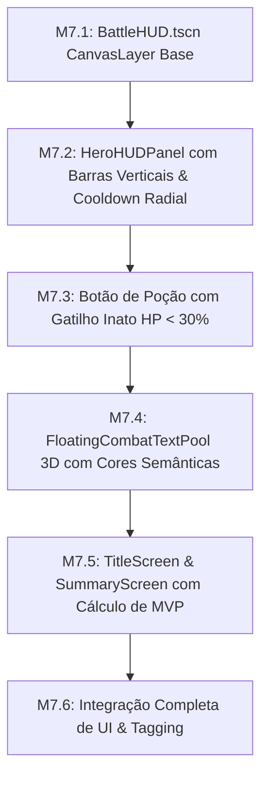

# 🚩 Marco 7 (M7) — Interface de Batalha, Textos Flutuantes & Telas

> **Status:** Não Iniciado  
> **Branch de Trabalho:** `feat/m7-ui-hud`  
> **Tag Final do Marco:** `v0.1.0-m7-ui-hud`  
> **Documentos de Referência:** [`docs/planejamento/01_visao_mvp_e_marcos.md`](../docs/planejamento/01_visao_mvp_e_marcos.md), [`docs/projeto/08_ui_hud_e_eventbus.md`](../docs/projeto/08_ui_hud_e_eventbus.md), [`docs/idea/05_telas_ui_hud/`](../docs/idea/05_telas_ui_hud/).

---

## 🎯 Visão Geral do Marco

Este marco implementa a **Camada de Apresentação e Feedback ao Jogador (UI/HUD)**.

Conforme a arquitetura de `docs/projeto/08_ui_hud_e_eventbus.md`, a interface opera em um `CanvasLayer` (2D Overlay) completamente desacoplado do mundo 3D, reagindo a eventos do `EventBus`.

O marco inclui:
1. **HUD de Batalha:** 3 painéis inferiores com retrato dos heróis, barras verticais de HP e Mana, e relógios radiais de cooldown de habilidades.
2. **Sistema de Poção Interativa/Automática:** Gatilho inato automático quando $HP < 30\%$ ou acionamento manual por clique do jogador.
3. **Floating Combat Text Pool 3D:** Textos de dano e cura flutuantes com cores semânticas (Branco, Vermelho, Verde, Azul, Dourado).
4. **Ciclo de Telas:** Tela de Título $\rightarrow$ Expedição $\rightarrow$ Tela de Resumo com Fórmula Matemática de Escolha do **MVP da Partida**.

---

## 📋 Lista Sequencial de Tarefas



---

<a id="m71"></a>
### 🔹 Tarefa M7.1: Camada de HUD 2D Overlay (`BattleHUD.tscn`)

#### 1. Contexto & Escolha Arquitetural
Para que o HUD não sofra distorções pela câmera 3D isométrica nem interfira na física do jogo, ele é construído em um nó `CanvasLayer` com resolução responsiva ancorada na base da tela.

#### 2. Árvore de Nós da Cena `res://src/ui/hud/BattleHUD.tscn`
```text
BattleHUD (CanvasLayer - Script: BattleHUD.gd)
├── RootContainer (Control - Anchors: Full Rect)
│   ├── TopInfoBar (HBoxContainer - Ancorado no Topo)
│   │   ├── DungeonNameLabel (Label)
│   │   └── GoldCounterLabel (Label)
│   └── PartyBottomBar (HBoxContainer - Ancorado na Base)
│       ├── HeroPanel_0 (HeroHUDPanel)
│       ├── HeroPanel_1 (HeroHUDPanel)
│       └── HeroPanel_2 (HeroHUDPanel)
```

**Script `res://src/ui/hud/BattleHUD.gd`:**
```gdscript
class_name BattleHUD
extends CanvasLayer

@onready var hero_panels: Array[HeroHUDPanel] = [
    $RootContainer/PartyBottomBar/HeroPanel_0,
    $RootContainer/PartyBottomBar/HeroPanel_1,
    $RootContainer/PartyBottomBar/HeroPanel_2
]

func initialize_hud(party_heroes: Array[CharacterEntity]) -> void:
    # Vincula cada painel ao respectivo herói da equipe
    pass
```

#### 3. Passo a Passo de Teste & Verificação
1. **Instanciação com Viewport 3D:**
   Adicione o `BattleHUD.tscn` como filho da cena da masmorra.
2. **Redimensionamento:**
   Altere o tamanho da janela da Godot.
   *Resultado Esperado:* A barra inferior de heróis deve permanecer ancorada e centralizada na base da tela.

#### 4. Critérios de Aceitação
- [ ] HUD renderizado como overlay 2D sobre o mundo 3D sem interferência de luz/câmera.
- [ ] Responsividade aprovada para resoluções widescreen.

#### 5. Lembrete de Commit
```bash
git checkout -b feat/m7-ui-hud
git add src/ui/hud/BattleHUD.tscn src/ui/hud/BattleHUD.gd
git commit -m "feat(m7-ui-hud): criar camada de hud 2d overlay battlehud para batalha 3d"
```

---

<a id="m72"></a>
### 🔹 Tarefa M7.2: Painel do Herói com Barras Verticais e Cooldowns Radiais

#### 1. Contexto & Escolha Arquitetural
Cada herói possui seu próprio `HeroHUDPanel.tscn`:
* **Barras Verticais:** `TextureProgressBar` orientada verticalmente para Vida (Verde) e Mana (Azul).
* **Retrato do Personagem:** Textura quadrada do herói (`portrait`).
* **Cooldowns Radiais:** Ícones de habilidades com máscara radial cinza que se esvazia conforme o tempo restante de recarga diminui.

#### 2. Assinaturas & Estrutura de Código
Crie o arquivo `res://src/ui/hud/HeroHUDPanel.gd`:

```gdscript
class_name HeroHUDPanel
extends Control

@onready var portrait_texture: TextureRect = $Portrait
@onready var hp_bar: TextureProgressBar = $HPBar
@onready var mana_bar: TextureProgressBar = $ManaBar
@onready var skill_icons: Array[TextureRect] = [$Skills/Skill_0, $Skills/Skill_1]

var bound_hero: CharacterEntity = null

func bind_to_hero(hero: CharacterEntity) -> void:
    bound_hero = hero
    EventBus.health_changed.connect(_on_health_changed)
    EventBus.mana_changed.connect(_on_mana_changed)
    EventBus.skill_cooldown_updated.connect(_on_cooldown_updated)

func _on_health_changed(entity: Node3D, current_hp: int, max_hp: int) -> void:
    if entity == bound_hero:
        hp_bar.value = float(current_hp) / float(max_hp) * 100.0

func _on_mana_changed(entity: Node3D, current_mana: float, max_mana: float) -> void:
    if entity == bound_hero:
        mana_bar.value = current_mana / max_mana * 100.0

func _on_cooldown_updated(caster: Node3D, skill_id: String, ratio: float) -> void:
    # Atualiza shader/overlay radial do ícone correspondente
    pass
```

#### 3. Passo a Passo de Teste & Verificação
1. **Simulação de Dano no Herói:**
   Cause 30 de dano em Bromm.
   *Resultado Esperado:* A barra de vida verde no HUD de Bromm deve descer instantaneamente para o percentual correto.

#### 4. Critérios de Aceitação
- [ ] Atualização suave de barras de HP e Mana via `EventBus`.
- [ ] Indicador radial de cooldown sincronizado com o tempo real de recarga da skill.

#### 5. Lembrete de Commit
```bash
git add src/ui/hud/HeroHUDPanel.tscn src/ui/hud/HeroHUDPanel.gd
git commit -m "feat(m7-ui-hud): implementar herohudpanel com barras verticais e cooldowns radiais"
```

---

<a id="m73"></a>
### 🔹 Tarefa M7.3: Botão de Poção com Gatilho Inato Automático ($HP < 30\%$) ou Manual

#### 1. Contexto & Escolha Arquitetural
O botão de Poção de Vida Menor no HUD oferece dupla agência:
* **Modo Automático (Inato):** Se o herói monitorado atingir $HP < 30\%$ e a poção estiver disponível, o sistema consome a poção automaticamente.
* **Modo Manual:** O jogador pode clicar diretamente no ícone da poção no HUD para forçar o consumo antecipado.

#### 2. Assinaturas & Estrutura de Código
Crie o arquivo `res://src/ui/hud/PotionButton.gd`:

```gdscript
class_name PotionButton
extends TextureButton

@export var potion_data: ItemData = null
@export var bound_hero: CharacterEntity = null

var is_available: bool = true

func _ready() -> void:
    pressed.connect(_on_manual_click)
    EventBus.health_changed.connect(_on_hero_health_changed)

func _on_manual_click() -> void:
    if is_available:
        _consume_potion()

func _on_hero_health_changed(entity: Node3D, current_hp: int, max_hp: int) -> void:
    if is_available and entity == bound_hero:
        var ratio: float = float(current_hp) / float(max_hp)
        if ratio <= potion_data.auto_trigger_hp_threshold:
            _consume_potion()

func _consume_potion() -> void:
    is_available = false
    disabled = true
    EventBus.potion_consumed.emit(bound_hero, potion_data)
```

#### 3. Passo a Passo de Teste & Verificação
1. **Teste do Autodisparo:**
   Reduza o HP de Bromm para 25%. A poção deve disparar automaticamente, curando 35 de vida e desabilitando o botão.
2. **Teste do Clique Manual:**
   Com HP em 50%, clique no botão. A poção deve curar imediatamente.

#### 4. Critérios de Aceitação
- [ ] Autodisparo imediato ao cruzar o limiar de 30% de HP.
- [ ] Consumo manual por clique respeitado.

#### 5. Lembrete de Commit
```bash
git add src/ui/hud/PotionButton.gd
git commit -m "feat(m7-ui-hud): implementar botao de pocao com gatilho inato automatico e clique manual"
```

---

<a id="m74"></a>
### 🔹 Tarefa M7.4: Pooler de Texto de Combate Flutuante 3D (`FloatingCombatTextPool.gd`)

#### 1. Contexto & Escolha Arquitetural
Para que o jogador entenda claramente cada evento de combate no espaço 3D, usamos números flutuantes projetados sobre a cabeça das entidades via `Label3D` gerenciados por um `NodePool`:
* **Branco:** Dano físico padrão causado em monstro.
* **Vermelho:** Dano recebido por herói.
* **Verde:** Cura aplicada.
* **Azul Claro:** Dano bloqueado/mitigado por armadura.
* **Dourado:** Acerto crítico.

#### 2. Assinaturas & Estrutura de Código
Crie o arquivo `res://src/ui/combat_text/FloatingCombatTextPool.gd`:

```gdscript
class_name FloatingCombatTextPool
extends NodePool

@export var text_scene: PackedScene = null

func _ready() -> void:
    super._ready()
    EventBus.damage_dealt.connect(_on_damage_dealt)
    EventBus.healing_applied.connect(_on_healing_applied)

func spawn_floating_text(world_pos: Vector3, text: String, color: Color, is_crit: bool) -> void:
    # Adquire Label3D do pool, posiciona em world_pos + offset e anima subida com tween
    pass

func _on_damage_dealt(target: Node3D, source: Node3D, amount: int, is_crit: bool, is_blocked: bool) -> void:
    # Define cor semântica e invoca spawn_floating_text
    pass

func _on_healing_applied(target: Node3D, healer: Node3D, amount: int) -> void:
    # Spawna texto verde de cura
    pass
```

#### 3. Passo a Passo de Teste & Verificação
1. **Disparo de Dano e Cura:**
   Desfira um ataque crítico de 50 de dano e uma cura de 20.
   *Resultado Esperado:* O número dourado "50!" e o número verde "+20" sobem suavemente e somem sem alocar memória extra.

#### 4. Critérios de Aceitação
- [ ] Textos flutuantes projetados corretamente no espaço 3D sem perda de performance.
- [ ] Cores semânticas fiéis à convenção de design.

#### 5. Lembrete de Commit
```bash
git add src/ui/combat_text/
git commit -m "feat(m7-ui-hud): implementar floatingcombattextpool 3d com cores semanticas de combate"
```

---

<a id="m75"></a>
### 🔹 Tarefa M7.5: Tela de Título e Tela de Resumo com Cálculo de MVP

#### 1. Contexto & Escolha Arquitetural
* **`TitleScreen.tscn`:** Menu inicial com botão "Iniciar Expedição de Teste".
* **`SummaryScreen.tscn`:** Exibida ao completar ou falhar a masmorra. Exibe total de ouro, monstros derrotados, tabela de estatísticas individuais (Dano Causado, Cura Realizada, Dano Mitigado) e coroa o **Herói MVP da Partida** com a fórmula:

$$\text{Pontuação MVP} = \text{Dano Causado} + (1.2 \times \text{Cura Realizada}) + (0.8 \times \text{Dano Mitigado})$$

#### 2. Assinaturas & Estrutura de Código
Crie os arquivos em `res://src/ui/screens/`:

**`res://src/ui/screens/SummaryScreen.gd`:**
```gdscript
class_name SummaryScreen
extends CanvasLayer

@onready var mvp_hero_label: Label = $Panel/MVPHeroLabel
@onready var mvp_portrait: TextureRect = $Panel/MVPPortrait
@onready var restart_button: Button = $Panel/RestartButton

func display_summary(match_stats: Dictionary) -> void:
    # Calcula pontuação de MVP de cada herói
    # Preenche a interface e exibe o vencedor
    pass

func calculate_mvp(stats: Dictionary) -> String:
    # Aplica a fórmula matemática e retorna o ID do herói MVP
    return ""
```

#### 3. Passo a Passo de Teste & Verificação
1. **Teste de Cálculo de MVP:**
   * Bromm: 100 Dano, 0 Cura, 200 Mitigação $\rightarrow Score = 100 + 0 + 160 = 260$.
   * Elysia: 300 Dano, 0 Cura, 20 Mitigação $\rightarrow Score = 300 + 0 + 16 = 316$.
   * Beatrice: 20 Dano, 250 Cura, 10 Mitigação $\rightarrow Score = 20 + 300 + 8 = 328$.
   * *Resultado Esperado:* Beatrice é declarada a MVP da partida.

#### 4. Critérios de Aceitação
- [ ] Fórmula de MVP computada com precisão.
- [ ] Fluxo de botões funcionais para reiniciar a expedição.

#### 5. Lembrete de Commit
```bash
git add src/ui/screens/
git commit -m "feat(m7-ui-hud): implementar telas de titulo e resumo com formula matematica de mvp"
```

---

<a id="m76"></a>
### 🔹 Tarefa M7.6: Validação do Fluxo de UI com `EventBus` e Tag `v0.1.0-m7-ui-hud`

#### 1. Contexto & Escolha Arquitetural
Validação de toda a camada de interface: HUD de Batalha com barras verticais e cooldowns radiais, textos de combate flutuantes, gatilho de poção e tela de resumo pós-extração.

#### 2. Passo a Passo de Teste & Validação
1. **Executar Masmorra com UI Ativa:**
   Inicie a expedição a partir da `TitleScreen.tscn`, jogue até a extração pelo portal e verifique a exibição da `SummaryScreen.tscn` com as métricas corretas.

#### 3. Critérios de Aceitação
- [ ] Interface 100% conectada e sincronizada via `EventBus`.
- [ ] 0 erros de nós de UI órfãos na memória.

#### 4. Passo a Passo de Merge & Tagging
```bash
# 1. Commit final
git add src/ui/
git commit -m "feat(m7-ui-hud): consolidar fluxo completo de ui hud reativo e resumo de partida"

# 2. Merge na branch main
git checkout main
git merge --no-ff feat/m7-ui-hud -m "merge(m7): integrar interface hud 3d/2d textos flutuantes e resumo"

# 3. Criar a Tag do Marco 7
git tag -a v0.1.0-m7-ui-hud -m "Marco M7 Concluído: Interface de Batalha, HUD 3D/2D, Textos Flutuantes e Tela de Resumo"
git tag -n
```

---

## ⏭️ Transição para o Próximo Marco
Com toda a interface e feedback integrados, abra o marco final de release:  
👉 **[08_m8_validacao_loop_release.md](08_m8_validacao_loop_release.md)**
