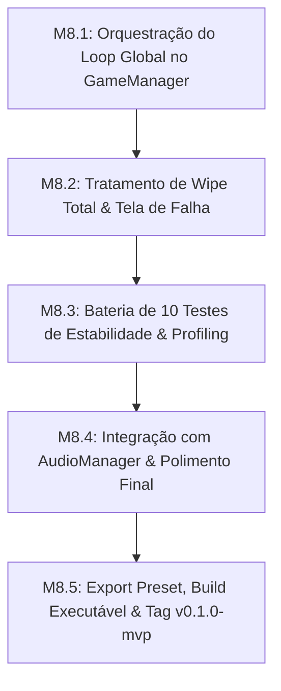
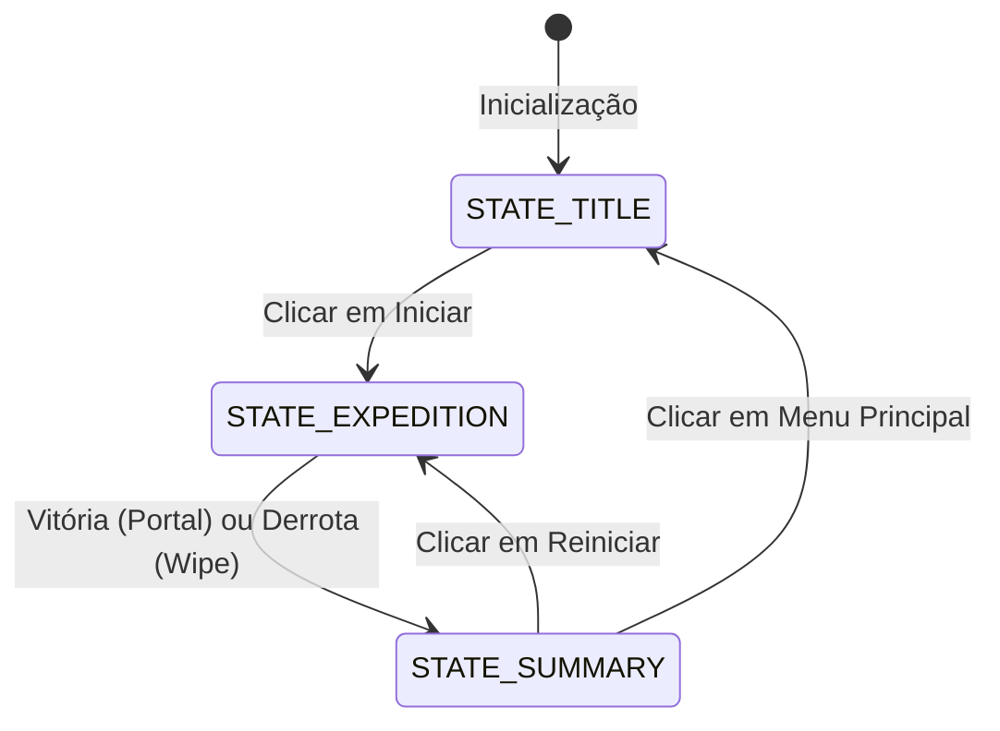

# 🚩 Marco 8 (M8) — Validação do Loop, Estabilidade & Release MVP

> **Status:** Não Iniciado  
> **Branch de Trabalho:** `feat/m8-release`  
> **Tag Final do Marco:** `v0.1.0-mvp`  
> **Documentos de Referência:** [`docs/01_Pitch_MVP.md`](../docs/01_Pitch_MVP.md), [`docs/planejamento/01_visao_mvp_e_marcos.md`](../docs/planejamento/01_visao_mvp_e_marcos.md), [`docs/planejamento/04_cronograma_e_cadencia.md`](../docs/planejamento/04_cronograma_e_cadencia.md), [`docs/projeto/09_gamemanager_e_persistencia.md`](../docs/projeto/09_gamemanager_e_persistencia.md).

---

## 🎯 Visão Geral do Marco

Este marco representa a **conclusão triunfante do MVP de Autodungeon**.

Aqui amarramos todas as peças do jogo em um **Core Loop contínuo e sem costuras**, gerenciado pelo `GameManager.gd`. Realizamos testes de estresse para validar estabilidade (10 partidas consecutivas sem erros de script nem travamentos), ajustamos o feedback sonoro via `AudioManager.gd`, tratamos condições de derrota (Wipe total da equipe) e geramos a **primeira build executável oficial do jogo sob a tag `v0.1.0-mvp`**.

---

## 📋 Lista Sequencial de Tarefas



---

<a id="m81"></a>
### 🔹 Tarefa M8.1: Orquestração do Game Loop Completo no `GameManager.gd`

#### 1. Contexto & Escolha Arquitetural
O `GameManager` atua como a máquina de estados mestra da aplicação, fazendo o gerenciamento de cenas sem criar dependências circulares:



#### 2. Assinaturas & Estrutura de Código
Crie o arquivo `res://src/core/GameManager.gd` e registre-o como Autoload:

```gdscript
class_name GameManagerSingleton
extends Node

enum GameState { STATE_TITLE, STATE_EXPEDITION, STATE_SUMMARY }

var current_state: GameState = GameState.STATE_TITLE
var match_statistics: Dictionary = {
    "damage_dealt": {},
    "healing_done": {},
    "damage_mitigated": {},
    "gold_earned": 0,
    "enemies_defeated": 0
}

func _ready() -> void:
    EventBus.match_ended.connect(_on_match_ended)
    EventBus.damage_dealt.connect(_track_damage)
    EventBus.healing_applied.connect(_track_healing)

func start_expedition() -> void:
    # Reseta estatísticas e troca de cena para GrayboxDungeon.tscn
    pass

func return_to_title() -> void:
    # Troca de cena para TitleScreen.tscn
    pass

func _on_match_ended(victory: bool, summary: Dictionary) -> void:
    # Transita para STATE_SUMMARY e exibe SummaryScreen.tscn
    pass

func _track_damage(target: Node3D, source: Node3D, amount: int, is_crit: bool, is_blocked: bool) -> void:
    pass

func _track_healing(target: Node3D, healer: Node3D, amount: int) -> void:
    pass
```

#### 3. Passo a Passo de Teste & Verificação
1. **Teste do Loop Completo:**
   Inicie na Tela de Título -> Clique em Iniciar -> Vença a Masmorra -> Acesse a Tela de Resumo -> Clique em Reiniciar.
   *Resultado Esperado:* A transição deve ser imediata e sem memory leaks entre as trocas de cena.

#### 4. Critérios de Aceitação
- [ ] `GameManager.gd` registrado como Autoload global.
- [ ] Rastreamento cumulativo e preciso de dano, cura e mitigação durante a partida.

#### 5. Lembrete de Commit
```bash
git checkout -b feat/m8-release
git add src/core/GameManager.gd project.godot
git commit -m "feat(m8-release): implementar gamemanager singleton para orquestracao do game loop completo"
```

---

<a id="m82"></a>
### 🔹 Tarefa M8.2: Tratamento de Wipe Total e Tela de Falha

#### 1. Contexto & Escolha Arquitetural
Se todos os 3 heróis morrerem em qualquer momento da masmorra:
1. O combate é suspenso imediatamente.
2. A câmera desacelera e foca no último herói caído.
3. O `DungeonManager` emite `EventBus.match_ended(false, summary_stats)`.
4. A tela exibe "Expedição Fracassada" e permite o retorno seguro ao menu principal sem congelamento de processos físicos.

#### 2. Assinaturas & Estrutura de Código
Integre a detecção no `PartyFormationController.gd` / `DungeonManager.gd`:

```gdscript
func check_party_wipe() -> void:
    var any_hero_alive: bool = false
    for hero in [leader_hero, support_hero, dps_hero]:
        if hero and hero.health_component and hero.health_component.is_alive:
            any_hero_alive = true
            break
    
    if not any_hero_alive:
        EventBus.match_ended.emit(false, GameManager.match_statistics)
```

#### 3. Passo a Passo de Teste & Verificação
1. **Teste de Wipe:**
   Force a morte dos 3 heróis simultaneamente na Sala 1.
   *Resultado Esperado:* A partida encerra imediatamente com tela de derrota limpa e sem travamento de nós órfãos.

#### 4. Critérios de Aceitação
- [ ] Detecção instantânea de wipe total da equipe.
- [ ] Encerramento gracioso de todos os processos de IA e física de monstros.

#### 5. Lembrete de Commit
```bash
git add src/systems/PartyFormationController.gd src/systems/DungeonManager.gd
git commit -m "feat(m8-release): implementar tratamento de wipe total da equipe e fluxo de derrota"
```

---

<a id="m83"></a>
### 🔹 Tarefa M8.3: Bateria de 10 Testes Consecutivos e Profiling de Performance 3D

#### 1. Contexto & Escolha Arquitetural
Para atender aos critérios de aceitação do MVP (`docs/planejamento/01_visao_mvp_e_marcos.md`), executamos uma bateria de testes de estresse de 10 partidas consecutivas no motor da Godot.

#### 2. Metas de Profiling & Estabilidade
* **Framerate:** Mínimo de 60 FPS sustentados em resolução 1080p.
* **Draw Calls:** Menos de 150 draw calls no ponto mais denso da Arena do Chefe.
* **Memória (RAM):** 0 crescimento descontrolado (Zero Memory Leaks em NodePools).
* **Console Debugger:** 0 erros (`errors`) e 0 avisos críticos (`warnings`).

#### 3. Passo a Passo de Teste & Verificação
1. **Abertura do Godot Profiler:**
   Acesse a aba *Debugger -> Profiler* e *Monitors*.
2. **Execução das 10 Partidas:**
   Complete 10 loops seguidos (Vitória e Derrota).
3. **Validação de Métricas:**
   Confirme que o número de `ObjectDB Objects` e `Nodes in Tree` retorna exatamente ao baseline inicial após cada ciclo.

#### 4. Critérios de Aceitação
- [ ] 10 partidas consecutivas executadas com 100% de estabilidade.
- [ ] Ausência comprovada de vazamento de memória.

#### 5. Lembrete de Commit
```bash
git add tests/
git commit -m "test(m8-release): validar bateria de 10 partidas consecutivas e profiling de memoria 3d"
```

---

<a id="m84"></a>
### 🔹 Tarefa M8.4: Integração de Áudio com `AudioManager.gd` e Ajustes de Balanceamento

#### 1. Contexto & Escolha Arquitetural
O `AudioManager.gd` (Autoload) conecta-se aos sinais do `EventBus` para disparar efeitos sonoros e músicas de forma desacoplada:
* Impacto físico de espada e escudo.
* Disparo de flecha da arqueira.
* Feitiço sagrado de cura da clériga.
* Som de alerta da telegrafia do chefe (1.5s).
* Fanfarra de vitória e abertura do baú dourado.

#### 2. Assinaturas & Estrutura de Código
Crie o arquivo `res://src/core/AudioManager.gd`:

```gdscript
class_name AudioManagerSingleton
extends Node

@export var sfx_hit: AudioStream = null
@export var sfx_heal: AudioStream = null
@export var sfx_telegraph_warning: AudioStream = null
@export var sfx_chest_open: AudioStream = null
@export var sfx_victory: AudioStream = null

func _ready() -> void:
    EventBus.damage_dealt.connect(_on_damage_dealt)
    EventBus.healing_applied.connect(_on_healing_applied)
    EventBus.boss_telegraph_started.connect(_on_telegraph_started)
    EventBus.match_ended.connect(_on_match_ended)

func play_sfx(stream: AudioStream) -> void:
    # Toca o efeito no canal dedicado de áudio (AudioServer)
    pass
```

#### 3. Passo a Passo de Teste & Verificação
1. **Teste Auditivo:**
   Acompanhe uma batalha completa e valide se todos os eventos chave geram feedback sonoro claro e calibrado.

#### 4. Critérios de Aceitação
- [ ] `AudioManager.gd` conectado e responsivo aos eventos globais.
- [ ] Volumes e barramentos de áudio balanceados.

#### 5. Lembrete de Commit
```bash
git add src/core/AudioManager.gd project.godot
git commit -m "feat(m8-release): integrar audiomanager aos sinais do eventbus com feedback sonoro"
```

---

<a id="m85"></a>
### 🔹 Tarefa M8.5: Geração de Build Executável e Publicação da Release Tag `v0.1.0-mvp`

#### 1. Contexto & Escolha Arquitetural
A geração da primeira build oficial e o fechamento do MVP consolidam o sucesso do cronograma e habilitam o projeto para o início dos testes de playtest externos e posterior expansão de conteúdo.

#### 2. Passo a Passo de Export & Release
1. **Configuração de Export Presets:**
   Em *Project -> Export*, configure os presets de exportação Desktop (Windows / macOS / Linux).
2. **Geração do Executável:**
   Gere o arquivo executável na pasta `builds/mvp/`.
3. **Teste do Executável Fora do Editor:**
   Abra o binário exportado diretamente pelo sistema operacional e execute uma expedição completa com sucesso.

#### 4. Passo a Passo de Merge Final & Publicação da Tag de Release
```bash
# 1. Commit final das configurações de exportação
git add project.godot export_presets.cfg
git commit -m "chore(m8-release): configurar export presets para build executavel do mvp"

# 2. Merge final da release branch na main
git checkout main
git merge --no-ff feat/m8-release -m "merge(m8): consolidar release oficial do mvp de autodungeon"

# 3. Criar a Tag de Release Oficial do MVP
git tag -a v0.1.0-mvp -m "Release Oficial do MVP de Autodungeon 3D (Godot 4.7+) - Todos os 9 Marcos M0 a M8 Concluídos com Sucesso"

# 4. Exibir tags e status do repositório
git tag -n
git status
```

---

## 🏆 MVP Concluído com Sucesso!
Parabéns! Com o encerramento do Marco 8, o **MVP de Autodungeon** está 100% construído, validado e documentado.

Para consultar o plano de expansão pós-lançamento (novas raças, novas classes, temporadas e monetização), consulte:  
👉 **[`docs/planejamento/05_roadmap_expansoes_pos_lancamento.md`](../docs/planejamento/05_roadmap_expansoes_pos_lancamento.md)**
