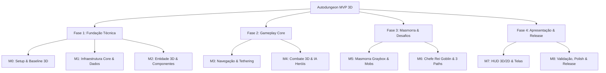
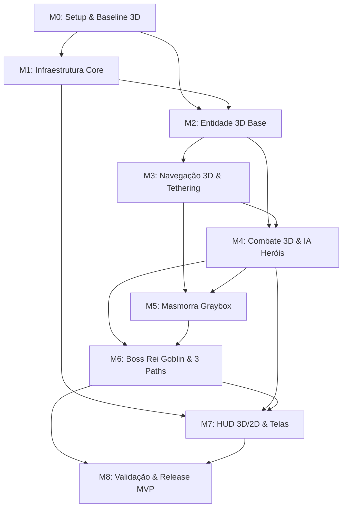

# 📊 Estrutura Analítica do Projeto (WBS Master) — Autodungeon MVP (Godot 4.7+ 3D)

Este documento representa o **WBS (Work Breakdown Structure)** centralizador do projeto **Autodungeon**. Ele estabelece a quebra hierárquica de todas as entregas e pacotes de trabalho necessários para construir o MVP funcional em 3D, conectando as diretrizes de [`docs/planejamento/`](../docs/planejamento/00_indice_planejamento.md) e [`docs/projeto/`](../docs/projeto/00_indice_arquitetura.md).

---

## 🗺️ Mapa dos Arquivos de Execução por Marco

Cada marco de desenvolvimento possui seu próprio arquivo detalhado e autocontido nesta pasta `cronograma/`. Durante o desenvolvimento, mantenha aberto **apenas o arquivo do marco atual**:

```text
📁 cronograma/
│
├── 📄 wbs.md                               <- [Você está aqui] WBS Mestre e Visão Geral
│
├── 📄 00_m0_setup_baseline.md              <- Marco 0: Setup do Repositório & Baseline Godot 4.7+ 3D
├── 📄 01_m1_infraestrutura_dados.md        <- Marco 1: Infraestrutura Core, EventBus & Custom Resources
├── 📄 02_m2_entidade_3d_base.md            <- Marco 2: Entidade 3D Base & Composição de Nós
├── 📄 03_m3_navegacao_tethering.md         <- Marco 3: Navegação 3D, Formação & Tethering Elástico
├── 📄 04_m4_combate_ia_herois.md           <- Marco 4: Combate 3D, Gatilho por Impacto & IA dos 3 Heróis
├── 📄 05_m5_masmorra_graybox_encounters.md <- Marco 5: Masmorra Graybox 3D, Encontros & Mini-Chefe
├── 📄 06_m6_chefe_rei_goblin_3paths.md     <- Marco 6: Arena do Rei Goblin, Telegrafia 3D & Os 3 Paths
├── 📄 07_m7_interface_hud_fluxo.md         <- Marco 7: Interface HUD 3D/2D, Textos Flutuantes & Telas
└── 📄 08_m8_validacao_loop_release.md      <- Marco 8: Validação do Loop, Estabilidade & Release MVP
```

---

## 🏗️ 1. Hierarquia da WBS (Fases $\rightarrow$ Marcos $\rightarrow$ Pacotes de Trabalho)



---

## 📋 2. Tabela Geral de Decomposição de Atividades (WBS Matrix)

| Nível WBS | Código da Tarefa | Descrição da Entrega | Arquivo de Detalhamento | Tag Git de Fechamento |
| :--- | :--- | :--- | :--- | :--- |
| **1.0** | **FASE 1** | **FUNDAÇÃO TÉCNICA** | — | — |
| 1.1 | **M0** | **Setup do Repositório & Baseline Godot 4.7+ 3D** | [00_m0_setup_baseline.md](00_m0_setup_baseline.md) | `v0.1.0-m0-setup` |
| 1.1.1 | M0.1 | Estrutura de Diretórios `res://` e Governança Git (`.gitignore`, `.gitattributes`) | [00_m0_setup_baseline.md](00_m0_setup_baseline.md#m01-criação-da-estrutura-de-diretórios-res-e-governança-git) | — |
| 1.1.2 | M0.2 | Configuração de Projeto Godot 4.7+ (Physics Layers, Renderer, Static Typing) | [00_m0_setup_baseline.md](00_m0_setup_baseline.md#m02-configuração-do-projeto-godot-47-projectgodot) | — |
| 1.1.3 | M0.3 | Cena de Baseline 3D (`TestEnvironment3D.tscn`) com Câmera Isométrica $45^\circ$ | [00_m0_setup_baseline.md](00_m0_setup_baseline.md#m03-cena-de-baseline-3d-testenvironment3dtscn-e-câmera-isométrica) | — |
| 1.1.4 | M0.4 | Validação de Baseline, Teste de Abertura Limpa e Tagging | [00_m0_setup_baseline.md](00_m0_setup_baseline.md#m04-validação-da-linha-de-base-merge-e-tag-v010-m0-setup) | `v0.1.0-m0-setup` |
| 1.2 | **M1** | **Infraestrutura Core, Autoloads & Custom Resources** | [01_m1_infraestrutura_dados.md](01_m1_infraestrutura_dados.md) | `v0.1.0-m1-core` |
| 1.2.1 | M1.1 | Implementação do `EventBus.gd` (Singleton Autoload de Mensageria) | [01_m1_infraestrutura_dados.md](01_m1_infraestrutura_dados.md#m11-implementação-do-eventbusgd-singleton-autoload) | — |
| 1.2.2 | M1.2 | Camada de Dados de Habilidades (`SkillEffect.gd`, `SkillData.gd`) | [01_m1_infraestrutura_dados.md](01_m1_infraestrutura_dados.md#m12-camada-de-dados-de-habilidades-skilleffectgd-e-skilldatagd) | — |
| 1.2.3 | M1.3 | Camada de Dados de Heróis e Estatísticas (`HeroData.gd`, `RaceData.gd`, `ClassData.gd`) | [01_m1_infraestrutura_dados.md](01_m1_infraestrutura_dados.md#m13-camada-de-dados-de-heróis-herodatagd-racedatagd-classdatagd) | — |
| 1.2.4 | M1.4 | Camada de Dados de Inimigos e Itens (`EnemyData.gd`, `ItemData.gd`, `LootTableResource.gd`) | [01_m1_infraestrutura_dados.md](01_m1_infraestrutura_dados.md#m14-camada-de-dados-de-inimigos-e-itens-enemydatagd-itemdatagd-loottableresourcegd) | — |
| 1.2.5 | M1.5 | Implementação do `NodePool.gd` Genérico para Reciclagem de Objetos | [01_m1_infraestrutura_dados.md](01_m1_infraestrutura_dados.md#m15-implementação-do-nodepoolgd-genérico-para-reciclagem-de-instâncias) | — |
| 1.2.6 | M1.6 | Instanciação dos Resources `.tres` do Trio do MVP (*Bromm*, *Elysia*, *Beatrice*) e Tagging | [01_m1_infraestrutura_dados.md](01_m1_infraestrutura_dados.md#m16-criação-dos-resources-tres-do-trio-mvp-e-tag-v010-m1-core) | `v0.1.0-m1-core` |
| 1.3 | **M2** | **Entidade 3D Base & Composição de Nós** | [02_m2_entidade_3d_base.md](02_m2_entidade_3d_base.md) | `v0.1.0-m2-entity3d` |
| 1.3.1 | M2.1 | Prefab Raiz `CharacterEntity.tscn` (`CharacterBody3D`, Colisão Cápsula, Mesh) | [02_m2_entidade_3d_base.md](02_m2_entidade_3d_base.md#m21-estrutura-raiz-de-characterentitytscn-e-colisor-físico-3d) | — |
| 1.3.2 | M2.2 | Componente de Estatísticas `StatsComponent.gd` (Base, Modificadores, Cálculo Dinâmico) | [02_m2_entidade_3d_base.md](02_m2_entidade_3d_base.md#m22-componente-de-estatísticas-statscomponentgd) | — |
| 1.3.3 | M2.3 | Componente de Vida e Mana `HealthComponent.gd` (Mitigação Linear Cap 80, Regen OOC) | [02_m2_entidade_3d_base.md](02_m2_entidade_3d_base.md#m23-componente-de-vida-e-mana-healthcomponentgd) | — |
| 1.3.4 | M2.4 | Componentes de Colisão de Combate `Hitbox3D.gd` e `Hurtbox3D.gd` | [02_m2_entidade_3d_base.md](02_m2_entidade_3d_base.md#m24-componentes-de-combate-hitbox3dgd-e-hurtbox3dgd) | — |
| 1.3.5 | M2.5 | Arquitetura de Máquina de Estados Finita (`StateMachine.gd` e `State.gd`) | [02_m2_entidade_3d_base.md](02_m2_entidade_3d_base.md#m25-máquina-de-estados-finita-statemachinegd-e-stategd) | — |
| 1.3.6 | M2.6 | Integração de Componentes na Entidade 3D, Teste Unitário de Dano e Tagging | [02_m2_entidade_3d_base.md](02_m2_entidade_3d_base.md#m26-integração-na-characterentitytscn-teste-de-dano-e-tag-v010-m2-entity3d) | `v0.1.0-m2-entity3d` |
| **2.0** | **FASE 2** | **GAMEPLAY CORE** | — | — |
| 2.1 | **M3** | **Navegação 3D, Formação & Tethering do Trio** | [03_m3_navegacao_tethering.md](03_m3_navegacao_tethering.md) | `v0.1.0-m3-navigation3d` |
| 2.1.1 | M3.1 | Implementação do `MovementComponent.gd` e Integração com `NavigationAgent3D` | [03_m3_navegacao_tethering.md](03_m3_navegacao_tethering.md#m31-componente-de-movimentação-movementcomponentgd-com-navigationagent3d) | — |
| 2.1.2 | M3.2 | Estados de Locomoção na FSM (`MarchState.gd`, `IdleState.gd`) | [03_m3_navegacao_tethering.md](03_m3_navegacao_tethering.md#m32-estados-de-locomoção-marchstategd-e-idlestategd) | — |
| 2.1.3 | M3.3 | Controlador de Formação do Grupo `PartyFormationController.gd` (Vanguarda/Centro/Retaguarda) | [03_m3_navegacao_tethering.md](03_m3_navegacao_tethering.md#m33-controlador-de-formação-partyformationcontrollergd) | — |
| 2.1.4 | M3.4 | Algoritmo de Mola de Tethering Elástico (Velocidade Relativa, Raio Limite 90px) | [03_m3_navegacao_tethering.md](03_m3_navegacao_tethering.md#m34-algoritmo-de-mola-de-tethering-elástico-e-coesão) | — |
| 2.1.5 | M3.5 | Cena de Teste de Travessia 3D com Waypoints e Baking de NavMesh | [03_m3_navegacao_tethering.md](03_m3_navegacao_tethering.md#m35-cena-de-teste-de-travessia-3d-com-waypoints-e-navmesh) | — |
| 2.1.6 | M3.6 | Teste de Reajuste de Papéis em Queda de Herói e Tagging | [03_m3_navegacao_tethering.md](03_m3_navegacao_tethering.md#m36-teste-de-reajuste-de-papéis-em-morte-de-herói-e-tag-v010-m3-navigation3d) | `v0.1.0-m3-navigation3d` |
| 2.2 | **M4** | **Combate 3D, Gatilho por Primeiro Impacto & IA dos Heróis** | [04_m4_combate_ia_herois.md](04_m4_combate_ia_herois.md) | `v0.1.0-m4-combat-ai` |
| 2.2.1 | M4.1 | Sistema de Gatilho de Batalha por Primeiro Impacto Físico (`CombatTriggerSystem.gd`) | [04_m4_combate_ia_herois.md](04_m4_combate_ia_herois.md#m41-sistema-de-gatilho-de-batalha-por-primeiro-impacto-físico) | — |
| 2.2.2 | M4.2 | Sistema de Gestão de Ameaça e Aggro (`ThreatTable.gd`) | [04_m4_combate_ia_herois.md](04_m4_combate_ia_herois.md#m42-sistema-de-gestão-de-ameaça-e-aggro-threattablegd) | — |
| 2.2.3 | M4.3 | Componente de Gestão de Habilidades `SkillHolderComponent.gd` e Cooldowns | [04_m4_combate_ia_herois.md](04_m4_combate_ia_herois.md#m43-componente-de-habilidades-skillholdercomponentgd) | — |
| 2.2.4 | M4.4 | IA Tática do Tanque — Bromm (*Investida*, *Postura Defensiva*, Geração de Aggro) | [04_m4_combate_ia_herois.md](04_m4_combate_ia_herois.md#m44-ia-tática-do-tanque-bromm-investida-postura-defensiva) | — |
| 2.2.5 | M4.5 | IA Tática da Arqueira DPS — Elysia (*Tiro Certeiro*, *Chuva de Flechas*, Kiting) | [04_m4_combate_ia_herois.md](04_m4_combate_ia_herois.md#m45-ia-tática-da-dps-elysia-kiting-e-habilidades-ranged) | — |
| 2.2.6 | M4.6 | IA Tática da Clériga Suporte — Beatrice (Árvore de Prioridades, *Cura*, *Escudo*) | [04_m4_combate_ia_herois.md](04_m4_combate_ia_herois.md#m46-ia-tática-da-suporte-beatrice-árvore-de-4-níveis) | — |
| 2.2.7 | M4.7 | Montagem da Batalha de Teste Trio vs Pack de Teste e Tagging | [04_m4_combate_ia_herois.md](04_m4_combate_ia_herois.md#m47-batalha-integrada-de-teste-trio-vs-pack-e-tag-v010-m4-combat-ai) | `v0.1.0-m4-combat-ai` |
| **3.0** | **FASE 3** | **MASMORRA & DESAFIOS** | — | — |
| 3.1 | **M5** | **Masmorra Graybox 3D, Encontros & Mini-Chefe** | [05_m5_masmorra_graybox_encounters.md](05_m5_masmorra_graybox_encounters.md) | `v0.1.0-m5-graybox-encounters` |
| 3.1.1 | M5.1 | Construção da Malha Graybox 3D (Sala 0, Sala 1, Corredor, Sala 2 Mini-Chefe, Arena 3) | [05_m5_masmorra_graybox_encounters.md](05_m5_masmorra_graybox_encounters.md#m51-construção-da-malha-graybox-3d-da-masmorra) | — |
| 3.1.2 | M5.2 | Entidade e IA dos Goblins Comuns (Guerreiro Melee e Arqueiro Ranged) | [05_m5_masmorra_graybox_encounters.md](05_m5_masmorra_graybox_encounters.md#m52-entidade-e-ia-dos-goblins-comuns-guerreiro-e-arqueiro) | — |
| 3.1.3 | M5.3 | Entidade e IA do Goblin Curandeiro (Suporte Monstruoso) | [05_m5_masmorra_graybox_encounters.md](05_m5_masmorra_graybox_encounters.md#m53-entidade-e-ia-do-goblin-curandeiro) | — |
| 3.1.4 | M5.4 | Entidade e Mecânica do Mini-Chefe Capitão Goblin Elite (*Aura de Fúria Tribal*) | [05_m5_masmorra_graybox_encounters.md](05_m5_masmorra_graybox_encounters.md#m54-entidade-e-mecânica-do-capitão-goblin-aura-de-fúria) | — |
| 3.1.5 | M5.5 | Controladores de Encontro de Sala (`RoomEncounterController.gd`) e Transições | [05_m5_masmorra_graybox_encounters.md](05_m5_masmorra_graybox_encounters.md#m55-controlador-de-encontros-de-sala-roomencountercontrollergd) | — |
| 3.1.6 | M5.6 | Teste do Fluxo Sala 1 $\rightarrow$ Corredor $\rightarrow$ Mini-Chefe e Tagging | [05_m5_masmorra_graybox_encounters.md](05_m5_masmorra_graybox_encounters.md#m56-teste-integrado-do-fluxo-de-salas-e-tag-v010-m5-graybox-encounters) | `v0.1.0-m5-graybox-encounters` |
| 3.2 | **M6** | **Arena do Chefe Rei Goblin, Telegrafia 3D & Os 3 Paths** | [06_m6_chefe_rei_goblin_3paths.md](06_m6_chefe_rei_goblin_3paths.md) | `v0.1.0-m6-boss-extraction` |
| 3.2.1 | M6.1 | Implementação do Portão de Arena `ArenaGate.tscn` (Tranca e Destranca de Colisão) | [06_m6_chefe_rei_goblin_3paths.md](06_m6_chefe_rei_goblin_3paths.md#m61-implementação-do-portão-de-arena-arenagatetscn) | — |
| 3.2.2 | M6.2 | Entidade do Boss Rei Goblin (Comportamento de Combate e Fases) | [06_m6_chefe_rei_goblin_3paths.md](06_m6_chefe_rei_goblin_3paths.md#m62-entidade-do-chefe-rei-goblin-e-fsm) | — |
| 3.2.3 | M6.3 | Sistema de Telegrafia 3D (`TelegraphDecal3D.tscn`, Shader Vermelho, Janela de 1.5s) | [06_m6_chefe_rei_goblin_3paths.md](06_m6_chefe_rei_goblin_3paths.md#m63-sistema-de-telegrafia-3d-telegraphdecal3dtscn-e-aviso-de-15s) | — |
| 3.2.4 | M6.4 | Sequenciamento dos 3 Paths no `DungeonManager.gd` (Exploração $\rightarrow$ Baú $\rightarrow$ Portal) | [06_m6_chefe_rei_goblin_3paths.md](06_m6_chefe_rei_goblin_3paths.md#m64-sequenciamento-dos-3-paths-no-dungeonmanagergd) | — |
| 3.2.5 | M6.5 | Implementação do Baú Dourado (`GoldenChest.tscn`) e Portal de Extração (`ExtractionPortal.tscn`) | [06_m6_chefe_rei_goblin_3paths.md](06_m6_chefe_rei_goblin_3paths.md#m65-implementação-do-baú-dourado-e-portal-de-extração) | — |
| 3.2.6 | M6.6 | Teste Integrado de Batalha do Chefe, Sequência dos 3 Paths e Tagging | [06_m6_chefe_rei_goblin_3paths.md](06_m6_chefe_rei_goblin_3paths.md#m66-teste-integrado-do-chefe-e-extração-e-tag-v010-m6-boss-extraction) | `v0.1.0-m6-boss-extraction` |
| **4.0** | **FASE 4** | **APRESENTAÇÃO & RELEASE** | — | — |
| 4.1 | **M7** | **Interface de Batalha (HUD 3D/2D), Textos Flutuantes & Fluxo de Telas** | [07_m7_interface_hud_fluxo.md](07_m7_interface_hud_fluxo.md) | `v0.1.0-m7-ui-hud` |
| 4.1.1 | M7.1 | Camada de HUD 2D Overlay (`BattleHUD.tscn`) com 3 Painéis de Heróis | [07_m7_interface_hud_fluxo.md](07_m7_interface_hud_fluxo.md#m71-camada-de-hud-2d-overlay-battlehudtscn) | — |
| 4.1.2 | M7.2 | Painel do Herói com Barras Verticais de Vida/Mana e Cooldowns Radiais (`HeroHUDPanel.tscn`) | [07_m7_interface_hud_fluxo.md](07_m7_interface_hud_fluxo.md#m72-painel-do-herói-com-barras-verticais-e-cooldowns-radiais) | — |
| 4.1.3 | M7.3 | Botão de Poção de Vida Menor com Gatilho Inato Automático ($HP < 30\%$) ou Manual | [07_m7_interface_hud_fluxo.md](07_m7_interface_hud_fluxo.md#m73-botão-de-poção-com-gatilho-inato-automático-hp--30-ou-manual) | — |
| 4.1.4 | M7.4 | Pooler de Texto de Combate Flutuante 3D (`FloatingCombatTextPool.gd`) com Cores Semânticas | [07_m7_interface_hud_fluxo.md](07_m7_interface_hud_fluxo.md#m74-pooler-de-texto-de-combate-flutuante-3d-floatingcombattextpoolgd) | — |
| 4.1.5 | M7.5 | Tela de Título (`TitleScreen.tscn`) e Tela de Resumo (`SummaryScreen.tscn` com Fórmula MVP) | [07_m7_interface_hud_fluxo.md](07_m7_interface_hud_fluxo.md#m75-tela-de-título-e-tela-de-resumo-com-cálculo-de-mvp) | — |
| 4.1.6 | M7.6 | Conexão Completa da UI com `EventBus`, Validação de Fluxo de Telas e Tagging | [07_m7_interface_hud_fluxo.md](07_m7_interface_hud_fluxo.md#m76-validação-do-fluxo-de-ui-com-eventbus-e-tag-v010-m7-ui-hud) | `v0.1.0-m7-ui-hud` |
| 4.2 | **M8** | **Integração do Loop Completo, Estabilidade & Release MVP** | [08_m8_validacao_loop_release.md](08_m8_validacao_loop_release.md) | `v0.1.0-mvp` |
| 4.2.1 | M8.1 | Orquestração do Game Loop Completo no `GameManager.gd` | [08_m8_validacao_loop_release.md](08_m8_validacao_loop_release.md#m81-orquestração-do-game-loop-completo-no-gamemanagergd) | — |
| 4.2.2 | M8.2 | Tratamento de Wipe Total da Equipe (Derrota Imediata e Retorno Limpo ao Título) | [08_m8_validacao_loop_release.md](08_m8_validacao_loop_release.md#m82-tratamento-de-wipe-total-e-tela-de-falha) | — |
| 4.2.3 | M8.3 | Bateria de 10 Testes Consecutivos de Estabilidade e Profiling de Performance 3D | [08_m8_validacao_loop_release.md](08_m8_validacao_loop_release.md#m83-bateria-de-10-testes-consecutivos-e-profiling-de-performance-3d) | — |
| 4.2.4 | M8.4 | Integração de Áudio com `AudioManager.gd` e Ajustes Finais de Balanceamento | [08_m8_validacao_loop_release.md](08_m8_validacao_loop_release.md#m84-integração-de-áudio-com-audiomanagergd-e-ajustes-de-balanceamento) | — |
| 4.2.5 | M8.5 | Configuração de Export Presets, Geração de Build Executável e Release Tag `v0.1.0-mvp` | [08_m8_validacao_loop_release.md](08_m8_validacao_loop_release.md#m85-geração-de-build-executável-e-publicação-da-release-tag-v010-mvp) | `v0.1.0-mvp` |

---

## ⛓️ 3. Diagrama de Dependências Técnicas & Fluxo Crítico



---

## 🎯 4. Regras de Ouro de Execução

1. **Um Arquivo de Referência Aberto por Vez:** Nunca avance para o arquivo seguinte sem cumprir 100% dos critérios do marco atual.
2. **Commits Atômicos:** Cada tarefa concluída deve gerar exatamente 1 commit semântico seguindo o padrão Conventional Commits especificado.
3. **Tags Imutáveis:** Ao finalizar todas as tarefas de um marco, integre a branch via PR para a `main` e aplique a Git Tag indicada.
4. **Sem Scope Creep:** Qualquer funcionalidade fora do escopo estrito do MVP deve ser descartada ou movida para o backlog pós-lançamento em `docs/planejamento/05_roadmap_expansoes_pos_lancamento.md`.
