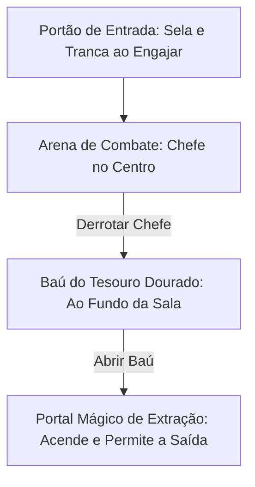
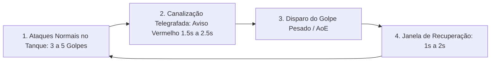

# Mecânicas de Chefes (Bosses) & Arenas — Autodungeon

Este documento define a arquitetura da Sala do Chefe, o ciclo de combate (Loop da IA), o sistema de fases de batalha (Fase 1, Fase 2 e Golpe Supremo em 10% de HP), os 4 arquétipos básicos de bosses e a interação tática dos heróis com ataques telegrafados em **Autodungeon**.

---

## 1. Estrutura e Layout da Sala do Chefe (Arena)

A Sala do Chefe encerra o trajeto (Path 1) da masmorra e opera como uma arena autolimitada:

* **Trancamento da Arena:** Ao cruzar o portão da sala do boss, a entrada é trancada magicamente, impedindo qualquer recuo para os corredores anteriores.
* **Baú do Tesouro Trancado:** Fica posicionado no fundo da sala (atrás do chefe) e só pode ser interagido após o boss ser totalmente abatido.
* **Portal de Saída Inativo:** Localizado próximo ao baú, o portal permanece apagado e só se ativa após a abertura do baú do tesouro.

---

## 2. O Loop de Batalha da IA do Chefe

O combate contra o boss segue um padrão rítmico determinístico que permite ao jogador planejar sua estratégia:

1. **Ataques Básicos Contínuos:** O chefe golpeia o Tanque (ou o herói de maior aggro) de 3 a 5 vezes consecutivas na velocidade normal.
2. **Carregamento Telegrafado:** O chefe interrompe os ataques normais e canaliza uma habilidade devastadora, projetando um marcador visual vermelho no chão (círculo, cone frontal ou feixe retangular) com tempo de aviso regular (1.5s a 2.5s).
3. **Execução do Golpe Pesado:** O ataque atinge a área marcada com dano elevado, atordoamento ou status contínuos.
4. **Janela de Recuperação:** O chefe sofre uma breve pausa de 1 a 2 segundos antes de reiniciar o ciclo, permitindo dano livre dos heróis.

---

## 3. Mecânica de Fases de Batalha (Fase 1, Fase 2 e Golpe Supremo)

Cada chefe possui fases distintas de combate com base em sua porcentagem de vida:

* **Fase 1 (100% a 50% HP — Combate Cadenciado):**
  * O chefe executa seu ciclo padrão de ataques e habilidades telegrafadas com ritmo previsível e velocidade de ataque normal.
* **Fase 2 (Abaixo de 50% HP — Transição de Padrão):**
  * O chefe realiza uma breve transição de 1 segundo (rugido visual com tremor de tela).
  * Desbloqueia novas variações de habilidades e invocações, mantendo a velocidade de ataque e o tempo de telegrafia regulares.
* **⚡ O Golpe Supremo (Desespero a 10% de HP):**
  * Quando a vida do chefe atinge **10% do seu total de HP** e ele ainda estiver vivo, ele canaliza seu **Golpe Supremo (Ultimate Devastador)**.
  * **Uso Único:** Esta habilidade suprema só pode ser lançada **uma única vez por combate**, servindo como o clímax dramático da batalha.

---

## 4. Reação Inteligente da IA dos Heróis aos Ataques Telegrafados

Durante o carregamento de habilidades telegrafadas do boss, a IA da equipe reage de acordo com suas funções e atributos:

* **Classes de Longo Alcance e Retaguarda (Arqueiro, Ladino, Mago, Sacerdote):**
  * Tentam sair da reta do ataque o mais rápido possível, deslocando-se para fora da área marcada no chão com base em sua **Velocidade de Movimento**.
  * Se o herói for lento ou estiver muito perto do centro da área e não conseguir sair a tempo, ele sofrerá o dano completo do impacto.
* **Linha de Frente / Tanques (Guerreiro, Paladino, Baluarte):**
  * O Tanque lança uma habilidade de proteção/mitigação caso a tenha disponível (*Levantar Escudo*, *Postura Defensiva*, *Escudo de Fé*).
  * Caso não possua habilidades de defesa prontas, ele segura sua posição e absorve o dano pelo time.

---

## 5. Os 4 Arquétipos Básicos de Chefes

| # | Arquétipo | Perfil de Combate | Padrão Telegrafado Típico |
| :---: | :--- | :--- | :--- |
| **1** | **Colosso Brutamontes** | Puro dano físico pesado, alto HP e ataques de atordoamento. | Pisões sísmicos em círculo (AoE) e investidas em linha reta. |
| **2** | **Conjurador Arcano** | Dano mágico elemental à distância, escudos arcanos e teletransporte. | Chuva de meteoros, raios em área e paredes de fogo. |
| **3** | **Mestre das Sombras** | Alta velocidade, períodos de invisibilidade e foco na retaguarda. | Pulos giratórios com adagas causando sangramento massivo. |
| **4** | **Invocador da Horda** | Ergue escudo de invulnerabilidade e invoca ondas de lacaios. | Círculos rituais de maldição e explosões de almas. |
