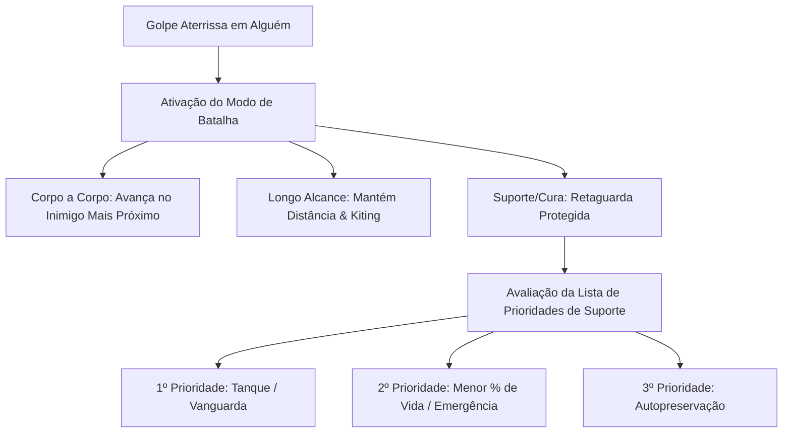

# Mecânicas de Combate — Autodungeon

Este documento define as regras de engajamento, inteligência artificial tática e comportamento dos personagens durante as batalhas automáticas em **Autodungeon**.

---

## 1. Gatilho de Combate (Engajamento)
* **Encontros no Caminho:** Monstros surgem ou patrulham salas e corredores ao longo do trajeto (Path 1) da masmorra.
* **Regra do Impacto (Primeiro Golpe Aterrissado):** Independentemente de quem avistou o outro primeiro (a equipe ou os monstros), o **Modo de Batalha** é ativado no exato instante em que o **primeiro golpe aterrissa e acerta qualquer integrante de qualquer um dos grupos** (seja um herói atingido ou um monstro atingido).
  * *Nota de Projéteis:* Se uma flecha ou magia de longo alcance for disparada, a marcha continua até que o projétil efetivamente colida com o alvo, momento no qual a transição para o combate ocorre.
* **Transição de Modo:** No momento do impacto, a navegação de marcha é congelada instantaneamente e a IA de Combate assume o controle total das ações e habilidades de cada personagem.

---

## 2. Comportamento Tático por Arquétipo

Durante o Modo de Batalha, cada herói executa um padrão de comportamento de acordo com sua função e as diretrizes configuradas pelo jogador no Lobby:

### ⚔️ Corpo a Corpo (Melee — Guerreiro, Baluarte, Berserker, Ladino)
* **Avanço Imediato:** Movem-se na direção do monstro mais próximo para travar o combate na linha de frente e criar a barreira física da equipe.
* **Geração de Aggro:** Tanques utilizam habilidades de atração para concentrar os ataques inimigos em si mesmos, protegendo os aliados mais frágeis da retaguarda.

### 🏹 Longo Alcance (Ranged — Arqueiro, Mago, Bruxo)
* **Posicionamento Vantajoso:** Mantêm-se afastados no alcance máximo de suas armas/feitiços, aproveitando a segurança da linha de trás.
* **Recuo Tático (Kiting):** Caso um inimigo tente romper a linha de frente e se aproximar, os heróis de longo alcance recuam automaticamente para restabelecer a distância segura.

### ✝️ Suporte & Curandeiros (Healers/Buffers — Sacerdote, Druida, Bardo)
* **Posição Segura:** Ficam abrigados na retaguarda, evitando ao máximo entrar no raio de ataque dos inimigos.
* **Sistema de Níveis de Prioridade de Alvos (Exclusivo para Suporte/Cura):**
  No Lobby, o jogador pode reordenar uma lista de níveis de prioridade que a IA de suporte consultará em tempo real (de cima para baixo) para decidir quem receberá curas, escudos e buffs:
  1. **Nível 1 — Foco no Tanque (Padrão):** Monitora e prioriza a vida do herói de maior defesa/aggro, impedindo que a linha de frente seja rompida.
  2. **Nível 2 — Emergência (Menor % de Vida):** Se o Tanque estiver saudável e outro aliado estiver em perigo crítico (HP < 40%), a cura é redirecionada para salvá-lo.
  3. **Nível 3 — Autopreservação:** Caso o próprio curandeiro sofra dano surpresa (ex: monstros que saltam na retaguarda), ele prioriza curar a si mesmo antes de continuar auxiliando os outros.
  4. **Nível 4 — Proteger o DPS Principal:** Prioriza manter vivo o maior causador de dano do time se a luta for prolongada.

---

## 3. Fim da Batalha, Baixas e Retomada
* **Condição de Vitória do Encontro:** Quando o último monstro do grupo é eliminado, o Modo de Batalha é encerrado.
* **Baixas em Batalha (Herói Caído):**
  * Se um herói tiver seus pontos de vida zerados, ele entra em estado de **Incapacitação** (cai no chão e cessa todas as ações).
  * A batalha continua normalmente enquanto houver pelo menos 1 herói vivo.
  * O herói caído só pode retornar à luta se for ressuscitado por habilidades específicas (ex: Sacerdote) ou consumíveis de ressurreição. Caso contrário, permanece no chão e não recebe a divisão de XP das batalhas seguintes.
* **Derrota Total (Wipe):** Se o último herói vivo for derrotado, a missão é encerrada imediatamente em falha (Wipe), forçando o retorno ao Lobby e a perda total do XP e dos espólios conquistados na expedição.
* **Reagrupamento & Regeneração Contínua:**
  * Os heróis vivos retornam à formação de marcha inicial (Tanque na frente, classes frágeis atrás).
  * **Regeneração de Mana no Trajeto:** Durante a caminhada entre os encontros, a equipe recupera Mana continuamente a uma taxa de 5% da mana máxima a cada 2 segundos.
* **Retomada da Marcha:** O Pathfinding é reativado e a equipe volta a seguir o trajeto principal em direção ao próximo encontro ou à Sala do Chefe.
