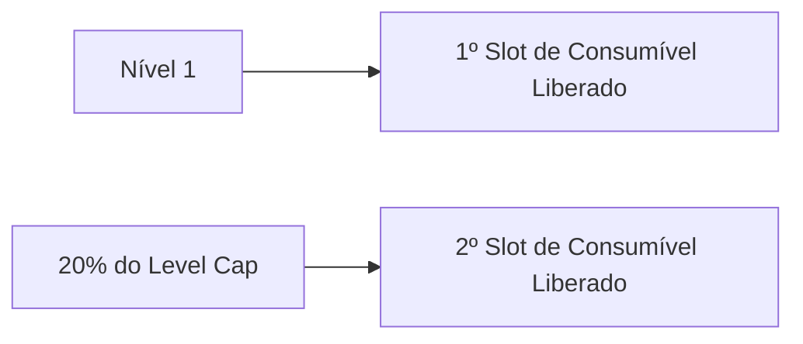
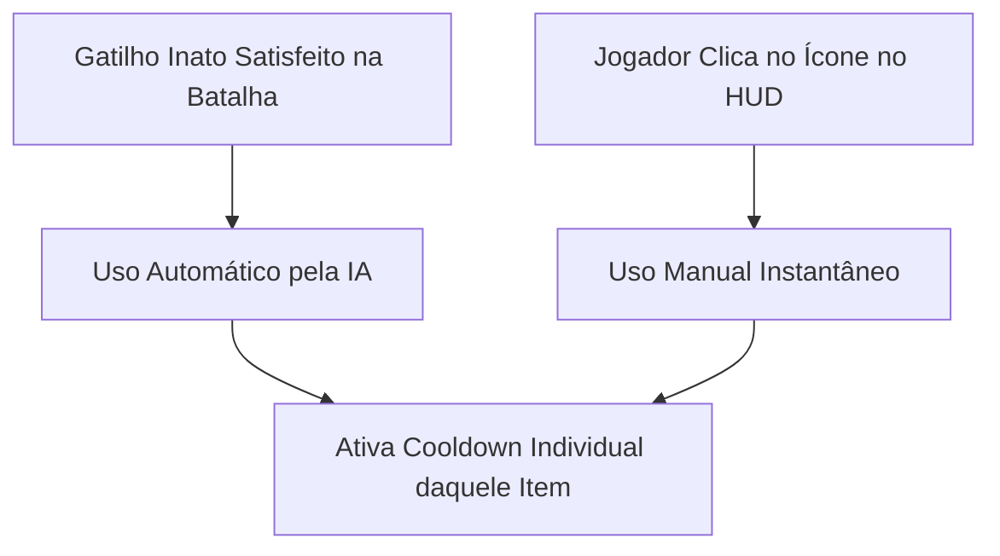

# Mecânicas de Consumíveis — Autodungeon

Este documento define as regras de slots, progressão por nível, sistema de cargas por raridade, gatilhos de ativação e variedade de itens consumíveis em **Autodungeon**.

---

## 1. Slots de Consumíveis e Progressão

Cada herói pode carregar até 2 consumíveis ativos para as expedições na masmorra:

* **Slot 1 (Inicial):** Desbloqueado desde o nível 1 para todos os personagens.
* **Slot 2 (Progressão):** Desbloqueado automaticamente quando o herói atinge **20% do Level Cap** do jogo (exemplo: se o limite de nível for 100, o segundo slot é liberado no nível 20).

---

## 2. Sistema de Cargas por Raridade & Persistência

Os consumíveis equipados possuem um número de cargas disponíveis por expedição. **O item não é destruído ao esgotar as cargas**: ao retornar ao Lobby após a masmorra, todas as suas cargas são restauradas automaticamente para a próxima missão.

| Raridade | Cor do Item | Cargas por Masmorra | Propriedades Especiais |
| :--- | :--- | :---: | :--- |
| **Comum** | Cinza | 1 Carga | Efeito simples e direto |
| **Raro** | Azul | 2 Cargas | Maior potência ou duração de efeito |
| **Épico** | Roxo | 3 a 4 Cargas | Efeitos potentes com múltiplos usos |
| **Lendário** | Laranja | 5 Cargas | **Exclusividade:** Pode conter até **2 efeitos simultâneos** no mesmo item |

---

## 3. Mecânica de Ativação Híbrida & Cooldown

Os consumíveis contam com dupla forma de disparo durante o combate:

* **Gatilho Inato Próprio:** Cada item traz embutida sua regra automática (ex: poções de cura ativam se HP < 30%; comidas ativam se Mana < 20%).
* **Acionamento Manual (HUD):** O jogador pode tocar no ícone do consumível na interface de batalha para forçar o uso imediato de 1 carga.
* **Cooldown Individual por Item:** Cada item consumível possui seu **próprio tempo de recarga interno (Cooldown Individual)** entre os usos de suas cargas (ex: uma Poção de Cura pode ter 15s de CD após o uso de uma carga, enquanto uma Bomba Alquímica tem 8s de CD). O uso de um consumível **não bloqueia** o uso do outro consumível equipado no herói.

---

## 4. Variedade e Categorias de Consumíveis

O jogo conta com diversas famílias de consumíveis equipáveis:

### 🧪 1. Poções de Suporte e Sustento
* *Poção de Vida:* Cura imediata de HP ao atingir estado crítico.
* *Poção de Mana:* Recuperação de mana para manter o lançamento de magias contínuo.
* *Antídoto / Elixir Purificador:* Remove venenos, sangramentos e outros status negativos.

### 💣 2. Poções de Ataque e Arremesso (Ofensivas)
* *Frascos de Fogo Alquímico / Ácido / Gelo:* Arremessados nos inimigos causando dano em área (AoE).
* *Prioridade de Alvo da IA:* Arremessados automaticamente no **maior grupo de monstros agrupados** ou no **inimigo de maior ameaça (Elite / Chefe)**.

### 🍖 3. Comidas Revigorantes
* *Banquetes de Batalha:* Restauram instantaneamente grandes quantias de Mana ou concedem regeneração acelerada por curto período.

### ✨ 4. Itens e Bugigangas com Feitiços Descartáveis
Itens com efeitos especiais temporários que simulam vantagens de combate:
* *Amuleto de Proteção de Emergência:* Concede um escudo temporário no Tanque quando a linha de frente sofre dano massivo.
* *Anel do Frenesi Veloz:* Dobra a velocidade de ataque do herói (ex: Ladino) por 6 segundos.
* *Pergaminho de Conjunção:* Permite conjurar instantaneamente a habilidade mais forte sem custo de mana.
* *Consumível Lendário de Duplo Efeito:* Ex: *Frasco do Berserker Ancestral* (Restaura 50% de HP **E** concede +30% de Velocidade de Ataque por 8s).
