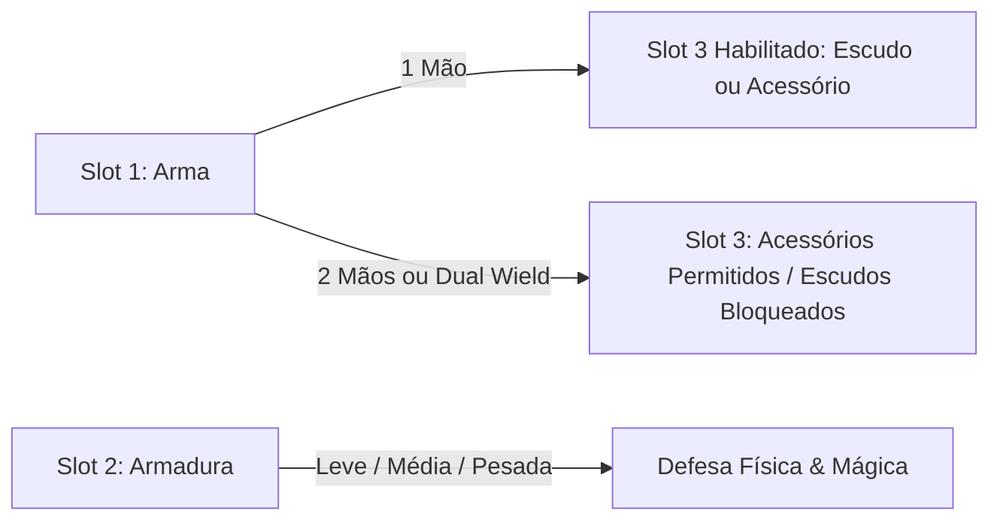

# Mecânicas de Equipamento — Autodungeon

Este documento define o funcionamento dos 3 slots de equipamento, as regras de armas (1 mão, 2 mãos e empunhadura dupla), categorias de armaduras e as mecânicas de escudos e acessórios mágicos em **Autodungeon**.

---

## 1. Estrutura dos 3 Slots de Equipamento

Cada herói possui exatamente 3 espaços de equipamentos em sua ficha:

---

## 2. Slot 1 — Mecânicas de Armas

Ao equipar uma arma, o herói herda seus atributos fundamentais de combate:
* **Poder de Ataque (Dano):** Dano base causado por golpe.
* **Velocidade de Ataque:** Define o intervalo de tempo entre cada ataque básico contínuo.
* **Classificação do Tipo de Ataque (3 Eixos Descritivos):**
  1. *Alcance:* Corpo a Corpo (Melee) ou À Distância (Ranged).
  2. *Natureza do Dano:* Físico ou Mágico.
  3. *Propriedade de Impacto:*
     * **Corte:** Espadas, adagas, foices, lâminas.
     * **Perfuração:** Flechas de arcos, virotes de bestas, lanças, projéteis perfurantes.
     * **Contusão (Impacto):** Maças, martelos, porretes, socos.
     * **Elemental:** Cajados mágicos disparando energias elementais (Fogo, Gelo, Raio, etc.).

### ✋ Armas de 1 Mão vs 2 Mãos vs Empunhadura Dupla
* **Armas de 1 Mão:**
  * Uso com uma mão (Espadas curtas, machados leves, adagas, cetros).
  * Permite que o **Slot 3** seja utilizado livremente com **Escudos** (se a classe for compatível) ou **Acessórios**.
* **Armas de 2 Mãos:**
  * Uso pesado (Espadões, arcos longos, bestas pesadas, machados de duas mãos, cajados grandes).
  * Possuem **dano consideravelmente superior** ao de armas de 1 mão.
  * **Regra de Equipamento:** Por ocuparem as duas mãos, **NÃO é permitido equipar Escudos no Slot 3**, mas o uso de **Acessórios continua totalmente liberado**.
* **Empunhadura Dupla (Dual Wield — 1 Arma em Cada Mão):**
  * Habilidade exclusiva de classes especializadas (ex: Ladino, Pistoleiro).
  * **Mecânica de Empilhamento na Bolsa:** O jogador pega duas armas de 1 mão compatíveis no inventário (ex: 1 Espada Curta + 1 Adaga, ou 2 Pistolas), empilha-as no mesmo espaço da bolsa e equipa o par empilhado no Slot 1.
  * **Vantagem de Combate:** O herói desfere **dois ataques por ciclo** e **continua podendo equipar Acessórios no Slot 3** (não pode equipar escudos).

---

## 3. Slot 2 — Mecânicas de Armaduras

O Slot de Armadura define a proteção geral do corpo do herói contra ameaças da masmorra, dividido em 3 categorias:

| Categoria de Armadura | Composição e Estilo | Perfil de Defesa & Efeitos | Classes Típicas |
| :--- | :--- | :--- | :--- |
| **Armadura Leve** | Roupões, túnicas, coletes, roupas leves, aventais, trajes casuais ou refinados | Foco em Defesa Mágica e total liberdade de movimento | Ladinos, Arqueiros, Bruxos, Magos, Sacerdotes |
| **Armadura Média** | Roupas feitas de couro, algumas reforçadas com placas de metal e partes de tecido pesado | Equilíbrio proporcional entre Defesa Física e Mágica | Caçadores, Combatentes ágeis |
| **Armadura Pesada** | Armaduras completas de metal (peitorais, elmos, placas para braços e grevas pesadas para pernas) | **Máxima Defesa Física** e proteção contra todo tipo de ataque, porém **reduz a velocidade de movimento** do herói | Guerreiros, Paladinos, Baluartes, Berserkers |

---

## 4. Slot 3 — Escudos vs Acessórios

### 🛡️ Escudos (Exclusivos de Guerreiros: Paladino, Baluarte e Berserker)
* **Condição de Uso:** Só podem ser equipados caso o herói esteja utilizando uma **Arma de 1 Mão**.
* **Mecânica de Bloqueio Total (%):** Possui uma taxa percentual de chance de bloqueio. Quando o bloqueio é ativado com sucesso em um golpe inimigo, **o dano do ataque físico é 100% anulado (dano zero)**.
* **Os 3 Tipos de Escudos:**
  1. **Escudo Pequeno:** Bônus leve de Defesa Física e taxa de bloqueio moderada, sem penalidades de agilidade.
  2. **Escudo Grande:** Defesa Física e chance de bloqueio elevadas.
  3. **Escudo Falange (Corpo Inteiro / Pavise):** Aumenta consideravelmente a Defesa Física e o Bloqueio, mas **reduz a velocidade de ataque** do herói.

### 🔮 Acessórios (Anéis, Amuletos, Orbes, Livros e Grimórios)
* **Compatibilidade:** Podem ser equipados por **qualquer classe** e combinados tanto com armas de 1 mão quanto com armas de 2 mãos e empunhadura dupla.
* **Exemplos e Mecânicas Únicas de Acessórios:**
  * **Anéis:**
    * *Anel da Vitalidade:* Concede +50 de Vida Máxima (HP).
    * *Anel da Cura Periódica:* Possui uma habilidade inata que cura o herói a cada 15 segundos (excelente para classes sem habilidades de auto-cura).
  * **Amuletos:**
    * *Amuleto do Titã:* Dobra o dano base da arma equipada.
    * *Amuleto da Fortaleza:* Concede um bônus percentual direto à Defesa geral.
  * **Orbes:**
    * *Orbe do Arcano:* Dobra o dano de magias e feitiços.
    * *Orbes Elementais:* Acrescentam propriedades e bônus de dano de Fogo, Gelo ou Raio às magias.
  * **Livros:**
    * *Tomo da Conjunção Dupla:* Habilita o lançamento de duas magias consecutivas (double cast) no mesmo ciclo.
  * **Grimórios:**
    * *Grimório Voraz:* Adiciona um efeito secundário aos buffs lançados pelo herói, concedendo **Roubo de Vida (Lifesteal)** ao aliado que recebeu o buff.
