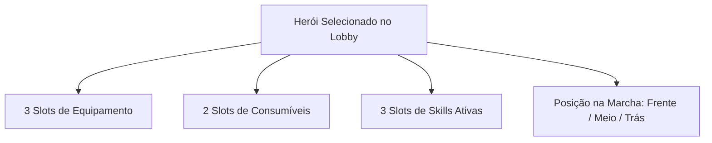

# Mecânicas de Gerenciamento de Time — Autodungeon

Este documento define as regras e o fluxo de interação da tela de Lobby para montagem da equipe de 3 heróis, customização de equipamentos, seleção de habilidades ativas e posicionamento tático da formação.

---

## 1. Visão Geral do Time e Coleção
* **Tamanho do Time Ativo:** A equipe em missão é composta por exatamente **3 heróis**.
* **Coleção de Heróis (Roster):** Lista de todos os personagens recrutados pelo jogador.
* **Adição e Substituição:** O jogador pode clicar em qualquer um dos 3 slots do time ativo e selecionar diretamente um herói da Coleção para adicioná-lo ou substituí-lo.
* **Composições Livres:** É permitido repetir raças e classes no mesmo time (ex: 2 Guerreiros Orcs e 1 Sacerdote Elfo).

---

## 2. Painel de Inspeção e Customização do Herói

Ao clicar em um dos heróis no Lobby, um painel detalhado de gerenciamento é aberto com as seguintes seções:

### 🛡️ Slots de Equipamentos (3 Slots)
Cada herói possui 3 espaços dedicados a equipamentos que concedem atributos e vantagens táticas:
1. **Slot 1 (Arma):** Define o ataque base, alcance e velocidade de ataque. As armas são divididas em:
   * **Armas de 1 Mão:** (ex: Espadas curtas, adagas, machados leves, cetros). Permitem o uso livre do Slot 3 com Escudos ou Acessórios.
   * **Armas de 2 Mãos:** (ex: Espadões, arcos longos, bestas pesadas, cajados grandes). Bloqueiam o uso de Escudos, mas permitem equipar Acessórios.
2. **Slot 2 (Armadura de Corpo):** Roupões, armaduras leves, médias ou pesadas (Define a defesa base física/mágica e resistências).
3. **Slot 3 (Acessório / Escudo):**
   * **Regra de Empunhadura (Mãos):** Armas de 1 mão permitem Escudos ou Acessórios. Armas de 2 mãos (ou dual wield) bloqueiam apenas o uso de Escudos, permitindo Acessórios.
   * **Restrição de Escudos:** **Escudos** são de uso exclusivo do **Guerreiro** e todas as suas subclasses (**Paladino**, **Baluarte** e **Berserker**).
   * **Acessórios Diversos:** Todas as classes podem equipar itens utilitários e mágicos como **Livros, Grimórios, Amuletos, Anéis ou Orbes**.

### 🧪 Slots de Consumíveis (2 Slots — Regra Embutida no Item)
* **Capacidade:** 2 consumíveis equipados por herói (ex: Poção de Vida, Poção de Mana, Antídoto, Pergaminho de Escudo).
* **Mecânica de Uso (Regra Embutida no Item):**
  * Cada item consumível possui sua **própria regra e condição de ativação embutida** em sua descrição (ex: uma Poção de Cura tem a regra inata de ser consumida automaticamente se o HP cair abaixo de 30%; um Antídoto tem a regra de ativar ao sofrer Envenenamento; e certos consumíveis podem permitir o acionamento manual do jogador via HUD).

### 🪄 Gestão de Habilidades Ativas (3 Slots Equipados)
* **Limite Ativo:** Cada herói pode levar exatamente **3 Habilidades Ativas** para a masmorra.
* **Conjunto de Escolha (Pool de Skills):**
  * O jogador seleciona as 3 skills a partir das **6 habilidades da classe base**.
  * Se o herói tiver desbloqueado uma **Subclasse**, suas 3 habilidades exclusivas são adicionadas ao pool, permitindo escolher 3 skills entre as **9 opções disponíveis**.

---

## 3. Posicionamento Tático da Formação (Frente / Meio / Trás)
Na tela de gerenciamento, o jogador define manualmente o papel espacial de cada um dos 3 integrantes na formação de marcha:
* **Frente (Vanguarda):** O primeiro a avançar e engajar os inimigos, ideal para tanques e combatentes corpo a corpo.
* **Meio (Intermediário):** Suporte intermediário ou combatentes híbridos/assassinos.
* **Trás (Retaguarda):** Mantém distância máxima da linha de frente, ideal para atiradores, magos frágeis e curandeiros primários.

---

## 4. Integração com as Instalações do Lobby (Ferreiro & Mercador)
Para apoiar a gestão e o fortalecimento contínuo da equipe de 3 heróis, o Lobby disponibiliza:
* **Ferreiro de Armas e Armaduras:** Permite investir o Ouro acumulado nas expedições para forjar melhorias de status, refinar atributos secundários e transferir propriedades mágicas entre equipamentos.
* **Mercador de Suprimentos:** Permite comprar e renovar o estoque de consumíveis (poções, comidas e bombas) e adquirir equipamentos de nível compatível para equipar heróis recém-evoluídos.
