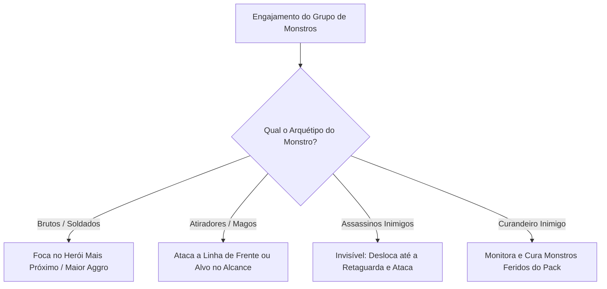

# Mecânicas de Inimigos & Inteligência Artificial — Autodungeon

Este documento define as regras de comportamento dos grupos de monstros, a inteligência artificial básica (IA), seleção de alvos, arquétipos táticos e padrões de combate de Elites e Chefes em **Autodungeon**.

---

## 1. Composição e Formação dos Grupos (Packs)
* **Tamanho dos Grupos:** Ao longo do trajeto (Path 1) da masmorra, os heróis encontram encontros com **2 a 5 monstros**.
* **Disposição Tática:** Os monstros organizam-se de forma inteligente no cenário antes do engajamento:
  * **Vanguarda:** Monstros brutos e com escudos posicionam-se à frente para interceptar o time.
  * **Retaguarda:** Atiradores, curandeiros e conjuradores posicionam-se atrás, aproveitando a cobertura dos brutos.
  * **Emboscadas & Invisibilidade:** Monstros assassinos/furtivos iniciam a batalha em estado de **Invisibilidade Total**. Eles ignoram o gatilho inicial de início de combate da equipe, continuam se deslocando invisíveis em direção ao seu alvo frágil na retaguarda e **só se revelam após desferirem o seu primeiro golpe**.

---

## 2. Sistema de Ameaça (Aggro) e Seleção de Alvos

A IA dos monstros decide quem atacar através de regras determinísticas baseadas em sua função:

* **Prioridade Padrão (Mobs Comuns):** Atacam o herói mais próximo ou aquele que emitir habilidades de provocação (Taunt/Aggro do Tanque).
* **Flanqueamento & Mecânica de Invisibilidade (Assassinos Inimigos):**
  * Ignoram o Tanque e movem-se invisíveis até o herói mais frágil.
  * **Quebra de Invisibilidade:** Ataques e magias de **dano em área (AoE)** que atingirem o assassino invisível quebram sua camuflagem imediatamente antes do ataque.
  * **Aplicação de Taunt:** Assim que a invisibilidade é encerrada (seja por sofrer dano em área ou após desferir o primeiro golpe), as habilidades de **Provocação (Taunt)** do Tanque passam a funcionar no assassino, permitindo forçá-lo a atacar a linha de frente.
* **Prioridades Cruzadas dos Heróis:** Habilidades de assassinos do time (ex: *Passo das Sombras* do Ladino) identificam e priorizam automaticamente abater os **Curandeiros** ou **Invocadores** inimigos.

---

## 3. Os 9 Arquétipos de IA de Monstros

Para garantir dinamismo tático sem controle direto do jogador, os monstros dividem-se em 9 padrões de comportamento:

| # | Arquétipo | Comportamento Tático da IA | Papel no Combate |
| :---: | :--- | :--- | :--- |
| **1** | **Bruto / Vanguarda** | Avança no Tanque e golpeia em cone frontal. | Absorver dano e prender a vanguarda. |
| **2** | **Atirador Ranged** | Dispara projéteis à distância e faz recuo (kiting) se alguém se aproximar. | Dano físico constante à distância. |
| **3** | **Curandeiro Inimigo** | Fica na retaguarda conjurando curas nos monstros feridos. | Sustento do grupo de monstros (Alvo prioritário!). |
| **4** | **Buffer / Xamã de Auras** | Planta totens e lança buffs de ataque/velocidade para os aliados. | Amplificar o poder do pack. |
| **5** | **Assassino Flanqueador** | Move-se invisível até a retaguarda e golpeia; vulnerável a dano em área (AoE) e Taunt após revelado. | Ameaçar curandeiros e magos frágeis. |
| **6** | **Suicida Explosivo** | Corre velozmente até o grupo de heróis e se autodestrói causando dano em área. | Forçar dispersão e queimar vida em área. |
| **7** | **Controlador (Disruptor)** | Lança magias de atordoamento (Stun), teias ou congelamento no Tanque. | Neutralizar a linha de frente para expor a equipe. |
| **8** | **Invocador (Summoner)** | Canaliza e sumona lacaios menores (esqueletos/morcegos) continuamente. | Sobrecarregar a equipe por número de alvos. |
| **9** | **Guardião com Escudo** | Ergue um escudo frontal que bloqueia ataques e protege quem está atrás. | Barreira física impenetrável frontal. |

---

## 4. Mecânicas de Elites e Chefes da Masmorra

### ⭐ Monstros Elites (Mini-Chefes)
* **Atributos:** Possuem $2\times\text{HP}$ e $+50\%$ de dano em relação aos monstros comuns.
* **Auras de Combate:** Cada Elite carrega uma aura passiva que afeta todos os monstros ao seu redor:
  * *Aura Vampírica:* Concede Roubo de Vida aos monstros do grupo.
  * *Aura Espinhosa:* Reflete uma porcentagem de dano físico recebido de volta aos atacantes.
  * *Aura de Celeridade:* Aumenta a velocidade de movimento e ataque do grupo.
* **Desativação de Aura por Eliminação:** Se o monstro Elite for derrotado primeiro durante a batalha, sua **aura desaparece instantaneamente**, fazendo com que todo o grupo perca o bônus e volte ao comportamento e status de inimigos comuns normais.

### 👑 Chefes de Masmorra (Dungeon Bosses)
Os chefes guardam o final do trajeto (Path 1) e utilizam mecânicas avançadas:
* **Fase 1 (100% a 50% HP — Combate Padrão):**
  * Alterna entre ataques pesados no Tanque e habilidades de dano em área (AoE).
  * **Ataques Telegrafados:** Habilidades devastadoras exibem um círculo ou linha vermelha no chão antes do impacto, permitindo que a IA dos heróis execute esquivas ou reações defensivas.
* **Fase 2 (Abaixo de 50% HP — Estado de Fúria / Enrage):**
  * O Chefe ruge, ganha $+30\%$ de velocidade de ataque e desbloqueia novos ataques em área ou invocações de lacaios.
