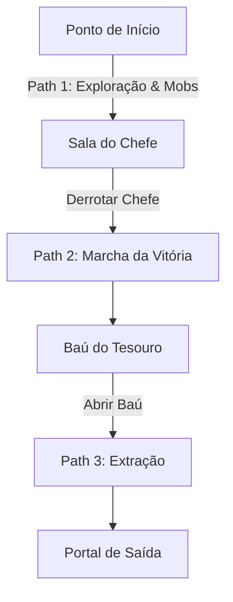

# Mecânicas de Movimento & Pathfinding — Autodungeon

Este documento define como os personagens navegam pela masmorra de forma autônoma no jogo **Autodungeon**, respeitando a velocidade individual de cada herói, a formação tática de equipe e a progressão da fase.

---

## 1. Visão Geral do Movimento
* **Controle Autônomo:** Os personagens não são controlados diretamente pelo jogador durante a fase. Toda a locomoção e tomada de decisão de caminho é gerida por algoritmos de navegação (Pathfinding / NavMesh).
* **Agentes Independentes:** Cada herói é um agente próprio com colisão física, raio de visão e sua própria **Velocidade de Movimento** (definida por Raça, Passivas e Penalidade de Equipamentos).
* **Comportamento de Grupo (Steering Behaviors):** Os personagens evitam sobreposição entre si (não ocupam o mesmo espaço) e desviam de armadilhas e obstáculos do cenário enquanto caminham.

---

## 2. Os 3 Trajetos de Pathfinding (Estágios)

A navegação da fase é dividida em 3 caminhos bem definidos que se ativam sequencialmente:

### 🚩 Path 1: Do Início até a Sala do Chefe (Travessia & Combate)
* **Objetivo:** O grupo percorre o mapa da masmorra seguindo o caminho principal até encontrar o Boss.
* **Interrupção Tática por Combate:**
  * Ao detectar um grupo de monstros (entrar no raio de aggro) ou sofrer um ataque, o Pathfinding de travessia é **interrompido temporariamente**.
  * A IA de Combate assume o controle da movimentação tática (tanques bloqueando a frente, ladinos flanqueando, arqueiros e magos recuando para posições seguras).
  * Após o grupo de monstros ser completamente derrotado, os heróis voltam a se agrupar na formação de marcha e o Pathfinding do Path 1 é retomado em direção ao objetivo.

### 🏆 Path 2: Do Local do Chefe até o Baú (A Recompensa)
* **Ativação:** Disparado no exato instante em que o Boss da masmorra é derrotado.
* **Objetivo:** Os heróis saem do modo de combate, reagrupam-se e caminham em direção ao Baú do Tesouro localizado logo atrás da arena do chefe.
* **Ação:** O grupo se posiciona ao redor do baú e a animação de abertura do tesouro é executada.

### 🌀 Path 3: Do Baú até o Portal de Saída (A Fuga/Vitória)
* **Ativação:** Disparado logo após a abertura do baú e a liberação dos espólios.
* **Objetivo:** O grupo caminha do baú em direção ao Portal Mágico recém-aberto.
* **Finalização:** Ao entrar no portal, a fase é concluída com sucesso e a tela de **Resumo da Partida** (Fase 4 do Core Loop) é exibida com as métricas de dano, cura, XP e loot obtidos.

---

## 3. Dinâmica de Velocidade, Formação e Coesão de Equipe
* **Diferença de Velocidades:** Um Metadílio Ladino se desloca consideravelmente mais rápido que um Anão Baluarte com armadura pesada.
* **Regra de Coesão (Raio da Equipe):** Para evitar que heróis velozes avancem desprotegidos, a equipe opera com uma zona de alcance de suporte. Se um personagem se afastar além do raio de segurança, ele desacelera para aguardar o grupo.
* **Formação de Marcha e Retaguarda:**
  * **Vanguarda (Frente):** O Tanque/Linha de frente sempre lidera a marcha e dita a ponta de exploração do mapa.
  * **Retaguarda (Trás):** Classes de longo alcance (Arqueiro, Mago), suportes/curandeiros (Sacerdote, Druida) e classes de baixa defesa física devem permanecer posicionados estritamente na retaguarda durante a travessia.
  * **Engajamento Seguro:** As classes frágeis da retaguarda não atacam nem se expõem até que o Tanque **entre efetivamente em modo de combate** e estabeleça o contato inicial com os inimigos (gerando o primeiro aggro).
* **Colisão Suave:** Heróis do mesmo time empurram-se suavemente para abrir espaço em portas e corredores estreitos, evitando engarrafamentos no mapa.
* **Adaptação Dinâmica em Baixas (Morte de Herói):** Se um dos 3 heróis morrer durante a travessia ou combate, seu corpo permanece no local do abate e o sistema de pathfinding recalcula automaticamente os papéis e o raio de tethering para os **2 heróis sobreviventes**, mantendo a marcha e as prioridades táticas até o fim da masmorra.
