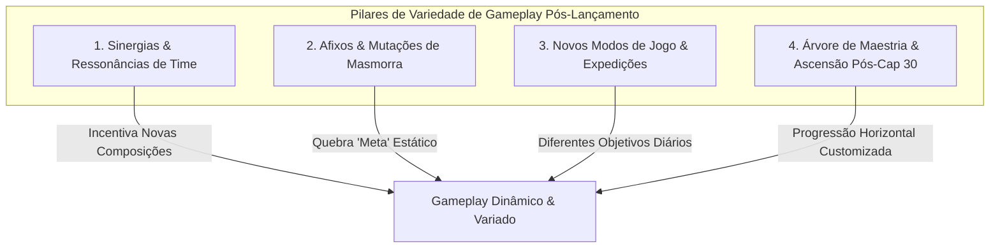
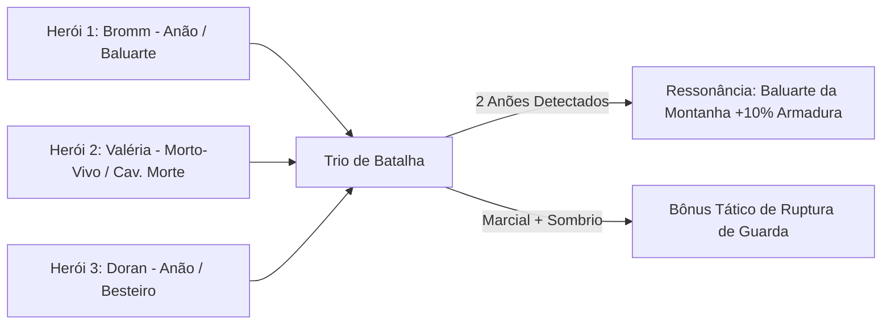
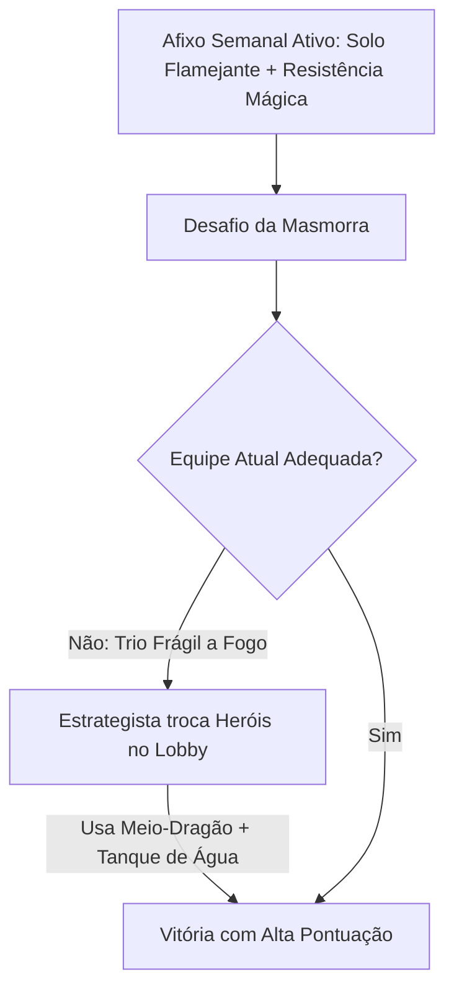
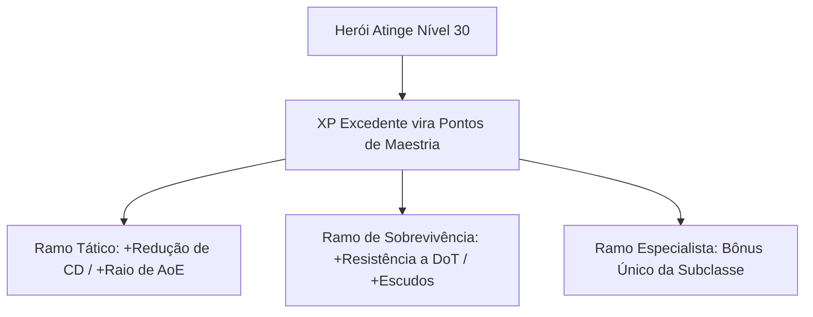

# 🌌 Sistema de Expansões, Sinergias & Variedade de Gameplay (Pós-Lançamento)

Este documento estabelece o design de sistemas e mecânicas projetados para enriquecer e diversificar a jogabilidade de **Autodungeon** após o lançamento oficial na **Google Play Store**. Ele define como novos conteúdos (raças, classes, habilidades e heróis) interagem através de **Sinergias de Equipe**, **Mutações de Masmorras**, **Modos de Jogo Alternativos** e **Ascensão de Maestria**.

---

## 🎯 1. Filosofia de Variedade & Retenção Pós-Lançamento

No lançamento inicial, o jogador explora masmorras com a base de 15 heróis. Para garantir longevidade, profundidade tática e incentivo ao desbloqueio de novos heróis adicionados nas temporadas pós-lançamento, a jogabilidade evolui em três pilares fundamentais:



---

## 🤝 2. Sistema de Sinergias & Ressonâncias de Equipe (Team Resonances)

O sistema de **Ressonância de Equipe** recompensa o jogador ao montar trios com afinidades de Raça, Classe ou Elemento, sem penalizar composições puramente táticas.

### 2.1. Como Funcionam as Ressonâncias
* Cada herói possui **Tags Raciais** (ex: *Anão, Elfo, Morto-Vivo, Fera*) e **Tags de Papel/Origem** (ex: *Arcano, Sagrado, Marcial, Sombrio, Elemental*).
* Quando a equipe de 3 heróis combina 2 ou 3 heróis com a mesma tag, uma **Ressonância Ativa** é concedida à equipe durante a expedição.



### 2.2. Tabela de Ressonâncias Raciais (Exemplos)

| Ressonância Racial | Requisito no Trio | Bônus Concedido à Equipe |
| :--- | :---: | :--- |
| **Baluarte da Montanha** | 2 Anões | $+10\%$ de Armadura para todos os aliados e $+20\%$ de resistência a atordoamento (*Stun*). |
| **Vento Feérico** | 2 Elfos | $+12\%$ de Velocidade de Movimento e $+1.5\%$ de regeneração de Mana por segundo fora de combate. |
| **Pacto dos Imortais** | 2 Mortos-Vivos | $+15\%$ de Resistência a Dano de Sombra e ressuscita 1x com 20% de HP ao sofrer dano letal. |
| **Fúria das Terras Selvagens** | 2 Orcs ou Feras | $+8\%$ de Dano Físico e $+5\%$ de Roubo de Vida (*Lifesteal*) em acertos críticos. |
| **Chama Dracônica Primordial** | 2 Meio-Dragões | Golpes corpo a corpo aplicam Queimadura de Fogo ($20\%$ do ataque por 3s). |
| **Aliança Cosmopolita** | 3 Raças Diferentes | $+5\%$ em todos os atributos e $+10\%$ de Ouro coletado na masmorra. |

### 2.3. Tabela de Ressonâncias de Classe / Arquétipo

| Ressonância de Classe | Requisito no Trio | Efeito Tático |
| :--- | :---: | :--- |
| **A Trindade Perfeita** | 1 Tanque + 1 DPS + 1 Suporte | O Tanque ganha $+10\%$ de Bloqueio, o DPS $+10\%$ de Dano e o Suporte $+15\%$ de Poder de Cura. |
| **Círculo dos Elementos** | 2 Conjuradores (Mago/Bruxo) | Habilidades mágicas reduzem a resistência elemental dos inimigos em $15\%$ por 4s. |
| **Vanguarda Blindada** | 2 Combatentes Corpo a Corpo | O dano em área recebido pela equipe é reduzido em $20\%$. |
| **Irmandade das Sombras** | 2 Ladinos / Assassinos | O primeiro ataque de cada encontro tem $+50\%$ de Chance de Crítico garantida. |

---

## 🌪️ 3. Sistema de Afixos e Mutações de Masmorras (Dungeon Modifiers)

Para evitar que uma única formação "meta" domine todo o jogo, as masmorras de alto nível e eventos pós-lançamento incorporam **Afixos Semanais Rotativos** (Mutações ambientais e de monstros).



### 3.1. Tipos de Afixos de Masmorra

1. **Afixos Ambientais (Hazard Modifiers):**
   * *Solo Ígneo:* Geysers de lava surgem a cada 15s na masmorra, causando dano de fogo a quem ficar parado. (Favorece heróis com saltos, alta velocidade ou Meio-Dragões).
   * *Névoa Asfixiante:* Reduz o campo de visão e aplica DoT de veneno constante se os combates demorarem mais de 30s. (Exige DPS explosivo).
   * *Câmara de Mana Rarefeita:* O custo de mana das skills aumenta em $50\%$, mas o ataque básico gera $+100\%$ de dano. (Favorece classes físicas como Guerreiros e Ladinos).

2. **Afixos de Inimigos (Mob Modifiers):**
   * *Espelho de Feitiços:* Monstros refletem $25\%$ do dano mágico recebido de volta ao conjurador. (Incentiva usar equipes de dano físico puro).
   * *Escudo de Falange:* Inimigos bloqueiam $40\%$ do dano frontal, mas recebem $+100\%$ de dano pelas costas. (Incentiva Ladinos com habilidades de teleporte/Passo das Sombras).
   * *Frenesi Sangrento:* Inimigos com menos de $30\%$ de HP dobram sua velocidade de ataque. (Exige controle de grupo ou finalizadores pesados).

3. **Afixos de Restrição / Bônus Temático:**
   * *Semana dos Arcanos:* Heróis Conjuradores causam $+30\%$ de Dano e ganham $+50\%$ de XP.
   * *Desafio dos Reinos do Norte:* Masmorra restrita a heróis Anões, Bárbaros e Guerreiros.

---

## 🏛️ 4. Novos Modos de Jogo Pós-Lançamento

A progressão do jogador se expande além do mapa padrão de 10 estágios através de três novos modos de operação:

```text
+---------------------------------------------------------------------------------------+
|                             MODOS DE JOGO PÓS-LANÇAMENTO                             |
+---------------------------------------------------------------------------------------+
|                                                                                       |
|  [ 1. TORRE DO INFINITO ]   ---> 100+ Andares com dificuldade progressiva e Bosses     |
|                                  a cada 5 andares. Reset mensal de ranking.           |
|                                                                                       |
|  [ 2. FENDA TEMPORAL / RIFT ] -> Masmorra procedural com afixos aleatórios diários    |
|                                  para farmar Moedas de Maestria e Itens Lendários.    |
|                                                                                       |
|  [ 3. EXPEDIÇÕES DE GUILDA ] --> Enviar heróis da reserva em missões passivas AFK     |
|                                  (ex: 4h, 8h) para recolher minérios, ouro e poções.  |
+---------------------------------------------------------------------------------------+
```

### 4.1. Modo 1: Torre do Infinito (Endless Tower)
* Estrutura vertical de 100 andares. Cada andar apresenta grupos de monstros cada vez mais resistentes com composições táticas complexas.
* A cada 5 andares, uma batalha de Chefe Duplo ou Chefe com mutações raras.
* Tabela de classificação (*Leaderboard*) global na Google Play Services.

### 4.2. Modo 2: Fenda Temporal (Daily Rifts)
* Masmorras rápidas geradas com 3 afixos aleatórios diários.
* A conclusão garante **Fragmentos de Invocação de Herói** e **Pedras de Reforja de Equipamento**.

### 4.3. Modo 3: Expedições Passivas da Guilda (Idle Bounties)
* Permite colocar os heróis que o jogador **não está usando ativamente** no trio para explorar territórios remotos.
* Enquanto o jogador joga com seus heróis principais ou fecha o aplicativo, os heróis em expedição acumulam ouro, materiais de forja e gemas menores após 4, 8 ou 12 horas.
* **Valor para o Design:** Dá utilidade real a todos os heróis da coleção (evitando que heróis de nível baixo fiquem esquecidos).

---

## 🌟 5. Árvore de Maestria & Ascensão Pós-Nível 30

Ao atingir o **Level Cap 30**, o herói não ganha mais níveis numéricos brutos (para preservar a fórmula de mitigação linear e o teto de defesa 80). Em vez disso, todo o XP adicional é convertido em **Pontos de Maestria**:



* **Estrutura de 10 Nós de Maestria:** Cada herói possui uma pequena árvore de 10 nós opcionais onde o jogador pode gastar até 5 pontos, personalizando o estilo de jogo do herói (ex: focar o Bromm em puro Bloqueio ou em Geração Agressiva de Ameaça).
* **Reset de Maestria:** O jogador pode resetar os pontos de maestria a qualquer momento no Lobby investindo uma pequena quantia de Ouro.

---

## 🔗 Navegação e Referências
* [Guia de Criação de Novas Raças](../02_racas/guia_criacao_novas_racas.md)
* [Guia de Criação de Novas Classes](../03_classes/guia_criacao_novas_classes.md)
* [Guia de Criação de Novas Skills & Efeitos](../04_skills/guia_criacao_novas_skills_e_efeitos.md)
* [Pipeline de Criação de Novos Heróis](../03_classes/herois_unicos/guia_pipeline_novos_herois.md)
* [Arquitetura Técnica de LiveOps & Expansões Modulares](../../projeto/10_arquitetura_liveops_expansoes_modulares.md)
