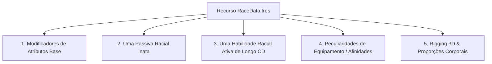

# 🧬 Guia de Criação e Framework de Novas Raças (Pós-Lançamento)

Este documento estabelece o framework formal, o orçamento de atributos (*Power Budget*), a padronização de habilidades raciais e o catálogo de futuras raças para expansões pós-lançamento de **Autodungeon**.

---

## 📐 1. Anatomia e Regras de uma Raça em Autodungeon

Toda raça no jogo, seja do lançamento inicial ou adicionada em expansões/temporadas futuras, é representada por um recurso orientado a dados (`RaceData.tres`) e deve seguir rigorosamente a seguinte estrutura de design:



### 1.1. Orçamento de Atributos Base (Power Budget Balanceado)
Para evitar *Power Creep* (inflação desbalanceada de poder), todas as raças compartilham a mesma soma líquida de modificadores:
* **Pontuação Base:** Toda raça possui uma distribuição neutra ajustada em $+15\%$ a $+20\%$ em seus atributos principais compensada por $-10\%$ a $-15\%$ em atributos secundários, ou um bônus balanceado universal (como o Humano).
* **Atributos Modificados:** HP Máximo, Força (Ataque Físico), Inteligência (Ataque Mágico/Mana), Agilidade (Velocidade/Esquiva/Crítico) e Defesa Física/Mágica.

### 1.2. Habilidade Passiva Racial (Inata)
* Efeito permanente ativo durante toda a masmorra.
* Exemplo: *Elfo:* $+15\%$ regeneração de mana; *Anão:* $+15\%$ defesa física e imunidade a knockback; *Orc:* $+20\%$ HP máximo.

### 1.3. Habilidade Ativa Racial (Longo Cooldown)
* Habilidade de alto impacto tático com tempo de recarga entre **45 a 90 segundos**.
* Disparada de forma autônoma pela IA do herói em situações críticas (ex: HP $< 40\%$ ou encontro com Chefe) ou via comando tático.

### 1.4. Peculiaridade Mecânica ou de Equipamento
* Traço único que adiciona sabor e variedade à montagem de builds (ex: *Metadílio não usa botas, mas ganha velocidade base máxima*; *Anão ganha bônus ao usar martelos/machados*).

---

## 📝 2. Template Padrão para Criação de Nova Raça

Todo novo arquivo de raça criado na pasta `docs/idea/02_racas/[nome_da_raca].md` deve seguir este modelo:

```markdown
# Raça: [Nome da Raça]

## 📜 1. Lore & Identidade Visual
* **Aparência e Estatura:** (Descrição física, proporções 3D e silhueta).
* **Origem no Mundo:** (Histórico dentro do universo de Autodungeon).
* **Traço Cultural:** (Filosofia, armas preferidas e motivações).

## 📊 2. Modificadores de Atributos Base
* **HP Base:** (+X% / -X%)
* **Ataque Físico / Força:** (+X% / -X%)
* **Poder Mágico / Inteligência:** (+X% / -X%)
* **Agilidade / Velocidade de Marcha:** (+X% / -X%)
* **Defesa Física / Defesa Mágica:** (+X% / -X%)
* **Taxa de Crítico / Esquiva Base:** (+X% / -X%)

## 🧬 3. Habilidades Raciais
* **Passiva Racial Inata — [Nome da Passiva]:** (Descrição precisa do efeito, valores numéricos e condições).
* **Habilidade Racial Ativa — [Nome da Habilidade] (CD: Xs, Custo: Y Mana):** (Descrição da animação, área de impacto, dano/buff e gatilho da IA).

## 🎒 4. Peculiaridades de Equipamento & Afinidades
* **Afinidades de Classe Ideais:** (Ex: Guerreiro, Ladino, Monge).
* **Restrições ou Bônus de Itens:** (Ex: Bônus de armaduras pesadas, bônus com armas mágicas).

## 🤝 5. Sinergias de Ressonância de Equipe (Team Resonance)
* **Tag Racial:** `RACE_TAG_NAME`
* **Efeito de Dupla (2x Raça no Trio):** (Bônus concedido ao time).
```

---

## 🌌 3. Catálogo de Raças Planejadas para Expansões Pós-Lançamento

Abaixo estão as especificações completas das 5 raças prioritárias para os ciclos de expansão (Seasons 1 a 4 pós-Google Play):

---

### 💀 3.1. Expansão 1: Morto-Vivo (Undead / Renegado)
* **Conceito Visual:** Esqueletos cobertos por farrapos nobres, olhos brilhando com chamas etéreas azuladas, pele pálida e postura elegante porém cadavérica.
* **Lore:** Antigos heróis ressuscitados pela névoa das masmorras que romperam o controle dos nigromantes e agora lutam por conta própria.
* **Modificadores de Atributos:**
  * HP: $+5\%$ | Ataque Mágico: $+10\%$ | Defesa Mágica: $+15\%$ | Velocidade de Movimento: $-5\%$.
* **Passiva Racial (Toque do Sepulcro):** Imunidade a Veneno/Sangramento. Ao sofrer dano letal, torna-se invulnerável por 2 segundos antes de morrer (1x por masmorra).
* **Habilidade Ativa Racial (Lamento dos Caídos - CD: 75s):** Emite um grito espectral em área de 4m que causa medo (*Terrify/Flee*) aos monstros ao redor por 2.5 segundos e drena 10% do HP causado como escudo.
* **Afinidade:** Bruxo (Necromante), Cavaleiro da Morte, Ladino (Assassino).

---

### 🐾 3.2. Expansão 2: Homem-Fera (Beastfolk / Felino)
* **Conceito Visual:** Humanoides felinos e canídeos ágeis, com garras afiadas, pelagem listrada, cauda expressiva e movimentos acrobáticos.
* **Lore:** Tribos nômades das estepes selvagens que possuem sentidos ultra-aguçados e comunhão com os espíritos primordiais.
* **Modificadores de Atributos:**
  * Agilidade/Velocidade: $+15\%$ | Chance de Crítico: $+5\%$ | Ataque Físico: $+10\%$ | Defesa Física: $-10\%$.
* **Passiva Racial (Predador Noturno):** Aumenta o dano crítico em $+25\%$ contra inimigos com menos de $40\%$ de vida. Velocidade de ataque aumenta em $10\%$ durante todo o combate.
* **Habilidade Ativa Racial (Salto Predatório - CD: 50s):** Salta instantaneamente no inimigo de menor vida na arena, desferindo uma patada lacerante que causa $200\%$ de dano físico e aplica Sangramento severo.
* **Afinidade:** Ladino, Monge, Arqueiro (Caçador), Guerreiro (Berserker).

---

### ⚙️ 3.3. Expansão 3: Golem / Constructo Rúnico (Automaton)
* **Conceito Visual:** Corpos maciços esculpidos em pedra polida e placas de bronze reforçadas por núcleos energéticos de cristal incandescente no peito.
* **Lore:** Guardiões mecânicos ancestrais deixados por uma civilização esquecida, reativados pela energia das masmorras.
* **Modificadores de Atributos:**
  * HP: $+25\%$ | Defesa Física: $+20\%$ | Defesa Mágica: $+10\%$ | Velocidade de Marcha: $-15\%$ | Mana Máxima: $-30\%$.
* **Passiva Racial (Carapaça de Titanita):** Não possui barra de mana padrão (suas habilidades consomem frações de Escudo de Cristal). É imune a atordoamento (*Stun*) e congelamento (*Freeze*).
* **Habilidade Ativa Racial (Sobrecarga de Cristal - CD: 60s):** Descarrega o núcleo rúnico, criando um campo magnético que atrai todos os monstros da sala para si e gera um escudo equivalente a $30\%$ do seu HP máximo por 6 segundos.
* **Afinidade:** Guerreiro (Baluarte), Alquimista, Mago (Rúnico).

---

### 😈 3.4. Expansão 4: Ínfero / Meio-Demônio (Tiefling)
* **Conceito Visual:** Chifres curvados elegantes, pele avermelhada ou púrpura escura, cauda pontiaguda e olhos que reluzem em brasas de fogo infernal.
* **Lore:** Descendentes de linhagens tocadas pelo fogo dos planos inferiores, mestres no uso de feitiçaria destrutiva e contratos arriscados.
* **Modificadores de Atributos:**
  * Ataque Mágico: $+20\%$ | Ataque Físico: $+5\%$ | Defesa Física: $-10\%$ | Regeneração de Mana: $+10\%$.
* **Passiva Racial (Pacto de Chamas):** $+50\%$ de Resistência a Queimadura/Fogo. Todo dano causado pelo herói tem $15\%$ de chance de incendiar o alvo.
* **Habilidade Ativa Racial (Chamas do Averno - CD: 60s):** Invoca pilares de fogo negro do solo sob os 3 monstros mais próximos, causando grande dano mágico de fogo e reduzindo a defesa mágica dos alvos em $20\%$ por 5s.
* **Afinidade:** Bruxo, Mago (Elementalista), Invocador, Ladino.

---

### 🧜 3.5. Expansão 5: Tritão / Povo dos Mares (Merfolk)
* **Conceito Visual:** Seres aquáticos bípedes com brânquias suaves, escamas esmeralda e safira cintilantes, barbatanas dorsais translúcidas e feições nobres marinhas.
* **Lore:** Protetores dos santuários submersos que emergiram para conter a corrupção abissal que brota das profundezas das masmorras.
* **Modificadores de Atributos:**
  * Poder de Cura: $+20\%$ | Defesa Mágica: $+10\%$ | Mana Máxima: $+15\%$ | Ataque Físico: $-10\%$.
* **Passiva Racial (Bênção das Marés):** Todas as habilidades de cura e escudos conjurados por este herói são $15\%$ mais potentes. Fora de combate, a equipe recupera $+2\%$ de HP a cada 3 segundos.
* **Habilidade Ativa Racial (Torrente Purificadora - CD: 60s):** Invoca uma onda d'água curativa que lava a equipe inteira, removendo todos os debuffs/venenos ativos e curando $25\%$ do HP máximo de todos os heróis.
* **Afinidade:** Sacerdote (Clérigo/Oráculo), Bruxo (Druida), Mago.

---

## 🛠️ 4. Pipeline Técnico de Integração no Código (Godot Engine)

Para registrar uma nova raça no jogo após o lançamento:

1. **Criar o Resource `.tres`:** Instanciar a classe `RaceData.gd` em `res://data/races/[id_da_raca].tres`.
2. **Definir Scripts de Efeito:** Criar o `SkillEffect` da habilidade ativa em `res://data/skills/racial/[id_habilidade].tres`.
3. **Indexação Automática:** O singleton `ContentRegistry` escaneia a pasta `res://data/races/` na inicialização do jogo e popula automaticamente as telas de criação e os menus de filtro da UI.

```gdscript
# Exemplo de Resource de Raça (RaceData.gd)
class_name RaceData
extends Resource

@export var race_id: String = "undead"
@export var race_name: String = "Morto-Vivo"
@export var icon: Texture2D
@export_multiline var description: String = ""

@export_group("Modificadores de Status")
@export var hp_multiplier: float = 1.05
@export var phys_atk_multiplier: float = 1.0
@export var mag_atk_multiplier: float = 1.10
@export var phys_def_multiplier: float = 1.0
@export var mag_def_multiplier: float = 1.15
@export var speed_multiplier: float = 0.95

@export_group("Habilidades Raciais")
@export var passive_effect: SkillEffect
@export var active_racial_skill: SkillData

@export_group("Sinergias & Tags")
@export var synergy_tag: String = "TAG_UNDEAD"
```

---

## 🔗 Navegação
* [Lista Geral de Raças e Regras Base](_lista_e_regras.md)
* [Guia de Criação de Novas Classes](../03_classes/guia_criacao_novas_classes.md)
* [Pipeline de Criação de Novos Heróis](../03_classes/herois_unicos/guia_pipeline_novos_herois.md)
* [Arquitetura de Expansões Modulares](../../projeto/10_arquitetura_liveops_expansoes_modulares.md)
