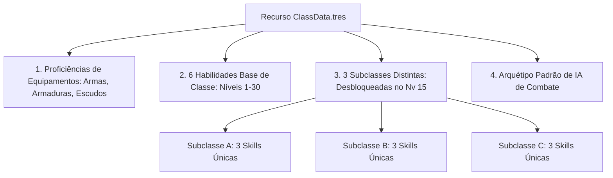

# ⚔️ Guia de Criação e Framework de Novas Classes (Pós-Lançamento)

Este documento define as regras formais, a matriz de habilidades (6 Base + 9 de Subclasses = 15 Skills), as restrições de equipamentos e o catálogo de classes planejadas para as expansões pós-lançamento de **Autodungeon**.

---

## 📐 1. Anatomia e Estrutura de uma Classe

Para manter a consistência com as 6 classes base de lançamento (*Arqueiro, Bruxo, Guerreiro, Ladino, Mago e Sacerdote*), qualquer nova classe adicionada ao ecossistema do jogo deve ser modelada via `ClassData.tres` e atender aos seguintes requisitos obrigatórios:



### 1.1. Estrutura Canônica de 15 Habilidades por Classe
* **6 Habilidades Base:** Disponíveis desde o Nível 1. Cobrem o repertório elementar da classe (dano básico, utilidade, mitigação e controle).
* **3 Subclasses Especializadas (Nível 15):** Cada subclasse traz **3 habilidades exclusivas**.
* **Total:** 15 habilidades projetadas por classe, permitindo que cada herói monte uma combinação personalizada de **3 habilidades ativas equipadas** no Lobby.

### 1.2. Regras de Equipamentos por Arquétipo
| Arquétipo de Classe | Slot 1 (Armas Permitidas) | Slot 2 (Armaduras) | Slot 3 (Acessório / Escudo) |
| :--- | :--- | :--- | :--- |
| **Guerreiro / Cavaleiro da Morte** | Espadas 1H/2H, Machados, Maças | Armaduras Pesadas / Médias | Escudos Grandes/Falanges ou Acessórios |
| **Monge** | Manoplas, Bastões 2H, Soqueiras | Armaduras Médias / Túnicas | Acessórios (Sem Escudo) |
| **Ladino** | Adagas 1H/Dual, Bestas Leves | Armaduras Médias (Couro) | Acessórios (Sem Escudo) |
| **Arqueiro** | Arcos 2H, Bestas 2H, Pistolas | Armaduras Médias (Couro) | Acessórios (Sem Escudo) |
| **Mago / Bruxo / Invocador** | Cajados 2H, Cetros 1H, Varinhas | Armaduras Leves (Túnicas) | Grimórios, Orbes e Acessórios |
| **Sacerdote / Alquimista** | Cetros 1H, Maças Leves, Frascos | Armaduras Leves / Médias | Relíquias, Amuletos e Acessórios |

---

## 📝 2. Template Padrão para Criação de Nova Classe

Todo novo arquivo de classe em `docs/idea/03_classes/[nome_da_classe].md` deve seguir este padrão:

```markdown
# Classe: [Nome da Classe]

## 📜 1. Visão Geral & Papel Tático
* **Papel Principal:** (Tanque / DPS Melee / DPS Ranged / Suporte / Invocador / Disruptor)
* **Posição Recomendada:** (Frente / Meio / Trás)
* **Mecânica Central Única:** (Ex: Sistema de Chi/Posturas, Medidor de Peste, Frascos de Alquimia).

## 🛡️ 2. Proficiências de Equipamentos
* **Armas (Slot 1):** (Lista de armas permitidas)
* **Armaduras (Slot 2):** (Tipo de armadura permitido)
* **Slot 3:** (Acessórios e/ou Escudos)

## 🪄 3. As 6 Habilidades Base de Classe (Nível 1+)
1. **[Nome Skill 1]:** (Tipo, Custo Mana, CD, Efeito)
2. **[Nome Skill 2]:** (Tipo, Custo Mana, CD, Efeito)
3. **[Nome Skill 3]:** (Tipo, Custo Mana, CD, Efeito)
4. **[Nome Skill 4]:** (Tipo, Custo Mana, CD, Efeito)
5. **[Nome Skill 5]:** (Tipo, Custo Mana, CD, Efeito)
6. **[Nome Skill 6]:** (Tipo, Custo Mana, CD, Efeito)

## 🌳 4. Subclasses & Árvores de Especialização (Nível 15)
### Subclasse 1: [Nome da Subclasse 1]
* *Foco Tático:* (Descrição da especialização)
* *Skill 1:* [Nome] (Efeito)
* *Skill 2:* [Nome] (Efeito)
* *Skill 3:* [Nome] (Efeito)

### Subclasse 2: [Nome da Subclasse 2]
...
### Subclasse 3: [Nome da Subclasse 3]
...
```

---

## 🌌 3. Catálogo de Novas Classes Planejadas para Expansões

Abaixo estão as 4 classes prioritárias projetadas para introdução nas temporadas pós-lançamento:

---

### 🥋 3.1. Classe de Expansão: Monge (Monk)
* **Papel Tático:** Combatente Híbrido Melee / Evasão Dinâmica & Interrupção.
* **Posição:** Frente / Meio.
* **Mecânica Central (Fluxo de Chi):** Cada ataque básico gera 1 ponto de Chi (máx 5). Habilidades especiais consomem Chi em vez de Mana, permitindo combate contínuo sem dependência de regeneração mágica.
* **Proficiências:** Manoplas, Bastões 2H e Armaduras Médias/Túnicas.
* **6 Habilidades Base:**
  1. *Palma de Choque:* Golpe frontal rápido que interrompe conjurações inimigas (CD: 4s).
  2. *Chute Vendaval:* Giro acrobático que causa dano a todos os monstros adjacentes e aumenta a esquiva em $+20\%$ por 3s (CD: 6s).
  3. *Meditação Interior:* Cura a si mesmo em $30\%$ do HP e remove 1 efeito negativo (CD: 18s).
  4. *Passo Ágil:* Teleporta instantaneamente para trás do alvo mais distante, esquivando de ataques (CD: 8s).
  5. *Corpo Inquebrável:* Converte $25\%$ do dano físico recebido em cura pelos próximos 4s (CD: 22s).
  6. *Golpe dos Mil Punhos:* Rajada violenta de 6 golpes rápidos com $150\%$ de dano total (CD: 12s).
* **3 Subclasses (Nível 15):**
  * **Punho Espiritual:** Habilidades com dano elemental e ondas de choque mágicas à média distância (*Palma Sagrada, Explosão de Chi, Dragão Astral*).
  * **Mestre Bêbado:** Foco extremo em esquiva, contra-ataques automáticos e absorção de dano imprevisível (*Dança Tropeçante, Gole Revigorante, Repvidar Embriagado*).
  * **Andarilho dos Ventos:** Foco em velocidade de ataque insana, golpes múltiplos e buffs de velocidade para toda a equipe (*Aura da Ventania, Vórtice Ciclone, Fúria Tempestuosa*).

---

### 💀 3.2. Classe de Expansão: Cavaleiro da Morte (Death Knight)
* **Papel Tático:** Tanque Ofensivo / Dreno de Vida & Debuffs de Área.
* **Posição:** Frente (Vanguarda).
* **Mecânica Central (Runas de Sangue & Peste):** Suas habilidades causam dano físico e de sombra, gerando escudos proporcionais ao dano drenado dos inimigos.
* **Proficiências:** Espadões 2H, Machados Pesados, Armaduras Pesadas de Placas.
* **6 Habilidades Base:**
  1. *Golpe Necrótico:* Ataque brutal que converte $30\%$ do dano causado em autocura (CD: 5s).
  2. *Garras da Morte:* Puxa o inimigo mais distante para a linha de frente, forçando-o a atacá-lo (CD: 10s).
  3. *Névoa Profana:* Cria uma poça escura no chão; monstros dentro recebem DoT contínuo de sombra e têm seu ataque reduzido em $15\%$ (CD: 14s).
  4. *Carapaça de Gelo Seco:* Ganha armadura maciça e reflete $20\%$ do dano sofrido de volta aos atacantes (CD: 16s).
  5. *Toque da Praga:* Contamina o alvo; quando o alvo morre, explode espalhando veneno aos monstros próximos (CD: 8s).
  6. *Pacto da Não-Morte:* Sacrifica $15\%$ do HP atual para ganhar $+40\%$ de dano por 6s (CD: 20s).
* **3 Subclasses (Nível 15):**
  * **Cavaleiro de Sangue:** Tanque vampírico com lifesteal extremo e autocura maciça (*Ferva-Sangue, Transfusão Sombria, Escudo de Hemoglobina*).
  * **Senhor da Peste:** Mestre de DoTs e enfraquecimento geral dos inimigos da sala (*Epidemia Devastadora, Enxame Pestilento, Morte Rastejante*).
  * **Gelorruína:** Tanque congelante que atordoa e desacelera atacantes (*Prisão de Gelo, Sopro Glacial, Inverno Eterno*).

---

### 🧪 3.3. Classe de Expansão: Alquimista (Alchemist)
* **Papel Tático:** Suporte Tático Híbrido / Conjurador de Poções de Campo & Dano Químico em Área.
* **Posição:** Meio / Trás.
* **Mecânica Central (Bolsa de Reagentes):** Arremessa frascos que alteram as propriedades do chão do campo 3D (Zonas Químicas).
* **Proficiências:** Cetros químicos, Frascos de arremesso, Adagas e Armaduras Médias/Túnicas.
* **6 Habilidades Base:**
  1. *Frasco Ácido:* Quebra a armadura do monstro em $-30\%$ por 6s (CD: 6s).
  2. *Bomba de Fogo Fátuo:* Explosão de área com dano de fogo e cegueira por 2s (CD: 8s).
  3. *Vapor Revigorante:* Lança uma granada de cura que regenera o HP da equipe em área (CD: 10s).
  4. *Elixir da Celeridade:* Concede $+30\%$ de velocidade de ataque e marcha a um aliado por 5s (CD: 12s).
  5. *Óleo Escorregadio:* Espalha óleo no chão; inimigos que passam têm $30\%$ de chance de escorregar e cair (CD: 14s).
  6. *Mistura Instável:* Dano massivo aleatório (Fogo, Gelo, Veneno ou Eletricidade) em raio amplo (CD: 15s).
* **3 Subclasses (Nível 15):**
  * **Bombardeiro:** Foco em DPS explosivo em grande área (*Granada de Fragmentação, Megabomba Rúnica, Chuva de Frascos*).
  * **Mutagênico:** Bebe seus próprios compostos para se transformar temporariamente em um bruto mutante de corpo a corpo (*Metamorfose Bestial, Fúria Química, Regeneração Celular*).
  * **Boticário:** Curandeiro avançado baseado em HoTs e antídotos universais (*Panaceia Mágica, Infusão de Vitalidade, Escudo Químico*).

---

### 🔮 3.4. Classe de Expansão: Invocador (Summoner)
* **Papel Tático:** Conjurador de Criaturas Autônomas / Controle e Multiplicação de Alvos.
* **Posição:** Trás (Retaguarda).
* **Mecânica Central (Entidades Convocadas):** Invoca familiares e golens temporários no campo de batalha que possuem sua própria barra de vida e atraem ataques dos monstros.
* **Proficiências:** Cajados 2H, Grimórios, Amuletos e Túnicas Mágicas.
* **6 Habilidades Base:**
  1. *Invocar Familiar Alado:* Spawna um falcão espiritual que ataca inimigos de longe (CD: 15s).
  2. *Lança Espiritual:* Projétil que causa dano mágico e marca o inimigo para seus summons focarem o ataque (CD: 5s).
  3. *Bênção do Mestre:* Aumenta o dano e a defesa de todas as criaturas invocadas em $+30\%$ por 8s (CD: 18s).
  4. *Escudo de Simbiose:* Transfere $40\%$ do dano sofrido pelo Invocador para o seu minion mais forte (CD: 20s).
  5. *Vínculo Etéreo:* Cura uma criatura invocada ou um aliado com $20\%$ de vida (CD: 8s).
  6. *Sacrifício Astral:* Detona um familiar invocado, causando dano mágico massivo em área e atordoando monstros (CD: 14s).
* **3 Subclasses (Nível 15):**
  * **Convocador Espiritual:** Invoca espíritos ancestrais e guardiões celestiais de suporte (*Espírito Guardião, Cura Astral, Bênção dos Ancestrais*).
  * **Mestre Elemental:** Invoca elementais de fogo, gelo e terra com ataques em área (*Golens Elementais, Tempestade Convocada, Fusão Elemental*).
  * **Senhor dos Pactos:** Invoca demônios menores e feras sombrias com alto poder de destruição (*Diabretes de Fogo, Cão do Averno, Pacto do Juízo Final*).

---

## 🛠️ 4. Pipeline Técnico de Registro na Godot Engine

```gdscript
# Exemplo de Resource de Classe (ClassData.gd)
class_name ClassData
extends Resource

@export var class_id: String = "monk"
@export var class_name: String = "Monge"
@export var icon: Texture2D
@export_multiline var description: String = ""

@export_group("Proficiências")
@export var allowed_weapon_types: Array[String] = ["fist", "staff_2h"]
@export var allowed_armor_type: String = "medium"
@export var can_use_shields: bool = false

@export_group("Habilidades Base (6 Skills)")
@export var base_skills: Array[SkillData] = []

@export_group("Subclasses (3 Subclasses)")
@export var subclasses: Array[SubclassData] = []
```

---

## 🔗 Navegação
* [Lista Geral de Classes e Regras Base](_lista_e_regras.md)
* [Guia de Criação de Novas Raças](../02_racas/guia_criacao_novas_racas.md)
* [Guia de Criação de Novas Skills & Efeitos](../04_skills/guia_criacao_novas_skills_e_efeitos.md)
* [Pipeline de Criação de Novos Heróis](../03_classes/herois_unicos/guia_pipeline_novos_herois.md)
