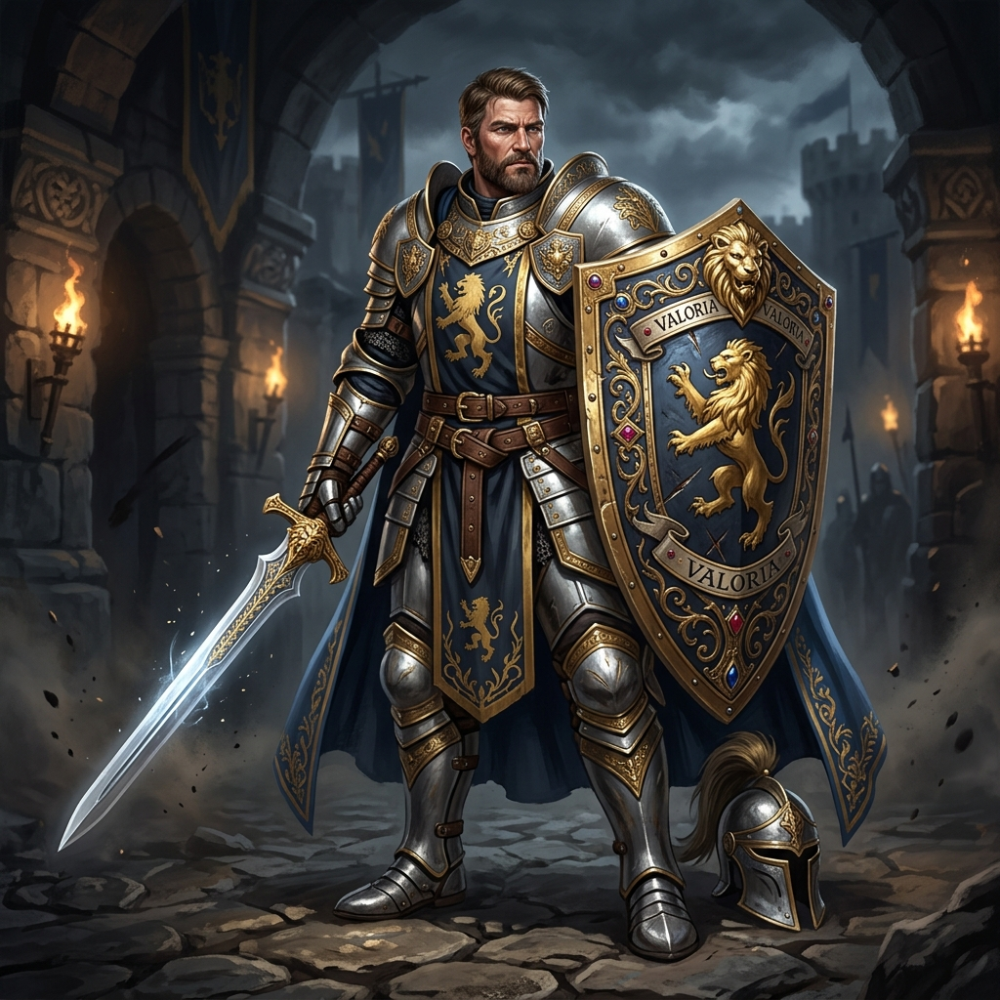

# Sir Alistair, o Escudo de Valória

## 📜 1. História & Origem
Primeiro cavaleiro da Guarda Real de Valória, Sir Alistair dedicou sua juventude a proteger a fronteira do reino contra invasões demoníacas. Quando as masmorras subterrâneas começaram a se abrir sob as cidades, ele jurou descer às profundezas para selar o mal na sua fonte. Com uma postura impecável e disciplina militar, Alistair personifica a liderança defensiva.

---

## 👤 2. Ficha do Personagem
* **Raça:** Humano
* **Classe Base:** Guerreiro
* **Subclasse (Nv 15):** Paladino
* **Papel Tático:** Tank Protetor / Liderança & Barreira de Equipe
* **Posição Recomendada na Formação:** Frente (Vanguarda)

---

## 🧬 3. Atributos Raciais
* **Passiva Racial (Adaptabilidade Heroica):** $+5\%$ em todos os atributos base (HP, Mana, Dano, Defesa e Velocidade).
* **Habilidade Racial Ativa (Vontade de Sobreviver - CD 60s):** Remove imediatamente todos os efeitos negativos (Stun, Veneno, Sangramento) e concede 25% de redução de dano por 4 segundos.

---

## 🪄 4. Habilidades Recomendadas (Build de 3 Skills)
1. **[Grito de Guerra](../../../04_skills/guerreiro/grito_de_guerra.md):** Eleva a moral da equipe, concedendo $+15\%$ de Dano e Armadura para todos os aliados por 6 segundos.
2. **[Pele de Aço](../../../04_skills/guerreiro/pele_de_aco.md):** Endurece o corpo absorvendo os próximos 3 ataques com mitigação de 50%.
3. **[Aura de Devoção](../../../04_skills/guerreiro/paladino/aura_de_devocao.md):** Reduz o dano sofrido por toda a equipe enquanto Alistair estiver vivo.

---

## 🎒 5. Equipamentos & Consumíveis Recomendados
* **Slot 1 (Arma):** Espada de 1 Mão *(ex: Espada de Prata Sagrada)*.
* **Slot 2 (Armadura):** Armadura de Placas Pesadas *(ex: Armadura de Soldado da Guarda)*.
* **Slot 3 (Escudo):** Escudo Grande *(ex: Escudo do Brasão Real)* com bloqueio elevado.
* **Consumíveis:** *Amuleto de Proteção de Emergência* e *Poção de Vida Média*.

---

## ⚔️ 6. Guia Estratégico & Sinergias
* **Estilo de Jogo:** Alistair é o tank mais balanceado e consistente do jogo. Ele protege ativamente os outros dois heróis através de buffs de defesa e controle de aggro.
* **Sinergias no Trio:**
  * **Com Doran (Arqueiro Besteiro) e Beatrice (Sacerdote):** Uma formação tática impenetrável onde Alistair segura a vanguarda e Doran fura as armaduras dos inimigos à distância.
  * **Com Pip (Metadílio Ladino):** Alistair segura o foco dos monstros de frente, permitindo que Pip ataque tranquilamente pelas costas.
* **Ponto de Atenção:** Alistair não causa dano expressivo; ele depende inteiramente do seu DPS para finalizar as batalhas antes que sua defesa se esgote.
