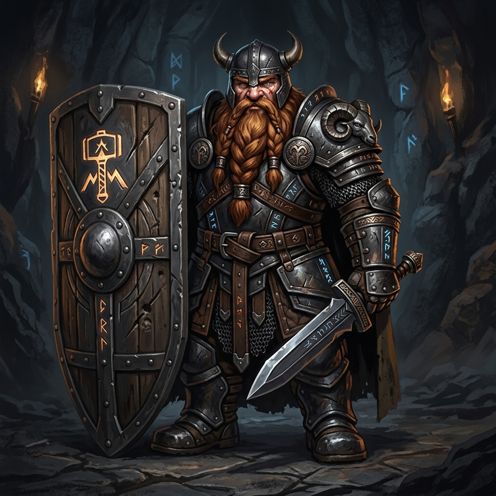

# Bromm, o Baluarte de Pedra

## 📜 1. História & Origem
Nascido nas entranhas das Grandes Forjas de Karak-Vorn, Bromm foi forjado entre a fuligem e o retinir de martelos sobre bigornas de adamante. Quando um terremoto ancestral libertou hordas de monstros nas minas profundas, Bromm empunhou um escudo maciço de torre e segurou a passagem sozinho por três dias, permitindo que seu clã evacuasse em segurança. Desde então, ele vaga pelas masmorras como uma fortaleza viva que nenhum monstro é capaz de mover.

---

## 👤 2. Ficha do Personagem
* **Raça:** Anão
* **Classe Base:** Guerreiro
* **Subclasse (Nv 15):** Baluarte
* **Papel Tático:** Tank / Defesa Absoluta & Controle de Área
* **Posição Recomendada na Formação:** Frente (Vanguarda)

---

## 🧬 3. Atributos Raciais
* **Passiva Racial (Corpo de Pedra):** $+15\%$ de Defesa Física base e imunidade natural a empurrões e recuos causados por monstros.
* **Habilidade Racial Ativa (Grito da Forja - CD 60s):** Bate no escudo liberando uma onda de choque que força todos os inimigos ao redor a focarem nele por 5 segundos e concede $+30\%$ de Armadura temporária.

---

## 🪄 4. Habilidades Recomendadas (Build de 3 Skills)
1. **[Investida](../../../04_skills/guerreiro/investida.md):** Avança rapidamente contra o primeiro monstro, iniciando o combate e gerando aggro inicial.
2. **[Postura Defensiva](../../../04_skills/guerreiro/postura_defensiva.md):** Eleva o escudo reduzindo todo o dano físico sofrido em 25% enquanto ativo.
3. **[Muralha Intransponível](../../../04_skills/guerreiro/baluarte/muralha_intransponivel.md):** Planta o escudo de falange no chão, criando uma zona onde aliados atrás recebem 50% de redução de dano.

---

## 🎒 5. Equipamentos & Consumíveis Recomendados
* **Slot 1 (Arma):** Espada de 1 Mão *(ex: Espada Longa do Guarda)*.
* **Slot 2 (Armadura):** Armadura Pesada de Placas *(ex: Peitorais de Ferro/Aço)*.
* **Slot 3 (Escudo):** Escudo Falange ou Grande *(ex: Falange do Baluarte Anão)* com alta taxa de Bloqueio Total.
* **Consumíveis:** *Amuleto de Proteção de Emergência* (Escudo automático em <30% HP) e *Elixir da Fortaleza Inquebrável*.

---

## ⚔️ 6. Guia Estratégico & Sinergias
* **Estilo de Jogo:** Bromm deve sempre liderar a formação. Sua função principal é absorver todos os golpes pesados dos brutos inimigos e travar o avanço das tropas.
* **Sinergias no Trio:**
  * **Com Beatrice (Sacerdote) e Elysia (Arqueiro):** Formação clássica e ultra-estável, perfeita para chefes difíceis.
  * **Com Valtrak (Mago Elementalista):** Bromm agrupa os monstros na sua frente, permitindo que as explosões de fogo de Valtrak atinjam todos os inimigos juntos.
* **Ponto de Atenção:** Devido à armadura pesada e escudo de falange, sua velocidade de movimento é menor; assegure-se de que a retaguarda não se distancie excessivamente nos corredores.
