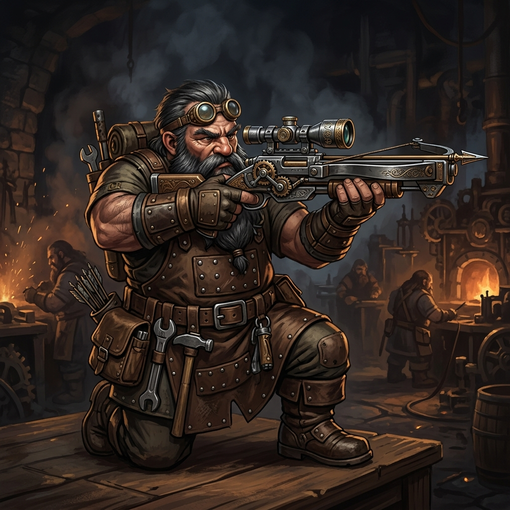

# Doran, o Atirador de Elite

## 📜 1. História & Origem
Doran sempre preferiu o som dos mecanismos de disparo ao choque de espadas. Engenheiro de armamentos em Karak-Vorn, ele desenhou as bestas pesadas que defendiam as muralhas das montanhas. Cansado de ficar no alto dos muros, construiu uma besta portátil com molas de aço reforçado e desceu às masmorras para perfurar as carapaças dos monstros mais resistentes.

---

## 👤 2. Ficha do Personagem
* **Raça:** Anão
* **Classe Base:** Arqueiro
* **Subclasse (Nv 15):** Besteiro
* **Papel Tático:** DPS Físico Ranged / Perfuração de Armadura & Disparos Pesados
* **Posição Recomendada na Formação:** Trás (Retaguarda)

---

## 🧬 3. Atributos Raciais
* **Passiva Racial (Olhar do Mineiro):** $+10\%$ de Precisão e imunidade a empurrões.
* **Habilidade Racial Ativa (Calibração Rápida - CD 45s):** Ajusta os mecanismos da besta, garantindo que os próximos 3 disparos perfurem 100% da armadura do inimigo.

---

## 🪄 4. Habilidades Recomendadas (Build de 3 Skills)
1. **[Tiro Perfurante](../../../04_skills/arqueiro/besteiro/tiro_perfurante.md):** Virote pesado que ignora 30% da armadura do alvo e atravessa em linha reta.
2. **[Recarga Tática](../../../04_skills/arqueiro/besteiro/recarga_tatica.md):** Reduz o tempo entre disparos pesados em 40% por 6 segundos.
3. **[Foco Fatal](../../../04_skills/arqueiro/besteiro/foco_fatal.md):** Aumenta o dano crítico em $+50\%$ contra monstros Elites e Chefes.

---

## 🎒 5. Equipamentos & Consumíveis Recomendados
* **Slot 1 (Arma):** Besta Pesada de 2 Mãos *(ex: Besta Pesada com Molas de Aço ou Balista Portátil)*.
* **Slot 2 (Armadura):** Armadura Média de Couro Reforçado.
* **Slot 3 (Acessório):** Amuleto de Dano/Crítico *(ex: Amuleto do Golpe Certeiro)*.
* **Consumíveis:** *Frasco de Ácido Corrosivo* e *Pão de Centeio Seco*.

---

## ⚔️ 6. Guia Estratégico & Sinergias
* **Estilo de Jogo:** Doran é o maior destruidor de monstros blindados e Chefes com alta defesa. Seus tiros lentos, porém devastadores, garantem dano massivo constante.
* **Sinergias no Trio:**
  * **Com Bromm (Tank Baluarte):** A clássica dupla anã; Bromm segura o chefe no lugar e Doran destrói sua barra de vida à distância.
  * **Com Beatrice (Sacerdote):** Beatrice mantém Doran protegido e buffado para maximizar os acertos críticos.
* **Ponto de Atenção:** Velocidade de ataque mais lenta que os arcos élficos; necessita de um bom posicionamento na retaguarda.
