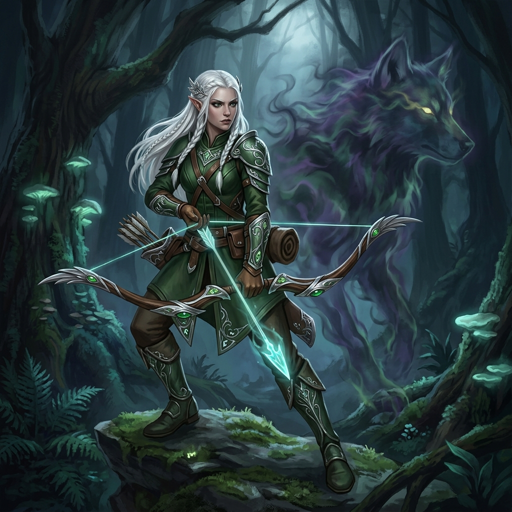

# Elysia, a Flecha Fantasma

## 📜 1. História & Origem
Elysia é uma guardiã das florestas prateadas de Silvaluna. Treinada desde a infância na arquearia tradicional élfica, ela desenvolveu a habilidade de disparar sem ser vista, usando a brisa para curvar suas flechas através das árvores. Ao ver a corrupção das masmorras invadir os bosques sagrados, ela partiu em caçada solitária aos monstros subterrâneos.

---

## 👤 2. Ficha do Personagem
* **Raça:** Elfo
* **Classe Base:** Arqueiro
* **Subclasse (Nv 15):** Caçador
* **Papel Tático:** DPS Físico Ranged / Kiting & Invocação de Suporte
* **Posição Recomendada na Formação:** Trás (Retaguarda)

---

## 🧬 3. Atributos Raciais
* **Passiva Racial (Graça Élfica):** $+10\%$ de Velocidade de Movimento e regeneração contínua de mana aumentada fora de combate.
* **Habilidade Racial Ativa (Vento Feérico - CD 45s):** Desloca-se em um flash de luz para 4 tiles de distância, deixando para trás um rastro de névoa que cega os monstros próximos por 2 segundos.

---

## 🪄 4. Habilidades Recomendadas (Build de 3 Skills)
1. **[Tiro Certeiro](docs/idea/04_skills/arqueiro/tiro_certeiro.md):** Disparo rápido de alta perfuração que causa 130% de dano físico à distância.
2. **[Chuva de Flechas](docs/idea/04_skills/arqueiro/chuva_de_flechas.md):** Lança uma saraivada em área circular, atingindo múltiplos monstros simultaneamente.
3. **[Invocar Companheiro](docs/idea/04_skills/arqueiro/cacador/invocar_companheiro.md):** Invoca um Lobo Espiritual que distrai os monstros e ataca os flancos.

---

## 🎒 5. Equipamentos & Consumíveis Recomendados
* **Slot 1 (Arma):** Arco Élfico de 2 Mãos *(ex: Arco Élfico da Brisa ou Arco da Águia)*.
* **Slot 2 (Armadura):** Armadura Média de Couro *(ex: Gibão do Caçador Furtivo)*.
* **Slot 3 (Acessório):** Amuleto de Crítico/Alcance *(ex: Amuleto do Golpe Certeiro)*.
* **Consumíveis:** *Frasco de Veneno Mortal* e *Pão de Centeio Seco*.

---

## ⚔️ 6. Guia Estratégico & Sinergias
* **Estilo de Jogo:** Elysia ataca a grandes distâncias da segurança da retaguarda. Se qualquer monstro tentar alcançá-la, ela recua naturalmente executando kiting.
* **Sinergias no Trio:**
  * **Com Bromm (Tank Baluarte):** A melhor combinação de frente/trás; Bromm bloqueia o avanço e Elysia dispara livremente.
  * **Com Milo (Bardo):** A Canção da Celeridade de Milo eleva a velocidade de disparo de Elysia ao limite.
* **Ponto de Atenção:** Baixa vida e pouca armadura física; se sofrer uma emboscada de assassinos furtivos pelas costas, precisará da ajuda imediata do seu suporte.
