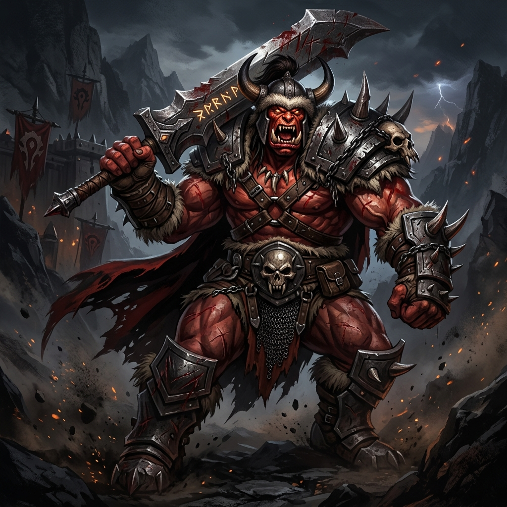

# Grommash, o Rompe-Montanhas

## 📜 1. História & Origem
Grommash é um veterano das Guerras dos Ermos Escarlates. Tendo sobrevivido a dezenas de cercos onde todos os seus companheiros pereceram, ele aprendeu que a dor física não é uma fraqueza, mas sim o combustível para uma fúria selvagem incontrolável. Ele não bloqueia golpes; ele os absorve com seus músculos e devolve com machados devastadores.

---

## 👤 2. Ficha do Personagem
* **Raça:** Orc
* **Classe Base:** Guerreiro
* **Subclasse (Nv 15):** Berserker
* **Papel Tático:** Tank Ofensivo / Sustentação por Roubo de Vida (Lifesteal)
* **Posição Recomendada na Formação:** Frente (Vanguarda)

---

## 🧬 3. Atributos Raciais
* **Passiva Racial (Vigor dos Ermos):** Possui o maior pool de HP base do jogo ($+25\%$ de Vida Máxima em comparação a outras raças).
* **Habilidade Racial Ativa (Fúria Sanguinária - CD 45s):** Entra em frenesi ao perder vida, ganhando $+20\%$ de Roubo de Vida e $+25\%$ de Velocidade de Ataque por 8 segundos.

---

## 🪄 4. Habilidades Recomendadas (Build de 3 Skills)
1. **[Corte Brutal](docs/idea/04_skills/guerreiro/berserker/corte_brutal.md):** Golpe violento de alto impacto que causa dano baseado na quantidade de vida que o próprio Grommash perdeu.
2. **[Fúria Cega](docs/idea/04_skills/guerreiro/berserker/furia_cega.md):** Aumenta o dano de ataque em 30%, mas reduz a própria defesa temporariamente.
3. **[Grito de Sangue](docs/idea/04_skills/guerreiro/berserker/grito_de_sangue.md):** Provoca todos os monstros em área, puxando o foco para si e restaurando uma porcentagem de HP a cada monstro provocado.

---

## 🎒 5. Equipamentos & Consumíveis Recomendados
* **Slot 1 (Arma):** Espadão de 2 Mãos *(ex: Zweihänder ou Decapitador de Ogros)*.
* **Slot 2 (Armadura):** Armadura Pesada ou Média Reforçada.
* **Slot 3 (Acessório):** Amuleto de Dano/HP *(ex: Amuleto do Titã Furioso)*.
* **Consumíveis:** *Poção do Sangue de Berserker* e *Carne Assada de Javali Selvagem*.

---

## ⚔️ 6. Guia Estratégico & Sinergias
* **Estilo de Jogo:** Grommash transforma o dano recebido em regeneração contínua de vida ao atingir os monstros. Seu gameplay é arriscado, mas com DPS massivo na linha de frente.
* **Sinergias no Trio:**
  * **Com Urok (Xamã Orc):** Os totens de Urok e a Sede de Sangue multiplicam o ataque de Grommash a níveis astronômicos.
  * **Com Beatrice (Sacerdote):** Beatrice garante a rede de segurança com curas emergenciais nos momentos em que a vida de Grommash cai criticamente.
* **Ponto de Atenção:** Como ele não utiliza escudos, sofre mais dano físico bruto; ele depende de bater sem parar para manter o Roubo de Vida ativo.
