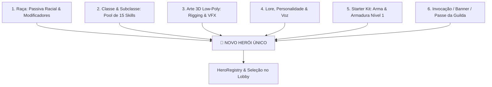
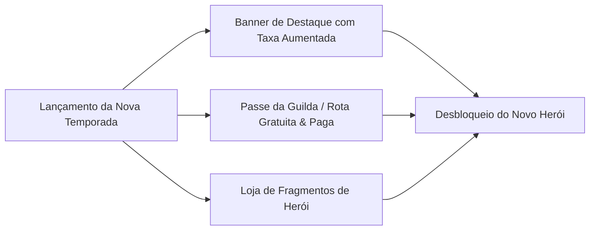

# 👑 Pipeline de Criação de Novos Heróis Únicos (Pós-Lançamento)

Este documento define o pipeline completo de engenharia, game design, arte 3D e integração comercial para a criação de novos **Heróis Únicos** em **Autodungeon** além dos 15 heróis do lançamento inicial (Heróis #16 ao #30+).

---

## 🎯 1. O Herói como Ponto de Convergência do Ecossistema

Em **Autodungeon**, um Herói Único é o ápice da combinação harmoniosa entre todos os subsistemas modulares do jogo:

---

## 📋 2. Checklist Passo a Passo de Lançamento de um Novo Herói

Para que um novo herói seja aprovado e publicado em uma atualização da Play Store, ele deve cumprir os 7 passos do pipeline:

| Passo | Área | Tarefa Obrigatória | Critério de Aceitação |
| :---: | :--- | :--- | :--- |
| **1** | **Game Design** | Criar a ficha do herói em Markdown na pasta `docs/idea/03_classes/herois_unicos/[nome]/[nome].md`. | Raça, classe, subclasse, build recomendada e lore validados. |
| **2** | **Dados (Data)** | Criar o recurso `HeroData.tres` em `res://data/heroes/[hero_id].tres`. | Referências corretas para `RaceData`, `ClassData` e habilidades iniciais. |
| **3** | **Arte 3D** | Produzir o modelo 3D Low-Poly (1.500–3.500 tris) em `.glb` com Texture Atlas único. | Rigging padrão compatível com os ciclos: *Idle, Walk, Attack, Cast, Hurt, Die*. |
| **4** | **VFX & SFX** | Criar os efeitos visuais 3D (partículas leves) e vincular os efeitos sonoros de voz/golpe. | VFX otimizado para mobile (OpenGL ES3 Compatibility). |
| **5** | **Simulação** | Executar o teste automatizado no `HeadlessCombatSimulator.gd`. | Taxa de vitória dentro da margem de $48\% - 52\%$ contra monstros de nível equivalente. |
| **6** | **UI & Catálogo** | Registrar o herói no `HeroRegistry` e criar o ícone de retrato 2D para o HUD e Lobby. | O herói aparece na galeria do Lobby e no painel de substituição de equipe. |
| **7** | **Comercial** | Vincular ao Banner de Invocação da Temporada, Loja de Fragmentos ou Passe de Batalha. | Preço em Gemas/Fragmentos configurado no `EconomyConfig`. |

---

## 🌟 3. Próxima Onda de Heróis Planejados (Expansões 1 & 2)

Abaixo estão as fichas conceituais completas dos 5 heróis projetados para as primeiras atualizações de temporada pós-lançamento:

---

### 💀 Herói #16: Valéria, a Lâmina Espectral
* **Raça:** Morto-Vivo | **Classe:** Cavaleiro da Morte | **Subclasse:** Cavaleiro de Sangue
* **Papel Tático:** Tank Vampírico / Dreno de Vida & Controle Sombrio
* **Posição:** Frente (Vanguarda)
* **Lore:** Antiga comandante de cavalaria imperial que recusou a morte para continuar protegendo as terras desoladas das masmorras. Empunha uma espada rúnica que pulsa com sangue espectral.
* **Build de 3 Skills Equipadas:**
  1. *[Golpe Necrótico](../guia_criacao_novas_classes.md#32-classe-de-expansao-cavaleiro-da-morte-death-knight)* (Dano + 30% Lifesteal).
  2. *[Garras da Morte](../guia_criacao_novas_classes.md#32-classe-de-expansao-cavaleiro-da-morte-death-knight)* (Puxa inimigo distante e gera aggro).
  3. *Escudo de Hemoglobina* (Cria escudo protetor baseado no dano total drenado dos inimigos).
* **Equipamentos:** Espadão Rúnico 2H, Armadura Pesada Espectral e Amuleto das Almas.
* **Sinergias de Ressonância:** Ativa *Pacto dos Imortais* (+15% Resistência à Sombra e auto-revive).

---

### 🐾 Herói #17: Jin, o Vendaval Sereno
* **Raça:** Homem-Fera (Felino) | **Classe:** Monge | **Subclasse:** Andarilho dos Ventos
* **Papel Tático:** DPS Melee de Alta Velocidade / Evasão Acrobática & Interrupção
* **Posição:** Frente / Meio
* **Lore:** Monge andarilho dos monastérios das montanhas celestes. Combina artes marciais de Chi com a agilidade natural felina para desferir dezenas de golpes por segundo.
* **Build de 3 Skills Equipadas:**
  1. *[Palma de Choque](../guia_criacao_novas_classes.md#31-classe-de-expansao-monge-monk)* (Golpe frontal com interrupção de feitiços).
  2. *[Passo Ágil](../guia_criacao_novas_classes.md#31-classe-de-expansao-monge-monk)* (Teleporte evasivo para trás do alvo).
  3. *Aura da Ventania* (Aumenta a velocidade de ataque de todo o trio em $+25\%$ por 6s).
* **Equipamentos:** Manoplas de Garras de Aço, Túnica dos Ventos e Faixa da Serenidade.
* **Sinergias de Ressonância:** Ativa *Predador Noturno* (+25% Dano Crítico contra inimigos <40% HP).

---

### 🧪 Herói #18: Zarek, o Alquimista da Peste
* **Raça:** Humano | **Classe:** Alquimista | **Subclasse:** Bombardeiro
* **Papel Tático:** DPS em Grande Área / Quebra de Defesa & Zonas Químicas
* **Posição:** Meio / Trás
* **Lore:** Erudito renegado que descobriu como misturar minérios de masmorra instáveis com compostos ácidos para dissolver armaduras monstruosas à distância.
* **Build de 3 Skills Equipadas:**
  1. *[Frasco Ácido](../guia_criacao_novas_classes.md#33-classe-de-expansao-alquimista-alchemist)* (Reduz armadura dos inimigos em 30%).
  2. *[Bomba de Fogo Fátuo](../guia_criacao_novas_classes.md#33-classe-de-expansao-alquimista-alchemist)* (Dano de fogo em área e cegueira de 2s).
  3. *Granada de Fragmentação* (Dano físico massivo e estilhaços que aplicam Sangramento em área).
* **Equipamentos:** Cetro Frasco de Alquimia, Armadura de Couro Reforçado e Bolsa de Reagentes Rúnicos.
* **Sinergias de Ressonância:** Excelente gatilhador de combos elementais (Óleo + Fogo).

---

### 🔥 Herói #19: Nyx, a Soberana das Chamas Negras
* **Raça:** Ínfero (Meio-Demônio) | **Classe:** Mago | **Subclasse:** Elementalista
* **Papel Tático:** DPS Mágico de Longo Alcance / Destruição Ígnea em Área
* **Posição:** Trás (Retaguarda)
* **Lore:** Nascida nas fendas do Averno, domina a arte de fundir fogo infernal e matéria arcana pura para incinerar hordas inteiras em segundos.
* **Build de 3 Skills Equipadas:**
  1. *[Pilar de Fogo](../../04_skills/mago/elementalista/pilar_de_fogo.md)* (Erupção de fogo vertical em área).
  2. *[Chuva de Meteoros](../../04_skills/mago/chuva_de_meteoros.md)* (Bombardeio mágico de longa distância).
  3. *Chamas do Averno* (Habilidade ativa racial de fogo negro penetrante).
* **Equipamentos:** Cajado do Fogo Negro 2H, Túnica Infernal e Orbe Vulcânico.

---

### 🌊 Herói #20: Thalassa, o Coral da Alvorada
* **Raça:** Tritão | **Classe:** Sacerdote | **Subclasse:** Oráculo
* **Papel Tático:** Suporte Místico / Cura em Área Contínua & Purificação
* **Posição:** Meio / Trás
* **Lore:** Sacerdotisa dos santuários marítimos profundos enviada para abençoar os expedicionários com as águas cristalinas da cura ancestral.
* **Build de 3 Skills Equipadas:**
  1. *[Círculo de Cura](../../04_skills/sacerdote/circulo_de_cura.md)* (Poça aquática que cura aliados dentro).
  2. *[Aura de Premonição](../../04_skills/sacerdote/oraculo/aura_de_premonicao.md)* (Concede esquiva passiva para o trio).
  3. *Torrente Purificadora* (Habilidade ativa racial que remove todos os debuffs do time e cura 25% HP).
* **Equipamentos:** Cetro das Marés 1H, Túnica de Seda Abissal e Relíquia da Concha Sagrada.

---

## 💰 4. Modelo de Distribuição & Monetização dos Novos Heróis

Para manter o jogo sustentável financeiramente após o lançamento na Google Play Store sem recorrer a práticas predatórias (*Pay-to-Win*):

1. **Garantia de Desbloqueio Gratuito (F2P Friendly):**
   * Todo novo herói possui **Fragmentos de Invocação** que podem ser farmados jogando a *Torre do Infinito* ou completando *Expedições Diárias*.
2. **Banner de Invocação de Destaque (Gemas / Moeda Premium):**
   * Opção de compra direta do herói ou invocação acelerada com taxa garantida (*Pity System* aos 30 sorteios).
3. **Passe da Guilda (Season Pass):**
   * O herói em destaque na temporada é desbloqueado no nível 20 da rota do passe (disponível para todos os jogadores).

---

## 🔗 Navegação
* [Compêndio dos 15 Heróis Iniciais](../../00_indice.md#👥-heróis-únicos-iniciais-15-fichas)
* [Guia de Criação de Novas Raças](../../02_racas/guia_criacao_novas_racas.md)
* [Guia de Criação de Novas Classes](../guia_criacao_novas_classes.md)
* [Arquitetura Técnica de LiveOps](../../projeto/10_arquitetura_liveops_expansoes_modulares.md)
