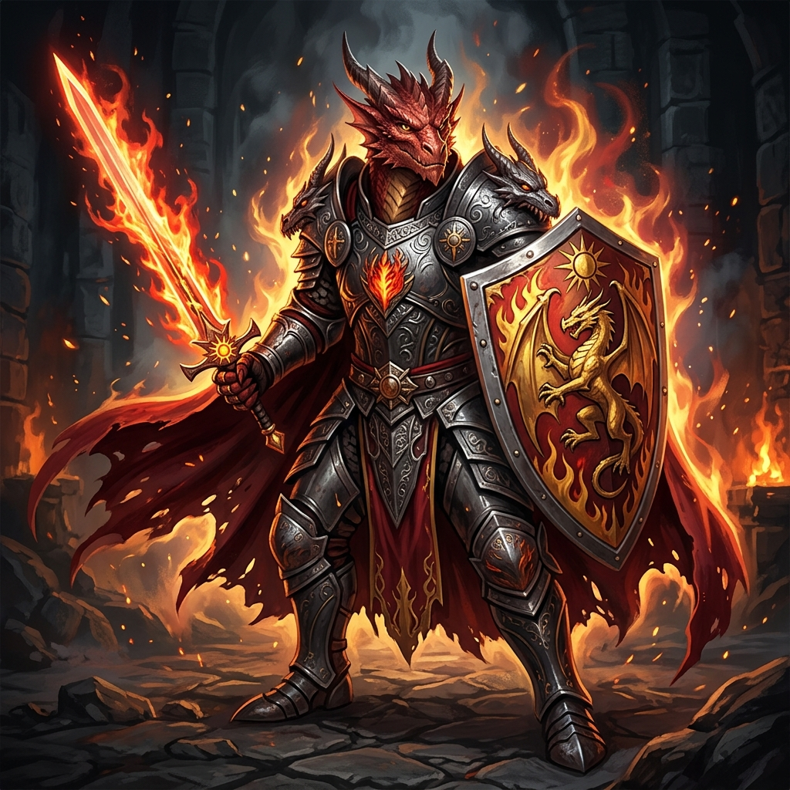

# Ignis, o Dragão de Ferro

## 📜 1. História & Origem
Nascido nas cinzas de um santuário destruído por dragões ancestrais, Ignis carrega o sangue draconiano e a devoção inabalável da Ordem da Chama Sagrada. Rejeitado por muitos devido à sua aparência assustadora de escamas escarlates, ele encontrou seu propósito empunhando a lâmina e o fogo sagrado para defender os indefesos das criaturas da escuridão.

---

## 👤 2. Ficha do Personagem
* **Raça:** Meio-Dragão
* **Classe Base:** Guerreiro
* **Subclasse (Nv 15):** Paladino
* **Papel Tático:** Tank / Sustentação & Dano Sagrado Ígneo
* **Posição Recomendada na Formação:** Frente (Vanguarda)

---

## 🧬 3. Atributos Raciais
* **Passiva Racial (Couro Draconiano):** $+10\%$ de Defesa Mágica base e imunidade total ao efeito de Queimadura.
* **Habilidade Racial Ativa (Sopro Primordial - CD 50s):** Expele um cone de chamas incandescentes que causa 160 de dano de Fogo em área e incinera as armaduras inimigas por 6 segundos (-15% de Defesa).

---

## 🪄 4. Habilidades Recomendadas (Build de 3 Skills)
1. **[Golpe Sagrado](../../../04_skills/guerreiro/paladino/golpe_sagrado.md):** Ataque corpo a corpo imbuído de luz sagrada que causa dano bônus a demônios e mortos-vivos.
2. **[Aura de Devoção](../../../04_skills/guerreiro/paladino/aura_de_devocao.md):** Aura passiva que concede $+10\%$ de Defesa Mágica e Física para todos os aliados próximos.
3. **[Mão da Cura](../../../04_skills/guerreiro/paladino/mao_da_cura.md):** Converte mana em cura emergencial direta para si mesmo ou para o aliado mais debilitado.

---

## 🎒 5. Equipamentos & Consumíveis Recomendados
* **Slot 1 (Arma):** Espada de 1 Mão de Fogo/Sagrada *(ex: Espada da Fênix Flamejante)*.
* **Slot 2 (Armadura):** Armadura Pesada de Placas *(ex: Peitorais Metálicos)*.
* **Slot 3 (Escudo):** Escudo Grande *(ex: Escudo Sagrado do Paladino)*.
* **Consumíveis:** *Poção de Mana Radiante* e *Frasco de Luz Sagrada Punitiva*.

---

## ⚔️ 6. Guia Estratégico & Sinergias
* **Estilo de Jogo:** Ignis atua como uma vanguarda semi-autossuficiente, aliviando o trabalho do curandeiro graças à sua *Mão da Cura* e emitindo dano constante de fogo.
* **Sinergias no Trio:**
  * **Com Kaelen (Assassino):** Enquanto Ignis queima e enfraquece as defesas da linha de frente, Kaelen se infiltra e elimina a retaguarda dos monstros.
  * **Com Faelar (Druida):** A cura ao longo do tempo do Druida combinada com a sustentação própria de Ignis torna a equipe quase imortal.
* **Ponto de Atenção:** Suas habilidades consomem mais mana que os outros guerreiros; certifique-se de equipá-lo com consumíveis ou itens de regeneração de mana.
