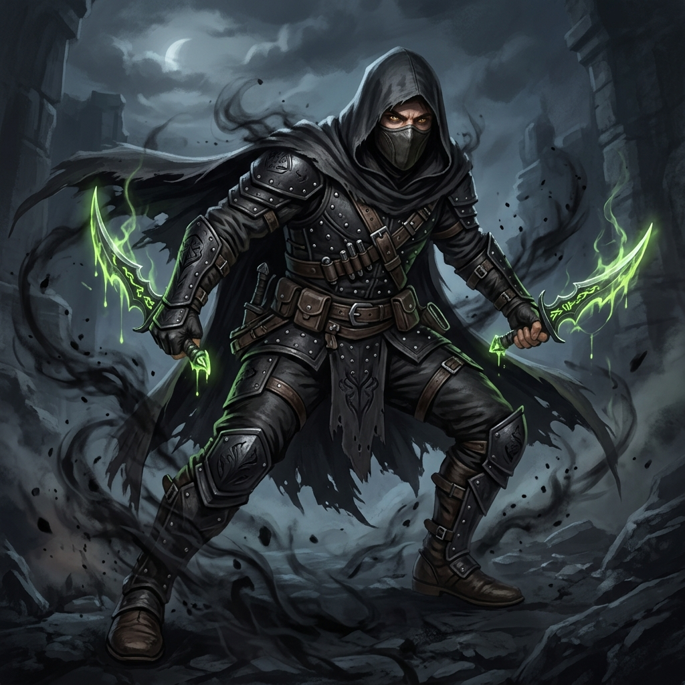

# Kaelen, o Carrasco das Sombras

## 📜 1. História & Origem
Crescido nas vielas mais escuras da Cidade Baixa, Kaelen aprendeu a matar antes mesmo de aprender a ler. Contratado pela Guilda dos Ladrões para eliminar alvos protegidos, ele aperfeiçoou a arte da lâmina envenenada e do ataque invisível. Ao descobrir que o líder da guilda havia sido corrompido por um artefato de masmorra, Kaelen partiu em busca dos segredos do submundo.

---

## 👤 2. Ficha do Personagem
* **Raça:** Humano
* **Classe Base:** Ladino
* **Subclasse (Nv 15):** Assassino
* **Papel Tático:** DPS Melee Burst / Flanqueador com Invisibilidade & Venenos
* **Posição Recomendada na Formação:** Meio ou Frente

---

## 🧬 3. Atributos Raciais
* **Passiva Racial (Instinto de Sobrevivência):** $+5\%$ de Esquiva e $+5\%$ de Dano Físico.
* **Habilidade Racial Ativa (Golpe Oportunista - CD 45s):** Se o alvo estiver com menos de 30% de HP, desfere um golpe que causa 250% de dano puro, ignorando a armadura.

---

## 🪄 4. Habilidades Recomendadas (Build de 3 Skills)
1. **[Passo das Sombras](../../../04_skills/ladino/passo_das_sombras.md):** Fica invisível e se teleporta para trás do monstro mais distante (curandeiros e atiradores inimigos).
2. **[Veneno Letal](../../../04_skills/ladino/assassino/veneno_letal.md):** Imbui as adagas com veneno mortal que causa dano ao longo do tempo (DoT) cumulativo.
3. **[Degolar](../../../04_skills/ladino/assassino/degolar.md):** Ataque devastador pelas costas que causa 300% de dano crítico se lançado saindo da furtividade.

---

## 🎒 5. Equipamentos & Consumíveis Recomendados
* **Slot 1 (Arma):** Adagas Duplas (Dual Wield) *(ex: Adagas Gêmeas de Salteador ou Lâminas do Algoz)*.
* **Slot 2 (Armadura):** Armadura Média de Couro *(ex: Gibão do Assassino Mestre)*.
* **Slot 3 (Acessório):** Amuleto de Crítico *(ex: Grimório Voraz de Lifesteal ou Amuleto do Golpe Certeiro)*.
* **Consumíveis:** *Anel do Frenesi Veloz* e *Frasco de Veneno Mortal*.

---

## ⚔️ 6. Guia Estratégico & Sinergias
* **Estilo de Jogo:** Kaelen não ataca a linha de frente; ele contorna a vanguarda e assassina os curandeiros e atiradores inimigos com extrema rapidez.
* **Sinergias no Trio:**
  * **Com Ignis (Tank Paladino):** Ignis atrai a atenção dos brutos enquanto Kaelen destrói a retaguarda dos monstros.
  * **Com Faelar (Druida):** As raízes de Faelar imobilizam os inimigos, permitindo que Kaelen ataque sem sofrer contra-ataques.
* **Ponto de Atenção:** Se o tanque falhar em segurar o aggro, Kaelen é muito frágil para suportar dano frontal contínuo.
