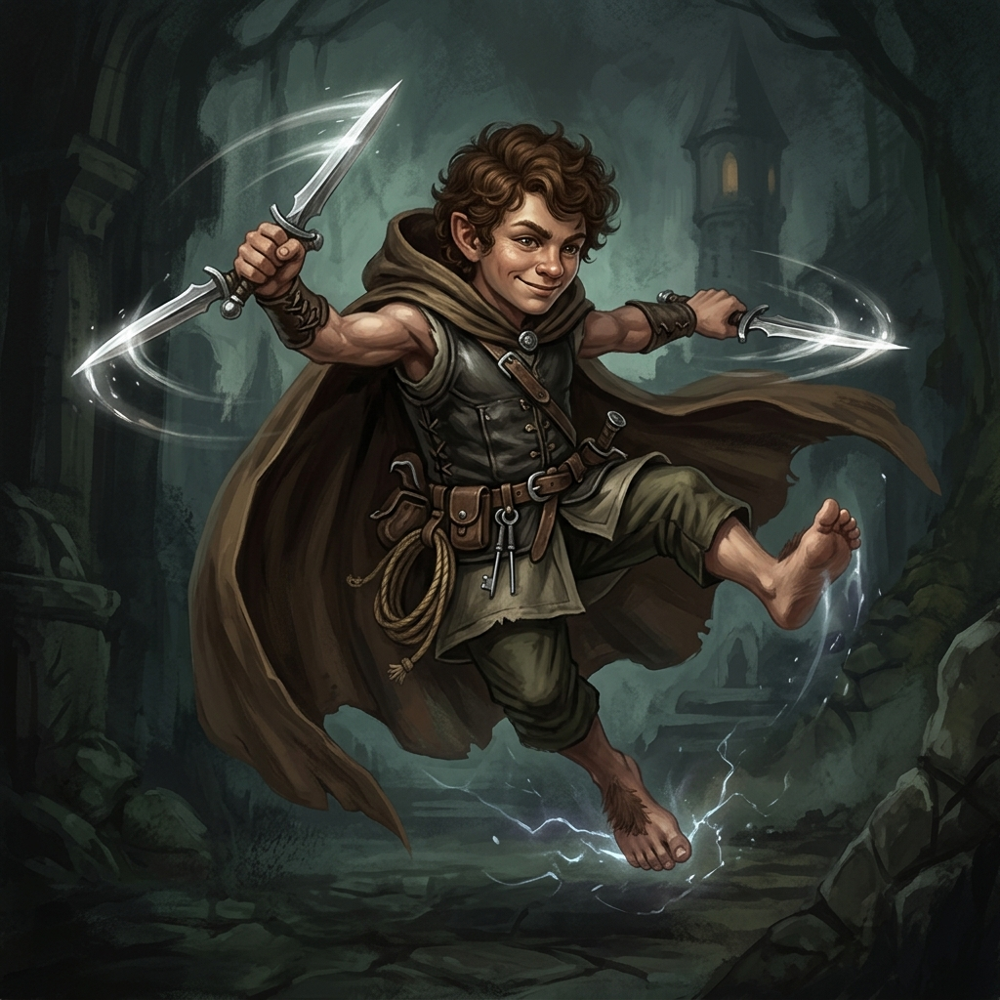

# Pip, o Truque Rápido

## 📜 1. História & Origem
Pip nunca gostou da calmaria dos vilarejos pacatos dos Metadílios. Fascinado por relíquias brilhantes e lendas de tesouros perdidos, ele se infiltrou nas masmorras armado apenas com um par de adagas leves e seus pés descalços hiperextensíveis. Ninguém é mais rápido que Pip, e nenhum guarda de masmorra jamais conseguiu colocar as mãos nele.

---

## 👤 2. Ficha do Personagem
* **Raça:** Metadílio
* **Classe Base:** Ladino
* **Subclasse (Nv 15):** Sombra
* **Papel Tático:** DPS Melee de Esquiva Extrema & Facada nas Costas
* **Posição Recomendada na Formação:** Meio ou Frente

---

## 🧬 3. Atributos Raciais
* **Passiva Racial (Pés Ligeiros):** Não equipa botas, mas possui $+15\%$ de Esquiva base e $+10\%$ de Velocidade de Movimento permanente.
* **Habilidade Racial Ativa (Pique de Adrenalina - CD 40s):** Concede $+50\%$ de Velocidade de Ataque e $+30\%$ de Esquiva adicional por 5 segundos.

---

## 🪄 4. Habilidades Recomendadas (Build de 3 Skills)
1. **[Reflexos Rápidos](../../../04_skills/ladino/reflexos_rapidos.md):** Aumenta a chance de esquivar de ataques físicos e mágicos.
2. **[Facada nas Costas](../../../04_skills/ladino/sombra/facada_nas_costas.md):** Desfere um golpe furtivo devastador por trás, causando 250% de dano crítico.
3. **[Passo Furtivo](../../../04_skills/ladino/sombra/passo_furtivo.md):** Fica invisível ao esquivar de um golpe, reposicionando-se nas costas do monstro.

---

## 🎒 5. Equipamentos & Consumíveis Recomendados
* **Slot 1 (Arma):** Adagas Leves Duplas *(ex: Par de Adagas de Bandido ou Lâminas da Lua Sangrenta)*.
* **Slot 2 (Armadura):** Armadura Média de Couro Leve *(ex: Traje das Sombras)*.
* **Slot 3 (Acessório):** Amuleto de Esquiva / Crítico *(ex: Anel da Vitalidade Básica)*.
* **Consumíveis:** *Anel do Frenesi Veloz* e *Poção de Vida Menor*.

---

## ⚔️ 6. Guia Estratégico & Sinergias
* **Estilo de Jogo:** Pip dança ao redor dos monstros, anulando dano através de esquiva (100% de dano zerado) e desferindo facadas críticas constantes.
* **Sinergias no Trio:**
  * **Com Alistair (Tank Paladino):** Alistair segura a atenção frontal enquanto Pip executa golpes mortais por trás.
  * **Com Milo (Bardo):** A aceleração sônica de Milo faz com que Pip desfira mais de 2.5 golpes por segundo.
* **Ponto de Atenção:** Ataques mágicos em área que não podem ser esquivados representam o maior perigo para Pip.
