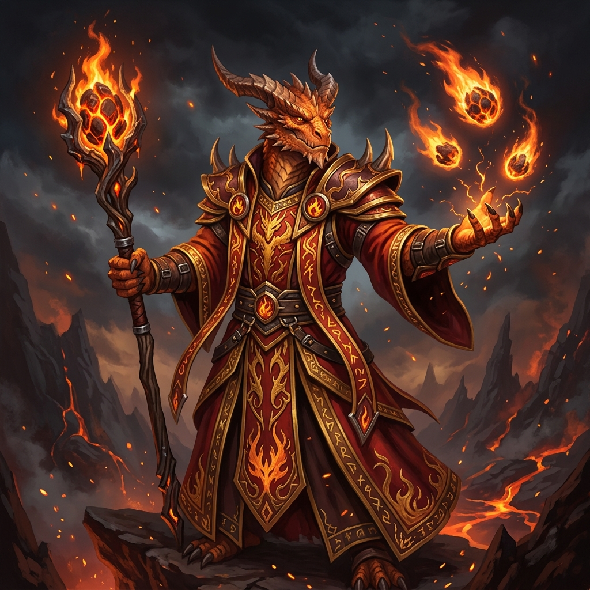

# Valtrak, a Chama Primordial

## 📜 1. História & Origem
Descendente direto da linhagem dos Dragões de Magma de Gor-Thar, Valtrak nasceu com o fogo fluindo em suas veias no lugar de sangue comum. Desde jovem, ele descobriu que suas escamas canalizavam a mana em forma de chamas arcanas muito superiores aos feitiços de magos comuns. Fascinado pelos mistérios arcanos sepultados nas masmorras, ele queima tudo o que se coloca em seu caminho.

---

## 👤 2. Ficha do Personagem
* **Raça:** Meio-Dragão
* **Classe Base:** Mago
* **Subclasse (Nv 15):** Elementalista
* **Papel Tático:** DPS Mágico de Área (AoE) / Destruição em Massa
* **Posição Recomendada na Formação:** Trás (Retaguarda)

---

## 🧬 3. Atributos Raciais
* **Passiva Racial (Resistência Vulcânica):** Imunidade a dano de Queimadura e $+10\%$ de dano mágico em feitiços de Fogo.
* **Habilidade Racial Ativa (Sopro de Magma - CD 50s):** Dispara uma torrente de lava que queima o chão em linha reta por 5 segundos, causando 200 de dano e incinerando defesas.

---

## 🪄 4. Habilidades Recomendadas (Build de 3 Skills)
1. **[Bola de Fogo](docs/idea/04_skills/mago/bola_de_fogo.md):** Projétil que explode no impacto, causando dano massivo em raio circular de 2 tiles.
2. **[Pilar de Fogo](docs/idea/04_skills/mago/elementalista/pilar_de_fogo.md):** Erupção ígnea sob os pés do maior grupo de monstros, causando 220% de dano mágico.
3. **[Chuva de Meteoros](docs/idea/04_skills/mago/chuva_de_meteoros.md):** Invoca múltiplos meteoros que devastam toda a arena do combate.

---

## 🎒 5. Equipamentos & Consumíveis Recomendados
* **Slot 1 (Arma):** Cajado Grande de Fogo *(ex: Cajado da Centelha Flamejante ou Cajado das Chamas Negras)*.
* **Slot 2 (Armadura):** Armadura Leve de Mago *(ex: Túnica das Brasas Místicas)*.
* **Slot 3 (Acessório):** Orbe Mágico ou Tomo *(ex: Orbe do Apocalipse Solar ou Tomo da Conjunção Dupla)*.
* **Consumíveis:** *Poção de Mana Concentrada* e *Frasco de Fogo Alquímico*.

---

## ⚔️ 6. Guia Estratégico & Sinergias
* **Estilo de Jogo:** Valtrak é o ápice do dano em área. Em masmorras com grandes hordas de monstros, ele é capaz de aniquilar salas inteiras em poucos segundos.
* **Sinergias no Trio:**
  * **Com Bromm (Tank Baluarte):** Bromm segura todos os monstros agrupados no mesmo ponto para os meteoros de Valtrak.
  * **Com Beatrice (Sacerdote):** Beatrice fornece a regeneração e proteção necessárias para que Valtrak conjure suas magias sem interrupção.
* **Ponto de Atenção:** Altíssimo consumo de mana; sem poções ou itens de recuperação de mana, ele pode ficar sem recursos no meio da luta contra o Chefe.
