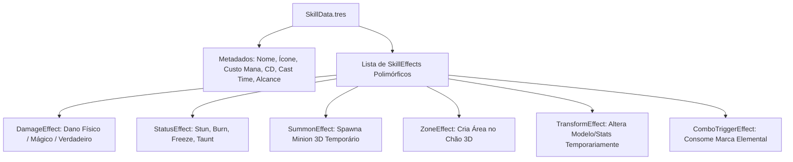
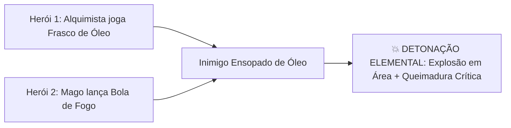

# 🪄 Guia de Criação de Novas Skills, Efeitos & Sinergias (Pós-Lançamento)

Este documento define o framework de engenharia e game design para criação de novas habilidades, novos nós de efeitos polimórficos (`SkillEffect`), sistemas de combos elementais e controle de grupo (CC) em **Autodungeon**.

---

## 🧩 1. Arquitetura Polimórfica de Efeitos (`SkillEffect`)

Toda habilidade em Autodungeon é composta por um container de dados (`SkillData.tres`) que agrega um ou mais recursos polimórficos de efeitos (`SkillEffect.tres`). Isso permite combinar múltiplos comportamentos em uma única magia sem duplicar código.



---

## ⚡ 2. Matriz de Efeitos de Status & Controle de Grupo (CC)

Para que novas raças, classes e heróis ofereçam opções táticas diversificadas, o sistema de combate suporta a seguinte matriz padronizada de efeitos de status:

| Efeito de Status | Tipo | Impacto no Alvo | Duração Típica |
| :--- | :---: | :--- | :---: |
| **Atordoamento (Stun)** | Hard CC | Interrompe qualquer ação e impede movimento, ataques e conjuração. | 1.0s – 2.5s |
| **Congelamento (Freeze)** | Hard CC | O alvo fica paralisado em gelo. Se sofrer golpe pesado físico, sofre *Estilhaço* ($+50\%$ dano). | 2.0s – 3.0s |
| **Silêncio (Silence)** | Soft CC | O alvo pode andar e desferir ataques básicos, mas não pode conjurar habilidades mágicas. | 3.0s – 5.0s |
| **Enraizamento (Root)** | Soft CC | O alvo não pode se mover, mas pode atacar e conjurar magias em alcance. | 2.0s – 4.0s |
| **Provocação (Taunt)** | Tático | Força o alvo a focar seus ataques exclusivamente no conjurador (essencial para Tanques). | 3.0s – 6.0s |
| **Queimadura (Burn)** | DoT | Dano de fogo contínuo a cada 1s. Interage com *Óleo* para gerar explosão. | 3.0s – 6.0s |
| **Sangramento (Bleed)** | DoT | Dano físico contínuo que dobra se o alvo estiver se movimentando. | 4.0s – 8.0s |
| **Veneno (Poison)** | DoT | Dano de natureza que reduz a taxa de cura recebida pelo alvo em $30\%$. | 5.0s – 10.0s |
| **Vulnerabilidade** | Debuff | Aumenta todo o dano recebido pelo alvo em $+15\%$ a $+30\%$. | 4.0s – 6.0s |

---

## 🧪 3. Sistema de Combos & Sinergias Elementais

A partir das expansões pós-lançamento, certas habilidades aplicam **Marcas Elementais** que podem ser detonadas ou combinadas por habilidades de outros heróis do trio:



### 3.1. Tabela de Interações de Combo Elemental

| Estado 1 (Aplicador) | Estado 2 (Gatilhador) | Resultado do Combo Elemental |
| :--- | :--- | :--- |
| **Óleo (Oil)** | **Fogo (Fire)** | **Incêndio Devastador:** Dano imediato em área de 3m e queima estendida por 8s. |
| **Molhado (Wet)** | **Raio / Eletricidade** | **Choque em Cadeia:** O raio ricocheteia para até 4 monstros adicionais com crítico garantido. |
| **Congelado (Frozen)** | **Golpe Pesado Físico (2H)** | **Estilhaço Glacial:** Quebra o gelo causando $150\%$ de dano e cegando monstros ao redor. |
| **Veneno (Poison)** | **Peste / Sombra** | **Erupção Tóxica:** Libera uma nuvem fétida que propaga o veneno para todos os monstros da sala. |

---

## ⚖️ 4. Fórmulas de Orçamento & Balanceamento de Skills

Para manter o jogo balanceado ao introduzir dezenas de novas habilidades, todo designer deve seguir a **Fórmula de Orçamento de Dano**:

$$\text{Poder da Skill} = \frac{\text{Multiplicador de Dano}}{\text{Tempo de Recarga (CD)}} \times \text{Modificador de Área (AoE)}$$

### 4.1. Regras de Calibração:
1. **Dano em Alvo Único (Single Target):**
   * Multiplicador: $150\%$ a $300\%$ do atributo base.
   * Tempo de Recarga: 4s a 8s.
2. **Dano em Área (AoE):**
   * Multiplicador: $80\%$ a $150\%$ do atributo base.
   * Modificador de Área: Divide o dano por $\sqrt{\text{Número Médio de Alvos}}$ para evitar que AoEs matem salas instantaneamente.
   * Tempo de Recarga: 8s a 16s.
3. **Golpes Supremos / Longo CD (Ultimates Raciais ou de Subclasse):**
   * Multiplicador: $350\%$ a $600\%$ do atributo base ou efeito que muda a batalha (ex: invulnerabilidade temporária, cura em massa, stun total).
   * Tempo de Recarga: 45s a 90s.

---

## 📝 5. Template para Documentar Novas Habilidades

```markdown
# Habilidade: [Nome da Habilidade]

## 📌 1. Identificação
* **Classe / Origem:** (Ex: Monge / Andarilho dos Ventos)
* **Tipo:** (Ativa / Passiva / Racial / Subclasse)
* **Alvo:** (Inimigo Único / Inimigo AoE / Aliado / Todos Aliados / Auto-conjurada)

## 📊 2. Atributos & Custos
* **Custo de Mana / Chi:** X
* **Tempo de Recarga (CD):** Xs
* **Tempo de Conjuração (Cast Time):** Xs
* **Alcance:** X metros (3D)
* **Raio de AoE:** X metros

## 🪄 3. Efeitos & Mecânicas
* **Dano / Cura Base:** X (+Y% de [Atributo])
* **Efeitos Adicionais:** (Stun, DoT, Buff, Debuff)
* **Interação Elemental:** (Aplica ou detona qual elemento)

## 🤖 4. Lógica de Disparo da IA
* Quando a IA do herói autônomo deve acionar esta habilidade? (Ex: Prioridade 1 se HP do Tanque < 50%, ou se houver >= 3 inimigos agrupados).
```

---

## 🔗 Navegação
* [Compêndio Geral de Habilidades](../00_indice.md#🪄-04-compêndio-de-habilidades--skills)
* [Guia de Criação de Novas Classes](../03_classes/guia_criacao_novas_classes.md)
* [Pipeline de Criação de Novos Heróis](../03_classes/herois_unicos/guia_pipeline_novos_herois.md)
* [Arquitetura de Combate & Habilidades](../../projeto/05_sistema_combate_e_habilidades.md)
