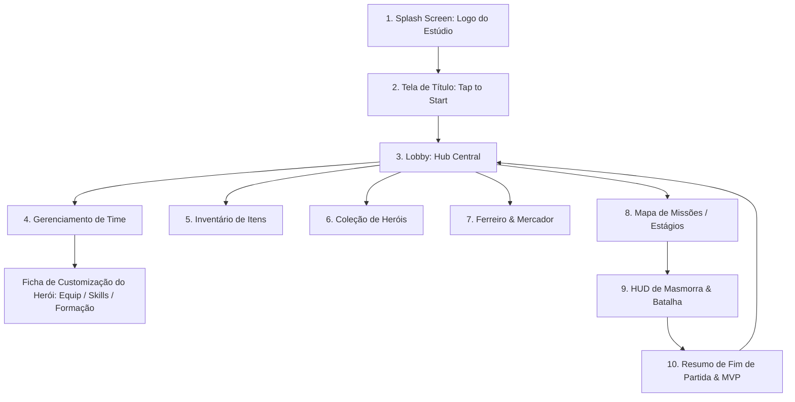

# Telas, Fluxo de Navegação & UI — Autodungeon

Este documento define a arquitetura de telas, mapa de navegação (User Flow) e a experiência de usuário (UI/UX) de **Autodungeon**.

---

## 1. Fluxo Geral de Navegação (User Flow)



---

## 2. Telas Iniciais & Entrada

### 🎮 1. Splash Screen
* Exibe a logo animada do estúdio de desenvolvimento.
* Duração: 2 segundos ou toque na tela para pular imediatamente.

### ⚔️ 2. Tela de Título (Title Screen)
* Exibe a arte principal do mundo de **Autodungeon** e a logo oficial do jogo.
* Música tema imersiva de fantasia épica.
* Botão/Aviso no centro inferior: *"Toque em qualquer lugar para Iniciar"*.
* Ao tocar na tela, transiciona com fade suave para o **Lobby**.

---

## 3. O Lobby (Hub Central de Comando)

O Lobby é a tela principal de navegação do jogador fora das masmorras.

```
+-------------------------------------------------------------+
| [Nível da Conta: 15]      [🪙 Ouro: 12.450]     [⚙️ Opções] |
+-------------------------------------------------------------+
|                                                             |
|           [ VISUAL DOS 3 HERÓIS EQUIPADOS ]                 |
|                                                             |
+-------------------------------------------------------------+
| [👥 Time]  [🎒 Inventário]  [🧬 Heróis]  [⚒️ Loja]  [🗺️ MISSÕES] |
+-------------------------------------------------------------+
```

* **Barra Superior:** Exibe o nível da conta, quantidade de Ouro e botão de Configurações/Áudio.
* **Área Central:** Exibe os 3 modelos/sprites dos heróis atualmente alocados na equipe com seus equipamentos visíveis.
* **Barra de Navegação Inferior:**
  * **Time:** Abre a tela de Gerenciamento de Equipe e Ficha dos Heróis.
  * **Inventário:** Abre a bolsa de equipamentos e consumíveis.
  * **Heróis:** Abre a coleção com todos os heróis recrutados.
  * **Ferreiro & Mercador:** Instalações para aprimoramento de itens e compra de suprimentos.
  * **MISSÕES (Destaque):** Botão principal de ação para selecionar o estágio e partir para a masmorra.

---

## 4. Tela de Gerenciamento de Time & Ficha de Customização

### 👥 Visão do Time Ativo
* Exibe **3 Slots de Heróis** (Slot 1: Vanguarda, Slot 2: Meio, Slot 3: Retaguarda).
* **Slot Vazio:** Exibe o botão `[ + Adicionar Herói ]`, abrindo a Coleção para alocar um novo personagem.
* **Slot Ocupado:** Exibe o herói com nome, nível, classe e raça. Clicar no herói abre a sua **Ficha de Customização**.

### 🛠️ Ficha de Customização do Herói (Abas Inferiores)
Ao abrir a ficha de um herói específico, a tela divide-se em 3 sub-abas navegáveis na parte inferior:

#### Sub-aba 1: Equipamentos & Consumíveis
* **3 Slots de Equipamento:**
  * *Slot 1 (Arma):* Mostra a arma equipada (1H ou 2H).
  * *Slot 2 (Armadura):* Mostra a armadura equipada (Leve, Média ou Pesada).
  * *Slot 3 (Acessório/Escudo):* Permite equipar Escudos (Guerreiros/Subclasses) ou Acessórios. Fica restrito para escudos se a arma for de 2 mãos.
* **2 Slots de Consumíveis:** Mostra os itens/poções equipados (2º slot bloqueado se o herói tiver menos de 20% do Level Cap / Nível 6).

#### Sub-aba 2: Habilidades Ativas (Drag & Drop)
* **3 Slots Ativos:** Caixas destacadas onde o jogador aloca as 3 habilidades que o herói usará na batalha.
* **Repertório de Habilidades (Pool):** Exibe as **6 habilidades da classe base** (ou **9 habilidades** se a subclasse estiver desbloqueada no Nível 15).
* **Mecânica de Arrastar e Soltar (Drag & Drop):** O jogador toca, segura e arrasta a habilidade desejada para o slot ativo correspondente.

#### Sub-aba 3: Formação & Prioridades Táticas
* **Posição na Marcha:** Botões de alternância direta: `[ Frente ]` | `[ Meio ]` | `[ Trás ]`.
* **Prioridades de Suporte/Cura (se for classe de cura):** Lista reordenável de 1º a 4º lugar de foco de magias.

---

## 5. Tela de Inventário de Itens

* **Capacidade da Bolsa:** Inicia com **40 slots** de capacidade máxima.
* **Expansão de Espaço:** Botão `[ + 5 Slots ]` permitindo expandir a bolsa mediante custo progressivo de Ouro.
* **Filtros Rápidos:** Abas de categoria: `[ Todos ]`, `[ Armas ]`, `[ Armaduras ]`, `[ Escudos/Acessórios ]`, `[ Consumíveis ]`.
* **Informações do Item Selecionado:** Painel lateral exibindo nome, nível requerido, raridade, atributos e descrição do efeito.
* **Botão de Descarte (Destruição Pura):** Permite apagar itens obsoletos para liberar espaço na bolsa imediatamente.

---

## 6. Tela de Missões & Mapa de Estágios

```
+-------------------------------------------------------------+
| < Voltar ao Lobby       ESTÁGIO 1: FLORESTA SOMBRIA         |
+-------------------------------------------------------------+
|                                                             |
|  [Fase 1] -> [Fase 2] -> [Fase 3] ... -> [Fase 10: CHEFE]   |
|   (Concl)     (Concl)     (Atual)          (Bloqueado)      |
|                                                             |
+-------------------------------------------------------------+
| Recompensas Possíveis: [Ouro, Equipamentos Nível 1-5]       |
|                                     [ ENTRAR NA MASMORRA ]  |
+-------------------------------------------------------------+
```

* **Seleção de Bioma / Estágio:** Menu carrossel com os mundos (Floresta Sombria, Galerias Subterrâneas, Cripta Ancestral, etc.).
* **As 10 Fases por Estágio:**
  * Fases numeradas de **1 a 10**.
  * Progressão estritamente linear (completar a Fase 1 libera a Fase 2, e assim por diante).
  * **Fase 10 (Grande Chefe):** Encerra o bioma e, ao ser derrotada, desbloqueia o próximo Estágio.
* **Botão "Entrar na Masmorra":** Inicia o carregamento da fase e transfere o jogador para a tela de **HUD de Batalha**.
