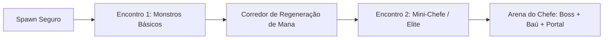

# Nível de Testes Graybox & Blueprint Arquitetônico — Autodungeon

Este documento define a planta arquitetônica, as métricas espaciais de grid e a lógica de composição do mapa de testes em **Graybox** de **Autodungeon**, servindo como o modelo padrão para a construção de todos os níveis fixos do jogo.

---

## 1. Objetivo do Mapa Graybox
O mapa de testes em Graybox serve para calibrar e validar em conjunto todos os sistemas do jogo:
* Navegação autônoma em 3 trajetos (Paths 1, 2 e 3).
* Coesão de equipe e velocidade de marcha.
* Dinâmica de combate por primeiro golpe aterrissado e kiting de arqueiros/magos.
* Inteligência artificial de monstros normais, assassinos, elites e chefes.
* Regeneração de recursos nos corredores e transição para o baú e portal de extração.

---

## 2. Métricas Espaciais & Grid 2D Top-Down

```
+---------------------------------------------------------------------------------+
|                                 MAPA GRAYBOX                                    |
|                                                                                 |
|  [ SALA 0: SPAWN ] ---> === [ CORREDOR 1 ] ===> [ SALA 1: MOBS MISTOS ]        |
|     (8x8 tiles)            (3x8 tiles)                 (12x10 tiles)            |
|                                                              |                  |
|                                                              v                  |
|                                                    === [ CORREDOR 2 ] ===       |
|                                                          (3x8 tiles)            |
|                                                              |                  |
|                                                              v                  |
|  [ SALA 3: ARENA DO CHEFE ] <=== [ CORREDOR 3 ] <=== [ SALA 2: MINI-CHEFE ]    |
|        (20x16 tiles)                 (3x8 tiles)              (12x10 tiles)     |
|   (Boss + Baú + Portal)                                (Elite com Aura)         |
+---------------------------------------------------------------------------------+
```

| Elemento do Mapa | Dimensões em Grid | Propósito Funcional |
| :--- | :---: | :--- |
| **Corredores** | **3 a 4 tiles de largura**<br>*(6 a 8 tiles de comprimento)* | Permite que os 3 heróis marchem sem engarrafamento e garante tempo para a **regeneração contínua de mana** fora de combate. |
| **Salas Comuns** | **12x10 tiles** | Espaço suficiente para o Tanque travar a frente e as classes frágeis recuarem (kiting) com segurança. |
| **Arena do Chefe** | **20x16 tiles** | Espaço amplo para acomodar marcações de ataques telegrafados, recuo dos heróis, o Baú e o Portal. |

---

## 3. Composição dos 4 Estágios de Teste

### 🟢 Estágio 0: Sala de Spawn (Entrada Segura)
* **Tamanho:** $8\times 8$ tiles.
* **Inimigos:** 0 (Área 100% segura).
* **O que testa:**
  * Ponto de largada inicial dos 3 heróis.
  * Formação de marcha (Tanque na frente, Meio, Retaguarda).
  * Inicialização do cronômetro de masmorra no HUD.
  * Calibração do raio de tethering e diferenças de velocidade de movimento.

---

### ⚔️ Estágio 1: Sala de Monstros Mistos (Combate Padrão)
* **Tamanho:** $12\times 10$ tiles.
* **Composição do Pack (4 Monstros):**
  * 2x *Brutos Melee* (Linha de frente).
  * 1x *Atirador Ranged* (Retaguarda).
  * 1x *Curandeiro Inimigo* (Retaguarda).
* **O que testa:**
  * Gatilho de combate no primeiro impacto.
  * Tanque avançando e gerando o primeiro aggro.
  * Arqueiro/Mago do time mantendo distância máxima e executando recuo tático (kiting).
  * Habilidades de assassino do time (Ladino) priorizando neutralizar o curandeiro inimigo.
  * Sistema de prioridades de cura do Sacerdote (Tanque vs heróis feridos).

---

### 💀 Estágio 2: Sala do Mini-Chefe (Monstro Elite com Aura)
* **Tamanho:** $12\times 10$ tiles.
* **Composição do Pack (3 Monstros):**
  * 1x *Monstro Elite* (com *Aura Vampírica* ou *Aura de Espinhos* e $2\times\text{HP}$).
  * 2x *Guardiões com Escudo* (protegendo o Elite).
* **O que testa:**
  * Dano absorvido e reflexão de status da aura do Elite.
  * Uso inteligente de consumíveis da equipe (poções e bombas).
  * **Queda da Aura:** Validação de que ao derrotar o Elite primeiro, os outros monstros perdem a aura e voltam ao status comum.

---

### 👑 Estágio 3: Arena do Chefe Final (Boss, Baú & Portal)
* **Tamanho:** $20\times 16$ tiles (Arena Fechada).
* **Composição:** 1x *Chefe da Masmorra* + 1x *Baú Dourado* + 1x *Portal Mágico*.
* **O que testa:**
  * **Trancamento da Sala:** Portão fechando ao engajar o chefe.
  * **Loop de Ataques Telegrafados:** Chefe carregando zonas vermelhas no chão (1.5s a 2.5s) e reação da IA dos heróis (retaguarda se esquivando e tanque ativando escudos).
  * **Transição de Fase:** Fase 1 (100% a 50% HP) → Fase 2 com novas habilidades.
  * **Golpe Supremo (10% HP):** Disparo único da habilidade devastadora de desespero do boss.
  * **Path 2 (Marcha da Vitória):** Heróis caminhando automaticamente até o baú após o boss morrer para coletar os espólios.
  * **Path 3 (Extração):** Heróis caminhando até o portal recém-aberto para encerrar a masmorra e abrir o Resumo com o ranking de MVP.

---

## 4. Blueprint Construtivo para Níveis Futuros

Todos os níveis dos biomas (Fases 1 a 10 de cada estágio) seguirão esta mesma estrutura modular:



1. **Início:** Sempre uma sala segura de Spawn.
2. **Progressão:** 2 a 4 salas de encontros conectadas por corredores de 6 a 8 tiles (tempo de mana regen).
3. **Clímax:** Sempre uma Arena Fechada terminando com a sequência Boss → Baú → Portal.
