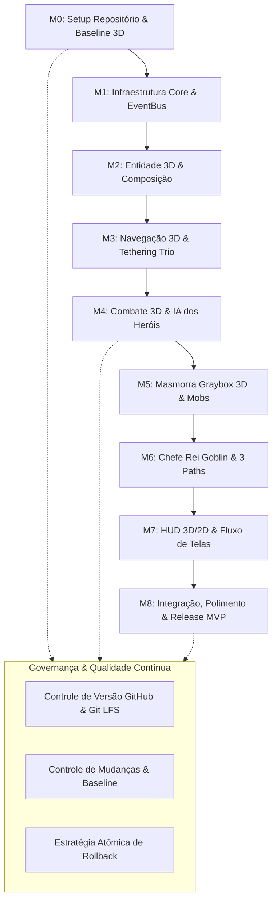

# 📋 Índice Geral de Planejamento — Autodungeon (Godot 4.7+ 3D)

Este diretório contém o planejamento estratégico, metodológico e de engenharia de software para o desenvolvimento iterativo do **MVP de Autodungeon** em ambiente **3D na Godot Engine 4.7+**, estruturado em marcos com controle rigoroso de configurações, versões e mudanças via **GitHub**.

---

## 🗺️ Mapa de Navegação do Planejamento

```text
📁 docs/planejamento/
│
├── 📄 00_indice_planejamento.md              <- [Você está aqui] Visão Geral e Mapa
├── 📄 01_visao_mvp_e_marcos.md                <- Os 9 Marcos de Desenvolvimento (M0 a M8)
├── 📄 02_gestao_configuracao_e_github.md      <- Git Flow, Git LFS, Conventional Commits e Rollback
├── 📄 03_controle_mudancas_e_rastreabilidade.md <- Processo de Change Requests, Baseline e Changelog
└── 📄 04_cronograma_e_cadencia.md             <- Cronograma por Marcos, Dependências e DoD
```

---

## 🧭 Resumo dos Módulos de Planejamento

| Documento | Foco Principal | Principais Diretrizes |
| :--- | :--- | :--- |
| **[01. Visão do MVP & Marcos](01_visao_mvp_e_marcos.md)** | Definição dos 9 Marcos estratégicos do MVP 3D. | *M0 a M8, entregáveis funcionais, escopo 3D e critérios de aceitação sem divisão de tarefas.* |
| **[02. Gestão de Configuração & GitHub](02_gestao_configuracao_e_github.md)** | Controle de versão, integridade de assets e rollback. | *Trunk-Based / Feature Branches, Git LFS (.glb/.png/.ogg), Conventional Commits, Tags e Revert.* |
| **[03. Controle de Mudanças & Rastreabilidade](03_controle_mudancas_e_rastreabilidade.md)** | Governança de escopo e histórico de evolução. | *Change Request Workflow, SemVer 2.0, CHANGELOG.md e Matriz GDD $\rightarrow$ Arquitetura $\rightarrow$ Marco.* |
| **[04. Cronograma & Cadência](04_cronograma_e_cadencia.md)** | Cronograma iterativo e matriz de dependências. | *Sequenciamento lógico, checkpoints de validação e Definition of Done (DoD).* |

---

## 🔄 Fluxo de Desenvolvimento Iterativo do MVP



---

## 🔗 Referências Cruzadas
* [Documento de Escopo & Pitch do MVP](../../01_Pitch_MVP.md)
* [Índice Geral da Arquitetura Técnica](../projeto/00_indice_arquitetura.md)
* [Índice Geral do Game Design (GDD)](../00_indice.md)
