# 🎯 01. Visão do MVP & Definição dos Marcos (3D Godot 4.7+)

Este documento estabelece o roadmap funcional do **MVP de Autodungeon** adaptado para a **Godot Engine 4.7+ em ambiente 3D**, dividindo o projeto em **9 Marcos Estratégicos (Milestones M0 a M8)** com foco em entregáveis funcionais e critérios de aceitação objetivos, sem micro-tarefas prematuras.

---

## 📐 1. Diretrizes Técnicas do Ambiente 3D (Godot 4.7+)

O desenvolvimento no espaço tridimensional mantém os princípios da arquitetura de [`docs/projeto/`](../projeto/00_indice_arquitetura.md), com as seguintes especializações de nós 3D:

| Componente Arquitetural | Implementação 3D (Godot 4.7+) | Responsabilidade |
| :--- | :--- | :--- |
| **Entidade Raiz** | `CharacterBody3D` | Colisão cilíndrica/cápsula e movimentação física no plano XZ. |
| **Navegação & Pathfinding** | `NavigationRegion3D` & `NavigationAgent3D` | Geração de NavMesh 3D e cálculo de caminho contínuo. |
| **Combate & Áreas** | `Area3D` (`Hitbox3D` / `Hurtbox3D`) | Detecção de acerto e disparo de colisores de ataque. |
| **Câmera** | `Camera3D` Top-Down Isométrica | Câmera posicionada em $45^\circ$ com SpringArm3D ou Offset suave seguindo o líder do grupo. |
| **Telegrafia de Boss** | `Decal` / `MeshInstance3D` com Shader 3D | Desenho da área de aviso vermelha no chão tridimensional. |
| **Interface (HUD)** | `CanvasLayer` (2D Overlay) | Renderização desacoplada de barras de vida, retratos e botões sobre o Viewport 3D. |

---

## 🚩 2. Os 9 Marcos de Desenvolvimento (Milestones M0 a M8)

```mermaid
graph LR
    subgraph Fase_Fundacao [Fase 1: Fundação]
        M0[M0: Setup & Baseline 3D]
        M1[M1: Infraestrutura Core]
        M2[M2: Entidade 3D Base]
    end

    subgraph Fase_Gameplay [Fase 2: Gameplay Core]
        M3[M3: Navegação 3D & Trio]
        M4[M4: Combate 3D & IA Heróis]
        M5[M5: Masmorra Graybox & Mobs]
    end

    subgraph Fase_Encerramento [Fase 3: Boss, UI & Release]
        M6[M6: Boss Rei Goblin & 3 Paths]
        M7[M7: HUD 3D/2D & Fluxo]
        M8[M8: Validação & Release MVP]
    end

    M0 --> M1 --> M2 --> M3 --> M4 --> M5 --> M6 --> M7 --> M8
```

---

### 📍 Marco 0 (M0): Setup do Repositório & Baseline Godot 4.7+ 3D
* **Objetivo:** Estabelecer o repositório no GitHub com governança de branches, Git LFS para arquivos binários/3D, `.gitignore` da Godot e cena 3D inicial de teste.
* **Escopo:**
  * Estrutura de diretórios `res://` conforme [`02_estrutura_diretorios_convencoes.md`](../projeto/02_estrutura_diretorios_convencoes.md).
  * Configuração do `.gitattributes` (Git LFS) e `.gitignore`.
  * Cena base 3D com `WorldEnvironment`, `DirectionalLight3D`, chão teste e `Camera3D` Top-Down.
* **Critérios de Aceitação:**
  1. Projeto abre na Godot 4.7+ sem erros ou warnings no Output.
  2. Git LFS rastreia extensões 3D (`.glb`, `.gltf`, `.blend`, `.png`, `.wav`).
  3. Tag de baseline `v0.1.0-m0-setup` criada no repositório.

---

### 📍 Marco 1 (M1): Infraestrutura Core & Camada de Dados
* **Objetivo:** Implementar os Singletons globais, barramento de eventos e classes de recursos de dados (`Custom Resources`).
* **Escopo:**
  * `EventBus.gd` (Autoload) com os sinais de combate, masmorra e itens.
  * `GameManager.gd` com máquina de estados de alto nível da aplicação.
  * Estrutura de `HeroData.gd`, `SkillData.gd`, `SkillEffect.gd`, `ItemData.gd`, `EnemyData.gd`.
  * Sistema de `NodePool` genérico para reciclagem de instâncias.
* **Critérios de Aceitação:**
  1. Custom Resources instanciáveis e editáveis via Inspector.
  2. Sinais do `EventBus` testados e disparados sem acoplamento direto.
  3. Tag `v0.1.0-m1-core` gerada.

---

### 📍 Marco 2 (M2): Entidade 3D Base & Composição de Nós
* **Objetivo:** Construir o prefab `CharacterEntity.tscn` em 3D utilizando composição de nós desacoplados.
* **Escopo:**
  * `CharacterBody3D` com colisão em cápsula.
  * `StatsComponent`, `HealthComponent` (com regeneração contínua de mana fora de combate).
  * `Hitbox3D` e `Hurtbox3D` com detecção de colisão física e cálculo de mitigação linear (cap de 80).
  * `StateMachine` (FSM) base integrada.
* **Critérios de Aceitação:**
  1. Entidade 3D sofre dano, mitiga conforme armadura e emite sinal de morte (`died`) ao zerar HP.
  2. Mana se regenera a 5% a cada 2s quando fora de combate.
  3. Tag `v0.1.0-m2-entity3d` gerada.

---

### 📍 Marco 3 (M3): Navegação 3D, Formação & Tethering do Trio
* **Objetivo:** Implementar a locomoção autônoma dos 3 heróis do MVP (*Bromm*, *Elysia*, *Beatrice*) em um `NavigationRegion3D` com mola de tethering elástico.
* **Escopo:**
  * `NavigationAgent3D` integrado ao `MovementComponent`.
  * `PartyFormationController`: Tanque na vanguarda dita o caminho; Suporte no meio e DPS atrás.
  * Algoritmo de ajuste de velocidade elástica (desaceleração do líder se a retaguarda se afastar mais de 90px).
  * Reajuste dinâmico de papéis em caso de morte de 1 herói.
* **Critérios de Aceitação:**
  1. Os 3 heróis marcham juntos seguindo Waypoints 3D sem se separarem ou prenderem nas paredes.
  2. Se o herói mais rápido tentar ultrapassar o limite, ele desacelera mantendo a coesão.
  3. Tag `v0.1.0-m3-navigation3d` gerada.

---

### 📍 Marco 4 (M4): Combate 3D, Gatilho por Impacto & IA dos 3 Heróis
* **Objetivo:** Implementar as 3 IAs táticas distintas dos heróis e o gatilho de combate por primeiro impacto físico.
* **Escopo:**
  * Transição instantânea Marcha $\rightarrow$ Batalha no momento em que o primeiro golpe colide.
  * **Bromm (Tanque):** Avança no mob mais próximo, usa *Investida* e *Postura Defensiva*, gerando aggro via `ThreatTable`.
  * **Elysia (DPS Ranged):** Mantém distância segura ($180\text{px}$), executa kiting se aproximada, usa *Tiro Certeiro* e *Chuva de Flechas*.
  * **Beatrice (Suporte):** Retaguarda segura, avalia árvore de prioridades (1. Tanque $<80\%$, 2. Emergência $<40\%$, 3. Autocura) e usa *Cura Rápida* e *Escudo de Fé*.
* **Critérios de Aceitação:**
  1. Nenhum herói da retaguarda ataca antes do primeiro contato físico do combate.
  2. Beatrice prioriza curar o Tanque e salva aliados em estado crítico.
  3. Elysia recua de inimigos que se aproximam (kiting).
  4. Tag `v0.1.0-m4-combat-ai` gerada.

---

### 📍 Marco 5 (M5): Masmorra Graybox 3D, Encontros & Mini-Chefe
* **Objetivo:** Construir o nível Graybox 3D completo do MVP conforme especificado no GDD (`dungeon_graybox.md`).
* **Escopo:**
  * **Sala 0:** Spawn seguro da equipe.
  * **Sala 1 (Encontro Básico):** 2 Goblins Guerreiros + 1 Goblin Arqueiro.
  * **Corredor de Transição:** Teste de curvas de NavMesh 3D e regeneração contínua de mana.
  * **Sala 2 (Mini-Chefe):** 1 Capitão Goblin Elite (com *Aura de Fúria Tribal*) + 1 Goblin Curandeiro.
  * Limpeza de encontro $\rightarrow$ retomada automática da marcha de travessia.
* **Critérios de Aceitação:**
  1. A equipe derrota os monstros da Sala 1, reagrupa-se, recupera mana no corredor e engaja na Sala 2.
  2. Morte do Capitão Goblin encerra a aura de fúria nos aliados.
  3. Tag `v0.1.0-m5-graybox-encounters` gerada.

---

### 📍 Marco 6 (M6): Arena do Chefe Rei Goblin, Telegrafia 3D & Os 3 Paths
* **Objetivo:** Implementar a batalha contra o Chefe Final, o ataque telegrafado no chão 3D e o sequenciamento dos 3 trajetos até o portal.
* **Escopo:**
  * Entrada na Arena: Portão `ArenaGate` fecha com colisão estática.
  * **Chefe Rei Goblin:** Ataques normais + Golpe em Área Telegrafado com projeção vermelha 3D (1.5s de aviso sonoro/visual).
  * Derrota do Boss $\rightarrow$ Ativação do **Path 2 (Marcha da Vitória até o Baú Dourado)**.
  * Abertura do Baú $\rightarrow$ Spawn dos espólios e ativação do **Path 3 (Extração até o Portal Mágico)**.
* **Critérios de Aceitação:**
  1. Ataque telegrafado do Boss dá 1.5s de janela visual clara antes de causar dano em área.
  2. Ao morrer o Boss, os heróis caminham automaticamente até o baú, abrem o tesouro e caminham até o portal.
  3. Tag `v0.1.0-m6-boss-extraction` gerada.

---

### 📍 Marco 7 (M7): Interface de Batalha (HUD 3D/2D) & Fluxo de Telas
* **Objetivo:** Conectar o HUD de combate reativo, textos de dano 3D flutuantes e o ciclo completo de telas.
* **Escopo:**
  * **Tela de Título:** Botão "Iniciar Expedição de Teste".
  * **HUD de Batalha:** 3 painéis inferiores com barras verticais de HP/Mana, CD radial de skills e botão clicável de Poção de Vida Menor (autodisparo em HP $<30\%$ ou clique).
  * **Floating Combat Text Pool 3D:** Branco (dano no mob), Vermelho (dano no herói), Verde (cura), Azul (bloqueio), Dourado (crítico).
  * **Tela de Resumo:** Dano, cura, mitigação, ouro/loot coletados e cálculo do **MVP da Partida**.
* **Critérios de Aceitação:**
  1. Barras e cooldowns atualizam em tempo real via `EventBus` sem atraso visual.
  2. Poção dispara automaticamente se o herói atinge vida crítica e pode ser clicada manualmente.
  3. Tela de vitória exibe o MVP correto baseado na fórmula matemática.
  4. Tag `v0.1.0-m7-ui-hud` gerada.

---

### 📍 Marco 8 (M8): Integração do Loop Completo, Estabilidade & Release MVP
* **Objetivo:** Validar a estabilidade e diversão do loop completo sem erros no console, gerando a primeira build executável do MVP.
* **Escopo:**
  * Teste do loop de ponta a ponta: *Título $\rightarrow$ Masmorra $\rightarrow$ Combates $\rightarrow$ Boss $\rightarrow$ Baú $\rightarrow$ Portal $\rightarrow$ Resumo $\rightarrow$ Reiniciar*.
  * Tratamento de Wipe total (se os 3 heróis morrerem, falha imediata e retorno ao menu).
  * Ajustes finais de balanceamento e áudio.
  * Geração do executável de teste (Build PC/Desktop) e Tag de Release `v0.1.0-mvp`.
* **Critérios de Aceitação:**
  1. 10 partidas consecutivas executadas sem crash, freeze ou erros de script.
  2. Hipótese central do MVP validada: jogabilidade autônoma fluida, clara e gratificante.
  3. Release Tag `v0.1.0-mvp` publicada no GitHub.

---

## 🌌 3. Além do MVP: Fundação Preparada para LiveOps & Novos Heróis

A conclusão dos marcos M0 a M8 entrega a base técnica e arquitetural estritamente desacoplada (Custom Resources, Dynamic Registry Pattern e Node-Based Components) que permite que, após o lançamento comercial na Google Play Store com os 15 heróis iniciais e monetização:
1. Novas Raças (*Morto-Vivo, Homem-Fera, Golem, Ínfero, Tritão*) e Novas Classes (*Monge, Cavaleiro da Morte, Alquimista, Invocador*) sejam adicionadas como Resources `.tres`.
2. Novos Heróis Únicos (#16 a #30+) sejam injetados via temporadas de 6 semanas sem quebrar saves antigos.
3. Mecânicas de variedade como *Sinergias de Ressonância*, *Torre do Infinito* e *Afixos de Masmorra* sejam ativadas.

*Veja o planejamento completo em:* **[05. Roadmap de Expansões & LiveOps Pós-Lançamento](05_roadmap_expansoes_pos_lancamento.md)**.

---

## 🔗 Próximos Passos
* Continue para: **[02. Gestão de Configuração & GitHub](02_gestao_configuracao_e_github.md)**
* Voltar ao: **[Índice de Planejamento](00_indice_planejamento.md)**

