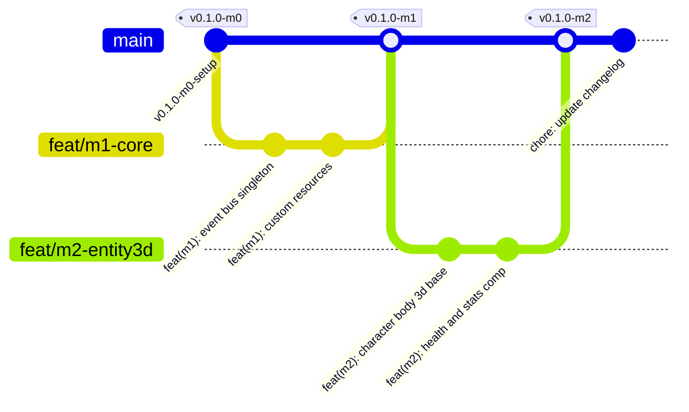
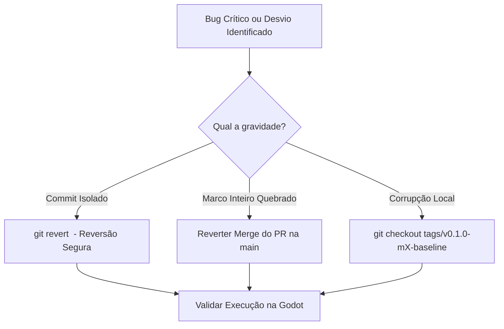

# 🛠️ 02. Gestão de Configuração, Versionamento & GitHub

Este documento estabelece o modelo de **Gerenciamento de Configuração de Software (SCM)**, a estratégia de ramificação (**Git Branching Model**), o rastreamento de assets binários/3D via **Git LFS**, os padrões de commit (**Conventional Commits**) e a estratégia de **Rollback Atômico** para o projeto **Autodungeon**.

---

## 🌿 1. Modelo de Ramificação (Trunk-Based com Feature Branches)

Adotamos o modelo **Trunk-Based Development** com branches de curta duração associadas diretamente aos Marcos (Milestones):



### 1.1. Convenção de Nomes de Branches
* **Funcionalidades de Marco:** `feat/m<numero>-<nome-do-modulo>` (ex: `feat/m3-navigation3d`, `feat/m4-combat-ai`).
* **Correções Rápidas (Hotfix/Bugfix):** `fix/m<numero>-<descricao>` (ex: `fix/m3-navmesh-stuck`).
* **Refatoração:** `refactor/m<numero>-<descricao>` (ex: `refactor/m2-component-injection`).
* **Branch Principal Estável:** `main` (sempre mantida em estado executável e compilável).

---

## 📦 2. Configuração do Repositório: Git LFS & `.gitignore`

Em projetos 3D na Godot Engine, arquivos de mídia pesados (modelos 3D, texturas de alta resolução e áudios) **nunca** devem ser armazenados no histórico Git padrão para evitar inchaço do repositório.

### 2.1. Arquivo `.gitattributes` (Configuração do Git LFS)
```gitattributes
# 3D Assets & Models
*.glb filter=lfs diff=lfs merge=lfs -text
*.gltf filter=lfs diff=lfs merge=lfs -text
*.blend filter=lfs diff=lfs merge=lfs -text
*.fbx filter=lfs diff=lfs merge=lfs -text
*.obj filter=lfs diff=lfs merge=lfs -text

# Audio Files
*.wav filter=lfs diff=lfs merge=lfs -text
*.ogg filter=lfs diff=lfs merge=lfs -text
*.mp3 filter=lfs diff=lfs merge=lfs -text

# Textures & Heavy Images
*.png filter=lfs diff=lfs merge=lfs -text
*.tga filter=lfs diff=lfs merge=lfs -text
*.exr filter=lfs diff=lfs merge=lfs -text
*.hdr filter=lfs diff=lfs merge=lfs -text

# Fonts
*.ttf filter=lfs diff=lfs merge=lfs -text
*.otf filter=lfs diff=lfs merge=lfs -text

# Line Endings (Normalização para evitar conflitos Windows/Mac/Linux)
*.gd text eol=lf
*.tscn text eol=lf
*.tres text eol=lf
*.md text eol=lf
```

### 2.2. Arquivo `.gitignore` Oficial para Godot 4.x
```gitignore
# Cache interno da Godot Engine
.godot/
*.import

# Configurações locais e temporárias do usuário
.DS_Store
*.tmp
*.log

# Presets de exportação com chaves sensíveis (se houver)
# export_presets.cfg

# Builds geradas
builds/
exports/
```

---

## 📝 3. Padrão de Commits: Conventional Commits

Todo commit no repositório deve seguir a convenção semântica para viabilizar rastreabilidade automática e geração de changelogs:

$$\text{tipo}(\text{escopo}): \text{descrição curta em minúsculas}$$

### 3.1. Tipos Permitidos
* `feat`: Nova funcionalidade adicionada ao jogo.
* `fix`: Correção de um bug ou comportamento incorreto.
* `refactor`: Mudança no código que não altera o comportamento do jogo.
* `docs`: Adição ou alteração de documentação técnica/planejamento.
* `test`: Adição ou correção de testes unitários/integração (GUT).
* `chore`: Manutenção de arquivos de configuração, build ou git.

### 3.2. Exemplos no Contexto do Autodungeon
```text
feat(m3-nav): implementar mola de tethering elastico no PartyFormationController 3D
feat(m4-ai): adicionar algoritmo de kiting para classes de longo alcance
fix(m2-health): corrigir calculo de mitigacao linear com teto de protecao de 80
refactor(m1-core): desacoplar sinais de dano do EventBus
docs(planejamento): criar matriz de marcos do MVP 3D
```

---

## ⏪ 4. Estratégia de Rollback Atômico & Segurança

Para garantir que qualquer funcionalidade problemática possa ser revertida de forma imediata sem impactar o restante do projeto, aplicamos as seguintes regras:



1. **Commits Atômicos por Componente:**
   * Um commit nunca mistura código de física 3D com interface ou balanceamento de itens. Cada commit altera um conjunto isolado e coeso de arquivos (`.gd`, `.tscn`, `.tres`).
2. **Reversão não-destrutiva (`git revert`):**
   * Em caso de falha em branch compartilhada, **nunca** utilize `git reset --hard` ou `git push -f` no `main`. Utilize `git revert <commit_hash>`, gerando um commit explícito de reversão que preserva o histórico.
3. **Tags de Baseline por Marco:**
   * Todo marco concluído recebe uma tag imutável (ex: `v0.1.0-m3-navigation3d`). Caso uma iteração subsequente falhe de maneira catastrófica, o time pode restabelecer o baseline seguro com:
     ```bash
     git checkout tags/v0.1.0-m3-navigation3d
     ```
4. **UIDs da Godot 4.x:**
   * Para evitar corrupção de referências entre cenas e scripts ao realizar merges ou rollbacks, os arquivos `.tscn` e `.tres` mantêm seus `uid://` consistentes e verificados.

---

## 🔗 Próximos Passos
* Continue para: **[03. Controle de Mudanças & Rastreabilidade](03_controle_mudancas_e_rastreabilidade.md)**
* Voltar ao: **[Índice de Planejamento](00_indice_planejamento.md)**
