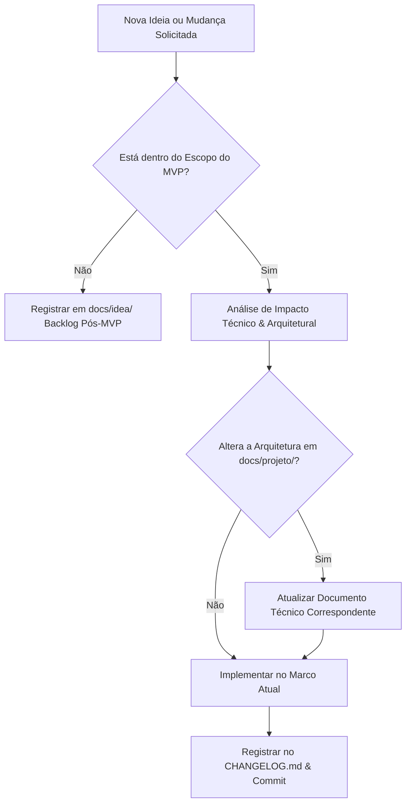

# 🔍 03. Controle de Mudanças & Matriz de Rastreabilidade

Este documento define o processo de **Governança e Controle de Mudanças (Change Management)**, a política de versionamento semântico (**SemVer 2.0**) e a **Matriz de Rastreabilidade** que conecta o Game Design às decisões técnicas e aos marcos de entrega do **Autodungeon**.

---

## 🛑 1. Política de Controle de Mudanças (Scope Control)

Para garantir que o desenvolvimento do MVP permaneça ágil, focado e dentro do cronograma, qualquer proposta de alteração de escopo ou design deve seguir o fluxo de controle de mudanças:

### 1.1. Regra Anti-Inchaço de Escopo (Scope Creep Guard)
Conforme definido no [`01_Pitch_MVP.md`](../../01_Pitch_MVP.md), os seguintes itens estão **estritamente bloqueados** durante a construção do MVP:
* ❌ Não incluir mais de 3 heróis (*apenas Bromm, Elysia e Beatrice*).
* ❌ Não criar sistemas complexos de forja/gacha ou biomas adicionais.
* ❌ Não adicionar mais de 1 masmorra graybox.

---

## 🏷️ 2. Versionamento Semântico (SemVer 2.0)

O projeto adota o padrão de versionamento semântico:

$$\text{v}\mathbf{MAJOR}.\mathbf{MINOR}.\mathbf{PATCH}\text{ - }\text{PRERELEASE}$$

* **v0.1.0-mX:** Builds e baselines intermediárias durante o desenvolvimento dos Marcos M0 a M7.
* **v0.1.0-mvp:** Versão final consolidada do MVP jogável (Marco M8).
* **v0.2.0-beta:** Versão pós-MVP com expansão de heróis e biomas.
* **v1.0.0:** Lançamento comercial oficial.

---

## 📜 3. Padrão de `CHANGELOG.md` (Keep a Changelog)

O arquivo `CHANGELOG.md` na raiz do projeto é atualizado a cada marco concluído, agrupado pelas categorias:
* `Added`: Para novas mecânicas, nós ou cenas adicionadas.
* `Changed`: Para alterações em mecânicas ou comportamentos já existentes.
* `Fixed`: Para correção de bugs.
* `Removed`: Para funcionalidades descontinuadas ou simplificadas.

---

## 🗺️ 4. Matriz de Rastreabilidade Ponta a Ponta

A tabela abaixo estabelece o mapeamento direto entre os **Requisitos de Game Design (GDD)**, a **Arquitetura Técnica (Godot)** e os **Marcos de Entrega do MVP (Milestones)**:

| ID | Requisito de Jogo (GDD / MVP) | Módulo Técnico (`docs/projeto/`) | Marco MVP (Milestone) | Artefato de Código / Cena Entregue |
| :--- | :--- | :--- | :---: | :--- |
| **REQ-01** | Infraestrutura e barramento desacoplado | [`01_visao_geral_e_padroes.md`](../projeto/01_visao_geral_e_padroes.md) | **M1** | `EventBus.gd`, `GameManager.gd` |
| **REQ-02** | Trio de Heróis (Bromm, Elysia, Beatrice) | [`03_arquitetura_entidades_componentes.md`](../projeto/03_arquitetura_entidades_componentes.md) | **M2** | `CharacterEntity.tscn` 3D, `StatsComponent.gd` |
| **REQ-03** | Mitigação Linear (Cap 80) e Regeneração | [`05_sistema_combate_e_habilidades.md`](../projeto/05_sistema_combate_e_habilidades.md) | **M2** | `HealthComponent.gd`, `Hurtbox3D.gd` |
| **REQ-04** | Formação de Marcha e Tethering Elástico | [`04_maquina_estados_e_ia.md`](../projeto/04_maquina_estados_e_ia.md) | **M3** | `PartyFormationController.gd`, `NavigationAgent3D` |
| **REQ-05** | Gatilho no 1º Impacto e Kiting Ranged | [`04_maquina_estados_e_ia.md`](../projeto/04_maquina_estados_e_ia.md) | **M4** | `CombatMelee.gd`, `CombatRanged.gd` |
| **REQ-06** | IA de Suporte com Árvore de 4 Níveis | [`04_maquina_estados_e_ia.md`](../projeto/04_maquina_estados_e_ia.md) | **M4** | `CombatSupport.gd`, `ThreatTable.gd` |
| **REQ-07** | Masmorra Graybox 3D e Encontros | [`07_navegacao_dungeon_e_fases.md`](../projeto/07_navegacao_dungeon_e_fases.md) | **M5** | `GrayboxDungeon.tscn` 3D, Spawners |
| **REQ-08** | Chefe Rei Goblin com Telegrafia 3D (1.5s) | [`05_sistema_combate_e_habilidades.md`](../projeto/05_sistema_combate_e_habilidades.md) | **M6** | `BossTelegraphAttack.tscn` 3D, `ArenaGate.tscn` |
| **REQ-09** | Sequenciamento dos 3 Paths (Baú & Portal) | [`07_navegacao_dungeon_e_fases.md`](../projeto/07_navegacao_dungeon_e_fases.md) | **M6** | `DungeonManager.gd`, `GoldenChest.tscn` |
| **REQ-10** | HUD de Batalha com Barras Verticais | [`08_ui_hud_e_eventbus.md`](../projeto/08_ui_hud_e_eventbus.md) | **M7** | `BattleHUD.tscn`, `HeroHUDPanel.tscn` |
| **REQ-11** | Pooler de Dano Flutuante 3D | [`08_ui_hud_e_eventbus.md`](../projeto/08_ui_hud_e_eventbus.md) | **M7** | `FloatingCombatTextPool.gd` |
| **REQ-12** | Tela de Resumo & Fórmula de MVP | [`08_ui_hud_e_eventbus.md`](../projeto/08_ui_hud_e_eventbus.md) | **M7** | `SummaryScreen.tscn`, `MatchSummaryCalculator.gd` |
| **REQ-13** | Loop Completo do MVP e Release | [`01_Pitch_MVP.md`](../../01_Pitch_MVP.md) | **M8** | Build Executável, Tag `v0.1.0-mvp` |

---

## 🔗 Próximos Passos
* Continue para: **[04. Cronograma & Cadência](04_cronograma_e_cadencia.md)**
* Voltar ao: **[Índice de Planejamento](00_indice_planejamento.md)**
