# ⏱️ 04. Cronograma Iterativo, Dependências & Definition of Done (DoD)

Este documento estabelece o **Cronograma Simples e Preciso por Marcos**, a **Matriz de Dependências Técnicas** e os critérios de conclusão (**Definition of Done**) para o desenvolvimento iterativo do MVP de **Autodungeon**.

---

## 📅 1. Cronograma Sequencial por Marcos (Roadmap do MVP)

O desenvolvimento segue uma cadência iterativa em **4 Fases Lógicas**:

```mermaid
gantt
    title Cronograma Iterativo do MVP (Godot 4.7+ 3D)
    dateFormat  X
    axisFormat  Marco %d
    
    section Fase 1: Fundação
    M0 Setup & Baseline 3D          :active, m0, 0, 1
    M1 Infraestrutura & Core Data   :m1, after m0, 1
    M2 Entidade 3D & Componentes    :m2, after m1, 2
    
    section Fase 2: Gameplay Core
    M3 Navegação 3D & Tethering     :m3, after m2, 3
    M4 Combate 3D & IA dos Heróis   :m4, after m3, 4
    
    section Fase 3: Masmorra & Boss
    M5 Masmorra Graybox & Encontros :m5, after m4, 5
    M6 Chefe Rei Goblin & 3 Paths   :m6, after m5, 6
    
    section Fase 4: Apresentação & Release
    M7 Interface HUD & Telas        :m7, after m6, 7
    M8 Integração, Testes & Release :m8, after m7, 8
```

---

## 🔗 2. Matriz de Dependências Técnicas

Para evitar retrabalho e bloqueios de código, cada marco só pode ser iniciado quando suas dependências predecessoras estiverem validadas:

| Marco | Nome do Marco | Depende Diretamente de | Bloqueia os Seguintes |
| :---: | :--- | :---: | :--- |
| **M0** | Setup do Repositório & Baseline 3D | *Nenhuma* | M1, M2, M3, M4, M5, M6, M7, M8 |
| **M1** | Infraestrutura Core & Camada de Dados | M0 | M2, M4, M7 |
| **M2** | Entidade 3D Base & Composição de Nós | M0, M1 | M3, M4, M5, M6 |
| **M3** | Navegação 3D & Tethering do Trio | M2 | M4, M5, M6 |
| **M4** | Combate 3D & IA dos Heróis | M2, M3 | M5, M6, M7 |
| **M5** | Masmorra Graybox 3D & Encontros | M3, M4 | M6 |
| **M6** | Chefe Rei Goblin & Os 3 Paths | M4, M5 | M7, M8 |
| **M7** | Interface (HUD 3D/2D) & Fluxo de Telas | M1, M4, M6 | M8 |
| **M8** | Integração do Loop, Testes & Release | M0, M1, M2, M3, M4, M5, M6, M7 | *Lançamento do MVP* |

---

## ✅ 3. Critérios de Conclusão de Marco: *Definition of Done (DoD)*

Um Marco (Milestone) é considerado **oficialmente concluído** somente quando satisfaz 100% dos seguintes requisitos:

1. **Compilação e Execução Limpa:** O projeto executa na Godot 4.7+ sem nenhum erro (`error`) ou aviso crítico (`warning`) no painel de Output/Debugger.
2. **Critérios de Aceitação Satisfeitos:** Todos os critérios de aceitação específicos do marco (definidos em [`01_visao_mvp_e_marcos.md`](01_visao_mvp_e_marcos.md)) foram verificados e aprovados.
3. **Padrão de Código:** O código GDScript segue static typing obrigatório e as convenções de [`02_estrutura_diretorios_convencoes.md`](../projeto/02_estrutura_diretorios_convencoes.md).
4. **Git Baseline Criado:** A branch da feature foi integrada à `main` via Pull Request e uma Git Tag atômica (ex: `v0.1.0-mX-nome`) foi criada.
5. **Rastreabilidade Atualizada:** O arquivo `CHANGELOG.md` foi atualizado com as adições e correções do marco.

---

## 🎯 4. Próxima Etapa: Detalhamento em Tarefas
Com os marcos, dependências, governança de GitHub e critérios de aceitação formalmente estabelecidos, a decomposição em tarefas detalhadas para desenvolvimento diário está disponível em:
👉 **[WBS Master & Arquivos de Execução por Marco](../../cronograma/wbs.md)**

---

## 🔗 Navegação
* Voltar ao: **[Índice de Planejamento](00_indice_planejamento.md)**
* Consultar a: **[Visão do MVP & Marcos](01_visao_mvp_e_marcos.md)**
