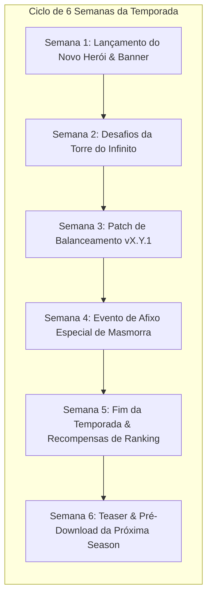
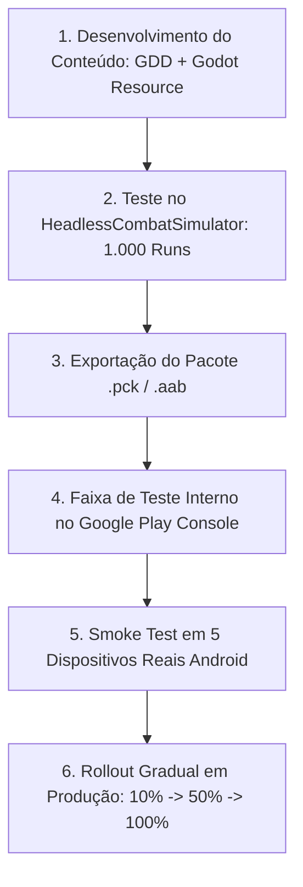

# 📋 05. Roadmap de Expansões & LiveOps Pós-Lançamento (Google Play)

Este documento estabelece o planejamento estratégico, a cadência de temporadas (*Seasons*), o cronograma de novos heróis, raças e classes, e o processo de entrega contínua para **Autodungeon** após o lançamento comercial na **Google Play Store**.

---

## 🔄 1. Cadência do Ciclo de LiveOps (Temporadas de 6 Semanas)

Para manter o engajamento e a retenção de longo prazo da base de jogadores móveis, o desenvolvimento pós-lançamento adota um ciclo previsível de **Temporadas de 6 Semanas**:



### 1.1. Conteúdo Padrão Entregue por Temporada
Cada grande atualização de temporada (Major Season Update) contém:
* **1 a 2 Novos Heróis Únicos** (com modelo 3D low-poly, animações, VFX e SFX).
* **1 Nova Raça ou 1 Nova Classe** integrada ao catálogo modular.
* **1 Novo Bioma / Cenário 3D de Masmorra** com monstros temáticos e novo Chefe.
* **3 Novos Afixos Semanais** para a rotação de masmorras de alto nível.
* **Novo Passe da Guilda (Guild Pass)** com 30 níveis de recompensas cosméticas e recursos.

---

## 🗓️ 2. Calendário Estratégico das 4 Primeiras Temporadas

```text
+---------------------------------------------------------------------------------------------------------+
|                                    CRONOGRAMA DE TEMPORADAS PÓS-LANÇAMENTO                              |
+-------------------+--------------------+------------------------+---------------------------------------+
| Temporada         | Tema & Lore        | Novos Personagens      | Novos Sistemas / Modos                |
+-------------------+--------------------+------------------------+---------------------------------------+
| Season 1 (Mês 2)  | Criptas Profanas   | Valéria (Morto-Vivo /  | Torre do Infinito (100 Andares) &     |
|                   |                    | Cavaleiro da Morte)    | Sinergias de Ressonância de Equipe    |
+-------------------+--------------------+------------------------+---------------------------------------+
| Season 2 (Mês 3.5)| Fúria Selvagem     | Jin (Homem-Fera /      | Fenda Temporal (Daily Rifts) &        |
|                   |                    | Monge)                 | Expedições Passivas de Guilda (AFK)   |
+-------------------+--------------------+------------------------+---------------------------------------+
| Season 3 (Mês 5)  | Forja da Alquimia  | Zarek (Humano /        | Sistema de Mutações Químicas &        |
|                   |                    | Alquimista) + Golem    | Árvore de Maestria Pós-Nível 30       |
+-------------------+--------------------+------------------------+---------------------------------------+
| Season 4 (Mês 6.5)| Chamas & Mares     | Nyx (Ínfero / Mago) &  | Invocador + Boss Rush Global com      |
|                   |                    | Thalassa (Tritão / Sac)| Ranking Google Play Services          |
+-------------------+--------------------+------------------------+---------------------------------------+
```

---

### 🏛️ Season 1: A Maldição das Criptas Profanas
* **Destaque:** Introdução da Raça **Morto-Vivo** e da Classe **Cavaleiro da Morte**.
* **Novo Herói:** *Valéria, a Lâmina Espectral* (Tank Vampírico de Linha de Frente).
* **Novo Modo:** *Torre do Infinito (100 Andares)* com reset mensal de classificação.
* **Mecânica Principal:** Ativação do sistema de *Ressonâncias de Equipe (Team Resonances)* no Lobby.

---

### 🐾 Season 2: O Despertar das Feras Ancestrais
* **Destaque:** Introdução da Raça **Homem-Fera (Felino)** e da Classe **Monge**.
* **Novo Herói:** *Jin, o Vendaval Sereno* (DPS Melee ultra-rápido baseado em Chi e Esquiva).
* **Novo Modo:** *Fendas Temporais Diárias (Daily Rifts)* e *Expedições Passivas de Guilda (AFK Bounties)*.
* **Mecânica Principal:** Introdução dos *Combos Elementais (Molhado + Choque / Óleo + Fogo)*.

---

### ⚙️ Season 3: A Forja dos Mestres Alquimistas
* **Destaque:** Introdução da Classe **Alquimista** e da Raça **Golem / Constructo**.
* **Novo Herói:** *Zarek, o Alquimista da Peste* (DPS em área com frascos químicos e quebra de defesa).
* **Novo Sistema:** *Árvore de Maestria & Ascensão Pós-Nível 30* (customização fina de builds).
* **Mecânica Principal:** Zonas de chão químico 3D persistentes durante o combate.

---

### 🔥 Season 4: Chamas do Averno & O Chamado Abissal
* **Destaque:** Introdução das Raças **Ínfero (Demônio)** e **Tritão**, e da Classe **Invocador**.
* **Novos Heróis:** *Nyx, a Soberana das Chamas Negras* (DPS Mágico) e *Thalassa, o Coral da Alvorada* (Suporte de Cura Aquática).
* **Novo Modo:** *Boss Rush Semanal* com chefes duplos e mutações extremas.
* **Mecânica Principal:** Sistema de familiares e minions invocados no campo de batalha 3D.

---

## 🛠️ 3. Pipeline de QA & Publicação de Atualizações na Play Store

Para garantir que novos conteúdos cheguem aos jogadores sem falhas técnicas ou travamentos:



### 3.1. Política de Rollout Gradual (Staged Rollout)
* **Dia 1:** 10% dos usuários da Play Store recebem a atualização. Monitoramento de crashes via Firebase / Play Console.
* **Dia 2:** Se a taxa de crash for inferior a $0.2\%$, expande para 50%.
* **Dia 3:** 100% da base recebe o novo conteúdo.

---

## ✅ 4. Critérios de Conclusão (Definition of Done — DoD) de uma Temporada

Uma atualização de temporada só é considerada pronta para publicação se:
1. **Balanceamento Validado:** O novo herói/classe foi aprovado pelo `HeadlessCombatSimulator.gd` com taxa de vitória entre $48\%$ e $52\%$.
2. **Performance Mobile Garantida:** A taxa de quadros (FPS) mantém-se estável em 60 FPS nos aparelhos de referência (OpenGL ES3 Compatibility).
3. **Persistência Segura:** O `SaveMigrationSystem.gd` realizou a migração de saves de versões anteriores sem perda de itens ou ouro.
4. **Compliance Google Play:** Conformidade com as diretrizes do Google Play Console e integração ativa com o Google Play Billing.

---

## 🔗 Navegação
* [Índice Geral de Planejamento](00_indice_planejamento.md)
* [Visão do MVP & Marcos M0 a M8](01_visao_mvp_e_marcos.md)
* [Roadmap Comercial Play Store](../roadmap_comercial_playstore.md)
* [Arquitetura Técnica de LiveOps](../projeto/10_arquitetura_liveops_expansoes_modulares.md)
