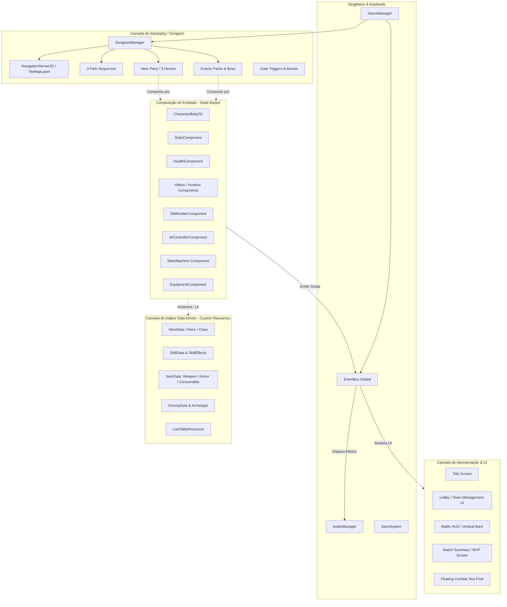

# 🏛️ Índice Geral da Arquitetura Técnica — Autodungeon (Godot 4.x)

Este diretório contém a documentação completa de **Engenharia de Software Orientada a Objetos** e **Arquitetura de Jogos Digitais** para o projeto **Autodungeon**, desenvolvido na **Godot Engine 4.x**.

---

## 🗺️ Mapa de Navegação dos Documentos Técnicos

```text
📁 docs/projeto/
│
├── 📄 00_indice_arquitetura.md              <- [Você está aqui] Índice e Visão Geral
├── 📄 01_visao_geral_e_padroes.md           <- Princípios SOLID, Padrões GoF/Game Patterns e Composição
├── 📄 02_estrutura_diretorios_convencoes.md <- Estrutura de Pastas res://, Convenções de Código e Ciclo de Vida
├── 📄 03_arquitetura_entidades_componentes.md <- Composição de Nós (Stats, Health, Hitbox, Hurtbox, Skills, AI)
├── 📄 04_maquina_estados_e_ia.md            <- FSM, Steering, Tethering Elástico e Prioridades de Suporte
├── 📄 05_sistema_combate_e_habilidades.md   <- Custom Resources, Efeitos de Skills, Fórmulas e Aggro
├── 📄 06_sistema_itens_inventario_loot.md   <- Modelagem de Itens, Consumíveis com Gatilho Inato e Drops
├── 📄 07_navegacao_dungeon_e_fases.md       <- NavigationServer2D, Sequenciamento dos 3 Paths e Dungeon Loop
├── 📄 08_ui_hud_e_eventbus.md               <- EventBus Singleton, HUD de Batalha e Object Pooler de Dano
└── 📄 09_gamemanager_e_persistencia.md      <- GameManager, Save/Load Seguro, Áudio e Fluxo Global
```

---

## 🧭 Resumo dos Módulos

| Documento | Foco Principal | Principais Padrões e Tecnologias |
| :--- | :--- | :--- |
| **[01. Visão Geral & Padrões](01_visao_geral_e_padroes.md)** | Filosofia de design, SOLID na Godot, Composição sobre Herança. | *Component Pattern, Resource-Driven, Observer, State, Strategy, Object Pool.* |
| **[02. Estrutura de Pastas & Convenções](02_estrutura_diretorios_convencoes.md)** | Organização do projeto `res://`, convenções de GDScript e tipagem estática. | *Static Typing, Style Guide, Ordem de ciclo de vida (`_enter_tree`, `_ready`, `_physics_process`).* |
| **[03. Entidades & Componentes](03_arquitetura_entidades_componentes.md)** | Anatomia de Heróis, Inimigos e Bosses através de Nós modulares. | *CharacterBody2D, HealthComponent, StatsComponent, Hurtbox/Hitbox, SkillHolder.* |
| **[04. Máquinas de Estados & IA](04_maquina_estados_e_ia.md)** | FSM hierárquica, marcha autônoma, tethering elástico e IA tática. | *Hierarchical FSM, Tethering Spring Algorithm, Kiting, Árvore de Decisão de Suporte.* |
| **[05. Combate & Habilidades](05_sistema_combate_e_habilidades.md)** | Arquitetura de Skills data-driven, fórmulas de dano/mitigação e aggro. | *Custom Resources (`SkillData`), `SkillEffect` polimórfico, Mitigação Linear, Threat Table.* |
| **[06. Itens, Inventário & Loot](06_sistema_itens_inventario_loot.md)** | Itens, armas, armaduras, consumíveis com autodisparo e loot tables. | *`ItemData` Hierarchy, Trigger Conditions, LootTable RNG, Recompensas do Chefe.* |
| **[07. Navegação & Masmorra](07_navegacao_dungeon_e_fases.md)** | NavigationServer2D, controle dos 3 Paths, portões de arena e fluxo. | *NavigationAgent2D, Path 1 (Exploração), Path 2 (Baú), Path 3 (Portal), DungeonManager.* |
| **[08. UI, HUD & EventBus](08_ui_hud_e_eventbus.md)** | Comunicação desacoplada, HUD reativo e pool de texto flutuante. | *EventBus (Autoload), MVC/MVVM em Godot, Floating Combat Text Pool, MVP Scoring.* |
| **[09. GameManager & Persistência](09_gamemanager_e_persistencia.md)** | Controle de fluxo global do jogo, serialização de saves e áudio. | *GameManager FSM, SaveSystem JSON/Resource, AudioManager, ConfigFile.* |

---

## 🏗️ Visão Arquitetural de Alto Nível



---

## 🔗 Referências Cruzadas
* [Índice Geral do Game Design (GDD)](../00_indice.md)
* [Escopo & Pitch do MVP](../01_Pitch_MVP.md)
* [Método de Organização Modular](../Metodo_Organizacao_GDD.md)
