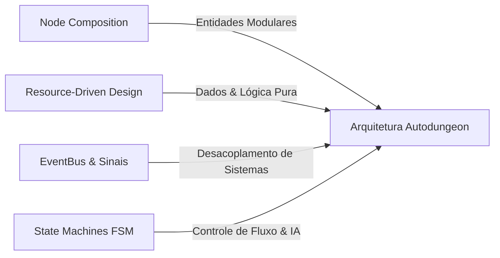
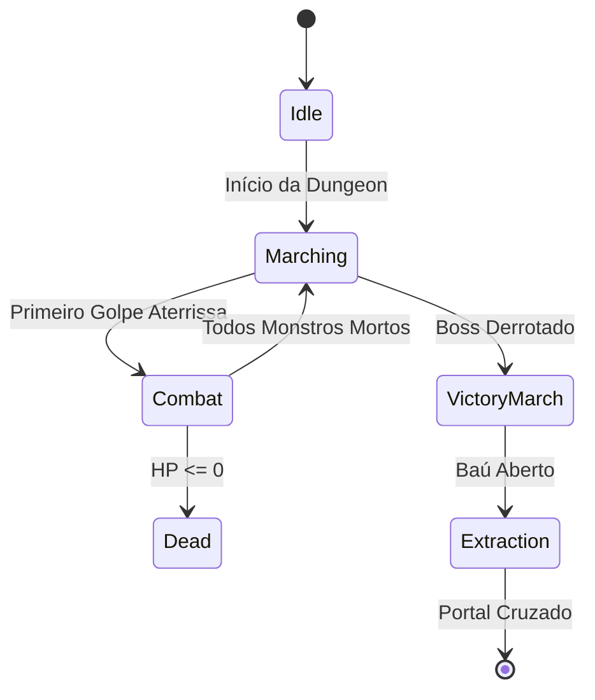

# 🏛️ 01. Visão Geral da Arquitetura & Padrões de Projeto

Este documento estabelece as bases de **Engenharia de Software Orientada a Objetos** e **Padrões de Projeto (Design Patterns)** aplicados à **Godot Engine 4.x** no desenvolvimento de **Autodungeon**.

---

## 🎯 1. Filosofia Arquitetural: Nós, Cenas e Recursos

A Godot Engine se diferencia dos motores tradicionais por não utilizar um modelo ECS (Entity Component System) puro nem uma herança monolítica de classes. Sua força reside no paradigma **"Tudo é um Nó / Toda Cena é um Componente Reutilizável"**.

Para **Autodungeon**, estabelecemos quatro pilares fundamentais:



1. **Composição sobre Herança (Composition over Inheritance):**
   * Em vez de criar árvores profundas (`CharacterBody2D` $\rightarrow$ `LivingEntity` $\rightarrow$ `Combatant` $\rightarrow$ `Hero` $\rightarrow$ `Warrior`), usamos uma entidade base leve (`CharacterEntity`) que agrega Nós-Componentes especializados (`HealthComponent`, `StatsComponent`, `HitboxComponent`, etc.).
2. **Separação Estrita de Dados e Lógica (Resource-Driven):**
   * Dados de jogo (atributos de heróis, tabelas de XP, status de monstros, efeitos de skills, definições de itens) são instâncias de `Resource` (`.tres`). Eles existem fora da árvore de nós, permitindo carregamento rápido, edição no Inspector e testes unitários isolados.
3. **Comunicação Desacoplada ("Call Down, Signal Up"):**
   * Um Nó Pai pode chamar funções diretamente em seus Nós Filhos (`node.take_damage()`).
   * Um Nó Filho **nunca** acessa o Nó Pai diretamente por caminho fixo (`get_parent().get_parent()`). Em vez disso, emite **Sinais** (`health_depleted.emit()`).
   * Sistemas distantes comunicam-se via um **EventBus Global** (Singleton).

---

## 📐 2. Princípios SOLID Aplicados à Godot Engine 4

| Princípio | Aplicação na Godot Engine | Exemplo no Autodungeon |
| :--- | :--- | :--- |
| **S — Single Responsibility (Responsabilidade Única)** | Cada Nó ou Script executa apenas uma tarefa bem definida. Uma cena de Herói não gerencia vida, IA e animações no mesmo script. | `HealthComponent` cuida exclusivamente de HP, dano e morte; `MovementComponent` cuida exclusivamente do pathfinding. |
| **O — Open/Closed (Aberto para Extensão, Fechado para Modificação)** | Adicionar novos comportamentos sem alterar o código existente, usando polimorfismo de `Resource` ou Nós plugáveis. | Criar um novo tipo de efeito de habilidade criando um `DoTEffect` herdando de `SkillEffect`, sem alterar o `SkillHolderComponent`. |
| **L — Liskov Substitution (Substituição de Liskov)** | Subclasses ou nós derivados devem poder substituir a classe base sem quebrar o sistema. | Qualquer `ItemData` (`WeaponItemData`, `ConsumableItemData`) pode ser processado pelo `InventorySystem` como um item genérico. |
| **I — Interface Segregation (Segregação de Interfaces)** | Scripts não devem depender de métodos que não usam. Na Godot, nós especializados atuam como "interfaces físicas". | Uma caixa que quebra só precisa de um `HurtboxComponent` e `HealthComponent`, sem carregar `MovementComponent` ou `AIControllerComponent`. |
| **D — Dependency Inversion (Inversão de Dependência)** | Módulos de alto nível não dependem de módulos de baixo nível; ambos dependem de abstrações (Sinais / Recursos). | A `BattleHUD` não conhece as instâncias concretas de `Hero`; ela escuta o `EventBus` ou sinais exportados. |

---

## 🧩 3. Padrões de Projeto (Design Patterns) do Projeto

### 3.1. Component Pattern (Padrão de Componentes em Nós)
Todo comportamento complexo é encapsulado em um Nó filho dedicado.

```gdscript
# Exemplo de uso de nós como componentes
class_name CharacterEntity
extends CharacterBody2D

@onready var stats_component: StatsComponent = $StatsComponent
@onready var health_component: HealthComponent = $HealthComponent
@onready var movement_component: MovementComponent = $MovementComponent
@onready var ai_controller: AIControllerComponent = $AIControllerComponent

func _ready() -> void:
    # Injeção de dependência via nós filhos
    health_component.setup(stats_component)
    movement_component.setup(self, stats_component)
```

### 3.2. Observer Pattern & EventBus (Padrão Observador)
Para evitar acoplamento direto entre sistemas distantes (ex: um monstro morre $\rightarrow$ atualizar contador de monstros na HUD $\rightarrow$ tocar som de morte $\rightarrow$ gerar drop de loot), utilizamos um `EventBus` Autoload.

```gdscript
# EventBus.gd (Autoload / Singleton)
extends Node

# Sinais de Combate
signal entity_damaged(target: CharacterEntity, amount: int, damage_type: int, is_crit: bool)
signal entity_healed(target: CharacterEntity, amount: int)
signal entity_died(entity: CharacterEntity)

# Sinais de Masmorra
signal combat_engagement_triggered(initiator: Node2D, target: Node2D)
signal boss_room_entered()
signal boss_defeated()
signal chest_opened(loot: Array[ItemData], gold: int)
signal dungeon_completed()
signal dungeon_wiped()
```

### 3.3. State Pattern (Máquina de Estados Finitos - FSM)
Usamos Nós para representar estados discretos de heróis e inimigos (`StateMarching`, `StateCombat`, `StateDead`), permitindo transições limpas e fáceis de debugar no editor.



### 3.4. Strategy Pattern (Estratégias de IA e Targeting)
A IA de Suporte e Seleção de Alvos utiliza algoritmos desacoplados que podem ser trocados em tempo de execução de acordo com a preferência do jogador no Lobby.

```gdscript
# Interface base de estratégia de mira
class_name TargetingStrategy
extends RefCounted

func select_target(allies: Array[CharacterEntity], enemies: Array[CharacterEntity], caster: CharacterEntity) -> CharacterEntity:
    return null
```

* `TankFocusTargeting`: Prioriza o herói de linha de frente.
* `LowestHealthTargeting`: Prioriza quem tem menor $\%$ de HP.
* `SelfPreservationTargeting`: Prioriza curar o próprio conjurador se estiver sob ataque.

### 3.5. Object Pooling Pattern (Reutilização de Objetos Voláteis)
Em batalhas com dezenas de golpes por segundo, instanciar e deletar nós de texto flutuante (`FloatingCombatText`), projéteis de flechas e partículas causaria travamentos no Garbage Collector / Engine Heap. Um **Object Pool** pré-aloca esses objetos e os recicla via `hide()` / `show()`.

```gdscript
# Exemplo conceitual do Pooler
class_name NodePool
extends Node

@export var scene_to_pool: PackedScene
@export var initial_size: int = 30

var _available: Array[Node] = []

func acquire() -> Node:
    if _available.is_empty():
        return scene_to_pool.instantiate()
    return _available.pop_back()

func release(node: Node) -> void:
    node.hide()
    _available.append(node)
```

---

## 🛡️ 4. Regras de Ouro da Arquitetura de Código

1. **Tipagem Estática Obrigatória (`Static Typing`):** Todas as variáveis, parâmetros e retornos devem ter tipos declarados explicitamente (`var speed: float = 120.0`, `func take_damage(amount: int) -> bool:`). Isso ativa verificações de compilação em tempo real e acelera a execução da VM do GDScript em até 3x.
2. **Proibido `get_node("../../../")` Frágil:** Dependências devem ser resolvidas via `@export`, injeção no `_ready()` ou através do `EventBus`.
3. **Scripts Puros em Recursos (`RefCounted` / `Resource`):** Lógicas que não precisam estar na tela nem receber ticks de física (como cálculos de mitigação de dano, geração de números de XP e leitura de tabelas de itens) devem ser `RefCounted` ou `Resource`, sem custo de Nós no SceneTree.
4. **Respeito aos Framerates Fixos:** Toda movimentação física, colisões e pathfinding devem residir em `_physics_process(delta: float)`, garantindo comportamento determinístico a 60 ticks/s. Animações e efeitos visuais residem em `_process(delta: float)`.

---

## 🔗 Próximos Passos
* Continue para: **[02. Estrutura de Diretórios & Convenções](02_estrutura_diretorios_convencoes.md)**
* Voltar ao: **[Índice Geral](00_indice_arquitetura.md)**
