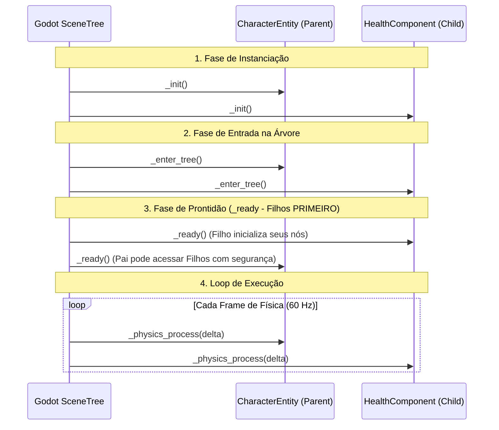

# 📁 02. Estrutura de Diretórios, Convenções & Ciclo de Vida

Este documento detalha o padrão de organização de arquivos no sistema de arquivos virtual da Godot (`res://`), as convenções de escrita em **GDScript 2.0 (Godot 4.x)** e o ciclo de vida dos nós.

---

## 🗂️ 1. Estrutura de Diretórios (`res://`)

O projeto adota uma estrutura modular por **Domínio de Responsabilidade**, agrupando cenas (`.tscn`), scripts (`.gd`) e recursos (`.tres`):

```text
res://
├── assets/                          <- Arquivos de mídia brutos e importados
│   ├── audio/
│   │   ├── music/                   <- Trilhas de lobby, dungeon e boss
│   │   └── sfx/                     <- Efeitos sonoros (espada, flecha, magia, UI)
│   ├── fonts/                       <- Fontes TTF/OTF
│   ├── sprites/
│   │   ├── characters/              <- Spritesheets de heróis e raças
│   │   ├── enemies/                 <- Spritesheets de goblins e chefes
│   │   ├── environment/             <- Tilesets de graybox e biomas
│   │   ├── items/                   <- Ícones de armas, armaduras e poções
│   │   ├── skills/                  <- Ícones de habilidades ativas e passivas
│   │   └── ui/                      <- Molduras, barras de vida verticais, botões
│   └── shaders/                     <- Shaders visuais (telegrafia, cooldown radial)
│
├── src/                             <- Código-fonte e cenas do jogo
│   ├── core/                        <- Singletons, utilitários e infraestrutura
│   │   ├── EventBus.gd              <- Barramento global de sinais desacoplados
│   │   ├── GameManager.gd           <- Gerenciador mestre de transição de telas
│   │   ├── AudioManager.gd          <- Controle de canais de áudio e música
│   │   ├── SaveSystem.gd            <- Serialização e persistência de dados
│   │   └── Constants.gd             <- Enums globais (DamageType, Archetype, etc.)
│   │
│   ├── data/                        <- Definições Data-Driven (Classes de Resource)
│   │   ├── classes/                 <- Stats e dados das 6 classes base e subclasses
│   │   ├── races/                   <- Definições e passivas raciais
│   │   ├── heroes/                  <- Recursos concretos dos 15 heróis únicos
│   │   ├── skills/                  <- Recursos (.tres) das 90 habilidades
│   │   ├── items/                   <- Recursos (.tres) de armas, armaduras e poções
│   │   ├── enemies/                 <- Fichas de monstros e chefes
│   │   └── loot_tables/             <- Tabelas de probabilidade de drop
│   │
│   ├── entities/                    <- Cenas e lógica de atores do jogo
│   │   ├── base/                    <- CharacterEntity base e nós primitivos
│   │   ├── components/              <- Nós modulares reutilizáveis
│   │   │   ├── HealthComponent.gd
│   │   │   ├── StatsComponent.gd
│   │   │   ├── HitboxComponent.gd
│   │   │   ├── HurtboxComponent.gd
│   │   │   ├── MovementComponent.gd
│   │   │   ├── SkillHolderComponent.gd
│   │   │   ├── EquipmentComponent.gd
│   │   │   ├── AIControllerComponent.gd
│   │   │   └── StateMachine.gd
│   │   ├── heroes/                  <- Cenas especializadas de Heróis
│   │   └── enemies/                 <- Cenas de monstros comuns, elites e Boss
│   │
│   ├── systems/                     <- Lógica de alto nível e regras de jogo
│   │   ├── combat/                  <- DamageCalculator, AggroManager
│   │   ├── formation/               <- Tethering elástico e posições de marcha
│   │   ├── ai/                      <- Estratégias de targeting e comportamentos
│   │   └── pooling/                 <- NodePool e gerenciadores de instâncias
│   │
│   ├── dungeon/                     <- Arquitetura do nível e navegação
│   │   ├── DungeonManager.gd        <- Controlador do ciclo da masmorra
│   │   ├── PathSequencer.gd         <- Gerenciador dos Paths 1, 2 e 3
│   │   ├── GrayboxDungeon.tscn      <- Cenário 2D com TileMapLayer e NavMesh
│   │   ├── ChestGold.tscn           <- Baú dourado interativo
│   │   ├── ExtractionPortal.tscn    <- Portal de extração de vitória
│   │   └── ArenaGate.tscn           <- Portão trancável da arena do chefe
│   │
│   └── ui/                          <- Telas, menus e HUDs
│       ├── hud/                     <- BattleHUD, Barras de HP/Mana, CD radial
│       ├── floating_text/           <- FloatingCombatText e Pooler
│       ├── lobby/                   <- Gestão de time, itens, skills e ferreiro
│       ├── summary/                 <- Tela de fim de partida e métricas MVP
│       └── title/                   <- Tela de título e início
│
└── tests/                           <- Testes unitários e de integração (GUT)
    ├── unit/                        <- Testes de fórmulas de dano e cálculos
    └── integration/                 <- Testes de máquinas de estado e combate
```

---

## 📜 2. Guia de Estilo & Convenções de GDScript

Para garantir manutenibilidade e padrão em todo o time, seguimos rigorosamente as convenções oficiais da Godot 4:

### 2.1. Nomenclatura
* **Arquivos e Pastas:** `snake_case.gd`, `health_component.tscn`, `sword_iron.tres`.
* **Classes e Tipos (`class_name`):** `PascalCase` (ex: `CharacterEntity`, `SkillData`, `DamageCalculator`).
* **Funções e Variáveis:** `snake_case` (ex: `take_damage()`, `current_health`, `move_speed`).
* **Constantes e Enums:** `UPPER_SNAKE_CASE` (ex: `MAX_DEFENSE_CAP = 80`, `enum DamageType { PHYSICAL, MAGICAL, TRUE }`).
* **Sinais (`signal`):** Verbo no particípio/passado em `snake_case` (ex: `health_changed`, `died`, `skill_cast_started`).
* **Membros Privados:** Prefixados com underscore `_` (ex: `_current_state`, `_calculate_mitigation()`).

### 2.2. Tipagem Estática Obrigatória (`Static Typing`)
Todo código deve ser explicitamente tipado. Evite `Variant` a menos que estritamente necessário:

```gdscript
# ✅ CORRETO: Tipagem estática e segura
func calculate_damage(attacker_power: int, target_defense: int) -> int:
    var capped_def: int = mini(target_defense, 80)
    var mitigation_factor: float = 1.0 - (float(capped_def) / 100.0)
    var final_dmg: int = maxi(1, int(round(float(attacker_power) * mitigation_factor)))
    return final_dmg

# ❌ INCORRETO: Sem tipos explícitos
func calculate_damage(attacker_power, target_defense):
    var def = target_defense
    return attacker_power * (1 - def / 100)
```

---

## 📐 3. Ordem Padrão de Declaração de Membros em um Script

Todo script `.gd` deve seguir a seguinte ordem cronológica de leitura:

```gdscript
# 1. Declaração de Classe e Extends
class_name HealthComponent
extends Node

# 2. Sinais
signal health_changed(new_health: int, max_health: int)
signal damage_taken(amount: int, is_crit: bool, damage_type: int)
signal healed(amount: int)
signal died()

# 3. Enums e Constantes
const MIN_HEALTH: int = 0

# 4. Variáveis Exportadas (@export)
@export_group("Health Settings")
@export var max_health: int = 100:
    set(value):
        max_health = maxi(1, value)
        current_health = mini(current_health, max_health)

# 5. Variáveis Públicas
var current_health: int = 100
var is_dead: bool = false

# 6. Variáveis Privadas
var _stats_component: StatsComponent

# 7. Variáveis @onready
@onready var _invulnerability_timer: Timer = $InvulnerabilityTimer

# 8. Métodos do Ciclo de Vida da Engine (Godot Built-ins)
func _init() -> void:
    pass

func _enter_tree() -> void:
    pass

func _ready() -> void:
    current_health = max_health

func _physics_process(delta: float) -> void:
    pass

# 9. Métodos Públicos
func setup(stats: StatsComponent) -> void:
    _stats_component = stats
    max_health = stats.get_stat("max_hp")
    current_health = max_health

func take_damage(raw_amount: int, damage_type: int, is_crit: bool) -> int:
    if is_dead:
        return 0
    
    var mitigated: int = _calculate_mitigation(raw_amount, damage_type)
    current_health = maxi(MIN_HEALTH, current_health - mitigated)
    
    damage_taken.emit(mitigated, is_crit, damage_type)
    health_changed.emit(current_health, max_health)
    
    if current_health <= 0:
        _handle_death()
        
    return mitigated

# 10. Métodos Privados
func _calculate_mitigation(amount: int, type: int) -> int:
    # Lógica interna de mitigação
    return amount

func _handle_death() -> void:
    is_dead = true
    died.emit()
```

---

## 🔄 4. Ciclo de Vida dos Nós e Ordem de Execução

Compreender o fluxo de inicialização do SceneTree é essencial para evitar referências nulas (`null instance`):



> [!IMPORTANT]
> **Regra de Ouro do `_ready()`:** Os nós filhos executam `_ready()` **antes** do nó pai. Portanto, um componente filho nunca deve tentar acessar o nó pai no seu próprio `_ready()`. A injeção de dependências deve ser feita pelo pai no `_ready()` do pai através do método `.setup()`.

---

## 🔗 Próximos Passos
* Continue para: **[03. Arquitetura de Entidades & Componentes](03_arquitetura_entidades_componentes.md)**
* Voltar ao: **[Índice Geral](00_indice_arquitetura.md)**
