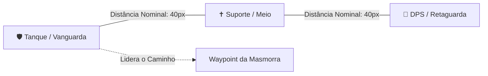
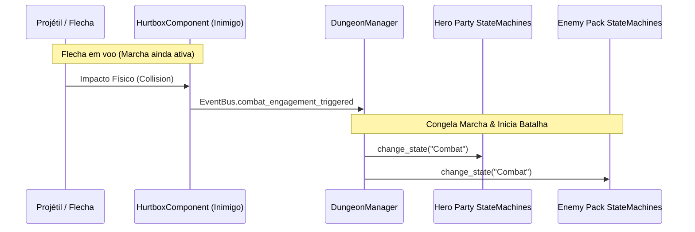
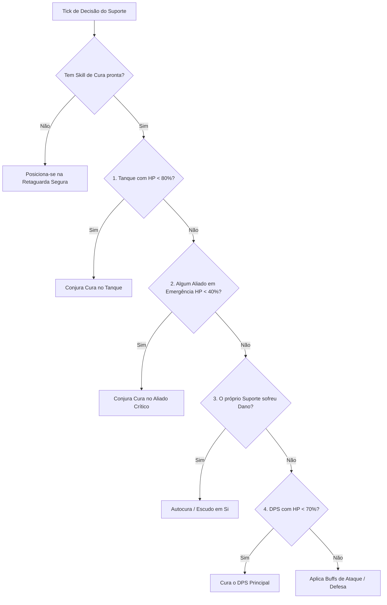

# 🤖 04. Máquinas de Estados (FSM) & Inteligência Artificial Tática

Este documento detalha a implementação da **Máquina de Estados Finitos (FSM)**, do algoritmo de **Tethering Elástico de Formação de Equipe**, da **Transição de Combate por Impacto** e das **Árvores de Tomada de Decisão da IA** em **Autodungeon**.

---

## ⚙️ 1. Arquitetura da Máquina de Estados (Node-Based FSM)

A FSM é estruturada como um nó gerenciador `StateMachine` que contém nós filhos derivados de `State`:

```text
StateMachine (Node)
├── StateIdle (Node)
├── StateMarching (Node)
├── StateCombat (Node)
│   ├── CombatMelee (Node)
│   ├── CombatRanged (Node)
│   └── CombatSupport (Node)
├── StateVictoryMarch (Node)
├── StateExtraction (Node)
└── StateDead (Node)
```

### 1.1. `State.gd` (Classe Base de Estado)
```gdscript
class_name State
extends Node

var entity: CharacterEntity
var state_machine: StateMachine

func enter(_msg: Dictionary = {}) -> void:
    pass

func exit() -> void:
    pass

func physics_update(_delta: float) -> void:
    pass
```

### 1.2. `StateMachine.gd` (Controlador da FSM)
```gdscript
class_name StateMachine
extends Node

signal state_changed(from_state: String, to_state: String)

@export var initial_state: State
var current_state: State
var _states: Dictionary = {}

func setup(entity: CharacterEntity) -> void:
    for child in get_children():
        if child is State:
            _states[child.name.to_lower()] = child
            child.entity = entity
            child.state_machine = self
            
    if initial_state:
        change_state(initial_state.name)

func change_state(target_state_name: String, msg: Dictionary = {}) -> void:
    var key: String = target_state_name.to_lower()
    if not _states.has(key):
        push_error("Estado inexistente: " + target_state_name)
        return
        
    var next_state: State = _states[key]
    if current_state == next_state:
        return
        
    var prev_name: String = current_state.name if current_state else "None"
    if current_state:
        current_state.exit()
        
    current_state = next_state
    current_state.enter(msg)
    state_changed.emit(prev_name, current_state.name)

func _physics_process(delta: float) -> void:
    if current_state:
        current_state.physics_update(delta)
```

---

## 🏃 2. Sistema de Marcha & Tethering Elástico de Equipe

Durante a travessia (Path 1, 2 e 3), os 3 heróis devem manter uma formação tática coesa, mesmo possuindo velocidades individuais distintas (ex: Metadílio rápido vs Anão lento com armadura pesada).



### 2.1. Algoritmo de Tethering Elástico (`PartyFormationController.gd`)

```gdscript
class_name PartyFormationController
extends Node

@export var max_separation_distance: float = 90.0 # Raio elástico máximo
@export var ideal_spacing: float = 35.0

var heroes: Array[CharacterEntity] = []

func update_party_movement(target_waypoint: Vector2, delta: float) -> void:
    var active_heroes: Array[CharacterEntity] = heroes.filter(func(h): return not h.health.is_dead)
    if active_heroes.is_empty():
        return

    # 1. Identificar o Líder da Marcha (Prioridade: Tanque > Suporte > DPS)
    var leader: CharacterEntity = active_heroes[0]
    
    # 2. O Líder segue o NavMesh em direção ao Waypoint
    leader.movement.move_towards(target_waypoint)
    
    # 3. Os seguidores ajustam velocidade com base na distância do Líder (Mola Elástica)
    for i in range(1, active_heroes.size()):
        var follower: CharacterEntity = active_heroes[i]
        var target_pos: Vector2 = leader.global_position - (leader.movement.facing_direction * (ideal_spacing * float(i)))
        var dist_to_target: float = follower.global_position.distance_to(target_pos)
        var dist_to_leader: float = follower.global_position.distance_to(leader.global_position)
        
        # Desacelera o líder se a retaguarda estiver ficando para trás
        if dist_to_leader > max_separation_distance:
            leader.movement.apply_speed_penalty(0.4) # Líder desacelera p/ aguardar
            follower.movement.apply_speed_penalty(1.2) # Seguidor acelera
        else:
            leader.movement.reset_speed()
            follower.movement.reset_speed()
            
        follower.movement.move_towards(target_pos)
```

### 2.2. Adaptação Dinâmica em Caso de Baixas (Morte de Herói)
Quando um herói tem seu HP zerado:
1. Ele emite o sinal `died` e para sua movimentação no local exato do abate.
2. O `PartyFormationController` filtra a lista de heróis ativos (`heroes.filter(...)`), redistribuindo os papéis restantes entre os **2 heróis sobreviventes**.
3. Se o Tanque cair, o próximo herói mais resistente assume a liderança do avanço e do raio de tethering.

---

## ⚔️ 3. Gatilho de Combate por Impacto (Engajamento)

Conforme a regra do GDD:
> *"O Modo de Batalha é ativado no exato instante em que o **primeiro golpe aterrissa e acerta qualquer integrante de qualquer um dos grupos**."*



---

## 🧠 4. Inteligência Artificial Tática por Arquétipo

### 4.1. IA Melee / Tanque (`CombatMelee.gd`)
* **Comportamento:** Identifica o monstro mais próximo ou com maior ameaça, avança e trava a linha de frente.
* **Geração de Ameaça:** Conjurando habilidades de aggro (ex: *Investida*, *Grito de Guerra*), força os monstros a fixarem a mira nele.

### 4.2. IA Longo Alcance / DPS (`CombatRanged.gd` com Kiting)
* **Distância Segura:** Mantém uma distância ideal de $180\text{px}$ do alvo.
* **Algoritmo de Kiting (Recuo Tático):**
```gdscript
func execute_kiting(nearest_enemy: CharacterEntity, ideal_dist: float) -> void:
    var dist: float = entity.global_position.distance_to(nearest_enemy.global_position)
    if dist < ideal_dist * 0.6: # Inimigo rompeu a linha de frente
        var flee_vector: Vector2 = (entity.global_position - nearest_enemy.global_position).normalized()
        entity.movement.set_velocity(flee_vector * entity.stats.get_stat("move_speed"))
    elif dist > ideal_dist:
        var approach_vector: Vector2 = (nearest_enemy.global_position - entity.global_position).normalized()
        entity.movement.set_velocity(approach_vector * (entity.stats.get_stat("move_speed") * 0.5))
    else:
        entity.movement.stop()
```

### 4.3. IA de Suporte & Curandeiro (`CombatSupport.gd` com Árvore de Decisão)
O suporte avalia a lista de prioridades configurável frame a frame para decidir onde aplicar suas habilidades de cura, escudo e buffs:



```gdscript
# Implementação da Árvore de Prioridade do Suporte
func evaluate_heal_target(party: Array[CharacterEntity]) -> CharacterEntity:
    var tank: CharacterEntity = null
    var critical_ally: CharacterEntity = null
    var lowest_hp_pct: float = 1.0
    
    for hero in party:
        if hero.health.is_dead:
            continue
        var hp_pct: float = float(hero.health.current_hp) / float(hero.health.max_hp)
        
        # Identificar o Tanque
        if hero.equipment.has_shield() or hero.stats.get_stat("armor") >= 40:
            tank = hero
            
        # Identificar emergência crítica (< 40%)
        if hp_pct < 0.40 and hp_pct < lowest_hp_pct:
            lowest_hp_pct = hp_pct
            critical_ally = hero

    # 1º Prioridade: Emergência Absoluta (< 40%)
    if critical_ally:
        return critical_ally
        
    # 2º Prioridade: Tanque ferido (< 80%)
    if tank and (float(tank.health.current_hp) / float(tank.health.max_hp)) < 0.80:
        return tank
        
    # 3º Prioridade: Autopreservação (se o curandeiro foi atingido)
    var self_hp_pct: float = float(entity.health.current_hp) / float(entity.health.max_hp)
    if self_hp_pct < 0.60:
        return entity
        
    return null
```

---

## 🔗 Próximos Passos
* Continue para: **[05. Sistema de Combate & Habilidades](05_sistema_combate_e_habilidades.md)**
* Voltar ao: **[Índice Geral](00_indice_arquitetura.md)**
