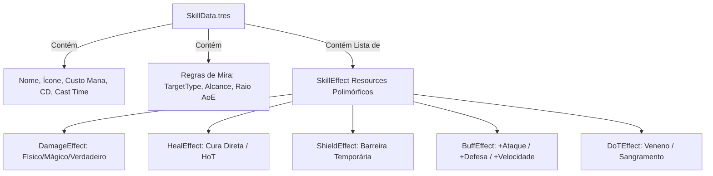
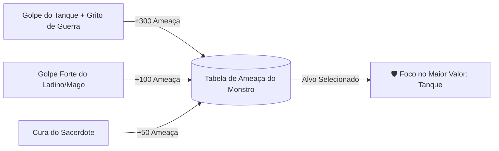

# ⚔️ 05. Sistema de Combate & Habilidades (Data-Driven)

Este documento detalha o sistema de combate, a modelagem de habilidades através de **Custom Resources da Godot Engine 4**, a biblioteca de efeitos polimórficos, as fórmulas matemáticas de mitigação e o sistema de ameaça/aggro em **Autodungeon**.

---

## 🪄 1. Arquitetura Data-Driven de Habilidades (`Resource`)

Habilidades em **Autodungeon** são puramente orientadas a dados (`Resource`), permitindo que designers criem e balanceiem novas magias diretamente no Inspector da Godot sem tocar em código.



### 1.1. `SkillData.gd` (Definição de Habilidade)
```gdscript
class_name SkillData
extends Resource

enum TargetType { ENEMY_SINGLE, ENEMY_AOE, ALLY_SINGLE, ALLY_AOE, SELF }
enum DamageClass { PHYSICAL, MAGICAL, TRUE_DAMAGE }

@export_group("Identificação")
@export var id: String = "fireball"
@export var skill_name: String = "Bola de Fogo"
@export var icon: Texture2D
@export_multiline var description: String = ""

@export_group("Custos & Tempos")
@export var mana_cost: int = 25
@export var cooldown_seconds: float = 6.0
@export var cast_time_seconds: float = 0.8 # Tempo de canalização/animação
@export var range_pixels: float = 200.0

@export_group("Regras de Alvo")
@export var target_type: TargetType = TargetType.ENEMY_SINGLE
@export var aoe_radius: float = 0.0

@export_group("Efeitos")
@export var effects: Array[SkillEffect] = []
```

### 1.2. `SkillEffect.gd` (Efeito Polimórfico Base)
```gdscript
class_name SkillEffect
extends Resource

func apply_effect(caster: CharacterEntity, target: CharacterEntity, aoe_targets: Array[CharacterEntity] = []) -> void:
    pass
```

### 1.3. `DamageEffect.gd` (Efeito Concreto de Dano)
```gdscript
class_name DamageEffect
extends SkillEffect

@export var base_damage: int = 50
@export var scaling_stat: String = "magic_attack" # ou "physical_attack"
@export var scaling_ratio: float = 1.2
@export var damage_type: HitData.DamageType = HitData.DamageType.MAGICAL

func apply_effect(caster: CharacterEntity, target: CharacterEntity, _aoe_targets: Array[CharacterEntity] = []) -> void:
    var stat_val: float = caster.stats.get_stat(scaling_stat)
    var raw_damage: int = int(round(float(base_damage) + (stat_val * scaling_ratio)))
    
    # Checagem de Crítico
    var crit_chance: float = caster.stats.get_stat("crit_chance")
    var is_crit: bool = randf() < crit_chance
    if is_crit:
        var crit_mult: float = caster.equipment.get_crit_multiplier() # Adagas 2.0x, Arcos 1.75x, Melee 1.5x
        raw_damage = int(round(float(raw_damage) * crit_mult))
        
    var hit: HitData = HitData.new()
    hit.amount = raw_damage
    hit.damage_type = damage_type
    hit.is_crit = is_crit
    hit.attacker = caster
    
    target.hurtbox.receive_hit(hit)
```

---

## 🧮 2. Fórmulas Matemáticas de Combate & Mitigação

Todas as fórmulas matemáticas especificadas no GDD são consolidadas em uma classe estática utilitária `CombatFormulas.gd`:

```gdscript
class_name CombatFormulas
extends RefCounted

const DEFENSE_CAP: float = 80.0
const MIN_DAMAGE: int = 1

## Mitigação Linear: Dano = Ataque * (1 - min(Defesa, 80) / 100)
static func calculate_mitigated_damage(raw_attack: int, defense: float) -> int:
    var capped_defense: float = minf(defense, DEFENSE_CAP)
    var mitigation_factor: float = 1.0 - (capped_defense / 100.0)
    var final_dmg: int = int(round(float(raw_attack) * mitigation_factor))
    return maxi(MIN_DAMAGE, final_dmg)

## Multiplicador de Crítico por Tipo de Arma
static func get_weapon_crit_multiplier(weapon_type: String) -> float:
    match weapon_type.to_lower():
        "dagger":
            return 2.00 # Adagas (200%)
        "bow", "crossbow":
            return 1.75 # Arcos e Bestas (175%)
        _:
            return 1.50 # Espadas, Machados, Cajados (150%)

## Dano Contínuo por Tick (DoT - Veneno / Sangramento)
static func calculate_dot_tick(caster_attack: float, effect_percent: float) -> int:
    var tick: int = int(round(caster_attack * effect_percent))
    return maxi(1, tick)
```

---

## 🛡️ 3. Sistema de Ameaça (Aggro & Threat Table)

Para que os Tanques (ex: *Bromm*, *Sir Alistair*) desempenhem seu papel protegendo a retaguarda, os monstros mantêm uma **Tabela de Ameaça** (`ThreatTable`):



### 3.1. `ThreatTable.gd`
```gdscript
class_name ThreatTable
extends RefCounted

var _threats: Dictionary = {} # CharacterEntity -> float

func add_threat(entity: CharacterEntity, amount: float) -> void:
    if not is_instance_valid(entity) or entity.health.is_dead:
        return
    _threats[entity] = _threats.get(entity, 0.0) + amount

func get_highest_threat_target() -> CharacterEntity:
    var best_target: CharacterEntity = null
    var max_val: float = -1.0
    
    for entity in _threats.keys():
        if not is_instance_valid(entity) or entity.health.is_dead:
            continue
        if _threats[entity] > max_val:
            max_val = _threats[entity]
            best_target = entity
            
    return best_target

func cleanup_dead_entities() -> void:
    for entity in _threats.keys():
        if not is_instance_valid(entity) or entity.health.is_dead:
            _threats.erase(entity)
```

---

## 🔴 4. Mecânica de Ataques Telegrafados do Chefe

Conforme as regras de chefes do GDD:
1. O Boss inicia a conjuração de um ataque massivo.
2. Uma área circular ou retangular vermelha é desenhada no chão via Shader/Sprite (`TelegraphArea2D`) com **1.5s de aviso sonoro e visual**.
3. Ao término do timer, os heróis que estiverem dentro da área sofrem o impacto do golpe supremo.

```gdscript
class_name BossTelegraphAttack
extends Node2D

@export var warning_duration: float = 1.5
@export var damage_amount: int = 150
@onready var telegraph_visual: Sprite2D = $TelegraphVisual
@onready var hit_area: Area2D = $HitArea

func trigger_telegraph(target_position: Vector2) -> void:
    global_position = target_position
    telegraph_visual.modulate = Color(1, 0, 0, 0.2)
    show()
    
    # Animação de pulso vermelho (Tween)
    var tween: Tween = create_tween()
    tween.tween_property(telegraph_visual, "modulate:a", 0.7, warning_duration)
    tween.finished.connect(_on_telegraph_detonated)

func _on_telegraph_detonated() -> void:
    var overlapping_bodies = hit_area.get_overlapping_bodies()
    for body in overlapping_bodies:
        if body is CharacterEntity and body.faction == CharacterEntity.Faction.PLAYER_HERO:
            var hit: HitData = HitData.new()
            hit.amount = damage_amount
            hit.damage_type = HitData.DamageType.PHYSICAL
            body.hurtbox.receive_hit(hit)
    queue_free()
```

---

## 🔗 Próximos Passos
* Continue para: **[06. Sistema de Itens, Inventário & Loot](06_sistema_itens_inventario_loot.md)**
* Voltar ao: **[Índice Geral](00_indice_arquitetura.md)**
