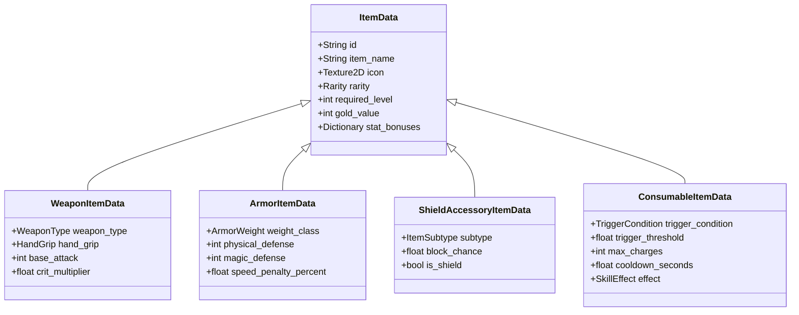
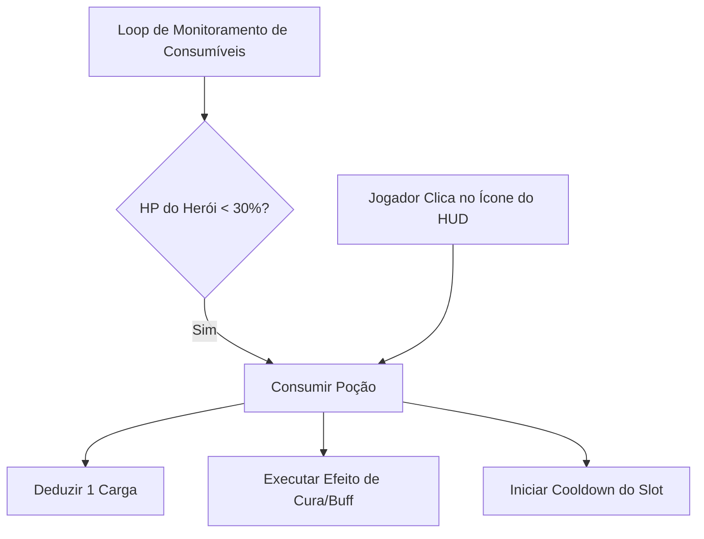

# 🎒 06. Sistema de Itens, Inventário & Loot (Data-Driven)

Este documento define a modelagem de itens e equipamentos via **Custom Resources**, o sistema de **Consumíveis com Gatilho Inato/Manual** e as **Tabelas de Loot (Loot Tables)** em **Autodungeon**.

---

## 📦 1. Hierarquia de Itens (`ItemData` Resource)

Todos os itens do jogo herdam de uma classe base `ItemData`, permitindo serialização, exibição em inventários e aplicação dinâmica de bônus de atributos:



### 1.1. `ItemData.gd` (Classe Base)
```gdscript
class_name ItemData
extends Resource

enum Rarity { COMMON, RARE, EPIC, LEGENDARY }

@export_group("Dados Básicos")
@export var id: String = "item_id"
@export var item_name: String = "Nome do Item"
@export var icon: Texture2D
@export var rarity: Rarity = Rarity.COMMON
@export var required_level: int = 1
@export var gold_value: int = 50
@export_multiline var description: String = ""

@export_group("Bônus de Atributos")
@export var stat_bonuses: Dictionary = {
    "max_hp": 0.0,
    "max_mana": 0.0,
    "armor": 0.0,
    "magic_resist": 0.0,
    "physical_attack": 0.0,
    "magic_attack": 0.0,
    "crit_chance": 0.0,
    "move_speed": 0.0
}
```

---

## 🛡️ 2. Sistema de Equipamentos (3 Slots de Equipamento)

Cada herói possui exatamente 3 slots de equipamento no `EquipmentComponent`:

1. **Slot 1 (Arma):** Arma de 1 Mão (1H), 2 Mãos (2H) ou Empunhadura Dupla (Dual Wield).
2. **Slot 2 (Armadura de Corpo):** Armadura Leve (Túnica), Média (Couro) ou Pesada (Placas com penalidade de velocidade).
3. **Slot 3 (Secundário / Acessório):** Escudo (concede % de bloqueio físico total) ou Acessório (Anel, Amuleto, Livro, Grimório).

```gdscript
class_name EquipmentComponent
extends Node

signal equipment_changed(slot_index: int, item: ItemData)

var slot_weapon: WeaponItemData
var slot_armor: ArmorItemData
var slot_shield_accessory: ShieldAccessoryItemData

var _stats: StatsComponent

func setup(stats: StatsComponent) -> void:
    _stats = stats

func equip_item(slot_index: int, item: ItemData) -> void:
    match slot_index:
        1:
            if item is WeaponItemData:
                slot_weapon = item
        2:
            if item is ArmorItemData:
                slot_armor = item
        3:
            if item is ShieldAccessoryItemData:
                slot_shield_accessory = item
                
    _recalculate_equipment_stats()
    equipment_changed.emit(slot_index, item)

func _recalculate_equipment_stats() -> void:
    # Remove modificadores antigos e aplica bônus dos itens equipados no StatsComponent
    pass

func has_shield() -> bool:
    return slot_shield_accessory != null and slot_shield_accessory.is_shield

func get_crit_multiplier() -> float:
    if slot_weapon:
        return slot_weapon.crit_multiplier
    return 1.5
```

---

## 🧪 3. Sistema de Consumíveis (Gatilho Inato & Manual)

Cada herói possui até 2 slots de consumíveis (Slot 1 desbloqueado no Nv 1, Slot 2 no Nv 6). O consumo pode ocorrer de duas formas:
1. **Gatilho Inato Automático:** A IA monitora as condições (ex: `HP < 30%`) e dispara a poção imediatamente.
2. **Toque Manual:** O jogador clica no ícone da poção no HUD de Batalha.



```gdscript
class_name ConsumableSlot
extends RefCounted

signal charges_changed(remaining: int, max_val: int)
signal cooldown_started(duration: float)

var item: ConsumableItemData
var current_charges: int = 1
var is_on_cooldown: bool = false
var _cooldown_timer: float = 0.0

func setup(data: ConsumableItemData) -> void:
    item = data
    current_charges = data.max_charges

func check_auto_trigger(hero: CharacterEntity) -> bool:
    if not item or current_charges <= 0 or is_on_cooldown:
        return false
        
    match item.trigger_condition:
        ConsumableItemData.TriggerCondition.HP_BELOW_PERCENT:
            var hp_pct: float = float(hero.health.current_hp) / float(hero.health.max_hp)
            return hp_pct <= item.trigger_threshold
            
        ConsumableItemData.TriggerCondition.MANA_BELOW_PERCENT:
            var mp_pct: float = float(hero.health.current_mana) / float(hero.health.max_mana)
            return mp_pct <= item.trigger_threshold
            
    return false

func use_consumable(hero: CharacterEntity) -> bool:
    if not item or current_charges <= 0 or is_on_cooldown:
        return false
        
    current_charges -= 1
    is_on_cooldown = true
    _cooldown_timer = item.cooldown_seconds
    
    # Aplica o efeito no herói
    if item.effect:
        item.effect.apply_effect(hero, hero)
        
    charges_changed.emit(current_charges, item.max_charges)
    cooldown_started.emit(item.cooldown_seconds)
    return true
```

---

## 🎁 4. Sistema de Loot e Recompensas (Loot Table RNG)

O cálculo de drops do jogo é gerenciado por `LootTableResource.gd`:

```gdscript
class_name LootTableResource
extends Resource

@export var drop_chance: float = 0.20 # 20% nos monstros comuns

@export_group("Pesos de Itens")
@export var common_weight: float = 0.70
@export var rare_weight: float = 0.25
@export var epic_weight: float = 0.05
@export var legendary_weight: float = 0.00

@export var item_pool: Array[ItemData] = []

func generate_mob_drop(dungeon_level: int) -> Array[ItemData]:
    var drops: Array[ItemData] = []
    if randf() > drop_chance:
        return drops # Nenhum drop
        
    var selected_item: ItemData = _roll_random_item(dungeon_level)
    if selected_item:
        drops.append(selected_item)
    return drops

func generate_boss_chest_rewards(dungeon_level: int) -> Dictionary:
    var total_gold: int = 50 * dungeon_level
    var items: Array[ItemData] = []
    
    # Gera 2 a 3 itens de alta raridade (60% Raro, 30% Épico, 10% Lendário)
    var count: int = randi_range(2, 3)
    for i in range(count):
        var roll: float = randf()
        var target_rarity: ItemData.Rarity = ItemData.Rarity.RARE
        if roll > 0.90:
            target_rarity = ItemData.Rarity.LEGENDARY
        elif roll > 0.60:
            target_rarity = ItemData.Rarity.EPIC
            
        var item: ItemData = _get_item_by_rarity(target_rarity, dungeon_level)
        if item:
            items.append(item)
            
    return {
        "gold": total_gold,
        "items": items
    }

func _roll_random_item(_level: int) -> ItemData:
    if item_pool.is_empty():
        return null
    return item_pool.pick_random()

func _get_item_by_rarity(target_rarity: ItemData.Rarity, _level: int) -> ItemData:
    var matching = item_pool.filter(func(item): return item.rarity == target_rarity)
    if not matching.is_empty():
        return matching.pick_random()
    return item_pool.pick_random() if not item_pool.is_empty() else null
```

---

## 🔗 Próximos Passos
* Continue para: **[07. Navegação, Dungeon & Fases](07_navegacao_dungeon_e_fases.md)**
* Voltar ao: **[Índice Geral](00_indice_arquitetura.md)**
