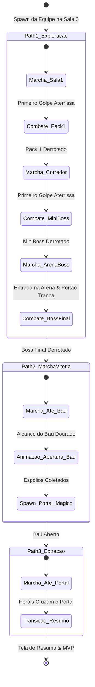

# 🗺️ 07. Navegação, Masmorra & Sequenciamento de Fases

Este documento define a arquitetura da masmorra, a integração com o **`NavigationServer2D` da Godot 4.x**, o sequenciamento dos **3 Trajetos (Paths 1, 2 e 3)** e o controle de encontros e portas de arena pelo `DungeonManager`.

---

## 🧭 1. Os 3 Trajetos de Pathfinding (Sequenciador)

A progressão da masmorra é estritamente orquestrada em 3 caminhos lineares ativados em sequência:



---

## 🏛️ 2. Arquitetura da Cena da Masmorra (`GrayboxDungeon.tscn`)

A cena do nível é composta por camadas bem definidas:

```text
GrayboxDungeon (Node2D)
├── TileMapLayer_Ground (TileMapLayer)       <- Chão e visual do piso
├── TileMapLayer_Walls (TileMapLayer)        <- Paredes com colisão estática
├── NavigationRegion2D                       <- NavMesh 2D gerado para navegação
├── WaypointsContainer (Node2D)              <- Marcadores dos 3 Paths (Markers2D)
│   ├── Path1_Markers (Node2D)
│   ├── Path2_ChestMarker (Marker2D)
│   └── Path3_PortalMarker (Marker2D)
├── EncounterZones (Node2D)                  <- Gatilhos e spawners de monstros
│   ├── Encounter_Room1 (Node2D)
│   ├── Encounter_Room2_MiniBoss (Node2D)
│   └── Encounter_BossRoom (Node2D)
├── ArenaGate (StaticBody2D)                 <- Portão que tranca a entrada do Boss
├── GoldenChest (Area2D)                     <- Baú do Tesouro Dourado
├── ExtractionPortal (Area2D)                <- Portal Mágico de Saída
├── PartyContainer (Node2D)                  <- Container com os 3 heróis instanciados
└── DungeonManager (Node)                    <- Controlador mestre da execução
```

---

## 🎮 3. `DungeonManager.gd` (Controlador Mestre da Masmorra)

```gdscript
class_name DungeonManager
extends Node

enum DungeonStage { PATH1_EXPLORATION, PATH2_VICTORY_CHEST, PATH3_EXTRACTION, COMPLETED, WIPED }

@export var dungeon_level: int = 1
@export var current_stage: DungeonStage = DungeonStage.PATH1_EXPLORATION

@onready var party_controller: PartyFormationController = $PartyFormationController
@onready var arena_gate: ArenaGate = $ArenaGate
@onready var golden_chest: GoldenChest = $GoldenChest
@onready var extraction_portal: ExtractionPortal = $ExtractionPortal

var current_waypoint_index: int = 0
var path1_waypoints: Array[Vector2] = []
var active_encounter_enemies: Array[CharacterEntity] = []

func _ready() -> void:
    EventBus.combat_engagement_triggered.connect(_on_combat_started)
    EventBus.boss_defeated.connect(_on_boss_defeated)
    EventBus.chest_opened.connect(_on_chest_opened)
    EventBus.entity_died.connect(_on_entity_died)
    
    _initialize_waypoints()
    _start_path1_exploration()

func _initialize_waypoints() -> void:
    for marker in $WaypointsContainer/Path1_Markers.get_children():
        if marker is Marker2D:
            path1_waypoints.append(marker.global_position)

func _physics_process(delta: float) -> void:
    match current_stage:
        DungeonStage.PATH1_EXPLORATION:
            if not party_controller.is_in_combat and current_waypoint_index < path1_waypoints.size():
                var target: Vector2 = path1_waypoints[current_waypoint_index]
                party_controller.update_party_movement(target, delta)
                
                # Checa se o líder alcançou o waypoint
                if party_controller.get_leader_position().distance_to(target) < 25.0:
                    current_waypoint_index += 1
                    
        DungeonStage.PATH2_VICTORY_CHEST:
            party_controller.update_party_movement(golden_chest.global_position, delta)
            if party_controller.get_leader_position().distance_to(golden_chest.global_position) < 30.0:
                golden_chest.interact()
                
        DungeonStage.PATH3_EXTRACTION:
            party_controller.update_party_movement(extraction_portal.global_position, delta)

func _on_combat_started(_initiator: Node2D, _target: Node2D) -> void:
    party_controller.enter_combat_mode()

func _on_encounter_cleared() -> void:
    party_controller.resume_marching_mode()

func _on_boss_defeated() -> void:
    current_stage = DungeonStage.PATH2_VICTORY_CHEST
    EventBus.boss_defeated_feedback.emit()
    # Ativa marcha em direção ao baú
    party_controller.resume_marching_mode()

func _on_chest_opened(loot: Array[ItemData], gold: int) -> void:
    current_stage = DungeonStage.PATH3_EXTRACTION
    extraction_portal.activate()

func _on_entity_died(entity: CharacterEntity) -> void:
    if entity.faction == CharacterEntity.Faction.PLAYER_HERO:
        # Checa se todos os 3 heróis morreram (Wipe)
        if party_controller.are_all_heroes_dead():
            current_stage = DungeonStage.WIPED
            EventBus.dungeon_wiped.emit()
```

---

## 🚪 4. Tranca de Portão & Arena do Chefe (`ArenaGate.gd`)

Ao entrar na sala do Chefe:
1. Um gatilho `Area2D` detecta a entrada do Tanque.
2. O portão `ArenaGate` fecha sua colisão e ativa sua animação de tranca, impedindo recuo.
3. A música de fundo transiciona para o tema do Boss via `AudioManager`.

```gdscript
class_name ArenaGate
extends StaticBody2D

@onready var collision_shape: CollisionShape2D = $CollisionShape2D
@onready var visual_gate: Sprite2D = $VisualGate

func lock_gate() -> void:
    collision_shape.set_deferred("disabled", false)
    visual_gate.frame = 1 # Frame de portão fechado
    EventBus.boss_room_entered.emit()

func unlock_gate() -> void:
    collision_shape.set_deferred("disabled", true)
    visual_gate.frame = 0 # Aberto
```

---

## 🔗 Próximos Passos
* Continue para: **[08. UI, HUD & EventBus](08_ui_hud_e_eventbus.md)**
* Voltar ao: **[Índice Geral](00_indice_arquitetura.md)**
