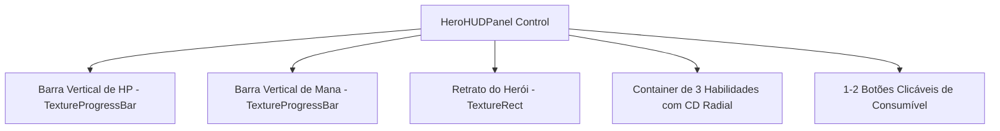

# 🖥️ 08. Interface (UI/UX), HUD & EventBus Global

Este documento detalha o desacoplamento entre UI e Gameplay via **EventBus**, a implementação do **HUD de Batalha**, o **Object Pooler de Números Flutuantes de Dano (Floating Combat Text)** e o cálculo do **MVP na Tela de Resumo** em **Autodungeon**.

---

## 📡 1. O Barramento Global de Sinais (`EventBus.gd`)

Para manter a interface e os sistemas de jogo 100% desacoplados (sem referências diretas), todas as notificações trafegam através do Singleton `EventBus`:

```gdscript
# res://src/core/EventBus.gd (Autoload)
extends Node

# --- Sinais de Combate & Entidades ---
signal entity_damaged(target: CharacterEntity, amount: int, damage_type: int, is_crit: bool)
signal entity_healed(target: CharacterEntity, amount: int)
signal entity_blocked(target: CharacterEntity)
signal entity_dodged(target: CharacterEntity)
signal entity_died(entity: CharacterEntity)
signal skill_cast_started(caster: CharacterEntity, skill: SkillData)
signal skill_cooldown_updated(caster: CharacterEntity, slot_index: int, current_cd: float, max_cd: float)

# --- Sinais de Masmorra & Navegação ---
signal combat_engagement_triggered(initiator: Node2D, target: Node2D)
signal encounter_cleared(encounter_index: int)
signal boss_room_entered()
signal boss_defeated()
signal boss_defeated_feedback()
signal chest_opened(loot: Array[ItemData], gold: int)
signal extraction_portal_entered()
signal dungeon_completed()
signal dungeon_wiped()

# --- Sinais de Inventário & Itens ---
signal item_collected(item: ItemData)
signal gold_collected(amount: int)
signal consumable_used(hero_index: int, slot_index: int, remaining_charges: int)
```

---

## 🎮 2. Arquitetura do HUD de Batalha (`BattleHUD.tscn`)

O HUD reside em um `CanvasLayer` e escuta o `EventBus` para atualizar seus elementos reativamente:

```text
BattleHUD (CanvasLayer)
├── TopBar (Control)
│   ├── TimerLabel (Label - Cronômetro mm:ss)
│   ├── GoldCounter (HBoxContainer - Ícone + Valor)
│   └── ItemCounter (HBoxContainer - Ícone + Valor)
├── HeroPanelsContainer (HBoxContainer - 3 Painéis Alinhados)
│   ├── HeroPanel_0 (HeroHUDPanel)
│   ├── HeroPanel_1 (HeroHUDPanel)
│   └── HeroPanel_2 (HeroHUDPanel)
└── FloatingTextPool (Node2D - Object Pooler)
```

### 2.1. Anatomia do `HeroHUDPanel.tscn`



```gdscript
# HeroHUDPanel.gd
class_name HeroHUDPanel
extends Control

@export var hero_index: int = 0

@onready var hp_bar: TextureProgressBar = $HPBarVertical
@onready var mp_bar: TextureProgressBar = $MPBarVertical
@onready var portrait: TextureRect = $HeroPortrait
@onready var skill_buttons: Array[TextureProgressBar] = [$Skills/Skill1_CD, $Skills/Skill2_CD, $Skills/Skill3_CD]
@onready var potion_button: Button = $Potions/PotionSlot1

var bound_hero: CharacterEntity

func bind_hero(hero: CharacterEntity) -> void:
    bound_hero = hero
    portrait.texture = hero.stats.base_data.portrait_texture
    
    # Conexão direta ou via EventBus
    hero.health.health_changed.connect(_on_health_changed)
    hero.health.mana_changed.connect(_on_mana_changed)
    _on_health_changed(hero.health.current_hp, hero.health.max_hp)
    _on_mana_changed(hero.health.current_mana, hero.health.max_mana)

func _on_health_changed(current: int, max_val: int) -> void:
    hp_bar.max_value = max_val
    hp_bar.value = current

func _on_mana_changed(current: int, max_val: int) -> void:
    mp_bar.max_value = max_val
    mp_bar.value = current

func _on_potion_button_pressed() -> void:
    if bound_hero and bound_hero.equipment:
        bound_hero.equipment.use_consumable_slot(1)
```

---

## 💥 3. Object Pooler de Texto Flutuante (`FloatingCombatTextPool.gd`)

Para evitar alocações de memória constantes durante o combate, os números de dano são reciclados em um pool pré-alocado:

```gdscript
class_name FloatingCombatTextPool
extends Node2D

@export var text_scene: PackedScene
@export var pool_size: int = 40

var _pool: Array[FloatingCombatText] = []

func _ready() -> void:
    EventBus.entity_damaged.connect(_on_entity_damaged)
    EventBus.entity_healed.connect(_on_entity_healed)
    EventBus.entity_blocked.connect(_on_entity_blocked)
    
    for i in range(pool_size):
        var instance: FloatingCombatText = text_scene.instantiate()
        instance.hide()
        add_child(instance)
        _pool.append(instance)

func spawn_text(pos: Vector2, text: String, color: Color, is_crit: bool = false) -> void:
    var item: FloatingCombatText = _get_available_item()
    if item:
        item.display(pos, text, color, is_crit)

func _on_entity_damaged(target: CharacterEntity, amount: int, _type: int, is_crit: bool) -> void:
    var color: Color = Color.WHITE if target.faction == CharacterEntity.Faction.ENEMY_MOB else Color.CRIMSON
    if is_crit:
        color = Color.GOLD
    spawn_text(target.global_position + Vector2(0, -20), str(amount), color, is_crit)

func _on_entity_healed(target: CharacterEntity, amount: int) -> void:
    spawn_text(target.global_position + Vector2(0, -20), "+" + str(amount), Color.GREEN, false)

func _on_entity_blocked(target: CharacterEntity) -> void:
    spawn_text(target.global_position + Vector2(0, -20), "BLOQUEIO", Color.DODGER_BLUE, false)

func _get_available_item() -> FloatingCombatText:
    for item in _pool:
        if not item.is_active:
            return item
    return null
```

---

## 🏆 4. Tela de Resumo & Cálculo de Pontuação MVP

Ao cruzar o portal de saída, a tela de resumo exibe as métricas de combate e calcula o **MVP da Partida**:

$$\text{Pontuação} = \text{Dano Causado} + (\text{Dano Mitigado/Bloqueado} \times 0.8) + (\text{Cura Realizada} \times 1.2)$$

```gdscript
class_name MatchSummaryCalculator
extends RefCounted

static func calculate_mvp_score(damage_dealt: int, damage_mitigated: int, healing_done: int) -> float:
    return float(damage_dealt) + (float(damage_mitigated) * 0.8) + (float(healing_done) * 1.2)

static func determine_party_mvp(heroes_metrics: Array[HeroBattleMetrics]) -> HeroBattleMetrics:
    var best_hero: HeroBattleMetrics = null
    var highest_score: float = -1.0
    
    for metric in heroes_metrics:
        var score: float = calculate_mvp_score(metric.damage_dealt, metric.damage_mitigated, metric.healing_done)
        if score > highest_score:
            highest_score = score
            best_hero = metric
            
    return best_hero
```

---

## 🔗 Próximos Passos
* Continue para: **[09. GameManager & Persistência](09_gamemanager_e_persistencia.md)**
* Voltar ao: **[Índice Geral](00_indice_arquitetura.md)**
