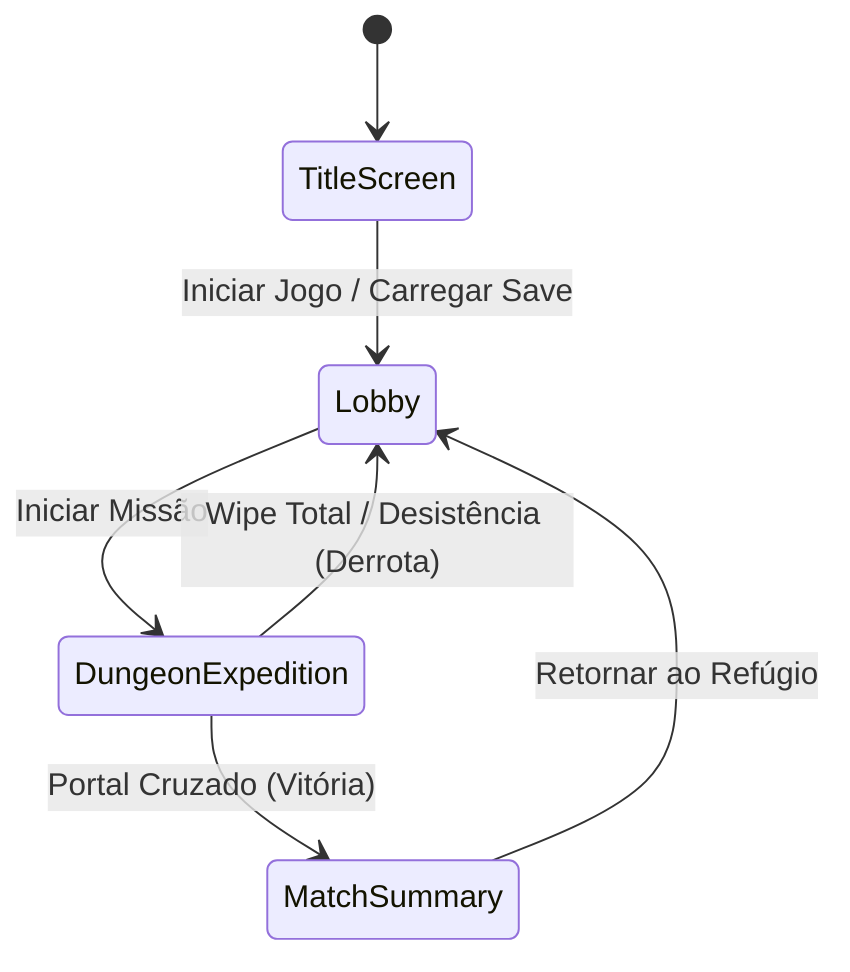
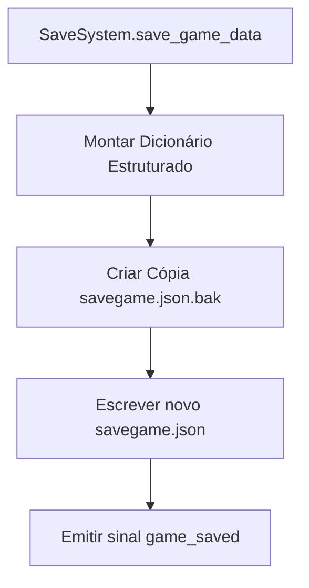

# 💾 09. GameManager, Persistência & Áudio

Este documento detalha o fluxo global da aplicação através do **GameManager**, o sistema de salvamento seguro (**SaveSystem**) e a arquitetura de canais de som (**AudioManager**) em **Autodungeon**.

---

## 🕹️ 1. O Gerenciador Global da Aplicação (`GameManager.gd`)

O `GameManager` é um Singleton (Autoload) responsável pela máquina de estados de nível macro da aplicação e pela transição fluida de cenas:



```gdscript
# res://src/core/GameManager.gd (Autoload)
extends Node

enum AppState { TITLE, LOBBY, DUNGEON, SUMMARY }

var current_app_state: AppState = AppState.TITLE
var selected_party: Array[HeroData] = [] # 3 Heróis ativos escolhidos no Lobby
var active_dungeon_level: int = 1

# Referência da tela de transição (Fade In / Fade Out)
@onready var _fader: CanvasLayer = $SceneFader

func _ready() -> void:
    SaveSystem.load_game_data()

func transition_to_dungeon(dungeon_level: int, party: Array[HeroData]) -> void:
    selected_party = party
    active_dungeon_level = dungeon_level
    current_app_state = AppState.DUNGEON
    _change_scene_with_fade("res://src/dungeon/GrayboxDungeon.tscn")

func transition_to_summary(summary_data: Dictionary) -> void:
    current_app_state = AppState.SUMMARY
    _change_scene_with_fade("res://src/ui/summary/SummaryScreen.tscn", summary_data)

func transition_to_lobby() -> void:
    current_app_state = AppState.LOBBY
    _change_scene_with_fade("res://src/ui/lobby/LobbyScreen.tscn")

func _change_scene_with_fade(target_scene_path: String, _extra_args: Dictionary = {}) -> void:
    # Animação de fade-out -> get_tree().change_scene_to_file -> fade-in
    get_tree().change_scene_to_file(target_scene_path)
```

---

## 💾 2. Sistema de Salvamento & Serialização (`SaveSystem.gd`)

Para assegurar a integridade do progresso do jogador (ouro, heróis destravados, níveis e inventário), os dados são serializados em formato JSON no diretório seguro do usuário `user://savegame.json`, com sistema de cópia de segurança (`.bak`).



### 2.1. Estrutura do Dicionário de Save (JSON Schema)
```json
{
  "version": 1,
  "timestamp": 1755280000,
  "player_profile": {
    "gold": 1250,
    "highest_unlocked_dungeon": 4
  },
  "heroes": [
    {
      "hero_id": "bromm",
      "level": 6,
      "current_xp": 450,
      "equipped_items": {
        "slot_1": "sword_iron_01",
        "slot_2": "plate_iron_01",
        "slot_3": "shield_wood_01"
      },
      "equipped_skills": ["charge", "defensive_stance", "shield_slam"],
      "equipped_consumables": ["lesser_health_potion", "none"]
    }
  ],
  "inventory": [
    "dagger_steel_01",
    "bow_oak_01",
    "leather_armor_01"
  ]
}
```

### 2.2. Implementação do `SaveSystem.gd`
```gdscript
# res://src/core/SaveSystem.gd (Autoload)
extends Node

const SAVE_PATH: String = "user://savegame.json"
const BACKUP_PATH: String = "user://savegame.json.bak"

signal game_saved()
signal game_loaded()

var save_data: Dictionary = {}

func save_game_data() -> bool:
    var json_string: String = JSON.stringify(save_data, "\t")
    
    # Cria backup antes de sobrescrever
    if FileAccess.file_exists(SAVE_PATH):
        DirAccess.copy_absolute(SAVE_PATH, BACKUP_PATH)
        
    var file = FileAccess.open(SAVE_PATH, FileAccess.WRITE)
    if not file:
        push_error("Erro ao abrir arquivo para salvar: " + str(FileAccess.get_open_error()))
        return false
        
    file.store_string(json_string)
    file.close()
    game_saved.emit()
    return true

func load_game_data() -> bool:
    if not FileAccess.file_exists(SAVE_PATH):
        _create_default_save()
        return true
        
    var file = FileAccess.open(SAVE_PATH, FileAccess.READ)
    if not file:
        return false
        
    var content: String = file.get_as_text()
    file.close()
    
    var parsed = JSON.parse_string(content)
    if parsed is Dictionary:
        save_data = parsed
        game_loaded.emit()
        return true
    else:
        push_error("Save corrompido! Tentando restaurar do backup...")
        return _restore_backup()

func _create_default_save() -> void:
    save_data = {
        "version": 1,
        "player_profile": { "gold": 0, "highest_unlocked_dungeon": 1 },
        "heroes": [],
        "inventory": []
    }
    save_game_data()

func _restore_backup() -> bool:
    if FileAccess.file_exists(BACKUP_PATH):
        DirAccess.copy_absolute(BACKUP_PATH, SAVE_PATH)
        return load_game_data()
    return false
```

---

## 🔊 3. Gerenciador de Áudio & Canais SFX (`AudioManager.gd`)

Em jogos com combate automático intenso, sons repetitivos podem causar fadiga auditiva. O `AudioManager` aplica variação sutil de **Pitch Randomization** (0.9 a 1.1) em cada golpe e faz **Crossfade** automático entre trilhas de exploração e combate do Boss:

```gdscript
# res://src/core/AudioManager.gd (Autoload)
extends Node

@onready var music_player: AudioStreamPlayer = $MusicPlayer
@onready var sfx_pool: Node = $SFXPool

func play_sfx(stream: AudioStream, randomize_pitch: bool = true) -> void:
    var player: AudioStreamPlayer = _get_available_sfx_player()
    if player and stream:
        player.stream = stream
        if randomize_pitch:
            player.pitch_scale = randf_range(0.92, 1.08)
        else:
            player.pitch_scale = 1.0
        player.play()

func play_music(stream: AudioStream, fade_duration: float = 1.0) -> void:
    if music_player.stream == stream:
        return
        
    var tween: Tween = create_tween()
    tween.tween_property(music_player, "volume_db", -80.0, fade_duration * 0.5)
    tween.tween_callback(func():
        music_player.stream = stream
        music_player.play()
    )
    tween.tween_property(music_player, "volume_db", 0.0, fade_duration * 0.5)

func _get_available_sfx_player() -> AudioStreamPlayer:
    for child in sfx_pool.get_children():
        if child is AudioStreamPlayer and not child.playing:
            return child
    return null
```

---

## 🔗 Próximos Passos
* Voltar ao: **[Índice Geral da Arquitetura Técnica](00_indice_arquitetura.md)**
* Consultar o: **[Índice Geral do GDD](../00_indice.md)**
