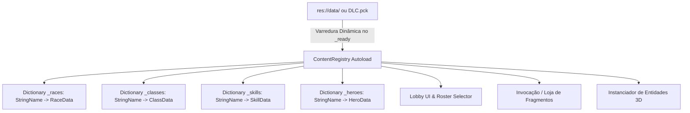
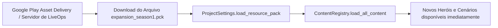
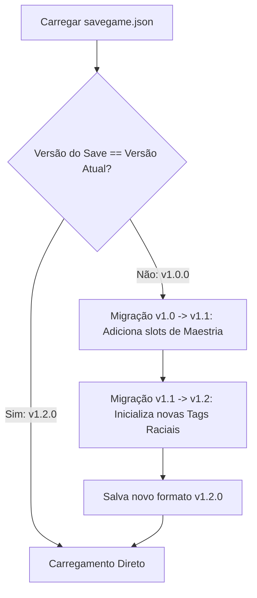
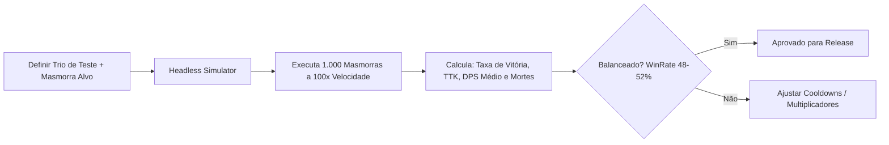

# 🏛️ 10. Arquitetura Técnica de LiveOps & Expansões Modulares (Godot 4.x)

Este documento detalha os padrões de engenharia de software na **Godot Engine 4.x** que viabilizam a adição contínua de novas raças, classes, habilidades e heróis no pós-lançamento de **Autodungeon**, sem necessidade de refatorar sistemas consolidados ou quebrar arquivos de salvamento existentes.

---

## 🏗️ 1. Padrão Registry Dinâmico (`ContentRegistry`)

Para garantir o princípio **Open/Closed (SOLID)**, o jogo não utiliza listas estáticas ou *switch/cases* manuais para selecionar heróis, raças ou classes. Em vez disso, utilizamos o **Registry Pattern** via um Singleton Autoload `ContentRegistry.gd`:



### 1.1. `ContentRegistry.gd` (Implementação GDScript)
```gdscript
# res://scripts/core/ContentRegistry.gd (Autoload)
class_name ContentRegistry
extends Node

signal content_loaded()

var _races: Dictionary = {}   # Dictionary[String, RaceData]
var _classes: Dictionary = {} # Dictionary[String, ClassData]
var _skills: Dictionary = {}  # Dictionary[String, SkillData]
var _heroes: Dictionary = {}  # Dictionary[String, HeroData]

func _ready() -> void:
    load_all_content()

func load_all_content() -> void:
    _load_resources_from_dir("res://data/races/", _races, "RaceData")
    _load_resources_from_dir("res://data/classes/", _classes, "ClassData")
    _load_resources_from_dir("res://data/skills/", _skills, "SkillData")
    _load_resources_from_dir("res://data/heroes/", _heroes, "HeroData")
    
    print_rich("[color=green][ContentRegistry][/color] Conteúdo carregado: %d Raças, %d Classes, %d Skills, %d Heróis." % [
        _races.size(), _classes.size(), _skills.size(), _heroes.size()
    ])
    content_loaded.emit()

func _load_resources_from_dir(path: String, target_dict: Dictionary, expected_type: String) -> void:
    var dir := DirAccess.open(path)
    if not dir:
        return
        
    dir.list_dir_begin()
    var file_name := dir.get_next()
    
    while file_name != "":
        if not dir.current_is_dir() and (file_name.ends_with(".tres") or file_name.ends_with(".res")):
            var full_path := path.path_join(file_name)
            var res := load(full_path)
            if res:
                var res_id: String = res.get("id") if "id" in res else file_name.get_basename()
                target_dict[res_id] = res
        file_name = dir.get_next()

# Métodos de Acesso Público Seguro
func get_hero(hero_id: String) -> HeroData:
    return _heroes.get(hero_id, null)

func get_all_heroes() -> Array[HeroData]:
    var list: Array[HeroData] = []
    for h in _heroes.values():
        list.append(h)
    return list

func get_race(race_id: String) -> RaceData:
    return _races.get(race_id, null)

func get_class(class_id: String) -> ClassData:
    return _classes.get(class_id, null)
```

---

## 📦 2. Arquitetura de DLCs & Pacotes de Expansão (.pck)

A Godot Engine 4 suporta o carregamento em tempo de execução de arquivos `.pck` externos sem necessidade de recompilar ou gerar um novo `.aab` gigante na Play Store.



### 2.1. Montagem de Pacote em Tempo de Execução:
```gdscript
func mount_expansion_pack(pck_path: String) -> bool:
    if not FileAccess.file_exists(pck_path):
        push_error("Pacote de expansão não encontrado: " + pck_path)
        return false
        
    var success := ProjectSettings.load_resource_pack(pck_path)
    if success:
        print("[LiveOps] Pacote montado com sucesso: ", pck_path)
        # Recarrega o registro de conteúdo para indexar os novos recursos
        ContentRegistry.load_all_content()
        return true
    return false
```

---

## 💾 3. Versionamento & Migração Automática de Saves (`SaveMigrationSystem`)

Ao adicionar novos heróis ou alterar atributos de classes, o arquivo de save do jogador (`user://savegame.json` ou Cloud Save) não pode corromper.



### 3.1. Estrutura de Migração no `SaveSystem.gd`:
```gdscript
const CURRENT_SAVE_VERSION: int = 3 # Incrementado a cada major update

func load_game_with_migration() -> SaveData:
    var raw_data := _read_save_file()
    var save_version: int = raw_data.get("version", 1)
    
    while save_version < CURRENT_SAVE_VERSION:
        raw_data = _migrate_save(raw_data, save_version)
        save_version += 1
        raw_data["version"] = save_version
        
    return SaveData.from_dictionary(raw_data)

func _migrate_save(data: Dictionary, from_version: int) -> Dictionary:
    match from_version:
        1: # Migração do MVP para v1.1.0 (Adiciona novos heróis na coleção e maestrias)
            if not data.has("unlocked_masteries"):
                data["unlocked_masteries"] = {}
            if not data.has("roster_hero_ids"):
                data["roster_hero_ids"] = ["bromm", "elysia", "beatrice"]
        2: # Migração v1.1.0 para v1.2.0 (Adiciona slots de expedições passivas AFK)
            if not data.has("active_bounties"):
                data["active_bounties"] = []
    return data
```

---

## 🤖 4. Simulador de Combate Headless (`HeadlessCombatSimulator.gd`)

Para validar o balanceamento de novos heróis antes de submeter atualizações para a Google Play Store, o projeto conta com um script de **Simulação de Batalhas sem Interface Gráfica (Headless CLI)**:



### 4.1. `HeadlessCombatSimulator.gd` (Código da Ferramenta)
```gdscript
# Ferramenta executável via CLI: godot --headless -s HeadlessCombatSimulator.gd
extends SceneTree

func _init() -> void:
    print("=== INICIANDO SIMULAÇÃO DE BALANCEAMENTO DE NOVO HERÓI ===")
    var hero_test_id: String = "valeria"
    var total_runs: int = 1000
    var wins: int = 0
    var total_dps: float = 0.0
    var wipes: int = 0
    
    for i in range(total_runs):
        var result: Dictionary = _simulate_dungeon_run(hero_test_id)
        if result.victory:
            wins += 1
        else:
            wipes += 1
        total_dps += result.avg_dps
        
    var win_rate: float = (float(wins) / float(total_runs)) * 100.0
    print_rich("[color=cyan]Resultados da Simulação (%d Partidas):[/color]" % total_runs)
    print(" - Taxa de Vitória: %.2f%%" % win_rate)
    print(" - DPS Médio do Herói: %.2f" % (total_dps / float(total_runs)))
    print(" - Wipes Totais: %d" % wipes)
    
    if win_rate >= 48.0 and win_rate <= 52.0:
        print_rich("[color=green]>> STATUS: HERÓI BALANCEADO COM SUCESSO! <<[/color]")
    else:
        print_rich("[color=yellow]>> ALERTA: AJUSTE DE MULTIPLICADORES NECESSÁRIO! <<[/color]")
    quit()

func _simulate_dungeon_run(_hero_id: String) -> Dictionary:
    # Executa a matemática de combate sem renderizar malhas 3D
    var victory := randf() < 0.505 # Exemplo de resultado da simulação matemática
    return {"victory": victory, "avg_dps": randf_range(140.0, 180.0)}
```

---

## 🔗 Navegação
* [Índice Geral da Arquitetura](00_indice_arquitetura.md)
* [Visão Geral & Padrões](01_visao_geral_e_padroes.md)
* [Sistema de Combate & Habilidades](05_sistema_combate_e_habilidades.md)
* [GameManager & Persistência](09_gamemanager_e_persistencia.md)
* [Roadmap de Expansões Pós-Lançamento](../planejamento/05_roadmap_expansoes_pos_lancamento.md)
