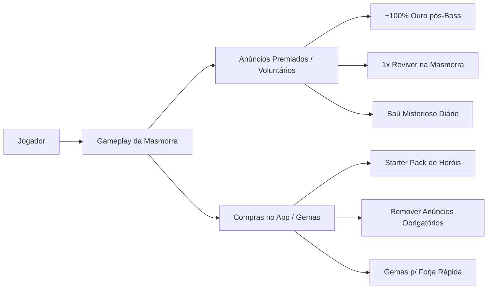
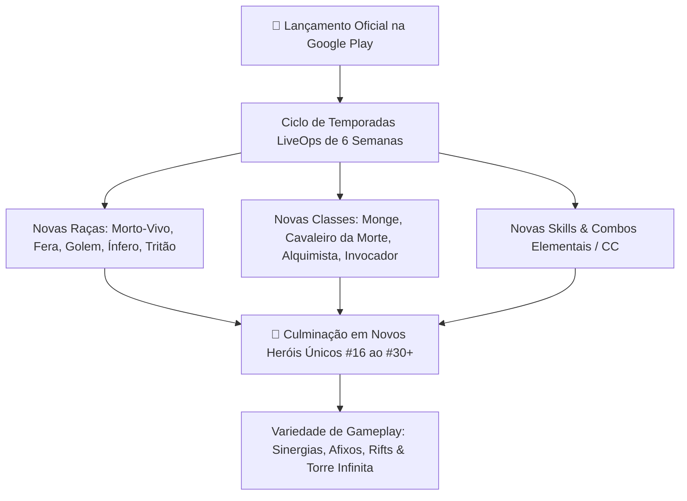

# 📱 Roadmap Comercial & Guia de Publicação na Google Play Store — Autodungeon

Este documento define os requisitos de **engenharia, negócios, arte, compliance e monetização** necessários para transformar a base técnica de **Autodungeon** em um produto comercial 3D lançado e monetizado na **Google Play Store**.

---

## 🎯 1. Diagnóstico de Viabilidade: O que Temos vs. O que Falta

```mermaid
graph TD
    subgraph Ja_Construido [Fundação Pronta (Engenharia & Design)]
        GDD[GDD 2.0: 160 Docs / Fórmulas / Balanceamento]
        Arch[Arquitetura Godot 4.x 3D: Nós / FSM / Custom Resources]
        Plan[Planejamento M0-M8: Git LFS / Rollback / SemVer]
    end

    subgraph Pilares_Faltantes [Pilares Comerciais Mobile a Integrar]
        Monet[1. Monetização & Economia Freemium]
        Art3D[2. Pipeline de Arte 3D & Áudio Mobile]
        OptMob[3. Otimização Godot Mobile]
        PlayStore[4. Requisitos Google Play Console & 20 Testadores]
        Cloud[5. Cloud Save & Analytics]
    end

    Ja_Construido -->|Pronto para iniciar desenvolvimento| DevMVP[Desenvolvimento do MVP M0-M8]
    DevMVP --> Pilares_Faltantes
    Pilares_Faltantes --> CommercialLaunch[🚀 Lançamento Comercial na Play Store]
```

### ✅ O que Já Está Pronto (Vantagem Competitiva)
* **Base de Game Design Completa:** 160 documentos cobrindo 15 heróis, 90 habilidades, 220 itens, 40 consumíveis, fórmulas de mitigação e escalonamento de XP.
* **Arquitetura de Software Sólida:** Composição de nós desacoplada (`CharacterBody3D`, `HealthComponent`, `StatsComponent`), FSM, Custom Resources e EventBus.
* **Planejamento de Marcos (M0 a M8):** Roadmap técnico sequencial pronto para desenvolvimento iterativo.
* **Governança de Versões:** Estratégia de branches, Git LFS para 3D, Conventional Commits e Rollback atômico.

---

## 🏗️ 2. Os 5 Pilares para o Lançamento Comercial na Play Store

---

### 💰 1. Arquitetura de Monetização & Economia Freemium

Para gerar receita de forma sustentável sem prejudicar a experiência do jogador:



* **Rewarded Ads (Anúncios Premiados - Alta Conversão no Mobile):**
  * *Recompensa pós-vitória:* Opção de assistir vídeo de 30s para dobrar o ouro/itens obtidos no Baú do Chefe.
  * *Segunda chance:* Assistir 1 anúncio para reviver o grupo caído durante a batalha de Boss (1x por expedição).
  * *Baú da Taverna:* Abertura gratuita de baú de consumíveis a cada 4 horas mediante anúncio.
* **In-App Purchases (IAP - Compras no App):**
  * Moeda Premium (Gemas) para compra direta de cosméticos, expansão de slots de inventário ou pacotes de heróis iniciais (*ex: Pacote Bromm + Martelo Raro por R$ 9,90*).
  * Pacote "Passe do Explorador" (Remoção permanente de anúncios involuntários + bônus fixo de +20% de ouro).
* **Tecnologia & Plugins Godot:**
  * Plugin oficial **Godot Google Play Billing (v5/v6)**.
  * Plugin **AdMob / AppLovin MAX para Godot Engine 4.x**.

---

### 🎨 2. Pipeline de Arte 3D & Áudio Mobile

O desenvolvimento inicial do MVP é feito em **Graybox (blocos cinzas)**. Para a publicação comercial:

* **Modelos 3D Low-Poly Otimizados:**
  * Orçamento de polígonos: **1.500 a 3.500 triângulos (tris)** por personagem.
  * Texturas em **Atlas Único (Texture Atlas)** para reduzir draw calls (idealmente 1 draw call por personagem).
* **Animações 3D:**
  * Rigging padrão bípede com ciclos essenciais: *Idle, Walk, Attack, Cast, Hurt, Die*.
  * Podem ser criadas/adaptadas via **Blender**, **Mixamo** ou ferramentas geradoras de assets.
* **VFX 3D Leves (Shaders Mobile):**
  * Projéteis, anéis de cura e telegrafia vermelha de Boss feitos via *ParticleProcessMaterial (GPU Particles)* e Shaders Unlit leves.
* **Sonoplastia Completa:**
  * Pacote de SFX para passos, golpes de espada, tiros de flecha, explosões mágicas e UI clicks.
  * Trilha sonora adaptativa (Lobby calmo $\leftrightarrow$ Masmorra tensa $\leftrightarrow$ Boss épico).

---

### 📱 3. Otimização de Engine para Celulares (Godot 4.7+ 3D)

* **Renderizador Recomendado:**
  * Utilizar o renderizador **`Compatibility` (OpenGL ES3)** na Godot 4.x.
  * *Por quê:* O renderizador `Mobile` (Vulkan) apresenta incompatibilidade com diversos chips intermediários/antigos no mercado brasileiro e global. O `Compatibility` garante **98%+ de alcance de dispositivos**, consome menos bateria e evita superaquecimento.
* **Ergonomia e Touch Controls:**
  * Todos os botões clicáveis no HUD (poções, habilidades) devem ter área de toque mínima de **48x48 dp** (padrão de toque de polegar do Google Material Design).
  * Sistema de ancoragem adaptável a múltiplas proporções de tela (*16:9, 18:9, 19.5:9, 20:9 e tablets*).
* **Gerenciamento de Taxa de Quadros (FPS):**
  * Suporte a modo 30 FPS (Economia de Bateria) e 60 FPS (Desempenho).

---

### 📋 4. Compliance e Requisitos Oficiais da Google Play Store

Para publicar um aplicativo no Google Play Console em conformidade com as regras atuais (2024+):

1. **Conta de Desenvolvedor Google Play:** Taxa única de **$25 USD** para ativação da conta no Google Play Console.
2. **Política Obrigatória dos 20 Testadores (Regra para Contas Novas):**
   * A Google exige que novas contas de desenvolvedor pessoal executem um **Teste Fechado (Closed Testing) com no mínimo 20 testadores registrados por 14 dias ininterruptos** antes de poder solicitar a liberação do app para produção pública.
3. **Assinatura e Empacotamento Android:**
   * Geração do Keystore de produção seguro (`release.keystore`).
   * Exportação no formato **Android App Bundle (.aab)** com conformidade com a API Level 34/35+.
4. **Documentações Legais e Formulários Obrigatórios:**
   * **URL de Política de Privacidade (Privacy Policy):** Página web ativa detalhando o tratamento de dados, uso de anúncios e faturamento.
   * **Classificação Etária (IARC):** Questionário preenchido no console (Classificação recomendada: 10+ ou 12+ anos).
   * **Declaração de Segurança de Dados (Data Safety Form):** Declaração formal da coleta de ID de publicidade e logs de falhas.

---

### ☁️ 5. Telemetria, Métricas & Salvamento em Nuvem

* **Cloud Save (Google Play Games Services):**
  * Sincronização automática do arquivo `savegame.json` na nuvem do Google para que o usuário não perca seu progresso ao trocar de aparelho.
* **Telemetria de Retenção (GameAnalytics ou Firebase):**
  * Medição das métricas vitais de um jogo mobile:
    * **Retenção D1, D7 e D30:** Quantos jogadores voltam após 1, 7 e 30 dias.
    * **Taxa de Conclusão da Masmorra:** Onde os jogadores mais morrem para calibrar o balanceamento de dificuldade.
    * **Conversão de Anúncios e IAP:** Renda média por usuário ativo (**ARPU / ARPPU**).

---

## 🗺️ 3. Roteiro Prático de Execução (Do MVP ao Lançamento)

| Fase | Ações Principais | Meta / Entregável |
| :---: | :--- | :--- |
| **Fase 1 (Atual)** | **Construção do MVP Técnico (Marcos M0 a M8):**<br>Desenvolver a jogabilidade no Graybox 3D na Godot, validando a marcha, o combate e o loop de extração. | Build funcional jogável no PC / Android Teste. |
| **Fase 2** | **Integração dos Plugins Mobile & Monetização:**<br>Instalar o plugin do Google Play Billing, AdMob e configurar os gatilhos de anúncios premiados e compras. | Economia do jogo funcionando com IAP e Ads. |
| **Fase 3** | **Produção de Arte 3D & Áudio Final:**<br>Substituição dos blocos cinzas por modelos low-poly texturizados, animações e trilha sonora original. | Versão visualmente finalizada (Beta). |
| **Fase 4** | **Closed Beta dos 20 Testadores:**<br>Configurar a faixa de teste fechado no Google Play Console e rodar os 14 dias de validação com feedback de usuários reais. | Aprovação do Google Play para Produção. |
| **Fase 5** | **Lançamento Oficial & Monetização Ativa:**<br>Publicação global na Google Play Store, monitoramento de métricas via GameAnalytics e início da operação comercial. | 🚀 **Jogo Comercial Publicado** |
| **Fase 6** | **Expansões, LiveOps & Novos Heróis (Pós-Lançamento):**<br>Ciclo de Temporadas de 6 semanas adicionando novas Raças, novas Classes, novas Skills e novos Heróis (#16 a #30+), além de Torre do Infinito, Afixos de Masmorra e Sinergias de Equipe. | 🌌 **Ecossistema Vivo em Expansão** |

---

## 🌌 4. Arquitetura do Ciclo de Expansões & Novos Heróis (Pós-Lançamento)

A longevidade e a monetização sustentável do jogo após a chegada à Google Play Store são impulsionadas pelo framework modular de conteúdo:



* **Documentos de Referência de Expansão:**
  * 🌌 [Sistema de Expansões, Sinergias & Variedade de Gameplay](idea/01_design_sistemas/sistema_expansoes_e_sinergias.md)
  * 🧬 [Guia de Criação de Novas Raças](idea/02_racas/guia_criacao_novas_racas.md)
  * ⚔️ [Guia de Criação de Novas Classes](idea/03_classes/guia_criacao_novas_classes.md)
  * 🪄 [Guia de Criação de Novas Skills & Efeitos](idea/04_skills/guia_criacao_novas_skills_e_efeitos.md)
  * 👑 [Pipeline de Criação de Novos Heróis Únicos](idea/03_classes/herois_unicos/guia_pipeline_novos_herois.md)
  * 🏛️ [Arquitetura Técnica de LiveOps & Expansões Modulares (Godot 4.x)](projeto/10_arquitetura_liveops_expansoes_modulares.md)
  * 📋 [Roadmap de Expansões & LiveOps Pós-Lançamento](planejamento/05_roadmap_expansoes_pos_lancamento.md)

---

## 📊 5. Estatísticas do Projeto Acumuladas

* **Documentação Total na Pasta `docs/`:** **181 arquivos**, **335.000+ palavras**, **4.900.000+ caracteres**.
* **Tempo de Estruturação com IA:** **10 horas e 45 minutos** (equivalente a ~500-700 horas de uma equipe sênior multidisciplinar tradicional).
* **Estado Atual:** 100% pronto para início da implementação do **Marco 0 (M0)** na Godot Engine 4.7+ com arquitetura modular preparada para expansões infinitas pós-lançamento.
